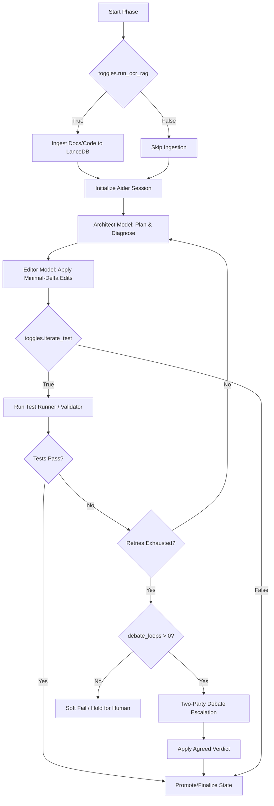

# aider-factory 🏭

⚠️ **Active Development:** This package is fully usable right now and has been tested in active workflows with great results! We are currently doing a bit of cleanup and benchmarking before the official stable release. Feel free to explore, use it, and star the repo!

[](https://opensource.org/licenses/Apache-2.0)
[](https://www.python.org/downloads/)
[](https://www.kernel.org/)
[](https://aider.chat)

**aider-factory** is a modular, lightweight, YAML-driven automation harness, grounding validator, and RAG/debate engine built on top of [Aider](https://aider.chat).

Designed with a "bolt-on, bolt-off" UNIX philosophy, `aider-factory` can be run as a complete file-coupled DAG pipeline, or its components can be used as standalone command-line clients in your standard terminal, shell scripts, or CI/CD pipelines.

---

## 🚀 The Core Draws

### 1. A Barebones, YAML-Configured Aider Harness
If you want a simple, lightweight, and repeatable way to automate Aider without the bloat of heavy agent frameworks, `aider-factory` does this out of the box. 
* Fully customizable options through a simple `.env.yml` file to cater to your specific pipeline or workflow needs.
* Easily define phase-based tasks, manage target/editable files, and run test-driven self-healing loops.

### 2. Modular, Standalone CLI Clients
You do not have to buy into a monolithic ecosystem. Each component of `aider-factory` is exposed as a global, standalone command-line client that you can lift and use anywhere:
* **`aider-helper`**: Dual-purpose configuration architect and general AI terminal assistant.
* **`aider-oracle`**: A blazing-fast local RAG client.
* **`aider-validate`**: A deterministic fact-checker and quote-sticher for CI/CD.
* **`aider-research`**: A private metasearch CLI.
* **`aider-factory`**: The pipeline orchestrator.

### 3. Deterministic Grounding & Validation (Code & Review)
A multi-tiered, deterministic-first validation system that can be used in both **code** or **review** paths, and in **autonomous** or **pair programming** modes.
* **The tags are the state:** The LLM cannot award itself a passing grade. Only the deterministic validator promotes tags from `[evidence]` to `[validated]` or `[fixed]`.
* **Exact Substring Proof:** A quote is either an exact verbatim substring of the source, or it is a tripwire. No fuzzy thresholds.
* **Raw Text Validation:** Fact-check any quote-less, human-written, or LLM-generated text using semantic chunking, Reciprocal Rank Fusion (RRF), and Entailment scoring.
* **Free Ellipsis Auto-Stitching:** Automatically splits quotes on `...`, matches the fragments in the source, and auto-replaces them with the continuous source span if the gap is small—saving massive token costs with 0 LLM calls.
* **Unique commands and flags** make it a treat to use across different workflows.

### 4. Structured, Refereed Debates Anywhere
Run structured, adversarial debates between the Architect and a specialized, reactive Knowledge Oracle.
* Can be run **anywhere**, in both **autonomous** or **pair programming** modes.
* **Persistent Oracle Sessions:** Unlike standard RAG which flushes context on every turn, the Oracle session accumulates and persists context across debate turns and rounds, ensuring deep, multi-turn reasoning.
* **Deterministic Referee:** A simple script reads the `PROPOSAL:` and `VERDICT:` lines to resolve the debate (agreement or deadlock), preventing credit-burning loops.

---

## 🛠️ The Four Superpowers

```
┌───────────────────────────────────────────────────────────────────────────┐
│                           aider-factory (DAG)                             │
└──────────────┬──────────────────────┬──────────────────────┬──────────────┘
               │                      │                      │
               ▼                      ▼                      ▼
      ┌─────────────────┐    ┌─────────────────┐    ┌─────────────────┐
      │  aider-oracle   │    │ aider-validate  │    │ aider-research  │
      │   (Local RAG)   │    │  (Grounding)    │    │  (Private Web)  │
      └─────────────────┘    └─────────────────┘    └─────────────────┘
```

### 1. 🏭 `aider-factory` (The Orchestrator)
Automates multi-phase development workflows. It manages file context, coordinates the split **Architect/Editor** model pattern, captures test suite failures, and drives iterative self-healing loops.

### 2. 🔮 `aider-oracle` (The Local Knowledge Oracle)
A standalone, terminal-first RAG client. It parses codebases structurally using `tree-sitter` AST chunking, indexes literature into LanceDB, and answers queries using local or cloud models. It includes a built-in **two-party referee debate** engine for high-stakes architectural decisions.

### 3. 🛡️ `aider-validate` (The Fact-Checker)
A deterministic validator designed for CI/CD. It audits generated text against source documents. It features an **exact-substring check**, a **free, deterministic ellipsis auto-stitcher**, and a **raw text hallucination scanner** (`--claims-only`). It natively integrates with `MiniCheck` for state-of-the-art sentence-level entailment verification.

### 4. 🔍 `aider-research` (The Private Search Agent)
A vendor-free metasearch CLI. It auto-provisions a local, rootless **SearXNG** container via Podman/Docker, aggregates search engines, applies academic filters, and generates clean Markdown research reports.

---

## ⏱️ Quick Start in 5 Commands

```bash
# 1. Install Podman or Docker (for rootless, zero-config SearXNG web research)
sudo apt install -y podman

# 2. Install aider-factory globally via uv
uv tool install --force git+https://github.com/bryan506/aider-factory.git

# 3. Export your API key
export GEMINI_API_KEY="your-api-key-here"

# 4. Navigate to your project directory and initialize workspace
cd /path/to/your-project
aider-factory

# 5. Bootstrap your pipeline config interactively (or edit .aider_factory/.env.yml directly)
aider-helper bootstrap
```

---

## 📦 Installation Options

Ensure you have Python 3.12 and [uv](https://astral.sh/uv/) installed.

### Global Installation (Recommended)
```bash
sudo apt install -y podman
uv tool install --force git+https://github.com/bryan506/aider-factory.git
```

### Editable Installation (For Developers)
```bash
git clone https://github.com/bryan506/aider-factory.git
cd aider-factory
uv tool install --force --editable .
```

---

## 📖 Standalone CLI Examples

### General AI Terminal Assistant (`aider-helper --terminal`)
```bash
# Ask general software engineering questions directly from your terminal
aider-helper query --terminal "Explain compound indexing in SQLite"

# Pass workspace context files to the terminal assistant
aider-helper query -t --context src/main.py "Review this file for potential memory leaks"

# Clear the interactive terminal assistant session history
aider-helper -t --clear
```

### Pipeline Configuration & Architecture Expert (`aider-helper --master`)
```bash
# Load the full Factory Service Manual into context to ask deep architectural questions
aider-helper query --master "How do I configure a pre-edit debate in my YAML?"
```

### Metasearch the Web Privately
```bash
aider-research search \"negative income tax labor supply\" --academic --top 5

# Return only a list of URLs and save to a file
aider-research search \"latest advancements in RAG\" --links-only --out urls.txt
```

### Ingest and Query Local Documentation
```bash
# Ingest a web page or PDF into your active collection
aider-oracle --add-web https://example.com/api-docs.html --collection my_project

# Query the Oracle
aider-oracle \"What is the rate limit for the API?\"
```

### Run a Refereed Architectural Debate
```bash
aider-oracle --debate code \"Should we migrate from SQLite to PostgreSQL?\"
```

### Run Deterministic Quote Validation (CI/CD Ready)
```bash
aider-validate --file review.md --source source_ocr.md --report report.md --autofix
```

### Fact-Check Raw Text for Hallucinations (Zero-Config)
```bash
# Auto-discovers your LanceDB vector store and scores every paragraph
aider-validate --claims-only --file LLM_summary_response.md
```

---

## 🗺️ Architecture & Workflow Skeleton



---

## 📜 License & Disclaimer

This project is licensed under the Apache License 2.0 - see the [LICENSE](LICENSE) file for details.

**aider-factory** is an independent, community-driven open-source project. It is not affiliated with, sponsored by, endorsed by, or associated with Paul Gauthier, the official Aider project, or Oracle Corporation.
