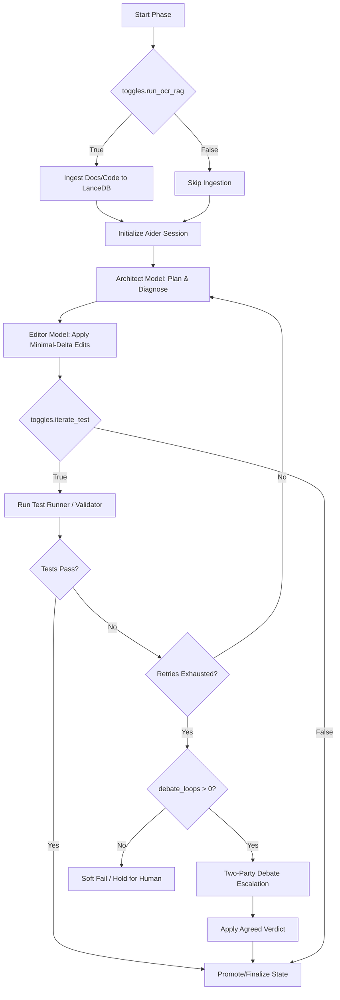

# aider-factory 🏭

⚠️ **Active Development:** This repository is currently being prepared for its official open-source release. Feel free to explore, star, and watch the repo as we finalize the initial stable version!

[](https://opensource.org/licenses/MIT)
[](https://www.python.org/downloads/)
[](https://www.kernel.org/)
[](https://aider.chat)

**aider-factory** is an industrial-grade, local-first software engineering agent fabric and validation engine. It acts as a highly optimized, YAML-driven automation harness built on top of [Aider](https://aider.chat).

By separating planning from execution, preserving local LLM Key-Value (KV) caches, and enforcing a **deterministic-first validation ladder**, `aider-factory` allows you to run complex, multi-file codebase mutations and academic research pipelines safely, securely, and at a fraction of the cost of cloud-only agent platforms.

---

## 🚀 Why aider-factory?

Most autonomous agent frameworks suffer from two fatal flaws:
1. **The Agentic Death Loop:** You delegate a task, the agent makes a minor logical error, spins in a loop trying to fix it, burns $50 of API credits, and hands you an unsalvageable codebase.
2. **KV Cache Invalidation:** Every time an agent fetches a web page, rebuilds a repository map, or auto-commits, the LLM\'s context window shifts. This flushes the KV cache, making local model inference incredibly slow and expensive.

### The aider-factory Solution:
* **Deterministic-First Grounding:** We treat LLM output as fundamentally untrustworthy. Before any agent is called, deterministic code performs exact-substring grounding, auto-stitches ellipsis splices, and runs test suites. LLMs are reserved strictly for high-level judgment.
* **Decoupled RAG & Web Research:** The main coding agent never reads raw web pages or documentation. `aider-research` metasearches privately via local SearXNG, and `aider-oracle` indexes the documents incrementally into LanceDB. The coder only receives highly targeted, grounded answers, keeping your **KV cache 100% locked in VRAM.**
* **Language-Agnostic DAG Pipelines:** Define your workflows as a Directed Acyclic Graph (DAG) in a simple `.env.yml` file. Run the same robust `produce → verify → escalate → finalize` skeleton whether you are refactoring a Rust codebase, writing R unit tests, or compiling a literature review.

---

## 🛠️ The Four Standalone Superpowers

`aider-factory` is built on the UNIX philosophy: a suite of modular, CLI-first tools that can be bolted together or used completely independently.

```
┌───────────────────────────────────────────────────────────────────────────┐
│                           aider-factory (DAG)                             │
└──────────────┬──────────────────────┬──────────────────────┬──────────────┘
               │                      │                      │
               ▼                      ▼                      ▼
      ┌─────────────────┐    ┌─────────────────┐    ┌─────────────────┐
      │  aider-oracle   │    │ aider-validate  │    │ aider-research  │
      │   (Local RAG)   │    │  (Grounding)    │    │  (Private Web)  │
      └─────────────────┘    └─────────────────┘    └─────────────────┘
```

### 1. 🏭 `aider-factory` (The Orchestrator)
Automates multi-phase development workflows. It manages file context, coordinates the split **Architect/Editor** model pattern, captures test suite failures, and drives iterative self-healing loops.

### 2. 🔮 `aider-oracle` (The Local Knowledge Oracle)
A standalone, terminal-first RAG client. It parses codebases structurally using `tree-sitter` AST chunking, indexes literature into LanceDB, and answers queries using local or cloud models. It includes a built-in **two-party referee debate** engine for high-stakes architectural decisions.

### 3. 🛡️ `aider-validate` (The Fact-Checker)
A deterministic validator designed for CI/CD. It audits generated text against source documents. It features an **exact-substring check** and a **free, deterministic ellipsis auto-stitcher** that repairs split quotes without calling an LLM. It integrates with `MiniCheck` for sentence-level entailment verification.

### 4. 🔍 `aider-research` (The Private Search Agent)
A vendor-free metasearch CLI. It auto-provisions a local, rootless **SearXNG** container via Podman/Docker, aggregates search engines, applies academic filters, and generates clean Markdown research reports.

---

## 📦 Installation

Ensure you have Python 3.12 and [uv](https://astral.sh/uv/) installed.

### Global Installation (Recommended)
```bash
uv tool install --force git+ssh://git@gitlab.com/bryanrod182/aider-factory.git
```

### Editable Installation (For Developers)
```bash
git clone git+ssh://git@gitlab.com/bryanrod182/aider-factory.git
cd aider-factory
uv tool install --force --editable .
```

To support private, vendor-free web research, install Podman (or Docker):
```bash
sudo apt install -y podman
```

---

## ⏱️ Quick Start in 60 Seconds

### 1. Initialize Your Workspace
Navigate to any codebase and initialize the zero-clutter workspace:
```bash
cd /path/to/your-project
aider-factory
```
This bootstraps `.aiderignore` and a default configuration template at `.aider_factory/.env.yml`.

### 2. Configure Your Keys
Export your API keys (globally in your shell profile or locally in a `.env` file):
```bash
export GEMINI_API_KEY=\"AIzaSy...\"
export OPENAI_API_KEY=\"sk-proj...\"
```

### 3. Run Your First Pipeline
Open `.aider_factory/.env.yml`, configure your target files, and run:
```bash
aider-factory
```

---

## 📖 Standalone CLI Examples

### metasearch the Web Privately
```bash
aider-research search \"negative income tax labor supply\" --academic --top 5
```

### Ingest and Query Local Documentation
```bash
# Ingest a web page or PDF into your active collection
aider-oracle --add-web https://example.com/api-docs.html --collection my_project

# Query the Oracle
aider-oracle \"What is the rate limit for the API?\"
```

### Run a Refereed Architectural Debate
```bash
aider-oracle --debate code \"Should we migrate from SQLite to PostgreSQL?\"
```

### Run Deterministic Quote Validation (CI/CD Ready)
```bash
aider-validate --file review.md --source source_ocr.md --report report.md --autofix
```

---

## 🗺️ Architecture & Workflow Skeleton



---

## 📜 License & Disclaimer

This project is licensed under the MIT License - see the [LICENSE](LICENSE) file for details.

**aider-factory** is an independent, community-driven open-source project. It is not affiliated with, sponsored by, endorsed by, or associated with Paul Gauthier, the official Aider project, or Oracle Corporation.
