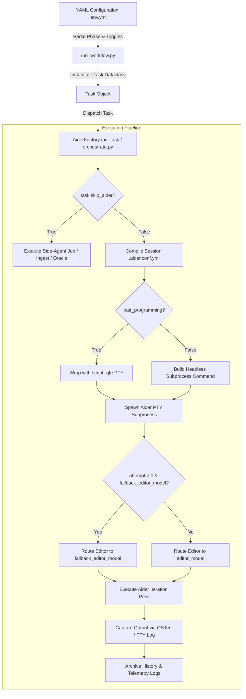

# Aider Orchestration & Native Toggles

## 1. Executive Overview & Foundational Invariants

### Purpose
The AI Factory pipeline wraps the Aider chat engine to orchestrate complex Directed Acyclic Graph (DAG) software engineering workflows. Rather than executing raw, unconstrained interactive AI coding sessions, the pipeline acts as an automated harness that controls Aider's execution environment, prompt injection, chat history preservation, and operational parameters on a per-phase and per-task basis.

### Foundational Invariants
1. **YAML-Driven Orchestration Scope**: The pipeline pipeline configuration file (`.env.yml` / `session.yml`) is the single source of truth for execution parameters. Global default configuration files (`.aider.conf.yml`, `.aider.model.settings.yml`) are overridden dynamically at runtime by task-specific flags parsed from the YAML `toggles:` block.
2. **Tri-Layer Flag Enforcement (Belt-and-Suspenders)**: When overriding Aider flags, the pipeline applies them across three simultaneous mechanisms: dynamically compiled session configuration files (`.aider.conf.yml`), CLI command-line arguments (e.g., `--yes-always`, `--map-tokens`), and environment variables (e.g., `AIDER_YES_ALWAYS=true`).
3. **Session State & History Isolation**: Multi-turn conversation histories (`.aider.chat.history.md`, `.aider.input.history`) and session cost accounting ledgers are stored inside isolated session directories (`.aider_factory/sessions/<slug>/`). The session state is preserved across task iterations and retry loops, preventing context clobbering.
4. **PTY Interactive Wrapping**: When `pair_programming: true` is configured, Aider must be executed inside a pseudo-terminal wrapper (`script -qfe`) to provide a real PTY for `prompt_toolkit` interactive prompt rendering, while piping full telemetry to stdout and `.pair_capture.log`.
5. **Deterministic Fallback Escalation**: In iterative testing loops (`iterate_test: true`), if an initial execution attempt fails using `editor_agent`, subsequent outer-loop retry attempts automatically escalate model routing to `fallback_editor_model` (if configured) on attempt $N > 0$.

---

## 2. System Topology & Lifecycle Flowcharts

The lifecycle of an Aider task invocation flows from YAML phase parsing through DAG task construction, session configuration compilation, and subprocess execution:



### Lifecycle Data Flow State Machine

```
[YAML Config] ──► [run_workflow.py] ──► [Task Dataclass]
                                              │
 ┌────────────────────────────────────────────┴──────────────────────────────────────────┐
 │ Task Parameters:                                                                     │
 │  - model / editor_model / fallback_editor_model                                       │
 │  - map_tokens / map_refresh / map_multiplier_no_files                                │
 │  - max_chat_history_tokens / yes_always / auto_accept_architect                       │
 │  - auto_commits / suggest_shell_commands / detect_urls / disable_playwright          │
 └────────────────────────────────────────────┬──────────────────────────────────────────┘
                                              │
                                              ▼
                                 [orchestrate.py: Task Execution]
                                              │
                     ┌────────────────────────┴────────────────────────┐
                     ▼                                                 ▼
        [Dynamic Config Compilation]                     [Environment Injection]
      Writes session .aider.conf.yml                    AIDER_YES_ALWAYS, OPENAI_API_BASE
                     │                                                 │
                     └────────────────────────┬────────────────────────┘
                                              │
                                              ▼
                                 [Aider Subprocess Launch]
                                              │
                        ┌─────────────────────┴─────────────────────┐
                        ▼                                           ▼
             [Autonomous Mode]                           [Pair Programming Mode]
       Popen(cmd_str, shell=True)                   Popen(["script", "-qfe", "-c", ...])
                        │                                           │
                        └─────────────────────┬─────────────────────┘
                                              │
                                              ▼
                               [Telemetry & Log Archival]
                Archives .aider.chat.history.md & .aider.llm.history to
                   .aider_factory/logs/chat_history/ and llm_history/
```

---

## 3. Technical Mechanics & Deep-Dive Logic

### Dynamic Session Configuration Compilation
When `orchestrate.py` executes a task, it dynamically compiles a session-scoped configuration file located at `.aider_factory/sessions/<slug>/.aider.conf.yml`. This compilation merges base default configurations with explicit overrides provided in the `Task` dataclass:

```python
# Extract from orchestrate.py (AiderFactory.run_task)
session_aider_conf = os.path.join(str(self.session_dir), ".aider.conf.yml")
conf_data = {}
if base_aider_conf and os.path.exists(base_aider_conf):
    try:
        with open(base_aider_conf, "r", encoding="utf-8") as f:
            conf_data = yaml.safe_load(f) or {}
    except Exception as e:
        log.warning(f"⚠️ Could not load base config {base_aider_conf}: {e}")

# Inject task-specific overrides into the compiled session config
if task.map_tokens is not None:
    conf_data["map-tokens"] = task.map_tokens
if task.map_refresh is not None:
    conf_data["map-refresh"] = task.map_refresh
if task.map_multiplier_no_files is not None:
    conf_data["map-multiplier-no-files"] = task.map_multiplier_no_files
if task.max_chat_history_tokens is not None:
    conf_data["max-chat-history-tokens"] = str(task.max_chat_history_tokens)
if task.yes_always is not None:
    conf_data["yes-always"] = bool(task.yes_always)
if task.auto_accept_architect is not None:
    conf_data["auto-accept-architect"] = bool(task.auto_accept_architect)
if task.auto_commits is not None:
    conf_data["auto-commits"] = bool(task.auto_commits)
if task.suggest_shell_commands is not None:
    conf_data["suggest-shell-commands"] = bool(task.suggest_shell_commands)
if task.detect_urls is not None:
    conf_data["detect-urls"] = bool(task.detect_urls)
if task.disable_playwright is not None:
    conf_data["disable-playwright"] = bool(task.disable_playwright)

with open(session_aider_conf, "w", encoding="utf-8") as f:
    yaml.safe_dump(conf_data, f)
```

### Model Routing & Attempt-Based Fallback Escalation
When executing tasks with multiple outer iteration loops (`iterate_test: true`), `orchestrate.py` monitors the attempt counter. On the initial attempt (`attempt == 0`), Aider routes editor requests to `editor_model`. If the initial attempt fails or test execution yields errors, subsequent retry loops (`attempt > 0`) dynamically escalate to `fallback_editor_model` if configured:

```python
current_editor = (
    task.fallback_editor_model
    if (attempt > 0 and task.fallback_editor_model)
    else task.editor_model
)

cmd = [
    "aider",
    "--no-check-model-accepts-settings",
    "--no-show-model-warnings",
    "--model", task.model,
    "--editor-model", current_editor,
    ...
]
```

### Pseudo-Terminal (PTY) Wrapping in Pair Programming Mode
Standard Python `subprocess.Popen` calls attach pipes to `stdout` and `stdin`. When Aider is run autonomously, this works cleanly. However, Aider's interactive user interface relies on `prompt_toolkit`, which requires a true TTY terminal device. 

When `pair_programming: true` is configured, `orchestrate.py` wraps Aider using the Unix `script` utility:

```python
cmd_str = " ".join(shlex.quote(arg) for arg in cmd)
process = subprocess.Popen(
    ["script", "-qfe", "-c", cmd_str, _pair_capture],
    env=env,
    cwd=self.project_dir,
)
```

#### Flags breakdown:
- `-q`: Quiet mode (suppresses `script` start/done headers).
- `-f`: Flush output after each write operation so terminal streaming is real-time.
- `-e`: Return the exit code of the child process (`aider`), ensuring pipeline failure handling accurately catches non-zero exit statuses.
- `-c`: Execute the escaped command string.
- `_pair_capture`: Path to `.aider_factory/sessions/<slug>/.pair_capture.log`, capturing full terminal output for downstream cost aggregation (`aggregate_costs.py`).

---

## 4. Exhaustive CLI & Parameter Reference

The table below maps every supported YAML toggle to its corresponding Aider CLI flag, environment variable, default value, and functional description:

| YAML Toggle (under `toggles:`) | Aider CLI Flag | Environment Variable | Default Value | Functional Description |
| :--- | :--- | :--- | :--- | :--- |
| `pair_programming` | N/A (Wraps `script -qfe`) | N/A | `false` | **True**: Executes Aider inside an interactive PTY session.<br>**False**: Executes Aider headlessly in autonomous mode. |
| `yes_always` | `--yes-always` | `AIDER_YES_ALWAYS` | Inverse of `pair_programming` | **True**: Automatically confirms all prompts.<br>**False**: Prompts user for manual confirmation. |
| `auto_accept_architect` | `--auto-accept-architect`<br>`--no-auto-accept-architect` | `AIDER_AUTO_ACCEPT_ARCHITECT` | Inverse of `pair_programming` | **True**: Automatically applies Architect plans to the Editor without manual review. |
| `auto_commits` | `--auto-commits`<br>`--no-auto-commits` | `AIDER_AUTO_COMMITS` | `true` | **True**: Automatically creates git commits after successful edits.<br>**False**: Leaves edits uncommitted in working tree. |
| `suggest_shell_commands` | `--suggest-shell-commands`<br>`--no-suggest-shell-commands` | `AIDER_SUGGEST_SHELL_COMMANDS` | `true` | **True**: Allows the model to propose shell execution blocks.<br>**False**: Disables shell command suggestions. |
| `detect_urls` | `--detect-urls`<br>`--no-detect-urls` | `AIDER_DETECT_URLS` | `false` | **True**: Auto-scrapes URLs found in LLM responses.<br>**False**: Disables web URL scraping. |
| `disable_playwright` | `--disable-playwright` | `AIDER_DISABLE_PLAYWRIGHT` | `false` | **True**: Explicitly disables Playwright/Chromium browser initialization. |
| `map_tokens` | `--map-tokens <int>` | N/A (via config) | Config default (`0`) | Sets token budget for repository map generation. `0` disables repository map. |
| `map_refresh` | `--map-refresh <str>` | N/A (via config) | `"manual"` | Controls repository map refresh frequency (`manual`, `auto`, `always`). |
| `map_multiplier_no_files`| `--map-multiplier-no-files <float>`| N/A (via config) | `0.0` | Multiplier for repository map token allocation when no files are in chat context. |
| `max_chat_history_tokens` | `--max-chat-history-tokens <int>` | N/A (via config) | `100000` | Maximum token budget for chat history before truncation occurs. |

---

## 5. Configuration Schema & YAML Knobs

### 1. Master Pipeline Phase Toggles (`.env.yml` / `session.yml`)

```yaml
name: "Production DAG Pipeline"
working_directory: "/home/user/project"

phases:
  - name: "Autonomous Implementation Phase"
    enabled: true
    models:
      architect_agent: "openai/qwen3.5-122b-a10b-90k:latest"
      editor_agent: "ollama/qwen3.6-27B-90k:latest"
      editor_agent_test: "ollama/qwen3.6-27B-90k:latest"
      editor_agent_test_fallback: "openai/qwen3.5-122b-a10b-90k:latest"

    toggles:
      # Execution Mode
      pair_programming: false
      shared_history: false
      sticky_context: true

      # Native Aider Overrides
      map_tokens: 0
      map_refresh: "manual"
      map_multiplier_no_files: 0.0
      max_chat_history_tokens: 100000

      # Automation & Safety Guards
      yes_always: true
      auto_accept_architect: true
      auto_commits: true
      suggest_shell_commands: true
      detect_urls: false
      disable_playwright: true

    files:
      target_files:
        - "src/core/engine.py"
      extra_editable_files: []
      test_files:
        - "tests/test_engine.py"
      context_files_job:
        - "src/core/types.py"
      context_files_test: []
```

### 2. Global Baseline Configuration (`.aider_factory/.aider.conf.yml`)

```yaml
# .aider_factory/.aider.conf.yml
max-chat-history-tokens: "90000"
map-tokens: "0"
map-refresh: "manual"
weak-model: "gemini/gemini-2.5-flash"
user-input-color: "#d97706"
timeout: "10800"
auto-commits: true
attribute-author: false
attribute-committer: false
```

### 3. Reasoning Budget & Model Overrides (`.aider_factory/.aider.model.settings.yml`)

```yaml
# .aider_factory/.aider.model.settings.yml
- name: openai/qwen3.6-27B-90k-udq4kxl:latest
  edit_format: editor-diff
  use_repo_map: true
  examples_as_sys_msg: true
  caches_by_default: true
  extra_params:
    think: false
    temperature: 0.1
    top_p: 1.0

- name: ollama/qwen3.6-27B-90k:latest
  edit_format: editor-diff
  examples_as_sys_msg: true
  caches_by_default: true
  extra_params:
    think: false
```

---

## 6. Telemetry, Diagnostics & Operational Edge Cases

### Operational Quirks & Shell Command Execution
Getting an LLM to propose and execute shell commands (such as running tests or invoking `.aider_factory/bash/oracle`) involves specific constraints within Aider's internal architecture:

1. **Architect Mode Disables Shell Execution**: When acting as the Architect (`architect: true` or `AIDER_ARCHITECT=true`), Aider disables shell command scanning. Any shell block proposed by an Architect model is treated strictly as explanatory markdown text or converted into a file edit.
2. **`ask` Edit Format Disables Shell Execution**: In `ask` mode (`--edit-format ask`), shell blocks are not parsed or executed by the coder harness.
3. **The `yes-always` Blocking Quirk**: Setting `--yes-always` (or `yes_always: true`) actually **blocks** model-suggested shell commands. Aider requires an explicit, interactive human confirmation before executing shell commands; under `--yes-always`, shell command confirmation defaults to "no" and skips silently (Aider upstream issue #3903).
4. **Slash-Command Syntax Restriction**: The `/run` directive is an interactive human slash-command. If an LLM outputs `/run .aider_factory/bash/oracle` inside a ` ```bash ` block, the system shell attempts to execute the literal `/run` system directory and fails with `Permission denied`. Models must emit bare executable paths (e.g., `.aider_factory/bash/oracle "..."`).

### The `E2BIG` Argument Buffer Safeguard
During multi-turn debate escalations or large RAG context queries, debate prompts containing source code, test failure logs, and architectural specifications can exceed several megabytes in size. Passing these prompts directly as CLI string arguments to subprocesses triggers the Linux kernel `E2BIG` error (`Argument list too long`).

To prevent process crashes, `orchestrate.py` and `oracle_agent.py` automatically write large debate prompts to temporary files inside `.aider_factory/.oracle_prompt_<tmp>.txt` and pass them via the `--file` flag:

```python
# Extract from orchestrate.py (_oracle_turn)
prompt_file = tempfile.NamedTemporaryFile(
    mode="w",
    suffix=".txt",
    dir=os.path.join(self.project_dir, ".aider_factory"),
    prefix=".oracle_prompt_",
    delete=False,
)
prompt_file.write(prompt)
prompt_file.close()

args = [oracle, "--mode", mode, "--file", prompt_file.name]
```

### OS-Level Telemetry Redirection (`OSTee`)
Standard Python logging redirects `sys.stdout` and `sys.stderr` in user-space, which misses output from native C/Rust extensions (such as LanceDB), child processes (Aider, pytest, Docker), and PTY script wrappers.

`run_workflow.py` uses low-level OS file descriptor redirection (`OSTee`):

```python
class OSTee:
    def __init__(self, log_path: str):
        self.log_path = log_path
        self.orig_stdout_fd = os.dup(1)
        self.orig_stderr_fd = os.dup(2)
        self.pipe_r, self.pipe_w = os.pipe()

        os.dup2(self.pipe_w, 1)
        os.dup2(self.pipe_w, 2)
        self.log_file = open(self.log_path, "a", encoding="utf-8", errors="replace")
        ...
```

This intercepts all output at the kernel level across C, C++, Rust, Python, and subprocess layers, streaming live output to the console while maintaining a master log file (`.aider_factory/logs/<config_stem>_run_<timestamp>.log`) for cost accounting (`aggregate_costs.py`).
