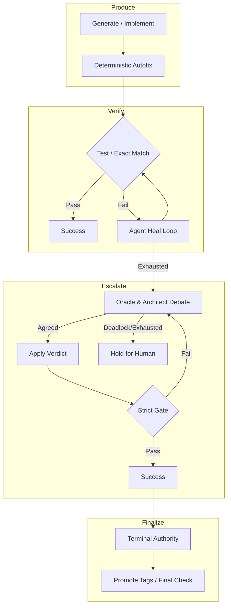

# AI Factory Core Philosophies & Engineering Invariants

## 1. Executive Overview & Foundational Invariants

The AI Factory Pipeline is built upon a rigid, language-agnostic foundation. The core philosophy dictates that the same Directed Acyclic Graph (DAG) skeleton (`produce → verify → escalate → finalize`) applies uniformly to literature reviews, Python, R, Rust, Go, or Java.

These 13 load-bearing invariants govern all pipeline operations and agent behaviors:

1. **Deterministic-first**: Agents are utilized only where code provably cannot do the job. Code handles exact matching, anchored stitching, tag assignment, counting, and test suite execution. Agents handle *judgment* (e.g., faithfulness of paraphrase, root cause analysis).
2. **Provable truth & precision over recall**: Grounding is determined by exact normalized substrings or test suite exit codes (`0`). No fuzzy matching, Levenshtein distance, or embeddings decide pass/fail.
3. **Embeddings as annotation-only**: Region similarity and embeddings flag passages as potentially hallucinated or retrieve reference material. They never grant or deny grounding.
4. **Only PROMOTE tags automatically**: The system never deletes a quote, never fabricates, and never auto-writes the `"Not specified in paper."` sentinel.
5. **Tags ARE the state**: The deterministic validator is the *sole* writer of grounding tags (`[validated]`, `[fixed]`, `[unsupported]`). Agents only write `[evidence]` and edit text.
6. **Minimal-delta edits**: Changes must be targeted, preserving behavior on untouched paths.
7. **Full cross-validation after EVERY change**: Verification relies on logic independent of the code under test (e.g., compile, DAG dry-run, backward-compat pass).
8. **Splittable & combinable DAG**: Phases are order-independent and file-coupled. Every node reads inputs from disk, allowing steps to scale identically whether run as one phase or many.
9. **No pipeline git commits except Aider auto-commits**: `.aider_factory/python/` remains untracked. Provenance is maintained via auto-commits on artifacts, ledgers, and verdicts.
10. **Single bundled Python interpreter runtime**: Everything runs under Aider's bundled Python (`AIDER_PY`), ensuring consistent access to `lancedb`, `sentence-transformers`, `litellm`, and `yaml`.
11. **Native Aider framework integration**: The pipeline extends Aider's framework (ask mode, iterate-test loop, `.aider.conf.yml`) rather than reinventing it.
12. **Reactive ground-truth Knowledge Oracle**: The Oracle owns ground truth and judges the Architect's proposals by citing exact evidence. It is reactive, not a whole-document auditor.
13. **Plain, objective communication**: Agents must communicate plainly, prioritizing objectivity and course correction over agreeable confirmation.

## 2. System Topology & Lifecycle Flowcharts

The pipeline employs a unified, language-agnostic execution chassis. The same DAG topology routes both code generation and literature review grounding.



## 3. Technical Mechanics & Deep-Dive Logic

### Deterministic Logic vs. Agent Judgment

The pipeline strictly separates deterministic verification from probabilistic agent judgment.

#### Exact Substring Matching (Grounding)
For literature reviews, a quote is grounded if and only if its normalized form is an exact substring of the normalized source document.
Let $Q$ be the normalized quote and $S$ be the normalized source text:
$$ \text{Grounding}(Q, S) = \begin{cases} 1 & \text{if } Q \subseteq S \\ 0 & \text{otherwise} \end{cases} $$

#### Tag State Machine
The deterministic validator enforces a strict state machine for grounding tags:
- **`[evidence]`**: Initial authored state.
- **`[validated]`**: $Q \subseteq S$ and the quote text matches the pre-edit baseline hash.
- **`[fixed]`**: $Q \subseteq S$ and the quote text was edited (hash differs from baseline).
- **`[unsupported]`**: $\text{Grounding}(Q, S) = 0$ after an *agreed* debate concludes.

#### Reciprocal Rank Fusion (RRF)
When retrieving context across multiple LanceDB tables, the Oracle utilizes Reciprocal Rank Fusion to merge results deterministically:
$$ \text{RRF\_Score}(d \in D) = \sum_{t \in \text{Tables}} \frac{1}{60 + \text{rank}_t(d)} $$
Deduplication is strictly keyed by `(source_file, text[:64])`.

## 4. Exhaustive CLI & Parameter Reference

The core philosophies are enforced via specific CLI tools that operate independently of the agents.

| Command / Tool | Primary Flags | Runtime Behavior | Invariant Enforced |
| :--- | :--- | :--- | :--- |
| `aider-validate` | `--file`, `--source`, `--report` | Executes exact-substring grounding and region similarity annotation. | Provable truth (Invariant 2), Embeddings as annotation (Invariant 3). |
| `aider-validate` | `--autofix` | Deterministically stitches ellipsis-spliced quotes (`...`) if fragments form a contiguous span $\le 200$ chars. | Deterministic-first (Invariant 1). |
| `aider-validate` | `--finalize-unsupported` | Terminal step that promotes grounded quotes and flags ungrounded quotes as `[unsupported]`. | Validator tag authority (Invariant 5), Only PROMOTE tags (Invariant 4). |
| `aider-oracle` | `--debate [code\|review]` | Initiates a refereed two-party debate for escalation. | Oracle owns ground truth (Invariant 12). |

## 5. Configuration Schema & YAML Knobs

The DAG's order-independence and splittability (Invariant 8) are controlled via `.env.yml` toggles. The framework supports **Dynamic Per-Phase Toggles**, allowing you to override Aider's native operational flags on a phase-by-phase basis.

```yaml
phases:
  - name: "Core Execution Phase"
    toggles:
      # Execution Modes
      pair_programming: true
      run_job_one: true       # Produce: Implement feature / Generate review
      run_job_two: true       # Produce: Write tests
      iterate_test: true      # Verify: Agent heal loop
      auto_test: false        # Verify: Internal Aider testing
      
      # Aider Native Overrides
      map_tokens: 0
      map_refresh: "manual"
      map_multiplier_no_files: 0
      max_chat_history_tokens: 100000
      
      # Automation & Safety Guards
      yes_always: false
      auto_accept_architect: false
      auto_commits: false
      suggest_shell_commands: true
      detect_urls: false
      disable_playwright: false
    validation:
      enabled: true           # Verify: Exact-substring grounding loop
      validation_tag: "evidence"
    escalation_debate:
      loops: 4                # Escalate: Max turns per debate
      rounds: 1               # Escalate: Multi-round reflexion cycles
```

### Toggle Definitions

| Toggle | Purpose & Behavior |
| :--- | :--- |
| `pair_programming` | **True**: Wraps Aider in a `script` PTY for an interactive human-in-the-loop terminal session. **False**: Runs autonomously, piping output directly to logs. |
| `yes_always` | **True**: Auto-confirms all Aider prompts (ideal for autonomous runs). **False**: Prompts the user for confirmation. *(Defaults to inverse of `pair_programming` if unset).* |
| `auto_accept_architect` | **True**: Automatically applies the Architect's proposed plan to the Editor. |
| `auto_commits` | **True**: Commits to git after each successful edit pass. |
| `suggest_shell_commands`| **True**: Allows the model to propose shell commands (e.g., executing tests or oracle queries). |
| `detect_urls` | **False**: (Recommended) Prevents Aider from automatically scraping URLs found in model output, which can trigger unexpected headless browser installations mid-run. |
| `map_tokens` | Overrides the repository map token budget for the specific phase. |
| `map_refresh` | Controls when the repo map is refreshed (`manual`, `auto`, `always`). |
| `map_multiplier_no_files` | Multiplier for the map token budget when no files have been added to the chat. |
| `max_chat_history_tokens` | Chat token budget before truncation (aligns with model context windows). |
| `disable_playwright` | **True**: Belt-and-suspenders safeguard to prevent headless browser installation. |

## 6. Telemetry, Diagnostics & Operational Edge Cases

### Deletion Guard (Anchor-Count Floor)
To enforce Invariant 4 (Never delete a quote), the pipeline maintains a `quote_baseline` set of hashes in the debate ledger (`.debate.json`). If the number of recognized anchors drops below the baseline size, the validator raises a **Floor Violation** and halts, preventing silent quote deletion.

### Soft-Fail & Final-Check Diagnostics
- **`soft_fail`**: In review mode, the apply loop's strict gate may not re-run after the final edit. Loop exhaustion is treated as a soft success, deferring the absolute verdict to the deterministic `finalize` step.
- **`final_check`**: In code mode, the iteration loop verifies edit $N-1$ at the start of attempt $N$. To prevent false-positive failures, `final_check` re-runs the test suite *once* after the loop exhausts to report the true pass/fail status.

## 7. Aider Orchestration & Execution Modes

The AI Factory pipeline wraps the Aider chat engine to orchestrate complex DAG workflows.

### Global Configuration Files
- **`.aider.conf.yml` (Global Defaults)**: Locks KV cache behavior, UI settings, and background tasks (e.g., `max-chat-history-tokens: "90000"`, `timeout: "10800"`).
- **`.aider.model.settings.yml` (Reasoning Budgets)**: Forces specific APIs and controls the "Reasoning Budget". Setting `think: false` bypasses a model's Chain-of-Thought, saving Unified Memory bandwidth and ensuring fast, clean CLI returns for side-agents like the Knowledge Oracle.

### Execution Modes: Autonomous vs. Pair Programming
- **Autonomous Mode (`pair_programming: false`)**: Optimized for overnight batch jobs and test-fixing loops. `yes_always` and `auto_commits` default to `true`. Aider's stdout/stderr flows directly through `OSTee` to the master run log.
- **Pair Programming Mode (`pair_programming: true`)**: Optimized for complex research, strategy drafting, and code architecture. `yes_always` and `auto_commits` default to `false`. Wraps Aider in `script -qfe` to create a real interactive PTY, allowing direct interaction at the `architect>` prompt.

### Operational Quirks & Shell Commands
Getting the *model* to run a shell command reliably has specific constraints:
1. **Architect Mode Never Runs Shell Commands**: The architect's reply is not scanned for shell blocks. A model-proposed Oracle call is silently turned into a file edit.
2. **The `yes-always` Quirk**: `yes-always: true` **BLOCKS** model-suggested shell commands, as Aider treats them as requiring an *explicit* human "yes".
3. **The `/run` Slash-Command**: `/run` is a *human* slash-command. The model must emit the bare command (e.g., `.aider_factory/bash/oracle "..."`) instead of `/run`.

**Reliable Ways to Invoke the Oracle:**
* **Programmatic Job**: Use the `oracle:` block in your YAML phase configuration.
* **Interactive Pair Session**: Type `/run .aider_factory/bash/oracle "..."` manually at the `architect>` prompt.
