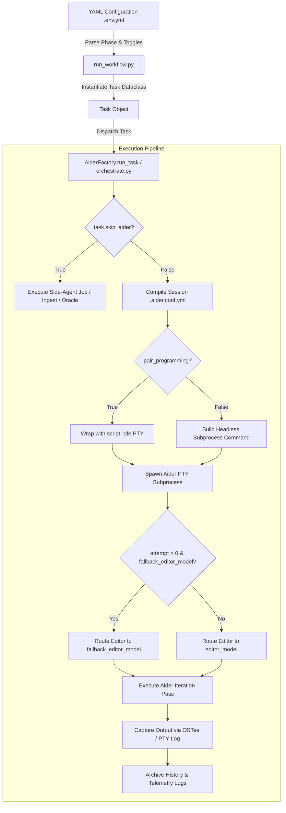
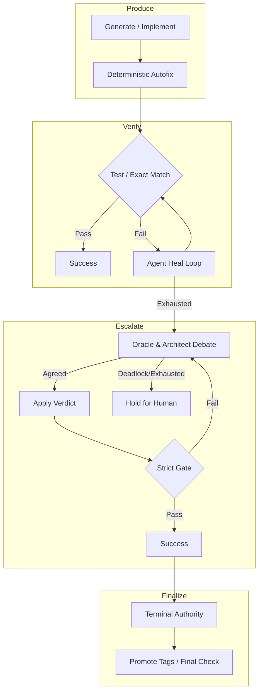
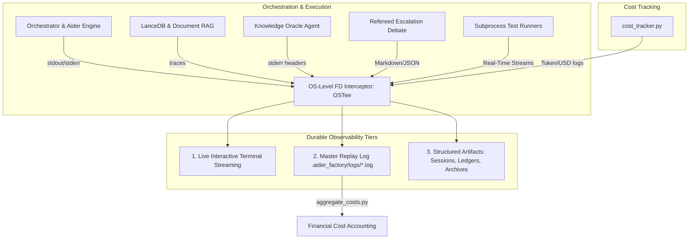
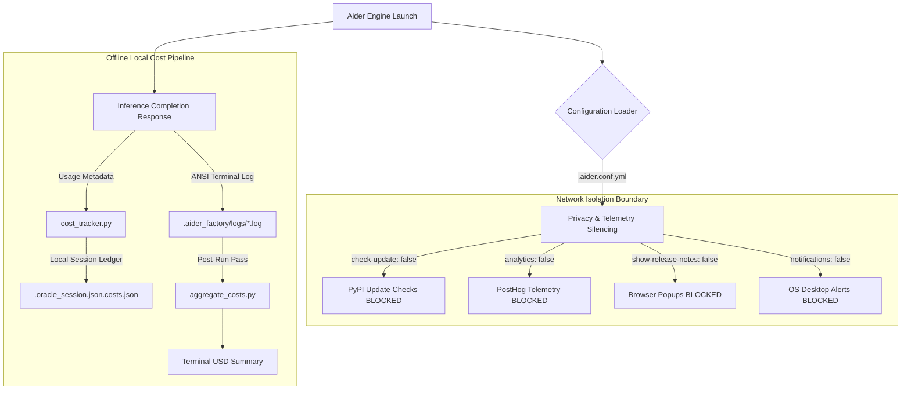
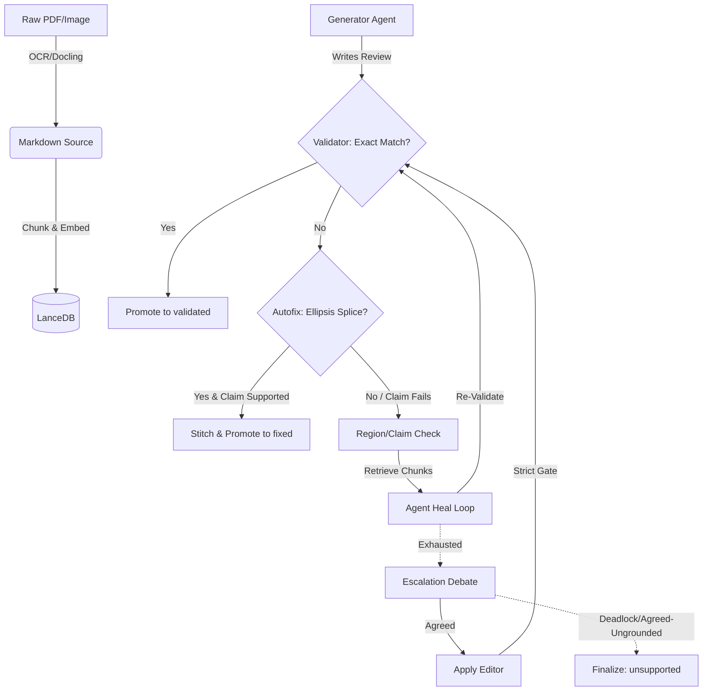

# `aider-apply` — Headless Code Application & KV-Cache Preservation Engine

## 1. Executive Overview & Foundational Invariants

`aider-apply` is a specialized, headless execution client that bridges high-reasoning conversational planning (Architect) and surgical code editing (Editor) without invalidating local LLM Key-Value caches (Prefix Caches).

It extracts implementation specifications directly from your active session's chat history (or a standalone spec file), spins up an isolated, headless Aider instance to apply `SEARCH/REPLACE` diffs to target files, commits changes to Git, and streams the resulting `git diff` back to your terminal or Architect session.

### The Core Problem: KV-Cache Invalidation in Aider

Aider is inherently **disk-aware**. Every turn, Aider scans all files currently loaded via `/add` or `/read`. If any loaded file is modified on disk:
1. Aider re-reads the file from disk and places the updated content into the prompt context.
2. Because the prompt text changes near the top of the context window, the **prefix hash changes completely**.
3. On local inference servers (e.g., `llama-server`, vLLM, SGLang), this causes a **total KV cache bust**. The server must re-evaluate the entire context (often 10,000 to 50,000+ tokens), turning a 1-second conversational turn into a 2-minute GPU stall.

### Foundational Invariants
* **Immutable Reference Files**: Can safely stay loaded in `/read` because they never mutate.
* **Mutable Target Files**: Must **never** be loaded in `/read` or `/add` during the Architect's reasoning phase. Instead, mutable files are introduced via the **append-only chat stream** (e.g., `/run cat src/target.py` or through turn extraction specs).
* **Edits**: Offloaded to a separate, headless Editor process (`aider-apply`), allowing the Architect's context prefix to remain 100% byte-identical and warm in GPU VRAM.

---

## 2. System Topology & Lifecycle Flowcharts

```text
┌─────────────────────────────────────────────────────────────────────────────────────────────────┐
│                                   AIDER-APPLY DATA FLOW                                         │
│                                                                                                 │
│  [Node 1: Architect Session]                                                                    │
│  • Runs interactively in /ask mode (AIDER_ARCHITECT=false, edit_format=ask)                     │
│  • Discusses, refines, and formats SEARCH/REPLACE blocks                                       │
│  • Appends turns to: .aider_factory/sessions/<name>/.aider.chat.history.md                      │
│                                                                                                 │
│                                           │                                                     │
│                                           ▼                                                     │
│  [Turn Extraction & Spec Synthesis: apply_agent.py]                                             │
│  1. Scans .aider.chat.history.md using TOKEN_ANCHOR_RE                                          │
│  2. Filters out tool invocations (/run, /add, /read) and strips thinking tokens (<think>)      │
│  3. Formats the last N turns into: .aider_factory/temp/active_spec.md                           │
│  4. Resolves editor configuration from paired session.yml                                       │
│                                                                                                 │
│                                           │                                                     │
│                                           ▼                                                     │
│  [Node 2: Headless Editor Pass]                                                                 │
│  • Spawns: aider --message-file active_spec.md --edit-format editor-diff <target_files>          │
│  • Redirects chat history to: .aider_factory/temp/.apply.chat.history.md                        │
│  • Modifies target files on disk & creates Git commit                                           │
│                                                                                                 │
│                                           │                                                     │
│                                           ▼                                                     │
│  [Diff Telemetry Stream]                                                                        │
│  • Runs: git --no-pager diff HEAD~1                                                             │
│  • Prints git diff to terminal or streams back into Architect's context                         │
│  • Node 1 Architect resumes with 100% KV-cache reuse (<1.2s prompt eval)!                       │
└─────────────────────────────────────────────────────────────────────────────────────────────────┘
```

---

## 3. Technical Mechanics & Deep-Dive Logic

### Dual-Anchor Turn Extraction Algorithm (`parse_chat_history`)

Chat history files generated by Aider contain user messages (`#### <prompt>`), assistant answers (`► ANSWER ...`), tool outputs (`> Added ...`), and token usage footers (`> Tokens: ...`). 

`apply_agent.py` uses a resilient Dual-Anchor Token Parser:
1. **Primary Anchor**: Locates message boundaries by matching `TOKEN_ANCHOR_RE`:
   ```regex
   (?m)^>\s*Tokens:\s*[\d\.]+[kKMG]?\s*sent,\s*[\d\.]+[kKMG]?\s*received.*$
   ```
2. **Slash-Command Filtering**: Matches `SLASH_CMD_RE` to strip out interactive commands (`/add`, `/run`, `/read`, `/drop`, `/model`, `/clear`, `/exit`, `/undo`, `/diff`, `/load`, `/help`) while preserving `/ask` prompts:
   ```regex
   ^/(add|run|read|drop|model|clear|exit|undo|diff|load|help)\b
   ```
3. **Thinking Token & Artifact Stripping**: Regex-cleans reasoning tags (`<thinking-content-...>`, `<think>...</think>`), Aider UI banners (`► ANSWER`), and tool artifacts (`> Added`, `> Moved`, `> No files`), extracting only the perfectly clean, actionable specification.
4. **Single vs. Multi-Turn Formatting**:
   - For $N = 1$ (default `turns=1`): Synthesizes a clean `# Directive` header (if user request is present) and a `# Specification & Implementation Plan` section.
   - For $N > 1$: Organizes prior discussion chronologically under `## Prior Context Turn N` headers, culminating in `## Active Directive`.

---

## 4. Exhaustive CLI & Parameter Reference

`aider-apply` is available globally via the terminal or inside an interactive Aider session via `/run aider-apply` (or `/run .aider_factory/bash/apply`).

```bash
aider-apply <files...> [options]
```

### Positional Arguments
* `files` — One or more relative or absolute paths to target files that need to be edited.

### Command Matrix
| Flag | Short | Default | Description |
| :--- | :--- | :--- | :--- |
| `--spec` | `-s` | `None` | Path to an explicit Markdown specification file (bypasses chat history parsing). |
| `--turns` | `-t` | `1` | Number of recent Architect turns to extract from chat history (e.g., `-t 3` for multi-turn context). |
| `--model` | `-m` | `None` | Override the editor model (e.g., `openai/qwen3.6-27b-90k:LATEST`). |
| `--session` | | `None` | Explicit session name to resolve chat history and `session.yml` from. If omitted, auto-discovers active session by `mtime`. |
| `--no-diff` | | `False` | Suppress printing the `git --no-pager diff HEAD~1` output to stdout after execution. |

---

## 5. Configuration Schema & YAML Knobs

`aider-apply` automatically discovers its model and API endpoints from the active configuration hierarchy following a strict resolution sequence (`resolve_editor_config`):

### Resolution Precedence
1. Explicit `--model <model_id>` CLI override flag.
2. `AI_FACTORY_CONFIG` environment variable path.
3. Paired session configuration: `.aider_factory/sessions/<session_name>/session.yml`.
4. Master workspace configuration: `.aider_factory/.env.yml` or `.env.yml`.
5. Default fallback (`gemini/gemini-2.5-flash`).

### YAML Configuration Example

```yaml
endpoints:
  editor_api: "http://192.168.100.1:8080/v1"

models:
  editor_agent: "openai/qwen2.5-coder:latest"
```

When `editor_api` is set, `apply_agent.py` automatically maps the endpoint to `OPENAI_API_BASE`, `OLLAMA_API_BASE`, and `LM_STUDIO_API_BASE` in the subprocess environment, setting `OPENAI_API_KEY` to `sk-dummy` for local inference servers.

---

## 6. Telemetry, Diagnostics & Operational Edge Cases

### Session Isolation & Ephemeral Artifacts
To prevent headless editor output from corrupting the active interactive session, `aider-apply` writes to the `.aider_factory/temp/` directory:
- `.aider_factory/temp/active_spec.md` — Synthesized specification extracted from chat history.
- `.aider_factory/temp/.apply.chat.history.md` — Isolated chat history for the editor pass.
- `.aider_factory/temp/.apply.input.history` — Isolated input log.

### Diff Telemetry Stream
Upon completing the headless edit pass, `aider-apply` streams the resulting Git diff to stdout using:
```bash
git --no-pager diff HEAD~1
```
This can be suppressed using `--no-diff`.

### Failure Modes & Exit Codes
* **Exit Code 1 (Missing History)**: Triggered if `.aider.chat.history.md` cannot be found in the session path or workspace root.
* **Exit Code 1 (Empty Spec)**: Triggered if the parser finds no actionable turns or valid specification text.
* **Exit Code 1 (Subprocess Error)**: Triggered if the underlying `aider` process exits with a non-zero returncode.
* **Exit Code 0 (Success)**: Returned when `aider` successfully applies the edits and generates a Git commit.

### Diagnostic Recovery Workflows

#### Scenario A: Standard Pair-Programming Handoff
1. Open an interactive session:
   ```bash
   aider-factory my_feature
   ```
2. Discuss the design with the Architect in chat. In Turn 1 and 2, explore the architecture. In Turn 3, ask:
   > *"Output the exact SEARCH/REPLACE blocks to implement `calculate_tax` in `src/calculator.py`."*
3. Apply the spec immediately without leaving the session:
   ```bash
   /run aider-apply src/calculator.py
   ```
4. `aider-apply` executes in ~15 seconds, commits the edit, and prints the git diff.
5. Resume chatting with the Architect. Because `src/calculator.py` was never in `/read`, the Architect evaluates **only the ~400 token delta** in ~1.1 seconds with 100% KV cache hit rate!

#### Scenario B: Multi-Turn Context Extraction (`--turns`)
If the implementation details are spread across the last 3 turns of your conversation:
```bash
aider-apply src/math_service.py --turns 3
```

#### Scenario C: Standalone Spec File Application
If you have an offline specification or design document (`specs/auth_refactor.md`):
```bash
aider-apply src/auth.py src/user.py --spec specs/auth_refactor.md
```

#### Scenario D: Cross-Session Application
Apply edits from a specific background worker session:
```bash
aider-apply src/service.py --session worker_session_2
```
# `aider-oracle` — Knowledge Oracle & RAG Retrieval Engine

## 1. Executive Overview & Foundational Invariants

`aider-oracle` is the Tier-2a Knowledge Oracle side-agent for the AI Factory. It provides grounded, verbatim evidence and strategic domain knowledge to the Architect and Editor agents without polluting their primary conversation contexts or VRAM with massive, unindexed document dumps.

### Core Architectural Roles
1. **Interactive RAG Side-Agent**: Executed via `/run aider-oracle "<question>"` inside Aider sessions or pair-programming prompts to answer focused domain or code queries on demand.
2. **Programmatic Document Synthesizer (`start_job: true`)**: Runs autonomously outside Aider sessions to fill Markdown templates straight from ingested literature collections (e.g., generating automated paper reviews or specification summaries).
3. **Refereed Debate Opponent (`--debate`)**: Acts as a strict, evidence-grounded critic during pre-edit and post-test escalation debates, evaluating Architect proposals against retrieved source material.

### Foundational Invariants
* **Strict Stream Separation**: The final answer is printed exclusively to `stdout` so that Aider folds a clean message into its chat context. All library logging (LiteLLM, HuggingFace, PyTorch), progress bars, retrieved chunk citations, and cost accounting lines are piped strictly to `stderr`.
* **Reactive Judge**: The Oracle is a reactive judge and evidence retriever; it is not a whole-document auditor. It evaluates Architect proposals against retrieved chunks and cites verbatim text.
* **Offline-First Reranking**: Local rerankers strictly attempt `local_files_only=True` first to guarantee zero network calls and prevent HuggingFace telemetry leaks, falling back to network downloads only during initial cold-start model provisioning.
* **Zero-RAG Bypass**: When `ORACLE_COLLECTION` or `rag.collection_name` is set to an empty string (`""`), vector search is completely bypassed. The Oracle relies solely on the provided prompt text or injected context files.

---

## 2. System Topology & Lifecycle Flowcharts

```text
┌─────────────────────────────────────────────────────────────────────────────────────────────────┐
│                                   AIDER-ORACLE DATA FLOW                                        │
│                                                                                                 │
│  [Node 1: Input & CLI Parsing]                                                                  │
│  • Parses query, --file, or maintenance commands (--add-web, --rm-file, --list-files)          │
│  • Resolves ORACLE_* environment variables from active phase in .env.yml                        │
│                                                                                                 │
│                                           │                                                     │
│                                           ▼                                                     │
│  [Node 2: Context Retrieval & RRF Fusion]                                                       │
│  • Truncates query to 6,000 chars (_MAX_EMBED_CHARS) to prevent VRAM OOM                        │
│  • Embeds query via sentence-transformers or OpenAI-compatible API                              │
│  • Searches LanceDB tables (batch=true fuses code & doc tables via Reciprocal Rank Fusion)      │
│  • Reranks candidates via Cross-Encoder or Native Listwise reranker (e.g., jina-reranker-v3.5)  │
│                                                                                                 │
│                                           │                                                     │
│                                           ▼                                                     │
│  [Node 3: LLM Generation & Telemetry]                                                           │
│  • Formats prompt with <knowledge_base> and <question> XML blocks                               │
│  • Calls rag_agent model (e.g., openai/qwen3.6-27b or gemini/gemini-2.5-flash)                 │
│  • Emits final answer to stdout; logs token counts, costs, and citations to stderr              │
│  • Optional: If --claims-only, instantly validates output via validator.py                      │
└─────────────────────────────────────────────────────────────────────────────────────────────────┘
```

---

## 3. Technical Mechanics & Deep-Dive Logic

### Reciprocal Rank Fusion (RRF)
When `batch: true` is enabled, the Oracle queries multiple LanceDB tables simultaneously (e.g., `<coll>_<repo>_code`, `<coll>_<repo>_docs`, `<coll>_docs`). To merge these disparate vector search result lists into a single deterministic top-$k$ candidate list, it applies Reciprocal Rank Fusion:

$$RRF\_Score(chunk) = \sum_{t \in Tables} \frac{1}{60 + rank_t(chunk)}$$

Chunk deduplication uses a composite key of `(source_file, text[:64])`. Secondary sort keys `(source_file, text_prefix)` break ties deterministically, eliminating filesystem ordering variance across operating systems.

### Two-Stage Reranking Engine
Candidates retrieved via vector search ($k_{recall} = \text{ORACLE\_RECALL\_K}$, default 30) are passed to a two-stage reranking engine (`_rerank_chunks`). The Oracle automatically detects and routes to two distinct model families:

1. **Native Listwise Rerankers** (e.g., `jinaai/jina-reranker-v3.5`):
   - **Detection**: Checks model configuration for custom `JinaForRanking` architectures (`AutoConfig.auto_map`).
   - **Execution**: Loaded via `transformers.AutoModel(trust_remote_code=True)` and scored jointly in a single forward pass using the vendor's native `.rerank(query, documents)` method.
   - **Safety Invariant**: Native listwise rerankers are *never* loaded through `sentence_transformers.CrossEncoder`, which forces `AutoModelForSequenceClassification` and silently discards the MLP projector head, yielding non-deterministic random scores.
2. **Pairwise Cross-Encoders** (e.g., `BAAI/bge-reranker-large`, `cross-encoder/ms-marco-MiniLM-L-6-v2`):
   - **Execution**: Loaded via `sentence_transformers.CrossEncoder` and scored via `predict([[query, doc], ...])`.

### Query Truncation Safeguard (`_MAX_EMBED_CHARS`)
During multi-turn debates or when `--file` attaches large context blocks, prompt strings can exceed 30,000+ characters. Passing these directly to local embedding models (e.g., `BAAI/bge-m3` or `sentence-transformers`) can exceed context windows and trigger Out-Of-Memory (OOM) GPU crashes. The Oracle strictly truncates the input string used for vector embedding:

```python
_MAX_EMBED_CHARS = 6000
embed_input = prefix + query[:_MAX_EMBED_CHARS]
```

This preserves the structural core of the query while staying well within embedding model context limits.

---

## 4. Exhaustive CLI Invocations & Command Matrix

The Knowledge Oracle provides both a search/query interface and a full-featured LanceDB database maintenance suite via `aider-oracle` (or `.aider_factory/bash/oracle`).

### Standard Query & Debate Interface

| Command / Flag | Argument | Description |
| :--- | :--- | :--- |
| `aider-oracle "<q>"` | Positional string | Standard interactive query using the active phase's collection and retrieval mode. |
| `--file` | `<path> ["note"]` | Reads message payload directly from a file on disk (bypasses OS command-line buffer limits). |
| `--collection` | `<table>` | Targets a specific LanceDB table (e.g., a single paper's table when `batch: false`). Supports global paths. |
| `--db` | `<dir>` | Overrides `ORACLE_RAG_DB_DIR` path to target an alternate LanceDB directory. |
| `--mode` | `top_k` \| `no_retrieve` \| `full_document` | Overrides the phase's retrieval mode for this single invocation. |
| `--type` | `code` \| `docs` | Filters RRF fusion to narrow retrieval strictly to `*_code` or `*_docs` tables. |
| `--no-rag` | None | Bypasses LanceDB vector retrieval entirely and queries the LLM directly over the prompt context. |
| `--claims-only` | None | Runs instant post-generation claim validation on the Oracle's generated response via `validator.py`. |
| `--no-print` | None | Suppresses stdout output during `--claims-only` validation; writes report to disk only. |
| `--debate` | `code` \| `review` | Triggers an interactive CLI-driven debate between the Architect and Oracle. |
| `--loops` | `<int>` | Sets max turns per debate round (default: 3). |
| `--rounds` | `<int>` | Sets max escalation rounds for debate reflexion (default: 1). |
| `--clear` | None | Wipes active session files (`.oracle_session.json`, `.oracle_debate_session.json`, transcripts). |
| `--list` | None | Lists all available LanceDB tables in the active `ORACLE_RAG_DB_DIR`. |

> **Auto-Validation Trigger:** While `--claims-only` can be invoked manually as a flag, the Oracle also runs this validation *automatically* on every standard generation if the `ORACLE_CLAIMS_ONLY=1` environment variable is exported.

### LanceDB Database Maintenance Interface

| Maintenance Flag | Arguments | Operational Behavior |
| :--- | :--- | :--- |
| `--list-files` | None | Scans all tables in the active collection and prints a list of all unique ingested source files. |
| `--add-file` | `<path1> [path2...]` | Copies target file(s) into `.aider_factory/markdown/lanceDB/<coll>/` and incrementally ingests them. |
| `--add-file ... --no-rag` | `<path1>...` | Converts files to Markdown (via OCR/Docling) in the collection folder but skips LanceDB vector indexing. |
| `--add-table` | `<dir1> [dir2...]` | Recursively copies folder(s) into the collection directory and incrementally ingests all files inside. |
| `--add-web` | `<url1> [url2...]` | Downloads web URLs or PDFs (via `rag_web.py`), converts to Markdown, and ingests into LanceDB. |
| `--add-web --file` | `<urls.txt>` | Ingests a line-separated file of URLs (supports `~/` and relative paths). |
| `--add-web ... --workers` | `<int>` | Sets parallel worker thread count for concurrent web downloads (default: 1). |
| `--rm-file` | `<filename>` | Surgically deletes all vector chunks belonging to `<filename>` across all collection tables. Drops empty tables. |
| `--rm-table` | `<table_name>` | Drops a specific LanceDB table directly from the database. |
| `--rm-db` | None | Wipes the entire `lancedb/` vector store directory while preserving raw Markdown text and OCR image caches. |

---

## 5. Configuration Schema & YAML Knobs

The Oracle's behavior is controlled per-phase in `.env.yml` via the `oracle:`, `rag:`, and `escalation_debate:` blocks:

```yaml
phases:
  - name: "Implementation Phase"
    enabled: true

    models:
      rag_agent: "openai/qwen3.6-27b-90k:latest" # Oracle reasoning model
      ocr_agent: "glm-ocr-f16:LATEST"             # Vision OCR model
      embed_model: "BAAI/bge-m3"                   # Vector embedding model
      ranking_agent: "jinaai/jina-reranker-v3.5"   # Reranker model

    rag:
      collection_name: "knowledge"
      batch: true                 # true: RRF multi-table fuse; false: per-doc tables
      retrieval_mode: "top_k"     # top_k | no_retrieve | full_document
      top_k: 5                    # Number of reranked chunks returned to context
      recall_k: 30                # Initial vector candidate pool before reranking
      chunk_size_chars: 800
      chunk_overlap_chars: 100
      code_chunk_size: 2000
      vectordb_overwrite: false   # true: force rebuild; false: incremental append
      run_ocr_rag: false          # true: trigger ingestion pass at phase start

    oracle:
      start_job: false            # false: Code mode (no auto-generate); true: Review mode
      template: "src/aider_factory/markdown/internal/analyze_bugs.md"
      job_debate_template: "src/aider_factory/markdown/templates/job_debate.md"
      full_document: false        # true: dump entire table context; false: top_k retrieval
      pre_edit_debate:
        enabled: true
        insert_debate: [1, 0, 0]  # Trigger pre-edit debate before Job 1

    escalation_debate:
      loops: 4                    # Max architect/oracle turns per debate
      rounds: 2                   # Escalation cycles after test-fix loop exhausts
      pass_round_history: true    # true: persist debate context across rounds
```

---

## 6. Operational Edge Cases, Failure Modes & Telemetry

### Session File Isolation
To prevent cross-phase context contamination and preserve debate history during apply-phase cleanups, the Oracle maintains isolated session sidecars in `.aider_factory/`:

- `.oracle_session.json`: Stores interactive multi-turn `/run aider-oracle` conversation history. Cleared automatically between Aider tasks.
- `.oracle_debate_session.json`: Stores debate back-and-forth turns. Configured via `ORACLE_SESSION_FILE`. Cleared between rounds only when `pass_round_history: false`.
- `.oracle_chat.history.md`: Human-readable transcript containing questions, answers, and collapsible `<details>` blocks holding raw retrieved LanceDB chunks.

### `E2BIG` Linux Kernel Safeguard
During deep escalation debates, full prompts containing multi-file code context, failure stack traces, and proposal diffs can exceed several megabytes. Passing these directly as CLI string arguments to child processes triggers the Linux kernel `E2BIG` error (`Argument list too long`). 

The orchestrator (`orchestrate.py`) detects large debate prompts, writes them to temporary files under `.aider_factory/.oracle_prompt_<tmp>.txt`, and invokes the Oracle via the `--file` flag:

```python
args = [oracle_bin, "--mode", mode, "--file", prompt_file.name]
```

The temporary prompt file is safely unlinked immediately after the Oracle process completes.
# Aider Orchestration & Native Toggles

## 1. Executive Overview & Foundational Invariants

### Purpose
The AI Factory pipeline wraps the Aider chat engine to orchestrate complex Directed Acyclic Graph (DAG) software engineering workflows. Rather than executing raw, unconstrained interactive AI coding sessions, the pipeline acts as an automated harness that controls Aider's execution environment, prompt injection, chat history preservation, and operational parameters on a per-phase and per-task basis.

### Foundational Invariants
1. **YAML-Driven Orchestration Scope**: The pipeline configuration file (`.env.yml` / `session.yml`) is the single source of truth for execution parameters. Global default configuration files (`.aider.conf.yml`, `.aider.model.settings.yml`) are overridden dynamically at runtime by task-specific flags parsed from the YAML `toggles:` block.
2. **Tri-Layer Flag Enforcement (Belt-and-Suspenders)**: When overriding Aider flags, the pipeline applies them across three simultaneous mechanisms: dynamically compiled session configuration files (`.aider.conf.yml`), CLI command-line arguments (e.g., `--yes-always`, `--map-tokens`), and environment variables (e.g., `AIDER_YES_ALWAYS=true`).
3. **Session State & Per-Target History Isolation**: Multi-turn conversation histories (`.aider.chat.history.md`, `.aider.input.history`) and session cost accounting ledgers are stored inside isolated session directories (`.aider_factory/sessions/<slug>/`). When `shared_history: false` is configured, active staging files are dynamically swapped and wiped per target file via `chat_history/` vaulting, guaranteeing zero conversation bleeding across sequential target files.
4. **Strict Single-Target Scoping & Prompt Defense**: In autonomous execution (`pair_programming: false`), all tasks are strictly bound to their explicitly declared `target_files`. Out-of-scope mid-run confirmation prompts (`Add file to the chat?`, `Create new file?`) are deterministically rejected via buffered `b"n\n"` stream responses, preventing model wandering and duplicate file creation.
5. **PTY Interactive Wrapping**: When `pair_programming: true` is configured, Aider is executed inside a pseudo-terminal wrapper (`script -qfe`) to provide a real PTY for `prompt_toolkit` interactive prompt rendering, while piping full telemetry to stdout and `.pair_capture.log`.
6. **Deterministic Fallback Escalation**: In iterative testing loops (`iterate_test: true`), if an initial execution attempt fails using `editor_agent`, subsequent outer-loop retry attempts automatically escalate model routing to `fallback_editor_model` (if configured) on attempt $N > 0$.

---

## 2. System Topology & Lifecycle Flowcharts

The lifecycle of an Aider task invocation flows from YAML phase parsing through DAG task construction, session configuration compilation, and subprocess execution:



### Lifecycle Data Flow State Machine

```
[YAML Config] ──► [run_workflow.py] ──► [Task Dataclass]
                                              │
 ┌────────────────────────────────────────────┴──────────────────────────────────────────┐
 │ Task Parameters:                                                                     │
 │  - model / editor_model / fallback_editor_model                                       │
 │  - map_tokens / map_refresh / map_multiplier_no_files                                │
 │  - max_chat_history_tokens / yes_always / auto_accept_architect                       │
 │  - auto_commits / suggest_shell_commands / detect_urls / disable_playwright          │
 └────────────────────────────────────────────┬──────────────────────────────────────────┘
                                              │
                                              ▼
                                 [orchestrate.py: Task Execution]
                                              │
                     ┌────────────────────────┴────────────────────────┐
                     ▼                                                 ▼
        [Dynamic Config Compilation]                     [Environment Injection]
      Writes session .aider.conf.yml                    AIDER_YES_ALWAYS, OPENAI_API_BASE
                     │                                                 │
                     └────────────────────────┬────────────────────────┘
                                              │
                                              ▼
                                 [Aider Subprocess Launch]
                                              │
                        ┌─────────────────────┴─────────────────────┐
                        ▼                                           ▼
             [Autonomous Mode]                           [Pair Programming Mode]
       Popen(cmd_str, shell=True)                   Popen(["script", "-qfe", "-c", ...])
                        │                                           │
                        └─────────────────────┬─────────────────────┘
                                              │
                                              ▼
                               [Telemetry & Log Archival]
                Archives .aider.chat.history.md & .aider.llm.history to
                   .aider_factory/logs/chat_history/ and llm_history/
```

---

## 3. Technical Mechanics & Deep-Dive Logic

### Per-Target History Isolation & State Vaulting (`shared_history: false`)
When `shared_history: false` is configured in a multi-file phase, `run_workflow.py` stems each task's history by its job prefix and target filename base:
$$\text{stem} = \text{job\_prefix} + \text{"\_"} + \text{base\_name}$$

The `AiderFactory` manages state isolation across sequential tasks using a two-stage vaulting protocol:
1. **`_swap_in_state(stem)`**: Before launching a task, `_swap_in_state` deletes all active staging files in the session root (`.aider.chat.history.md`, `.aider.input.history`, `.oracle_session.json`). If vault artifacts exist in `chat_history/.aider.chat.history_<stem>.md`, they are copied to the active stage; if the target file is running for the first time, the active stage remains completely blank. This guarantees that Task $N$ never inherits residual prompts or wandering architectural plans from Task $N-1$.
2. **`_swap_out_state(stem)`**: Upon task completion, active history files are synced back into the session's `chat_history/` vault under their respective `<stem>` identifiers.

### Headless Prompt Defense & Stdin Stream Management (`yes_always: false`)
In headless/autonomous mode (`pair_programming: false`), unexpected interactive prompts can cause catastrophic scope drift:
* **The `Add file to chat?` Prompt**: If the Architect proposes edits referencing non-target files, passing `'d'` ("Don't ask again") causes Aider to auto-accept all future file additions, giving write access to unassigned files.
* **The `Create new file?` Prompt**: When `stdin` is closed after a single response, secondary prompts hit `EOF`, which falls back to Aider's default `[Yes]` and silently creates duplicate or hallucinated files on disk (e.g., creating `oracle_tool.md` instead of updating `oracle.md`).

To prevent this, `orchestrate.py` injects a continuous rejection buffer:
```python
# Send repeated 'n\n' (No) to gracefully reject all out-of-scope mid-run prompts
process.stdin.write(b"n\n" * 50)
process.stdin.flush()
process.stdin.close()
```
Because all intended `target_files` and derived test files (`test_{stem}.*`) are declared in YAML and passed as positional CLI arguments at startup, Aider pre-authorizes them with zero confirmation prompts. Any mid-run confirmation dialog is therefore an undeclared, hallucinated file and is safely rejected.

### Dynamic Target Scoping in `--message`
To prevent the Architect model from applying global repository-wide goals across all files simultaneously, `orchestrate.py` dynamically anchors the `--message` payload to the active target file:
```text
ACTIVE TARGET FILE(S): `src/core/engine.py`
STRICT INVARIANT: You MUST ONLY plan and modify the assigned target file(s) (`src/core/engine.py`).
Do NOT propose SEARCH/REPLACE blocks for any other files.
Do NOT create new files.
All files passed via --read are IMMUTABLE context.

Please execute the instructions found in /path/to/plan.md.
```

### Dynamic Session Configuration Compilation
When `orchestrate.py` executes a task, it dynamically compiles a session-scoped configuration file located at `.aider_factory/sessions/<slug>/.aider.conf.yml`. This compilation merges base default configurations with explicit overrides provided in the `Task` dataclass:

```python
# Extract from orchestrate.py (AiderFactory.run_task)
session_aider_conf = os.path.join(str(self.session_dir), ".aider.conf.yml")
conf_data = {}
if base_aider_conf and os.path.exists(base_aider_conf):
    try:
        with open(base_aider_conf, "r", encoding="utf-8") as f:
            conf_data = yaml.safe_load(f) or {}
    except Exception as e:
        log.warning(f"⚠️ Could not load base config {base_aider_conf}: {e}")

# Inject task-specific overrides into the compiled session config
if task.map_tokens is not None:
    conf_data["map-tokens"] = task.map_tokens
if task.map_refresh is not None:
    conf_data["map-refresh"] = task.map_refresh
if task.map_multiplier_no_files is not None:
    conf_data["map-multiplier-no-files"] = task.map_multiplier_no_files
if task.max_chat_history_tokens is not None:
    conf_data["max-chat-history-tokens"] = str(task.max_chat_history_tokens)
if task.yes_always is not None:
    conf_data["yes-always"] = bool(task.yes_always)
if task.auto_accept_architect is not None:
    conf_data["auto-accept-architect"] = bool(task.auto_accept_architect)
if task.auto_commits is not None:
    conf_data["auto-commits"] = bool(task.auto_commits)
if task.suggest_shell_commands is not None:
    conf_data["suggest-shell-commands"] = bool(task.suggest_shell_commands)
if task.detect_urls is not None:
    conf_data["detect-urls"] = bool(task.detect_urls)
if task.disable_playwright is not None:
    conf_data["disable-playwright"] = bool(task.disable_playwright)

with open(session_aider_conf, "w", encoding="utf-8") as f:
    yaml.safe_dump(conf_data, f)
```

### Subprocess Environment Variable Injection
While the session `.aider.conf.yml` handles base settings, `orchestrate.py` enforces a belt-and-suspenders approach by directly injecting critical overrides into the `env` dictionary immediately prior to subprocess execution. This guarantees that flags like `AIDER_YES_ALWAYS`, `AIDER_AUTO_COMMITS`, `AIDER_AUTO_LINT`, `AIDER_SUGGEST_SHELL_COMMANDS`, and `AIDER_DETECT_URLS` are strictly honored, overriding any conflicting local environment state.

### KV-Cache Preservation & Python Hash Seeding
To guarantee 100% KV-cache prefix hits on local inference servers during interactive or `ask` mode turns, `orchestrate.py` explicitly injects `PYTHONHASHSEED="0"` into the subprocess environment. This forces Python to use deterministic set iteration, ensuring that the generated prompt string is byte-for-byte identical across multiple runs and eliminating random cache invalidation.

### Model Routing & Attempt-Based Fallback Escalation
When executing tasks with multiple outer iteration loops (`iterate_test: true`), `orchestrate.py` monitors the attempt counter. On the initial attempt (`attempt == 0`), Aider routes editor requests to `editor_model`. If the initial attempt fails or test execution yields errors, subsequent retry loops (`attempt > 0`) dynamically escalate to `fallback_editor_model` if configured:

```python
current_editor = (
    task.fallback_editor_model
    if (attempt > 0 and task.fallback_editor_model)
    else task.editor_model
)

cmd = [
    "aider",
    "--no-check-model-accepts-settings",
    "--no-show-model-warnings",
    "--model", task.model,
    "--editor-model", current_editor,
    ...
]
```

### Pseudo-Terminal (PTY) Wrapping in Pair Programming Mode
Standard Python `subprocess.Popen` calls attach pipes to `stdout` and `stdin`. When Aider is run autonomously, this works cleanly. However, Aider's interactive user interface relies on `prompt_toolkit`, which requires a true TTY terminal device. 

When `pair_programming: true` is configured, `orchestrate.py` wraps Aider using the Unix `script` utility:

```python
cmd_str = " ".join(shlex.quote(arg) for arg in cmd)
process = subprocess.Popen(
    ["script", "-qfe", "-c", cmd_str, _pair_capture],
    env=env,
    cwd=self.project_dir,
)
```

#### Flags breakdown:
- `-q`: Quiet mode (suppresses `script` start/done headers).
- `-f`: Flush output after each write operation so terminal streaming is real-time.
- `-e`: Return the exit code of the child process (`aider`), ensuring pipeline failure handling accurately catches non-zero exit statuses.
- `-c`: Execute the escaped command string.
- `_pair_capture`: Path to `.aider_factory/sessions/<slug>/.pair_capture.log`, capturing full terminal output for downstream cost aggregation (`aggregate_costs.py`).

---

## 4. Exhaustive CLI & Parameter Reference

The table below maps every supported YAML toggle to its corresponding Aider CLI flag, environment variable, default value, and functional description:

| YAML Toggle (under `toggles:`) | Aider CLI Flag | Environment Variable | Default Value | Functional Description |
| :--- | :--- | :--- | :--- | :--- |
| `pair_programming` | N/A (Wraps `script -qfe`) | N/A | `false` | **True**: Executes Aider inside an interactive PTY session.<br>**False**: Executes Aider headlessly in autonomous mode. |
| `shared_history` | N/A (Internal State Vault) | N/A | `false` | **False**: Strictly isolates chat history per target file via `chat_history/` vaulting and wipes active staging files between tasks.<br>**True**: Shares a single continuous `.aider.chat.history.md` across all target files. |
| `yes_always` | `--yes-always` (Omitted when `false`) | `AIDER_YES_ALWAYS` | Inverse of `pair_programming` | **True**: Auto-confirms all prompts.<br>**False**: Omitted from CLI; in headless mode, unexpected out-of-scope prompts are answered with `"n"` to protect target boundaries. |
| `auto_accept_architect` | `--auto-accept-architect`<br>`--no-auto-accept-architect` | `AIDER_AUTO_ACCEPT_ARCHITECT` | Inverse of `pair_programming` | **True**: Automatically applies Architect plans to the Editor without manual review. |
| `auto_commits` | `--auto-commits`<br>`--no-auto-commits` | `AIDER_AUTO_COMMITS` | `true` | **True**: Automatically creates git commits after successful edits.<br>**False**: Leaves edits uncommitted in working tree. |
| `suggest_shell_commands` | `--suggest-shell-commands`<br>`--no-suggest-shell-commands` | `AIDER_SUGGEST_SHELL_COMMANDS` | `true` | **True**: Allows the model to propose shell execution blocks.<br>**False**: Disables shell command suggestions. |
| `detect_urls` | `--detect-urls`<br>`--no-detect-urls` | `AIDER_DETECT_URLS` | `false` | **True**: Auto-scrapes URLs found in LLM responses.<br>**False**: Disables web URL scraping. |
| `disable_playwright` | `--disable-playwright` | `AIDER_DISABLE_PLAYWRIGHT` | `false` | **True**: Explicitly disables Playwright/Chromium browser initialization. |
| `sticky_context` | N/A | N/A | `false` | **True**: Automatically passes target files modified in the current phase as `--read` context to subsequent phases. Ideal for passing Phase 0 strategy docs into Phase 1 implementation. |
| `map_tokens` | `--map-tokens <int>` | N/A (via config) | Config default (`0`) | Sets token budget for repository map generation. `0` disables repository map. |
| `map_refresh` | `--map-refresh <str>` | N/A (via config) | `"manual"` | Controls repository map refresh frequency (`manual`, `auto`, `always`). |
| `map_multiplier_no_files`| `--map-multiplier-no-files <float>`| N/A (via config) | `0.0` | Multiplier for repository map token allocation when no files are in chat context. |
| `max_chat_history_tokens` | `--max-chat-history-tokens <int>` | N/A (via config) | `100000` | Maximum token budget for chat history before truncation occurs. |

---

## 5. Configuration Schema & YAML Knobs

### 1. Master Pipeline Phase Toggles (`.env.yml` / `session.yml`)

```yaml
name: "Production DAG Pipeline"
working_directory: "/home/user/project"

phases:
  - name: "Autonomous Implementation Phase"
    enabled: true
    models:
      architect_agent: "openai/qwen3.5-122b-a10b-90k:latest"
      editor_agent: "ollama/qwen3.6-27B-90k:latest"
      editor_agent_test: "ollama/qwen3.6-27B-90k:latest"
      editor_agent_test_fallback: "openai/qwen3.5-122b-a10b-90k:latest"

    toggles:
      # Execution Mode
      pair_programming: false
      shared_history: false
      sticky_context: true

      # Native Aider Overrides
      map_tokens: 0
      map_refresh: "manual"
      map_multiplier_no_files: 0.0
      max_chat_history_tokens: 100000

      # Automation & Safety Guards
      yes_always: true
      auto_accept_architect: true
      auto_commits: true
      suggest_shell_commands: true
      detect_urls: false
      disable_playwright: true

    files:
      target_files:
        - "src/core/engine.py"
      extra_editable_files: []
      test_files:
        - "tests/test_engine.py"
      context_files_job:
        - "src/core/types.py"
      context_files_test: []
```

### 2. Global Baseline Configuration (`.aider_factory/.aider.conf.yml`)

```yaml
# .aider_factory/.aider.conf.yml
max-chat-history-tokens: "90000"
map-tokens: "0"
map-refresh: "manual"
weak-model: "gemini/gemini-2.5-flash"
user-input-color: "#d97706"
timeout: "10800"
auto-commits: true
attribute-author: false
attribute-committer: false
```

### 3. Reasoning Budget & Model Overrides (`.aider_factory/.aider.model.settings.yml`)

```yaml
# .aider_factory/.aider.model.settings.yml
- name: openai/qwen3.6-27B-90k-udq4kxl:latest
  edit_format: editor-diff
  use_repo_map: true
  examples_as_sys_msg: true
  caches_by_default: true
  extra_params:
    think: false
    temperature: 0.1
    top_p: 1.0

- name: ollama/qwen3.6-27B-90k:latest
  edit_format: editor-diff
  examples_as_sys_msg: true
  caches_by_default: true
  extra_params:
    think: false
```

---

## 6. Telemetry, Diagnostics & Operational Edge Cases

### Operational Quirks & Shell Command Execution
Getting an LLM to propose and execute shell commands (such as running tests or invoking `.aider_factory/bash/oracle`) involves specific constraints within Aider's internal architecture:

1. **Architect Mode Disables Shell Execution**: When acting as the Architect (`architect: true` or `AIDER_ARCHITECT=true`), Aider disables shell command scanning. Any shell block proposed by an Architect model is treated strictly as explanatory markdown text or converted into a file edit.
2. **`ask` Edit Format Disables Shell Execution**: In `ask` mode (`--edit-format ask`), shell blocks are not parsed or executed by the coder harness.
3. **The `yes-always` Blocking Quirk**: Setting `--yes-always` (or `yes_always: true`) actually **blocks** model-suggested shell commands. Aider requires an explicit, interactive human confirmation before executing shell commands; under `--yes-always`, shell command confirmation defaults to "no" and skips silently (Aider upstream issue #3903).
4. **Slash-Command Syntax Restriction**: The `/run` directive is an interactive human slash-command. If an LLM outputs `/run .aider_factory/bash/oracle` inside a ` ```bash ` block, the system shell attempts to execute the literal `/run` system directory and fails with `Permission denied`. Models must emit bare executable paths (e.g., `.aider_factory/bash/oracle "..."`).

### The `E2BIG` Argument Buffer Safeguard
During multi-turn debate escalations or large RAG context queries, debate prompts containing source code, test failure logs, and architectural specifications can exceed several megabytes in size. Passing these prompts directly as CLI string arguments to subprocesses triggers the Linux kernel `E2BIG` error (`Argument list too long`).

To prevent process crashes, `orchestrate.py` and `oracle_agent.py` automatically write large debate prompts to temporary files inside `.aider_factory/.oracle_prompt_<tmp>.txt` and pass them via the `--file` flag:

```python
# Extract from orchestrate.py (_oracle_turn)
prompt_file = tempfile.NamedTemporaryFile(
    mode="w",
    suffix=".txt",
    dir=os.path.join(self.project_dir, ".aider_factory"),
    prefix=".oracle_prompt_",
    delete=False,
)
prompt_file.write(prompt)
prompt_file.close()

args = [oracle, "--mode", mode, "--file", prompt_file.name]
```

### OS-Level Telemetry Redirection (`OSTee`)
Standard Python logging redirects `sys.stdout` and `sys.stderr` in user-space, which misses output from native C/Rust extensions (such as LanceDB), child processes (Aider, pytest, Docker), and PTY script wrappers.

`run_workflow.py` uses low-level OS file descriptor redirection (`OSTee`):

```python
class OSTee:
    def __init__(self, log_path: str):
        self.log_path = log_path
        self.orig_stdout_fd = os.dup(1)
        self.orig_stderr_fd = os.dup(2)
        self.pipe_r, self.pipe_w = os.pipe()

        os.dup2(self.pipe_w, 1)
        os.dup2(self.pipe_w, 2)
        self.log_file = open(self.log_path, "a", encoding="utf-8", errors="replace")
        ...
```

This intercepts all output at the kernel level across C, C++, Rust, Python, and subprocess layers, streaming live output to the console while maintaining a master log file (`.aider_factory/logs/<config_stem>_run_<timestamp>.log`) for cost accounting (`aggregate_costs.py`).

### 6.4 The Factory Launcher Rationale
The pipeline must be executed using the bundled bash wrappers (e.g., `.aider_factory/bash/factory .env.yml`), rather than calling `python run_workflow.py` directly. 

**Why?** The pipeline runs ingestion (`rag_manager.py`) *in-process*. If you run the pipeline using your system Python, it will lack dependencies like `lancedb` and `sentence-transformers`, crashing immediately. The `bash/factory`, `bash/oracle`, and `bash/validate` wrappers dynamically resolve `AIDER_PY` to point to Aider's isolated `uv` tool environment, which contains the entire RAG/OCR stack.
# Autonomous Context Engineering Audit & Document Optimization Playbook

> **Mission Objective:** Systematically audit, refine, and synthesize project conventions, system prompts, and operational playbooks against an authoritative Context Engineering knowledge base (e.g., via a RAG Oracle). Ensure maximum model compliance, KV-cache prefix stability, positional attention optimization, and zero token bloat.

---

## 0. Workflow Overview & Gated Lifecycle

```
[Phase 1: Query Formulation]
       │
       ▼
[Phase 2: RAG Knowledge Retrieval]
       │
       ▼
[Phase 3: Gap Analysis & Spec Drafting] (Architect)
       │
       ▼
[Phase 4: Oracle Pre-Implementation Audit] (Validator Gate) ───[Rejected]──┐
       │                                                                  │ (Revise Spec)
       ▼ [Approved]                                                       │
[Phase 5: Surgical Implementation] (Editor) <─────────────────────────────┘
       │
       ▼
[Phase 6: Synthesis & Reconciliation] (Optional Consolidation)
       │
       ▼
[Phase 7: Final Verification & Cross-Validation]
```

---

## Phase 1: Targeted Query Formulation (Retrieval Engineering)

Before querying the RAG knowledge base, formulate targeted, high-density queries. Avoid vague questions like _"how to improve prompts"_. Instead, query across these core context engineering dimensions:

### Query Matrix Template

1. **KV-Cache Optimization & Prefix Stability:**

   > `"Prompt engineering patterns for KV-cache optimization immutable static system prefixes append-only dynamic context and deterministic serialization to maximize cache hits."`

2. **Positional Attention & Lost-in-the-Middle Mitigation:**

   > `"Instruction position and attention distribution: mitigating primacy, recency, and 'lost-in-the-middle' effects in long context system instructions."`

3. **Multi-Persona Role Isolation & State Hand-Offs:**

   > `"Preventing role bleed and instruction leakage in multi-persona prompts: separating planning, implementation, validation, and testing contexts."`

4. **Negative Constraints vs. Affirmative Boundaries:**

   > `"Empirical compliance rates of negative constraints (NEVER, DO NOT) versus affirmative operational boundaries in transformer attention."`

5. **Self-Healing Error Feedback & Anti-Oscillation:**

   > `"Self-healing error feedback loops, compiler diagnostic injection, and prompt pruning to prevent infinite loop oscillation."`

6. **Context Window Budgeting & The Sentinel Invariant:**
   > `"Active context window utilization degradation thresholds (70% rule), dynamic token budgeting, and preserving protected sentinel sets during compaction."`

---

## Phase 2: RAG Knowledge Retrieval

Execute the formulated queries against the vector knowledge base using hybrid retrieval (dense semantic search + lexical BM25/reranking).

```bash
# Example Oracle Execution
aider-oracle --collection <COLLECTION_PATH> "<TARGET_QUERY>"
```

**Extraction Checklist from Oracle Output:**

- [ ] Empirical utilization bounds (e.g., 70% threshold).
- [ ] Required prompt topology (Primacy $\to$ Middle $\to$ Recency).
- [ ] Schema enforcement contracts and AST anchor rules.
- [ ] Concrete negative-to-affirmative replacement patterns.

---

## Phase 3: Gap Analysis & Spec Drafting (Architect Role)

Audit the target document against the retrieved textbook principles. Identify anti-patterns and draft the improvement blueprint.

### Document Audit Checklist

1. **Primacy Check**: Are immutable invariants, role boundaries, and security rules at the very top?
2. **Recency Check**: Are output schemas, response templates, and completion checklists locked at the terminal position?
3. **Negative Constraint Check**: Is every "DO NOT" paired with an affirmative replacement (e.g., replace deleted lines with `# Removed`)?
4. **Generalization Check**: Is the document free from domain lock-in (unless domain-specific logic is explicitly requested)?
5. **Syntactic Anchor Check**: Are markdown headers rigid and deterministic for regex/AST parsers?
6. **Token Hygiene Check**: Are orphaned sections, conversational filler, and redundant explanations stripped out?

### Required Output of Phase 3:

Draft a complete Markdown proposal with a clear diff summary and rationale grounded in Oracle citations.

---

## Phase 4: Oracle Pre-Implementation Audit (Validator Gate)

**HARD GATE:** Before applying modifications to files, pass the proposed draft back to the Oracle for formal verification.

```bash
aider-oracle --collection <COLLECTION_PATH> --file <SCRATCHPAD_DRAFT> \
  "Audit this agent's proposed improvements against the context engineering corpus. Verify compliance with primacy/recency placement, affirmative constraints, and schema determinism."
```

- **If Rejected:** Return to Phase 3, address specific Oracle critiques, and re-audit.
- **If Approved (`Verdict: YES`):** Proceed to Phase 5.

---

## Phase 5: Surgical Implementation (Editor Role)

Apply the approved changes to the target files adhering strictly to the **Minimal-Delta Invariant**:

- **No Premature Editing:** Only modify files explicitly declared in the scope analysis.
- **Empty Search Invariant:** When creating or wiping a file, ensure search blocks are empty.
- **Affirmative Comment Invariant:** When deleting code or instructions, replace them with an explicit comment (`# Removed` / `// Removed`).
- **No Unresolved Placeholders:** Ensure syntax examples contain zero `TODO`, `NULL`, `None`, or `"if needed"` placeholders.

---

## Phase 6: Synthesis & Reconciliation (Optional Consolidation)

When two or more related instruction documents exist (e.g., a conventions file and an execution playbook):

1. **Extract Unique Strengths:** Merge structural schema anchors from the conventions file with operational lifecycle gates from the playbook.
2. **Eliminate Cross-File Redundancy:** Consolidate shared concepts (Pillars, Invariants, Verification Matrices) into a single authoritative file (e.g., `CONVENTIONS_REVISED.md`).
3. **Preserve High Information Density:** Ensure the reconciled file is shorter in line count but denser in actionable constraints than the sum of its source files.

---

## Phase 7: Final Verification & Close-Out

Run the final verification matrix before closing the task:

| Step                   | Verification Criteria                                                              | Status |
| :--------------------- | :--------------------------------------------------------------------------------- | :----- |
| **1. Parse Check**     | Regex and AST anchors (`## Scope Analysis`, `### [Task ID: ...]`) extract cleanly. | [ ]    |
| **2. Prefix Parity**   | System prompt prefix is 100% static and byte-invariant for KV-cache reuse.         | [ ]    |
| **3. Recency Check**   | File terminates with an actionable markdown task checklist (`- [ ]`).              | [ ]    |
| **4. Zero Bloat**      | Redundant prose eliminated; high token-to-information ratio achieved.              | [ ]    |
| **5. Oracle Sign-off** | Final document verified as fully compliant with context engineering corpus.        | [ ]    |

---
# AI Factory Core Philosophies & Engineering Invariants

## 1. Executive Overview & Foundational Invariants

The AI Factory Pipeline is built upon a rigid, language-agnostic foundation. The core philosophy dictates that the same Directed Acyclic Graph (DAG) skeleton (`produce → verify → escalate → finalize`) applies uniformly to literature reviews, Python, R, Rust, Go, or Java.

These 13 load-bearing invariants govern all pipeline operations and agent behaviors:

1. **Deterministic-first**: Agents are utilized only where code provably cannot do the job. Code handles exact matching, anchored stitching, tag assignment, counting, and test suite execution. Agents handle *judgment* (e.g., faithfulness of paraphrase, root cause analysis).
2. **Provable truth & precision over recall**: Grounding is determined by exact normalized substrings or test suite exit codes (`0`). No fuzzy matching, Levenshtein distance, or embeddings decide pass/fail.
3. **Embeddings as annotation-only**: Region similarity and embeddings flag passages as potentially hallucinated or retrieve reference material. They never grant or deny grounding.
4. **Only PROMOTE tags automatically**: The system never deletes a quote, never fabricates, and never auto-writes the `"Not specified in paper."` sentinel.
5. **Tags ARE the state**: The deterministic validator is the *sole* writer of grounding tags (`[validated]`, `[fixed]`, `[unsupported]`). Agents only write `[evidence]` and edit text.
6. **Minimal-delta edits**: Changes must be targeted, preserving behavior on untouched paths.
7. **Full cross-validation after EVERY change**: Verification relies on logic independent of the code under test (e.g., compile, DAG dry-run, backward-compat pass).
8. **Splittable & combinable DAG**: Phases are order-independent and file-coupled. Every node reads inputs from disk, allowing steps to scale identically whether run as one phase or many.
9. **No pipeline git commits except Aider auto-commits**: `.aider_factory/python/` remains untracked. Provenance is maintained via auto-commits on artifacts, ledgers, and verdicts.
10. **Single bundled Python interpreter runtime**: Everything runs under Aider's bundled Python (`AIDER_PY`), ensuring consistent access to `lancedb`, `sentence-transformers`, `litellm`, and `yaml`.
11. **Native Aider framework integration**: The pipeline extends Aider's framework (ask mode, iterate-test loop, `.aider.conf.yml`) rather than reinventing it.
12. **Reactive ground-truth Knowledge Oracle**: The Oracle owns ground truth and judges the Architect's proposals by citing exact evidence. It is reactive, not a whole-document auditor.
13. **Plain, objective communication**: Agents must communicate plainly, prioritizing objectivity and course correction over agreeable confirmation.

## 2. System Topology & Lifecycle Flowcharts

The pipeline employs a unified, language-agnostic execution chassis. The same DAG topology routes both code generation and literature review grounding.



## 3. Technical Mechanics & Deep-Dive Logic

### Deterministic Logic vs. Agent Judgment

The pipeline strictly separates deterministic verification from probabilistic agent judgment.

#### Exact Substring Matching (Grounding)
For literature reviews, a quote is grounded if and only if its normalized form is an exact substring of the normalized source document.
Let $Q$ be the normalized quote and $S$ be the normalized source text:
$$ \text{Grounding}(Q, S) = \begin{cases} 1 & \text{if } Q \subseteq S \\ 0 & \text{otherwise} \end{cases} $$

#### Tag State Machine
The deterministic validator enforces a strict state machine for grounding tags:
- **`[evidence]`**: Initial authored state.
- **`[validated]`**: $Q \subseteq S$ and the quote text matches the pre-edit baseline hash.
- **`[fixed]`**: $Q \subseteq S$ and the quote text was edited (hash differs from baseline).
- **`[unsupported]`**: $\text{Grounding}(Q, S) = 0$ after an *agreed* debate concludes.

#### Reciprocal Rank Fusion (RRF)
When retrieving context across multiple LanceDB tables, the Oracle utilizes Reciprocal Rank Fusion to merge results deterministically:
$$ \text{RRF\_Score}(d \in D) = \sum_{t \in \text{Tables}} \frac{1}{60 + \text{rank}_t(d)} $$
Deduplication is strictly keyed by `(source_file, text[:64])`.

## 4. Exhaustive CLI & Parameter Reference

The core philosophies are enforced via specific CLI tools that operate independently of the agents.

| Command / Tool | Primary Flags | Runtime Behavior | Invariant Enforced |
| :--- | :--- | :--- | :--- |
| `aider-validate` | `--file`, `--source`, `--report` | Executes exact-substring grounding and region similarity annotation. | Provable truth (Invariant 2), Embeddings as annotation (Invariant 3). |
| `aider-validate` | `--autofix` | Deterministically stitches ellipsis-spliced quotes (`...`) if fragments form a contiguous span $\le 200$ chars. | Deterministic-first (Invariant 1). |
| `aider-validate` | `--finalize-unsupported` | Terminal step that promotes grounded quotes and flags ungrounded quotes as `[unsupported]`. | Validator tag authority (Invariant 5), Only PROMOTE tags (Invariant 4). |
| `aider-oracle` | `--debate [code\|review]` | Initiates a refereed two-party debate for escalation. | Oracle owns ground truth (Invariant 12). |

## 5. Configuration Schema & YAML Knobs

The DAG's order-independence and splittability (Invariant 8) are controlled via `.env.yml` toggles. The framework supports **Dynamic Per-Phase Toggles**, allowing you to override Aider's native operational flags on a phase-by-phase basis.

```yaml
phases:
  - name: "Core Execution Phase"
    toggles:
      # Execution Modes
      pair_programming: true
      run_job_one: true       # Produce: Implement feature / Generate review
      run_job_two: true       # Produce: Write tests
      iterate_test: true      # Verify: Agent heal loop
      auto_test: false        # Verify: Internal Aider testing
      
      # Aider Native Overrides
      map_tokens: 0
      map_refresh: "manual"
      map_multiplier_no_files: 0
      max_chat_history_tokens: 100000
      
      # Automation & Safety Guards
      yes_always: false
      auto_accept_architect: false
      auto_commits: false
      suggest_shell_commands: true
      detect_urls: false
      disable_playwright: false
    validation:
      enabled: true           # Verify: Exact-substring grounding loop
      validation_tag: "evidence"
    escalation_debate:
      loops: 4                # Escalate: Max turns per debate
      rounds: 1               # Escalate: Multi-round reflexion cycles
```

### Toggle Definitions

| Toggle | Purpose & Behavior |
| :--- | :--- |
| `pair_programming` | **True**: Wraps Aider in a `script` PTY for an interactive human-in-the-loop terminal session. **False**: Runs autonomously, piping output directly to logs. |
| `yes_always` | **True**: Auto-confirms all Aider prompts (ideal for autonomous runs). **False**: Prompts the user for confirmation. *(Defaults to inverse of `pair_programming` if unset).* |
| `auto_accept_architect` | **True**: Automatically applies the Architect's proposed plan to the Editor. |
| `auto_commits` | **True**: Commits to git after each successful edit pass. |
| `suggest_shell_commands`| **True**: Allows the model to propose shell commands (e.g., executing tests or oracle queries). |
| `detect_urls` | **False**: (Recommended) Prevents Aider from automatically scraping URLs found in model output, which can trigger unexpected headless browser installations mid-run. |
| `map_tokens` | Overrides the repository map token budget for the specific phase. |
| `map_refresh` | Controls when the repo map is refreshed (`manual`, `auto`, `always`). |
| `map_multiplier_no_files` | Multiplier for the map token budget when no files have been added to the chat. |
| `max_chat_history_tokens` | Chat token budget before truncation (aligns with model context windows). |
| `disable_playwright` | **True**: Belt-and-suspenders safeguard to prevent headless browser installation. |

## 6. Telemetry, Diagnostics & Operational Edge Cases

### Deletion Guard (Anchor-Count Floor)
To enforce Invariant 4 (Never delete a quote), the pipeline maintains a `quote_baseline` set of hashes in the debate ledger (`.debate.json`). If the number of recognized anchors drops below the baseline size, the validator raises a **Floor Violation** and halts, preventing silent quote deletion.

### Soft-Fail & Final-Check Diagnostics
- **`soft_fail`**: In review mode, the apply loop's strict gate may not re-run after the final edit. Loop exhaustion is treated as a soft success, deferring the absolute verdict to the deterministic `finalize` step.
- **`final_check`**: In code mode, the iteration loop verifies edit $N-1$ at the start of attempt $N$. To prevent false-positive failures, `final_check` re-runs the test suite *once* after the loop exhausts to report the true pass/fail status.

## 7. Aider Orchestration & Execution Modes

The AI Factory pipeline wraps the Aider chat engine to orchestrate complex DAG workflows.

### Global Configuration Files
- **`.aider.conf.yml` (Global Defaults)**: Locks KV cache behavior, UI settings, and background tasks (e.g., `max-chat-history-tokens: "90000"`, `timeout: "10800"`).
- **`.aider.model.settings.yml` (Reasoning Budgets)**: Forces specific APIs and controls the "Reasoning Budget". Setting `think: false` bypasses a model's Chain-of-Thought, saving Unified Memory bandwidth and ensuring fast, clean CLI returns for side-agents like the Knowledge Oracle.

### Execution Modes: Autonomous vs. Pair Programming
- **Autonomous Mode (`pair_programming: false`)**: Optimized for overnight batch jobs and test-fixing loops. `yes_always` and `auto_commits` default to `true`. Aider's stdout/stderr flows directly through `OSTee` to the master run log.
- **Pair Programming Mode (`pair_programming: true`)**: Optimized for complex research, strategy drafting, and code architecture. `yes_always` and `auto_commits` default to `false`. Wraps Aider in `script -qfe` to create a real interactive PTY, allowing direct interaction at the `architect>` prompt.

### Operational Quirks & Shell Commands
Getting the *model* to run a shell command reliably has specific constraints:
1. **Architect Mode Never Runs Shell Commands**: The architect's reply is not scanned for shell blocks. A model-proposed Oracle call is silently turned into a file edit.
2. **The `yes-always` Quirk**: `yes-always: true` **BLOCKS** model-suggested shell commands, as Aider treats them as requiring an *explicit* human "yes".
3. **The `/run` Slash-Command**: `/run` is a *human* slash-command. The model must emit the bare command (e.g., `.aider_factory/bash/oracle "..."`) instead of `/run`.

**Reliable Ways to Invoke the Oracle:**
* **Programmatic Job**: Use the `oracle:` block in your YAML phase configuration.
* **Interactive Pair Session**: Type `/run .aider_factory/bash/oracle "..."` manually at the `architect>` prompt.
# Environment Variables & Multi-Provider API Key Resolution (`env_utils.py`)

## 1. Executive Overview & Foundational Invariants

The `env_utils.py` module serves as the centralized environment loader, provider alias normalizer, and intelligent API key resolver across all AI Factory components (`oracle_agent.py`, `validator.py`, `bootstrap.py`, `rag_manager.py`, `apply_agent.py`, and `cli.py`). Its primary purpose is to decouple authentication logic from downstream agents, ensuring seamless transitions between local inference servers (which require dummy keys) and cloud providers (which require specific cryptographic keys).

### Foundational Invariants
1. **Non-Destructive Injection:** The loader only populates `os.environ[k]` if the variable is not already set in the active process environment, allowing CLI overrides to take precedence over `.env` files.
2. **Dummy Key Safety:** Cloud endpoints strictly reject dummy keys (preventing `401 Unauthorized` crashes), while local endpoints automatically inject `"sk-dummy"` to satisfy upstream SDK validation requirements (e.g., LiteLLM, OpenAI SDK).
3. **Multi-Tier Precedence:** Environment variables are loaded in a strict precedence order, allowing workspace-specific `.env.local` files to override global repository `.env` files.
4. **Deterministic Dummy Filtering:** Any key matching `DUMMY_KEYS` (`sk-dummy`, `dummy`, `none`, `null`, or empty string) is treated as unconfigured for cloud provider resolution.

---

## 2. System Topology & Lifecycle Flowcharts

```text
┌─────────────────────────────────────────────────────────────────────────────────────────────────┐
│                                   API KEY RESOLUTION FLOW                                       │
│                                                                                                 │
│  [Call: resolve_api_key(model, api_base, explicit_key)]                                         │
│                            │                                                                    │
│                            ├── Is explicit_key valid (non-dummy)? ──► YES ──► Return explicit_key
│                            │                                                                    │
│                            ├──── Is api_base set? (Local Server / Proxy)                        │
│                            │     ├── 1. Return explicit_key if not dummy                        │
│                            │     ├── 2. Return ORACLE_AGENT_API_KEY if not dummy                │
│                            │     ├── 3. Return OPENAI_API_KEY if not dummy                      │
│                            │     └── 4. Fallback to "sk-dummy"                                  │
│                            │                                                                    │
│                            └──── api_base is None / Empty (Direct Cloud Model Routing)          │
│                                  ├── 1. Match model prefix in PROVIDER_ENV_KEYS                 │
│                                  │      (e.g., "gemini" -> GEMINI_API_KEY, GOOGLE_API_KEY)     │
│                                  ├── 2. Scan ALL_PROVIDER_KEYS fallback list                    │
│                                  └── 3. Return None (let client SDK raise/handle auth)          │
└─────────────────────────────────────────────────────────────────────────────────────────────────┘
```

---

## 3. Technical Mechanics & Deep-Dive Logic

### Dummy Key Filtering (`is_dummy_key`)
`is_dummy_key(key: Optional[str]) -> bool` returns `True` if a key is `None`, empty, or matches the set of placeholders:
```python
DUMMY_KEYS = frozenset({"sk-dummy", "dummy", "none", "null", ""})
```

### Multi-Tier File Loading (`load_env_files`)
`load_env_files(cwd: Optional[str] = None)` automatically scans and loads environment files in two directories (`cwd` or `os.getcwd()`, and `<base_dir>/.aider_factory`):
1. `<base_dir>/.env`
2. `<base_dir>/.env.local`
3. `<base_dir>/.aider_factory/.env`
4. `<base_dir>/.aider_factory/.env.local`

**Syntax Parsing Mechanics:**
* **`export` statement stripping:** Strips `export ` prefixes (`export KEY=val` -> `KEY=val`).
* **Quote un-wrapping:** Strips matching surrounding single (`'`) and double (`"`) quotes.
* **Inline comment stripping:** Truncates on `" #"` and strips whitespace.
* **Non-destructive assignment:** Only assigns `os.environ[k] = v` if `k` is not already present in `os.environ`.

### Intelligent Key Resolution (`resolve_api_key`)
`resolve_api_key(model: str = "", api_base: Optional[str] = None, explicit_key: Optional[str] = None) -> Optional[str]`
1. Triggers `load_env_files()`.
2. **Local Endpoint Branch (`api_base` is present):**
   - Checks `explicit_key` -> `os.environ["ORACLE_AGENT_API_KEY"]` -> `os.environ["OPENAI_API_KEY"]`.
   - If none are set or non-dummy, defaults to `"sk-dummy"`.
3. **Cloud Endpoint Branch (`api_base` is `None` or empty):**
   - Returns `explicit_key` if non-dummy.
   - Converts `model` to lowercase and checks provider matches in `PROVIDER_ENV_KEYS`.
   - If no provider match succeeds, iterates over `ALL_PROVIDER_KEYS`.
   - Returns `None` if no valid key is present.

---

## 4. Exhaustive CLI & Parameter Reference

While `env_utils.py` is an internal utility module, its mapping configuration dictates how API keys are resolved for all AI Factory components (`aider-oracle`, `aider-validate`, `aider-factory`, `aider-helper`).

### Provider Key Mapping Matrix (`PROVIDER_ENV_KEYS`)
| Provider Key Alias | Checked Environment Variables (in Order) |
| :--- | :--- |
| `gemini` / `google` | `GEMINI_API_KEY`, `GOOGLE_API_KEY`, `AIDER_GEMINI_API_KEY`, `GOOGLE_GEMINI_API_KEY` |
| `anthropic` / `claude` | `ANTHROPIC_API_KEY`, `AIDER_ANTHROPIC_API_KEY` |
| `openai` | `OPENAI_API_KEY`, `AIDER_OPENAI_API_KEY` |
| `openrouter` | `OPENROUTER_API_KEY`, `AIDER_OPENROUTER_API_KEY` |
| `groq` | `GROQ_API_KEY`, `AIDER_GROQ_API_KEY` |
| `deepseek` | `DEEPSEEK_API_KEY`, `AIDER_DEEPSEEK_API_KEY` |
| `mistral` | `MISTRAL_API_KEY`, `AIDER_MISTRAL_API_KEY` |

### Fallback Keys Order (`ALL_PROVIDER_KEYS`)
If a model string does not match any provider key in `PROVIDER_ENV_KEYS`, `resolve_api_key` scans:
1. `GEMINI_API_KEY`
2. `GOOGLE_API_KEY`
3. `AIDER_GEMINI_API_KEY`
4. `ANTHROPIC_API_KEY`
5. `OPENAI_API_KEY`
6. `OPENROUTER_API_KEY`
7. `GROQ_API_KEY`
8. `DEEPSEEK_API_KEY`
9. `MISTRAL_API_KEY`

---

## 5. Configuration Schema & YAML Knobs

The YAML pipeline configuration (`.env.yml`) supplies `model` strings and `endpoints` URLs which are passed directly to `resolve_api_key`.

```yaml
endpoints:
  # Local inference endpoint: resolve_api_key defaults to "sk-dummy" if no explicit key is set
  architect_api_base: "http://192.168.100.2:8080/v1"
  # Cloud endpoint: set to empty string or omit so resolve_api_key routes to GEMINI_API_KEY
  editor_api: ""

models:
  # Routes to local endpoint via architect_api_base
  architect_agent: "openai/qwen3.5-122b-a10b-90k:latest"
  # Direct cloud model: matches "gemini" in PROVIDER_ENV_KEYS
  editor_agent: "gemini/gemini-2.5-flash"
```

---

## 6. Telemetry, Diagnostics & Operational Edge Cases

### Failure Modes & Edge Cases
1. **Silent File Reading Exceptions:** `load_env_files` wraps `.env` parsing in `try/except Exception: pass`. If an environment file is unreadable or malformed, execution continues without throwing errors.
2. **Cloud Authentication Rejection:** If a cloud model (e.g. `gemini/gemini-2.5-flash`) is invoked without setting a valid API key, `resolve_api_key` returns `None`. Downstream client libraries (e.g., `litellm`) will raise an explicit authentication error (`401 Unauthorized` / `APIKeyMissingError`).
3. **Protected Local Endpoints:** If a local server requires a real Bearer token (e.g., a secured LiteLLM proxy), pass the real token via `OPENAI_API_KEY` or `ORACLE_AGENT_API_KEY`. Because `resolve_api_key` checks these variables before falling back to `"sk-dummy"`, valid keys are preserved.

---

## 7. Appendix: Auto-Injected Oracle Variables

When `run_workflow.py` executes a phase, it dynamically compiles the YAML configuration into a strict set of environment variables. These are injected into the subprocess environment for `bash/oracle` and `bash/validate`. 

While you should **never export these manually**, they are critical for debugging validation bash scripts:

**Routing & Model:**
* `ORACLE_ARCHITECT_MODEL`: Routes the CLI debate's Architect turn.
* `ORACLE_ARCHITECT_API_BASE`: Endpoint for the Architect in a CLI debate.
* `ORACLE_AGENT_MODEL`: The Oracle RAG model (e.g., `openai/qwen3.6-27b-90k:latest`).
* `ORACLE_AGENT_API_BASE`: Endpoint for the Oracle model.
* `ORACLE_AGENT_API_KEY`: Injected as `sk-dummy` for local servers.

**Retrieval Targets:**
* `ORACLE_RAG_DB_DIR`: Absolute path to `.../lanceDB/<collection>/lancedb`.
* `ORACLE_COLLECTION`: LanceDB table to query (`*` for batch fusion, or doc stem).
* `ORACLE_TOP_K`: Number of chunks for `top_k` retrieval.
* `ORACLE_RECALL_K`: Stage 1 candidate pool depth before reranking.
* `ORACLE_RETRIEVE_MODE`: `top_k` | `no_retrieve` | `full_document`.

**Validation System (Injected during heal/apply nodes):**
* `ORACLE_REVIEW_FILE`: The generated document being validated.
* `ORACLE_SOURCE_FILE`: The OCR `<stem>.md` ground-truth source.
* `ORACLE_VALIDATION_FILE`: The failures/context report to write/read (the gate).
* `ORACLE_LEDGER_FILE`: Per-doc JSON ledger tracking the no-progress guard state.
* `ORACLE_BASELINE_LEDGER`: Debate ledger holding `quote_baseline` for the deletion guard.
* `ORACLE_VALIDATION_TAG`: Quote tag to audit (default: `evidence`).
* `VALIDATION_ATTEMPT`: Outer-loop index; resets the per-run ledger on attempt 0.
* `GROUNDING_AGENT_MODEL`: The MiniCheck entailment model (e.g., `openai/minicheck-flan-t5-large`).
* `GROUNDING_VERIFY_ALL`: If `1`, scores all claims; if `0`, scores only failing quotes.
* `GROUNDING_ENTAIL_THRESHOLD`: Probability cutoff for the entailment verifier.

**Proxy KV-Cache Stickiness:**
* `LITELLM_SESSION_ID`: A unique UUID (`uuid.uuid4()`) generated and injected automatically by the pipeline. It is passed via `custom_headers: {"x-litellm-session-id": ...}` to ensure KV-cache stickiness across pipeline runs when routing through remote LiteLLM proxies.
# AI Factory Helper, Terminal Assistant & Skills Framework

## 1. Executive Overview & Foundational Invariants

The `aider-helper` CLI is the primary interactive configuration architect and general terminal assistant for the AI Factory. It operates via two distinct personas: a **Configuration Architect** for deterministic YAML mutation, and a **General AI Terminal Assistant** (`--terminal`) for unrestricted software engineering queries. The **Skills Framework** modularizes agent capabilities by injecting tool-specific instructions into the context window on demand.

### Foundational Invariants
1. **Append-Only KV Cache:** Context (manuals, repository maps, skills) is appended to the session history on the current turn. The system prompt remains static to guarantee 100% prefix cache hits on local inference servers (e.g., `llama-server`, vLLM).
2. **Strict Session Isolation:** Configuration sessions (`.helper_session.json`) and terminal sessions (`.helper_terminal_session.json`) are strictly bifurcated. Context from one persona never bleeds into the other.
3. **Non-Destructive Mutation:** In configuration mode, the helper applies minimal-delta edits to `.env.yml` while preserving inline comments and inactive blocks.
4. **Zero-Clutter Onboarding:** The `bootstrap` command auto-discovers endpoints, provisions default configurations, and generates a tailored `.env_<repo>.yml` without requiring manual file copying.

---

## 2. System Topology & Lifecycle Flowcharts

```text
┌─────────────────────────────────────────────────────────────────────────────────────────────┐
│                            AIDER-HELPER INVOCATION ROUTING                                  │
│                                                                                             │
│  [Call: aider-helper <command>]                                                             │
│         │                                                                                   │
│         ├─► bootstrap ──► Interactive Interview ──► Generates .env_<repo>.yml               │
│         │                                                                                   │
│         └─► query ──┬──► --terminal (-t) ──► Loads TERMINAL_PERSONA_PROMPT                  │
│                     │                        (Uses .helper_terminal_session.json)           │
│                     │                        (Bypasses YAML config parsing)                 │
│                     │                                                                       │
│                     └──► (Default) ────────► Loads PERSONA_PROMPT                           │
│                                              (Uses .helper_session.json)                    │
│                                              Parses & Updates active .env.yml               │
└─────────────────────────────────────────────────────────────────────────────────────────────┘
```

---

## 3. Technical Mechanics & Deep-Dive Logic

### Interactive Workspace Onboarding (`run_bootstrap`)
The `bootstrap` command initiates a terminal-based interview to capture user intent. It performs the following sequence:
1. **API Key Detection:** Scans the environment for valid provider keys (e.g., `GEMINI_API_KEY`, `OPENAI_API_KEY`) to determine the default provider.
2. **Cluster Auto-Discovery:** Queries the `LITELLM_BASE_URL` (if set) to auto-discover available models, prepending the `openai/` prefix for Aider routing.
3. **Parameter Collection:** Prompts the user for target files, context files, test frameworks, operating mode (autonomous vs. pair programming), model selection, and RAG/Oracle configuration.
4. **Deterministic Synthesis:** Reads the master `default_configs/env.yml` template, applies string replacements based on user input, and writes the final `.env_<repo>.yml` to `.aider_factory/`.

### Append-Only KV Cache Mechanics (`run_query`)
To maximize GPU VRAM efficiency and minimize Time-To-First-Token (TTFT), `aider-helper` utilizes an append-only memory architecture. 
When heavy documents are requested via flags (`--master`, `--expert`, `--repo-map`, `--context`), they are wrapped in XML tags (e.g., `<skills_reference>`, `<factory_service_manual>`) and prepended to the *user's current question turn*, rather than modifying the system prompt.
Because the beginning of the conversation history remains mathematically identical across subsequent queries, the inference server achieves a 100% prefix cache hit.

### Skills Injection Architecture
Skills are prompt programs written in Markdown, located in `.aider_factory/markdown/skills/` (e.g., `oracle.md`, `research.md`). They teach agents how to invoke specific CLI tools (like `/run .aider_factory/bash/oracle`). 
Instead of bloating the global `CONVENTIONS.md`, skills are modular. They are delivered to the Architect agent on a per-phase basis by adding the skill file path to the `files.context_files_job` array in the YAML configuration.

---

## 4. Exhaustive CLI Invocations & Command Matrix

The `aider-helper` CLI exposes two primary subcommands: `bootstrap` and `query`.

### Command Matrix

| Command / Flag | Alias | Description | Persona / Mode |
| :--- | :--- | :--- | :--- |
| `bootstrap` | | Initiates the interactive workspace onboarding interview. | Setup |
| `query <instruction>` | | Executes a query against the active persona. | Config / Terminal |
| `--file <path>` | `-f` | Target a specific configuration YAML file for editing. | Config |
| `--context <paths>` | `-c` | Comma-separated list of extra context files to load. | Both |
| `--ask` | `-a` | Conversational mode; prevents the agent from writing to disk. | Config |
| `--terminal` | `-t` | Switches to the General AI Terminal Assistant persona. | Terminal |
| `--clear` | | Wipes the active session history (respects `-t` flag isolation). | Both |
| `--master` | `-m` | Injects all skill reference documents (`markdown/skills/*.md`). | Both |
| `--expert` | `-e` | Injects the full Factory Service Manual (`factory_service_manual.md`). | Both |
| `--repo-map` | `-r` | Injects the static repository map (`static_repo_map.md`). | Both |

*Note: POSIX short-flag combining is fully supported (e.g., `aider-helper query -mta "Explain the debate KV cache strategy"`).*

---

## 5. Configuration Schema & YAML Knobs

### Environment Variable Overrides
The helper model and endpoint can be overridden dynamically, independently of the main pipeline configuration:

```bash
# For local endpoints (e.g., llama.cpp / LM Studio):
export AIDER_HELPER_MODEL="openai/qwen2.5-coder:latest"
export AIDER_HELPER_API_BASE="http://192.168.100.1:8080/v1"
export OPENAI_API_KEY="sk-dummy"

# For cloud providers:
export AIDER_HELPER_MODEL="anthropic/claude-3-5-sonnet-20241022"
export ANTHROPIC_API_KEY="your-key"
```

### Skills Injection via YAML
To equip an agent with a specific skill during a pipeline run, append the skill document to the phase's context files:

```yaml
phases:
  - name: "Implementation Phase"
    files:
      context_files_job:
        - "src/aider_factory/markdown/skills/oracle.md"
        - "src/aider_factory/markdown/skills/research.md"
```

---

## 6. Operational Edge Cases, Failure Modes & Telemetry

### Failure Modes & Edge Cases

1. **Missing API Keys:** If no valid API key is detected in the environment (and `AIDER_HELPER_API_BASE` is unset), the CLI intercepts the execution, calls `print_key_help_and_exit()`, and outputs instructions for exporting keys to `~/.bashrc`.
2. **Missing Repository Map:** If `--repo-map` (`-r`) is requested but `.aider_factory/static_repo_map.md` does not exist, the helper emits a warning to `stderr` (`Warning: --repo-map requested, but... not found`) and gracefully continues the query without the map.
3. **Cache Busting Risks:** Manually editing the `.helper_session.json` file or changing the underlying system prompt will alter the token sequence, breaking the prefix cache on the inference server and forcing a full prompt re-evaluation.
4. **YAML Parsing Failures:** In Configuration Architect mode, the agent is instructed to return ONLY the updated YAML block. If the agent hallucinates conversational text outside the markdown fences, the deterministic parser in `bootstrap.py` attempts to extract the content between ` ```yaml ` and ` ``` `. If extraction fails, the disk write is safely aborted.

### Telemetry & Diagnostics
- **Cost Accounting:** `aider-helper` queries are fully integrated into the global `cost_tracker.py` engine. It streams responses via `litellm` and calculates costs per-token. It prints `Tokens: X sent, Y received. Cost: $Z message, $W session` to `stderr` after every turn, aggregating the total session cost in memory. This means terminal assistance and configuration costs are tracked just like autonomous pipeline costs.
# LanceDB Vector Database & RAG Ingestion Engine

## 1. Executive Overview & Foundational Invariants

The AI Factory Knowledge Oracle and Validation systems leverage **LanceDB**—a high-performance, embedded, serverless vector database built directly on **Apache Arrow** and written in **Rust**.

This document is the master architectural and operational specification for LanceDB storage, multi-format document ingestion, AST code chunking, indexing thresholds, Reciprocal Rank Fusion (RRF), table compaction, and database maintenance CLI tooling.

### Foundational Invariants
- **Schema Safety Invariant**: When appending new files to an existing table (`overwrite: false`), `rag_manager.py` verifies that `source_type` and `language` columns exist in the Arrow schema, and that the vector dimension matches the active embedding model (`table.schema.field("vector").type.list_size == _dim`). If a legacy schema or dimension mismatch is detected, ingestion safely aborts with an actionable error rather than corrupting the database.
- **Query Vector Truncation Guard**: `_MAX_EMBED_CHARS = 6000`. When retrieving via `top_k`, the query text is truncated to 6,000 characters before embedding to prevent long debate prompts or attached code context from overflowing embedding model context windows (e.g. `sentence-transformers` or `BAAI/bge-m3`) and causing VRAM OOMs.
- **Active Working File Exclusion**: Any file listed under `target_files`, `extra_editable_files`, or `context_files_job` in the active phase is automatically excluded from ingestion scanning. The `working_repo` is auto-derived from `os.path.basename(working_directory)`. This prevents stale code copies from polluting vector retrieval during active refactoring.
- **Zero-RAG Bypass Mode**: If a phase configuration specifies `rag.collection_name: ""` (empty string or `[]`), the pipeline bypasses LanceDB vector ingestion and retrieval entirely. Both the Programmatic Oracle and Pre-Edit debates will rely strictly on the raw text contents of the files defined in `target_files` and `context_files_job` injected directly into the prompt.

### Academic Foundations
1. **Reciprocal Rank Fusion (RRF)**:
   - Cormack, G. V., Clarke, C. L., & Buettcher, S. (2009). *Reciprocal rank fusion outperforms Condorcet and individual rank learning methods.* Proceedings of the 32nd International ACM SIGIR Conference on Research and Development in Information Retrieval (SIGIR '09), 758–759. [DOI: 10.1145/1571941.1572114](https://doi.org/10.1145/1571941.1572114).
2. **Normalized Character Error Rate (CER)**:
   - Morris, A. C., Maier, V., & Green, P. (2004). *From WER and RIL to MER and WIL: improved evaluation measures for connected speech recognition.* Interspeech 2004.
   - Levenshtein, V. I. (1966). *Binary codes capable of correcting deletions, insertions, and reversals.* Soviet Physics Doklady.

---

## 2. System Topology & Lifecycle Flowcharts

The pipeline supports two distinct storage architectures configured via the `rag.batch` YAML toggle:

```text
┌─────────────────────────────────────────────────────────────────────────────────────────────────┐
│                                   LANCEDB STORAGE TOPOLOGIES                                    │
├───────────────────────────────────────────────┬─────────────────────────────────────────────────┤
│          `batch: true` (Unified Table)        │        `batch: false` (Per-Document Tables)     │
├───────────────────────────────────────────────┼─────────────────────────────────────────────────┤
│ • Tables: `<collection>_docs`,                │ • Tables: `<doc_stem_1>`, `<doc_stem_2>`, ...   │
│           `<collection>_<repo>_code`          │ • 1 isolated LanceDB table per document         │
│ • Unified vector space across entire corpus   │ • Multi-table Reciprocal Rank Fusion (RRF)      │
│ • Bypasses client-side fusion (Single Search) │ • Dynamic candidate recall scaling              │
│ • Optimal for: Software Docs & Code Repos     │ • Optimal for: Multi-Paper Literature Reviews   │
└───────────────────────────────────────────────┴─────────────────────────────────────────────────┘
```

### 2.1 `batch: true` (Unified Type-Routed Architecture)
- **Table Naming**: `<collection>_docs`, `<collection>_<repo>_code`, `<collection>_<repo>_docs`.
- **Execution**: All documents in the collection directory are embedded into a single unified table.
- **Search Mechanics**: When querying, `oracle_agent.py` executes a single vectorized kNN search over Apache Arrow contiguous memory. Because `len(per_table) == 1`, client-side RRF fusion is bypassed directly, feeding candidates straight to the Stage 2 Cross-Encoder.
- **Best Used For**: Software documentation, manuals, API specifications, and codebase repositories where global vector distance comparison across all files is required.

### 2.2 `batch: false` (Per-Document Table Architecture)
- **Table Naming**: Sanitized document stem (e.g. `paper_2024_momentum`, `macro_rates`).
- **Execution**: Each document or paper gets its own isolated LanceDB table.
- **Search Mechanics**: Vector search runs across each table independently. Candidates are merged using **Reciprocal Rank Fusion (RRF)**:
  $$\text{RRF\_Score}(d) = \sum_{t \in \text{Tables}} \frac{1}{60 + \text{rank}_t(d)}$$
- **Dynamic Recall Scaling**: To prevent candidate starvation when querying across many tables, Stage 1 recall scales dynamically:
  $$\text{recall\_k} = \min(\max(k \times 4,\, 30,\, \text{len(tables)} \times 4),\, 100)$$
- **Deterministic Composite Tie-Breaking**: RRF scores tied at identical ranks are broken deterministically by `(-score, source_file, text_prefix)`, eliminating filesystem inode traversal variance.
- **Best Used For**: Multi-paper academic literature reviews, legal contracts, or distinct books where users need per-document targeting (`oracle --collection paper_stem`) and surgical single-document updates (`oracle --rm-table <name>`).

### 2.3 Ingestion Engines Flowchart
```text
[Raw Files]
     │
     ├── Code Files (.py, .R, .js, .rs, .go) ──► Tree-Sitter AST Chunking (Functions/Classes)
     │
     ├── Office & Digital Docs (.pdf, .docx, .html) ──► Docling High-Fidelity Markdown Extraction
     │                                                         │ (Fallback on scan/error)
     │                                                         ▼
     └── Scanned PDFs & Images (.png, .jpg) ──────────► Vision OCR (GLM-OCR / Gemini) + CER Gate
```

---

## 3. Technical Mechanics & Mathematical Formulations

### Table Schema & Data Modeling
Every LanceDB table is defined via `lancedb.pydantic.LanceModel` with strict metadata typing:

```python
class RAGChunk(LanceModel):
    text: str                       # Passage chunk content
    vector: Vector(_dim)            # Embedding vector (e.g., 1024 for bge-m3, 4096 for qwen)
    source_file: str                # Relative file path (e.g., "manuals/risk.md")
    source_type: str                # "code" | "doc"
    language: str = ""              # Programming language ("python", "r", "rust", etc.)
    symbol: str = ""                # AST Symbol name (function, class, or method)
    line_start: int = 0             # 1-indexed source start line
    line_end: int = 0               # 1-indexed source end line
```

### Multi-Format Processing
- **AST-Aware Code Chunking**: Code files are parsed using `tree-sitter-language-pack`. AST nodes are chunked by structural boundaries (functions, classes, methods). If a single AST node exceeds `code_chunk_size` (default: 2000 chars), the engine falls back to line-level splitting with 3-line overlap while preserving the AST symbol metadata (`_text_split_fallback`).
- **Docling Multi-Format Extraction**: Digital PDFs, Office files (`.docx`, `.pptx`, `.xlsx`), HTML, and AsciiDoc are processed via `docling_runner.py` in an isolated subprocess (`uv run --isolated --with docling>=2.0.0`). Preserves document structural headers (`# Document Metadata`), author attribution, and embedded Markdown tables.
- **Smart Docling Routing**: When `use_docling: true` and `docling_do_ocr: false` are set, the engine performs a rapid pre-check on PDFs using PyMuPDF (`fitz`). If the PDF lacks a meaningful embedded text layer (i.e., it is a pure scanned image), the pipeline automatically bypasses Docling and routes the document directly to the Vision OCR engine. This prevents Docling from hanging or failing silently on pure scans.
- **Vision OCR & CER Gate**: Scanned documents and raw images are rasterized to PNGs via PyMuPDF (`fitz`) at 150 DPI. OCR vision requests run sequentially or in parallel (`ocr_parallel: 8`). Character Error Rate (CER) is computed on normalized alphanumeric text:
  $$\text{CER}(\text{ref}, \text{hyp}) = \frac{\text{LevenshteinDistance}(\text{ref}_{\text{alphanumeric}}, \text{hyp}_{\text{alphanumeric}})}{\text{Length}(\text{ref}_{\text{alphanumeric}})}$$
  If CER $> \text{cer\_threshold}$ (0.05), page OCR is retried up to `ocr_max_retries` (default: 2). If CER remains $> 0.40$ on digital PDFs, the engine falls back to the embedded PDF text layer.
- **Multi-Stage URL & Web Conversion Pipeline (`rag_web.py`)**:
  1. **Content-Type HEAD Sniff**: Executes a fast `HEAD` request. If `application/pdf` or a `.pdf` extension is detected, it directly downloads the binary PDF.
  2. **`llms.txt` Discovery**: Checks `{domain}/llms.txt`. If present ($>50$ bytes), it extracts structured Markdown documentation.
  3. **Trafilatura HTML Extraction**: Converts main body text into clean Markdown with embedded table structures.
  4. **Headless Playwright Fallback**: Launches headless Chromium via Playwright for JavaScript SPAs.
  5. **Deterministic Naming**: Output files are written to `.aider_factory/markdown/lanceDB/<collection>/<domain>_<path_stem>.md` (or `.pdf`) and incrementally indexed.
- **Atomic Fenced Code Block Chunking**: Documents and OCR sidecars are processed via a semantic chunker that preserves the opening and closing fences of oversized Markdown code blocks (` ``` ` or `~~~`), preventing mid-block fracturing that confuses language models.

### The Multimodal Trade-off: Docling vs. Vision LLMs
The pipeline offers a binary architectural choice for document extraction, controlled by the `use_docling` YAML toggle:
1. **Structural Parsing (`use_docling: true`)**: Uses Docling/PyMuPDF. Mathematically perfect for dense text, layouts, and tables. **Trade-off:** It is blind to the *meaning* of images/diagrams, replacing them with `<!-- image -->` tags. Because text embedding models cannot "see" images, these diagrams are effectively invisible to RAG retrieval. (Recommended for standard code/docs).
2. **Vision-Language Models (`use_docling: false`)**: Rasterizes every page to an image and sends it to the configured `ocr_agent`. The VLM "reads" the page and writes textual descriptions of diagrams/flowcharts, converting visual knowledge into searchable text tokens. **Trade-off:** Slower ingestion and minor text degradation/hallucinations on dense paragraphs. (Recommended for highly visual textbooks or slide decks).

### Configuring Local Vision Models (`llama.cpp`)
The AI Factory is completely decoupled from any specific Vision model. It sends standard OpenAI-compatible image payloads to the `ocr_api_base`. To use advanced local OCR models via `llama-server`:

1. **The Vision Projector (`mmproj`)**: Local VLMs require *two* files. You must configure your `llama-server` (e.g., in `models.ini`) to load both the main model and the vision projector:
   ```ini
   [unlimited-ocr:latest]
   model = /path/to/Unlimited-OCR-Q4_K_M.gguf
   mmproj = /path/to/mmproj-Unlimited-OCR-F16.gguf
   ```
2. **Prompt Tuning**: Different models require highly specific instruction prompts. You must override the `ocr_prompt` in your `.env.yml` to match the model's training:

| Model Family | Recommended `ocr_prompt` Override in `.env.yml` |
| :--- | :--- |
| **GLM-OCR** / **Qwen2-VL** | `"Extract text, tables, math, code, and documentation into clean Markdown. Preserve all structural integrity."` (Default) |
| **Unlimited-OCR** / **DeepSeek-OCR** | `"<|grounding|>Convert the document to markdown."` |
| **Plain Text (Unlimited-OCR)** | `"Free OCR."` (Extracts raw text without layout/bounding boxes) |

### Memory Bounds & Compaction
- **Buffered Streaming Ingestion (`FLUSH_CHUNK_THRESHOLD`)**: To cap RAM usage during large codebase builds, chunks are buffered in memory and flushed to LanceDB once the queue reaches `FLUSH_CHUNK_THRESHOLD = 2000` chunks. This writes partial progress to disk so unexpected interruptions do not lose previously processed documents.
- **Automated Table Compaction (`table.optimize()`)**: LanceDB uses append-only fragment writes and soft-deletes. `rag_manager._build_table` calls `table.optimize()` after chunk flushes to compact small fragment files into unified Arrow batches. `oracle_agent._remove_file` calls `tbl.optimize()` after deleting a file's chunks from a table.

### Search Engine & Indexing Invariants
- **Flat Exact kNN vs. `IVF_PQ` Index Threshold (`IVF_PQ_MIN_ROWS`)**:
  - Tables $\le 50,000$ rows: LanceDB uses exact brute-force kNN search via SIMD/AVX-512. At this scale, flat search executes in $< 15\text{ms}$ with 100% precision and zero quantization loss.
  - Tables $> 50,000$ rows (`IVF_PQ_MIN_ROWS = 50000`): `rag_manager.py` automatically builds an `IVF_PQ` Approximate Nearest Neighbor (ANN) index with cosine distance.
- **Cosine Distance Mathematics & Score Calibration**: In LanceDB, vector similarity search with `metric="cosine"` returns the `_distance` column representing:
  $$\text{\_distance} = 1 - \frac{u \cdot v}{\|u\|_2 \|v\|_2} = 1 - \cos(\theta)$$
  In `validator.py`, semantic similarity is calibrated directly:
  ```python
  sim = 1.0 - float(rows[0].get("_distance", 1.0))
  ```
  This maps LanceDB distance back to standard cosine similarity $\in [-1.0, 1.0]$ (and $[0.0, 1.0]$ for non-negative text embeddings).

---

## 4. Exhaustive CLI Invocations & Command Matrix

The Oracle CLI (`aider-oracle`) provides a complete administrative suite for managing LanceDB collections:

| Command | Description |
| :--- | :--- |
| `aider-oracle --list` | List all tables in the active collection directory. |
| `aider-oracle --list-files` | List all unique source files ingested across all tables. |
| `aider-oracle --add-file docs/architecture.pdf notes/specs.md` | Incrementally add and ingest one or more files into LanceDB. |
| `aider-oracle --add-file docs/paper.pdf --no-rag` | OCR files to Markdown ONLY (skip LanceDB vector indexing). |
| `aider-oracle --add-table /path/to/reference_library/` | Recursively copy and ingest an entire directory of documents. |
| `aider-oracle --add-web https://example.com/docs https://example.com/api.pdf` | Fetch URLs, convert to Markdown, and ingest into LanceDB. |
| `aider-oracle --add-web --file urls.txt --workers 8` | Fetch line-separated URLs concurrently with 8 worker threads. |
| `aider-oracle --rm-file specs.md` | Surgically delete all chunks for a specific file across all tables. |
| `aider-oracle --rm-table alpha_strategies_docs` | Drop a specific table completely from the database. |
| `aider-oracle --rm-db` | Wipe the vector database (`lancedb/`) while preserving raw markdown and OCR caches. |

### Smart Global Path Resolution
The `--collection` flag accepts global filesystem paths (e.g., `--collection ~/projects/alpha/.aider_factory/markdown/lanceDB/alpha_docs`). The CLI automatically extracts `alpha_docs` as the collection name and auto-derives the `--db` path, eliminating the need to pass `--db` manually for cross-project queries.

---

## 5. Configuration Schema & YAML Knobs

Configure LanceDB and RAG ingestion under the `rag` and `endpoints` blocks in `.env.yml`:

```yaml
endpoints:
  embed_api_base: "http://192.168.100.2:8081/v1" # Local embedding server (or null for cloud)
  ocr_api_base: "http://192.168.100.2:8081/v1"   # Vision OCR server (or null for cloud)
  ranking_api_base: null                         # null = local in-process cross-encoder

phases:
  - name: "Implementation"
    models:
      embed_model: "BAAI/bge-m3"                 # HuggingFace or cloud model name
      ocr_agent: "glm-ocr-f16:LATEST"            # Vision OCR model identifier
      ranking_agent: "jinaai/jina-reranker-v3.5" # Cross-Encoder reranker

    rag:
      collection_name: "project_knowledge"       # Folder under .aider_factory/markdown/lanceDB/
      batch: true                                # true = unified table, false = per-doc tables
      retrieval_mode: top_k                      # top_k | no_retrieve | full_document
      recall_k: 30                               # Stage 1 vector candidates (before rerank)
      top_k: 5                                   # Stage 2 final context chunks (after rerank)
      chunk_size_chars: 800                      # Text chunk size
      chunk_overlap_chars: 100                   # Chunk overlap
      code_chunk_size: 2000                      # AST code chunk size
      cer_threshold: 0.05                        # OCR Character Error Rate threshold
      ocr_max_retries: 2                         # OCR retry count
      ocr_parallel: 8                            # Parallel OCR workers
      use_docling: true                          # Fast-path digital document extraction
      docling_do_ocr: true                       # Docling internal OCR for scanned pages
      vectordb_overwrite: false                  # false = incremental cache-hit, true = rebuild
```

---

## 6. Operational Edge Cases, Failure Modes & Telemetry

### LanceDB Table Retrieval API Compatibility
LanceDB 0.4+ changed how `list_tables()` returns data. The Oracle and Validator handle both legacy lists and modern `ListTablesResponse` objects:
```python
_names = db.list_tables() if hasattr(db, "list_tables") else db.table_names()
available_tables = list(getattr(_names, "tables", _names))
```

### Comprehensive Troubleshooting Matrix

| Symptom / Error | Root Cause | Resolution |
| :--- | :--- | :--- |
| **`[knowledge base unavailable: ...]`** | Embedding endpoint is unreachable or model was evicted on `--models-max 1` servers. | Verify embedding server health (`curl <embed_api_base>/v1/models`). Check if another model evicted the embedder. |
| **`400 Bad Request: context size exceeded`** | Input tokens exceed per-slot context on llama-server (`ctx-size / parallel`). | Increase `ctx-size` in `models.ini` or verify query truncation to $\le 6000$ chars. |
| **`ImportError: lancedb`** | Script was executed with system Python instead of Aider's venv. | Run using `uv run` or `.aider_factory/bash/oracle`. |
| **`old-schema table ... (pre-metadata)`** | Table was created with legacy schema lacking `source_type` / `language`. | Set `vectordb_overwrite: true` in YAML to rebuild tables with the modern schema. |
| **`404 Not Found` on `/v1/rerank`** | Server serves endpoints at `/rerank` instead of `/v1/rerank`. | Engine automatically catches 404 and retries at `/rerank`. |
| **`[rerank] warning: remote rerank failed`** | Remote endpoint timed out or returned an error. | Engine logs warning to `stderr` and safely falls back to Stage 1 vector/RRF order (fail-open). |
| **Chat template ValueError with `sentence-transformers >= 3.0`** | LLM-based reranker lacks standard query/document template in tokenizer config. | Engine automatically injects standard `<Query>` / `<Document>` Jinja template. |
| **Padding token crash during batch prediction** | Tokenizer missing `pad_token`. | Engine automatically binds `pad_token = eos_token` and syncs `pad_token_id`. |
| **Inverted ranking (irrelevant chunks ranked top)** | Model outputs 2D classification logits `[neg, pos]`, evaluated at index 0. | `_extract_score` safely retrieves positive relevance class (`val[-1]`). |
# High-Performance Inference Servers, Routing & Models Configuration

> **Context Anchor & Authoring Directive:**  
> This document is the definitive master specification for high-performance LLM/vision inference serving, dynamic endpoint prefix routing, context arithmetic, and model settings overrides.  
> **Source References:** `factory_service_manual.md` under headers `## Operating System & Core Dependencies`, `## High-Performance Inference Servers`, `### Understanding Model Prefix Routing`, `### llama.cpp Architecture Overview`, `### Aider Configuration: .aider.conf.yml`, `### Aider Model Overrides: .aider.model.settings.yml`, `### Aider Operational Flags and Chat History`, `## Appendix A: Required Environment Variables`, `### Verifying Service Health`, `### Common Errors and Fixes`.  
> **Codebase References:** `src/aider_factory/default_configs/env.yml`, `src/aider_factory/default_configs/aider.conf.yml`, `src/aider_factory/default_configs/aider.model.settings.yml`, `src/aider_factory/python/env_utils.py`.  
> **Target Scope to Reconcile:**  
> 1. **Dynamic Prefix Routing Matrix:** Full mechanics of `openai/`, `ollama/`, `lm_studio/`, `gemini/`, `vertex_ai/`, `github_copilot/` routing to `architect_api_base`, `editor_api`, `editor_api_fallback`, and cloud providers.  
> 2. **llama-server Dual Architecture & Context Math:** Router (port 8081) vs Vision/OCR (port 8080), slot arithmetic ($\text{Context Per Slot} = \frac{\text{ctx\_size}}{\text{parallel}}$), case-sensitive alias registry (`models.ini`), and remote clustering.  
> 3. **Model Configuration & Overrides:** Setting `think: false`, `caches_by_default: true`, `examples_as_sys_msg: true`, and reasoning budgets.  
> 4. **Operational Troubleshooting:** Health check commands (`curl`), slot exhaustion, CER-driven context sizing, and systemd units.  
> 5. **Mandatory 6-Section Topology:** Adhere strictly to `implement_docs.md`.

## 1. Executive Overview & Foundational Invariants

The AI Factory pipeline orchestrates multiple AI models simultaneously across diverse inference endpoints. This architecture relies on high-performance local serving (via `llama.cpp` and `ollama`) combined with seamless cloud provider integration.

### Foundational Invariants
- **Deterministic Prefix Routing**: Model traffic is routed automatically based on Aider's native prefix syntax (e.g., `openai/`, `ollama/`). The prefix dictates the API endpoint, bypassing hardcoded URLs in the prompt.
- **Strict Context Division**: Local `llama-server` instances divide their total context size evenly across parallel slots. A request exceeding the per-slot context limit will deterministically fail.
- **Case-Sensitive Alias Registry**: Model aliases in the `models.ini` registry are strictly case-sensitive. The YAML configuration must match the registry exactly (e.g., `glm-ocr-f16:LATEST`).
- **Reasoning Budget Control**: Local models must have their reasoning tokens explicitly disabled (`think: false`) via `.aider.model.settings.yml` when fast, deterministic CLI returns are required (e.g., for the RAG Oracle).

---

## 2. System Topology & Lifecycle Flowcharts

The pipeline typically runs two separate `llama-server` instances to isolate reasoning tasks from heavy vision/embedding workloads.

```text
┌────────────────────────────────────────────────────────────────────────────────────────┐
│                          DUAL INFERENCE SERVER ARCHITECTURE                            │
├──────────────────────────────┬─────────────────────────────────────────────────────────┤
│ Primary Router (Port 8081)   │ Vision / OCR & Embedding (Port 8080)                    │
├──────────────────────────────┼─────────────────────────────────────────────────────────┤
│ • Endpoints: architect_api   │ • Endpoints: ocr_api_base, embed_api_base               │
│ • Models: Architect, Oracle  │ • Models: GLM-OCR, bge-m3, qwen-embedding               │
│ • Config: --parallel 3       │ • Config: Parallel OCR slots, dedicated context         │
│ • Purpose: Planning, RAG     │ • Purpose: Document ingestion, vector embedding         │
└──────────────────────────────┴─────────────────────────────────────────────────────────┘
```

### Prefix Routing Flowchart
```text
[Aider Session / Orchestrator]
       │
       ├── Prefix: `openai/` ───────► `architect_api_base` (e.g., http://192.168.100.2:8081/v1)
       │
       ├── Prefix: `ollama/` ───────► `editor_api` (e.g., http://localhost:11434/v1)
       │
       ├── Prefix: `lm_studio/` ────► `editor_api` (e.g., http://localhost:1234/v1)
       │
       └── Prefix: `gemini/` ───────► Direct API Routing (bypasses local endpoints, uses GEMINI_API_KEY)
```

---

## 3. Technical Mechanics & Deep-Dive Logic

### 3.1 Model Prefix Routing Mechanics
The pipeline parses the `models` block in `.env.yml` and dynamically injects `OPENAI_API_BASE`, `OLLAMA_API_BASE`, etc., into the Aider subprocess environment based on the prefix. 

| Prefix | Backend | Endpoint Used | Notes |
| :--- | :--- | :--- | :--- |
| `openai/` | OpenAI-compatible (llama-server, LiteLLM) | `architect_api_base` | Routes to local `llama-server` or remote proxy. |
| `ollama/` | Ollama native API | `editor_api` | Local coding models via `ollama serve`. |
| `lm_studio/` | LM Studio | `editor_api` | Maps to the same editor endpoint. |

> **Simultaneous Dual-Endpoint Injection:** When `editor_api` (or `editor_api_base`) is defined in the configuration, `orchestrate.py` and `apply_agent.py` simultaneously set both `OLLAMA_API_BASE` and `LM_STUDIO_API_BASE` to that exact endpoint in the subprocess environment. This guarantees seamless routing regardless of whether the user prefixes the model with `ollama/` or `lm_studio/`.
| `gemini/` | Google Gemini API | Bypasses endpoints | Uses `GEMINI_API_KEY`. |
| `vertex_ai/` | GCP Vertex AI | Bypasses endpoints | Uses GCP credentials. |
| `github_copilot/` | GitHub Copilot | Bypasses endpoints | Uses Copilot auth. |

### 3.2 Context Slot Arithmetic
`llama-server` divides the total `--ctx-size` evenly across `--parallel` slots. The maximum context available to any single request ($C_{req}$) is defined mathematically as:

$$C_{req} = \lfloor \frac{\text{ctx\_size}}{\text{parallel}} \rfloor$$

If an Architect prompt combined with source files exceeds $C_{req}$, the server will return a `400 Bad Request`. This is highly critical for vision models where image tokens consume massive context, and embedding models where input text length varies.

---

## 4. Exhaustive CLI & Parameter Reference

Service health and model availability must be verified using standard OS and HTTP tools.

| Command | Target | Purpose |
| :--- | :--- | :--- |
| `curl http://localhost:8081/health` | Primary Router | Verify Architect/Oracle server health. |
| `curl http://localhost:8080/health` | Vision/OCR Server | Verify Document ingestion server health. |
| `curl http://localhost:11434/api/tags` | Ollama | List available local Ollama models. |
| `systemctl status llama-pair-router.service` | systemd | Check daemon status for the primary router. |
| `systemctl status llama-vision.service` | systemd | Check daemon status for the vision/embedding server. |
| `journalctl -u llama-pair-router -f` | systemd | Tail live inference logs for the primary router. |

---

## 5. Configuration Schema & YAML Knobs

### 5.1 Pipeline Configuration (`.env.yml`)
The endpoints and models are defined globally or per-phase in `.env.yml`:

```yaml
endpoints:
  architect_api_base: "http://192.168.100.2:8081/v1"
  editor_api: "http://127.0.0.1:11434/v1"
  rag_agent_api: "http://192.168.100.2:8081/v1"
  ocr_api_base: "http://192.168.100.2:8080/v1"

phases:
  - name: "Implementation"
    models:
      architect_agent: "openai/qwen3.5-122b-a10b-90k:latest"
      editor_agent: "ollama/qwen2.5-coder:latest"
      rag_agent: "openai/qwen3.6-27b-90k:LATEST"
      ocr_agent: "glm-ocr-f16:LATEST"
```

### 5.2 Aider Model Overrides (`.aider.model.settings.yml`)
Model-specific reasoning budgets and KV-cache behaviors are forced via this file:

```yaml
- name: openai/qwen3.6-27b-90k:LATEST
  edit_format: editor-diff
  use_repo_map: true
  examples_as_sys_msg: true   # Locks instructions into the system block for cache retention
  caches_by_default: true     # Forces Aider to prefix-cache
  extra_params:
    think: false              # Strips reasoning tokens for speed
    thinking_tokens: 0
    temperature: 0.1          # Forces determinism
```

---

## 6. Operational Edge Cases, Failure Modes & Telemetry

| Failure Mode / Error Signature | Root Cause | Mitigation / Recovery Procedure |
| :--- | :--- | :--- |
| **`400 Bad Request: request exceeds the available context size`** | Input tokens exceed per-slot context on `llama-server` ($C_{req}$). | Increase `ctx-size` in `models.ini` or reduce `--parallel`. Verify query truncation limits. |
| **`400 Bad Request` with `model not found`** | Case-mismatch between `.env.yml` and `models.ini`. | Ensure the YAML `models:` entry exactly matches the `[section-name]` in `models.ini` (e.g., `LATEST` vs `latest`). |
| **Empty RAG context / `[knowledge base unavailable]`** | Embedding endpoint unreachable, or model evicted on `--models-max 1` servers. | Verify embedding server health (`curl <embed_api_base>/v1/models`). Increase `--models-max`. |
| **Slow Oracle CLI returns** | Model is streaming `<think>` tokens to stdout. | Ensure `think: false` and `thinking_tokens: 0` are set in `.aider.model.settings.yml` for the `rag_agent`. |
| **`permission denied: /run` during a session** | Model emitted `/run` inside a shell block instead of a bare command. | Aider's `architect` mode blocks shell execution. Use the programmatic `oracle` job or type `/run` manually in pair mode. |
# Local Inference Setup Guide

This guide covers the bare-metal installation, compilation, and systemd daemonization of local inference servers (`llama.cpp` and `ollama`) optimized for the AI Factory pipeline.

## 1. GPU Acceleration Layer

### Primary: AMD ROCm Setup

For AMD GPUs (especially Unified Memory setups like MI300 or consumer APUs/GPUs), install the ROCm SDK and add your user to the required hardware groups.

```bash
sudo apt install -y rocm-hip-sdk
sudo usermod -aG render,video $USER
# Log out and log back in for group changes to take effect
```

### Auxiliary: NVIDIA CUDA Setup

If deploying on an NVIDIA host, install the proprietary drivers and CUDA toolkit:

```bash
sudo apt install -y nvidia-driver-550 nvidia-cuda-toolkit
```

### Model Acquisition and Organization

GGUF model files can be downloaded from HuggingFace and stored in a central directory. All models are registered in `models.ini` using aliases, which you then reference in your pipeline YAML.

#### Downloading Models from HuggingFace

```bash
mkdir -p ~/Programs/gguf
cd ~/Programs/gguf

# Download split model files from HuggingFace (example pattern)
wget https://huggingface.co/USER/MODEL/resolve/main/model-00001-of-00002.gguf
wget https://huggingface.co/USER/MODEL/resolve/main/model-00002-of-00002.gguf
```

#### Merging Split GGUF Files

If the model was downloaded as multiple parts, use `llama-merge-gguf` to combine them:

```bash
# Clone and build llama-merge-gguf
git clone https://github.com/ggerganov/llama.cpp
cd llama.cpp/gguf-py
pip install -e .

# Merge split files into one GGUF
llama-merge-gguf \
    model-00001-of-00002.gguf \
    model-00002-of-00002.gguf \
    qwen3.6-27b-merged.gguf

# Remove split files, keep only the merged file
rm model-00001-of-00002.gguf model-00002-of-00002.gguf
```

#### Organizing Models

All merged GGUF files live in `~/Programs/gguf/` alongside `models.ini`:

```
~/Programs/gguf/
  models.ini
  qwen3.6-27b-merged.gguf
  glm-ocr-f16.gguf
  glm-ocr-mmproj.gguf
```

## 2. Compiling `llama.cpp`

#### Dependencies

```bash
sudo apt update
sudo apt install -y build-essential cmake git
```

#### Clone the Repository

```bash
git clone https://github.com/ggerganov/llama.cpp
cd llama.cpp
```

#### AMD (HIP/ROCm) — Primary Build

```bash
HIPCXX="$(hipconfig -l)/clang" cmake -B build \
    -DGGML_HIP=ON \
    -DGGML_HIP_ROCWMMA_FATTN=ON \
    -DCMAKE_BUILD_TYPE=Release

cmake --build build --config Release -j $(nproc)
```

#### NVIDIA (CUDA) — Auxiliary Build

```bash
cmake -B build -DGGML_CUDA=ON -DCMAKE_BUILD_TYPE=Release
cmake --build build --config Release -j $(nproc)
```

The compiled `llama-server` binary will be at:

```bash
./build/bin/llama-server
```

---

## 3. The `models.ini` Configuration File

llama.cpp supports a local model registry via `models.ini`. This file defines available models and their GGUF file paths, allowing `llama-server` to switch models on the fly via an API call.

Create `~/.config/llama-server/models.ini`:

```ini
# ~/.config/llama-server/models.ini
# Format: [model-name] -> /path/to/model.gguf
# The name after the slash in your pipeline YAML (e.g., "glm-ocr-f16:latest") maps to these entries.

[qwen3.5-122b-a10b-90k:latest]
path = /opt/models/qwen3.5-122b-a10b-90k-Q4_K_M.gguf
ctx_size = 32768
n_gpu_layers = 999

[qwen3.6-27b-90k:latest]
path = /opt/models/qwen3.6-27b-90k-udq4kxl.gguf
ctx_size = 32768
n_gpu_layers = 999

[glm-ocr-f16:LATEST]
model = /opt/models/GLM-OCR-f16.gguf
mmproj = /opt/models/mmproj-GLM-OCR-Q8_0.gguf
ctx-size = 65536          # divided by parallel slots (65536/8 = 8192 per slot)
parallel = 8              # 8 concurrent OCR requests; sweet spot for AMD APUs
n-gpu-layers = 999
temp = 0.1
flash-attn = off          # vision models: do NOT enable flash attention
cache-type-k = f16        # vision models: use f16 KV cache (not quantized)
cache-type-v = f16
mmap = false

[qwen3-embedding-8b-8k:LATEST]
model = /opt/models/Qwen3-Embedding-8B.i1-Q6_K.gguf
embeddings = on            # expose /v1/embeddings (CRITICAL for embedding models)
pooling = last             # Qwen3-Embedding pools the final [EOS] token (CRITICAL)
ctx-size = 16384           # safety margin for long queries (model trains to 40960)
batch-size = 16384
ubatch-size = 16384
n-gpu-layers = 999
parallel = 1               # embedding requests are serial; 1 slot is sufficient
flash-attn = on
cache-type-k = f16
cache-type-v = f16
mmap = false
```

When `llama-server` is running, you can switch models via API:

```bash
curl http://localhost:8081/load -d '{"model": "qwen3.6-27b-90k:latest"}'
```

---

## 4. Systemd Services for llama-server Instances

#### Systemd Service 1: Primary Router (Port 8081)

This instance serves the Architect and RAG Oracle models. It runs with MTP enabled for speed and parallel execution for hot-swapping.

Create `/etc/systemd/system/llama-pair-router.service`:

```ini
[Unit]
Description=Llama.cpp Primary Router — Architect + Oracle + Fallback Models
After=network.target

[Service]
Type=simple
User=YOUR_USERNAME
WorkingDirectory=/home/YOUR_USERNAME

# Ubuntu Performance & Stability Tuning
LimitMEMLOCK=infinity
LimitNOFILE=1048576
OOMScoreAdjust=-1000
# Environment="HSA_OVERRIDE_GFX_VERSION=11.0.0" # Uncomment if using consumer AMD RDNA3 GPUs/APUs

ExecStart=/opt/llama.cpp/build/bin/llama-server \
    --host 0.0.0.0 \
    --port 8081 \
    --models-dir /home/YOUR_USERNAME/.config/llama-server \
    --models-max 3 \
    --parallel 3 \
    --ctx-size 32768 \
    --spec-type draft-mtp \
    --spec-draft-n-max 3 \
    --flash-attn
Restart=always
RestartSec=5
StandardOutput=journal
StandardError=journal

[Install]
WantedBy=multi-user.target
```

Enable and start:

```bash
sudo systemctl daemon-reload
sudo systemctl enable llama-pair-router.service
sudo systemctl start llama-pair-router.service
# Verify status:
sudo systemctl status llama-pair-router.service
```

#### Systemd Service 2: Vision/OCR + Embedding Endpoint (Port 8080)

This instance serves the GLM-OCR vision model and the embedding model. The router loads models on demand (`--models-max 1` means one model at a time; the router evicts the idle model when a different model is requested). **Critical:** Do NOT enable MTP or Flash Attention as global flags on this instance — vision model encoders break with both. Per-model overrides in `models.ini` (e.g. `flash-attn = on` for the embedding model) are safe.

Create `/etc/systemd/system/llama-vision.service`:

```ini
[Unit]
Description=Llama.cpp Vision/OCR + Embedding Endpoint
After=network.target

[Service]
Type=simple
User=YOUR_USERNAME
WorkingDirectory=/home/YOUR_USERNAME

# Ubuntu Performance & Stability Tuning
LimitMEMLOCK=infinity
LimitNOFILE=1048576
OOMScoreAdjust=-1000
# Environment="HSA_OVERRIDE_GFX_VERSION=11.0.0" # Uncomment if using consumer AMD RDNA3 GPUs/APUs

ExecStart=/opt/llama.cpp/build/bin/llama-server \
    --host 0.0.0.0 \
    --port 8080 \
    --models-preset /path/to/models.ini \
    --models-max 1 \
    --parallel 1 \
    --no-mmap \
    --slot-prompt-similarity 0.0
Restart=always
RestartSec=5
StandardOutput=journal
StandardError=journal

[Install]
WantedBy=multi-user.target
```

Note: `--parallel 1` is the global default; the per-model `parallel = 8` in `models.ini` for `glm-ocr-f16:LATEST` overrides it when that model is loaded.

#### Parallel OCR Tuning (Vision Model Slot Count)

The optimal number of parallel OCR slots depends on your GPU's memory bandwidth. On an AMD Strix Halo APU (128 GB unified memory, ~250 GB/s bandwidth, 40 CUs at 2800 MHz), benchmarks show:

| `parallel` | Per-slot decode speed | Aggregate throughput | Wall-clock (47-page PDF) | Verdict                          |
| ---------- | --------------------- | -------------------- | ------------------------ | -------------------------------- |
| 1          | ~80 t/s               | ~80 t/s              | ~20 min (sequential)     | Baseline                         |
| 8          | ~80 t/s               | ~640 t/s             | ~5 min                   | Sweet spot                       |
| 16         | ~14 t/s               | ~224 t/s             | ~12 min                  | Regression (bandwidth saturated) |

**Recommendation:** Start at `parallel = 8` for vision models. Memory cost is minimal (~5 GB total for GLM-OCR at 8 slots with 8192 context per slot). Monitor GPU clocks — if they drop below ~2200 MHz sustained, reduce slots.

Enable and start:

```bash
sudo systemctl daemon-reload
sudo systemctl enable llama-vision.service
sudo systemctl start llama-vision.service
# Verify status:
sudo systemctl status llama-vision.service
```

---

## 5. Remote llama-server Instances & Ubuntu Firewall (UFW)

If you are accessing these servers from other machines on your LAN (or running remote instances), ensure Ubuntu's Uncomplicated Firewall (UFW) allows the traffic:

```bash
sudo ufw allow 8080/tcp
sudo ufw allow 8081/tcp
sudo ufw allow 11434/tcp
```

If your primary inference machine is a separate device (e.g., a tablet with an AMD GPU), you can run an additional `llama-server` instance on that remote host and configure the pipeline to target it via the `architect_api_base` endpoint.

On the remote host, create a similar systemd service pointing to the same `models.ini`:

```ini
[Service]
ExecStart=/opt/llama.cpp/build/bin/llama-server \
    --host 0.0.0.0 \
    --port 8081 \
    --models-dir /home/YOUR_USERNAME/.config/llama-server \
    --models-max 3 \
    --parallel 3 \
    --ctx-size 32768
```

## 6. Ollama Configuration (Port 11434)

Ollama is primarily used for fast, background coding tasks (the Editor model). It runs on its default port (11434) and is referenced by the `editor_api` endpoint.

#### Installation

```bash
curl -fsSL https://ollama.com/install.sh | sh
```

#### Systemd Performance Tuning & Remote Access

To optimize Ollama for the AI Factory pipeline, we need to allow remote access, prevent models from unloading during long test-suite runs, and enable Flash Attention to save VRAM.

Edit the systemd override:

```bash
sudo systemctl edit ollama.service
```

Add the following environment variables:

```ini
[Service]
# Allow remote access from other machines on the LAN
Environment="OLLAMA_HOST=0.0.0.0"
# Keep models loaded in VRAM indefinitely (prevents slow reloads during long pipeline pauses)
Environment="OLLAMA_KEEP_ALIVE=-1"
# Enable Flash Attention to save VRAM on large context windows
Environment="OLLAMA_FLASH_ATTENTION=1"
# Allow multiple concurrent requests (useful if running multiple pipelines)
Environment="OLLAMA_NUM_PARALLEL=4"
```

Then:

```bash
sudo systemctl daemon-reload
sudo systemctl restart ollama
```

#### Pulling Models

```bash
ollama pull qwen3.6-27B-90k:latest
ollama pull qwen2.5-coder:1.5b
```

The Ollama API is automatically OpenAI-compatible, so the `ollama/` prefix in your pipeline YAML will route correctly.
# Full-Stack Observability, Master Logging & Cost Accounting

## 1. Executive Overview & Foundational Invariants

The AI Factory architecture guarantees **100% full-stack visibility** into every agent turn, LanceDB chunking decision, subprocess execution, and financial expenditure. Nothing runs in a black box.

### Foundational Invariants
- **Kernel-Level Stream Interception**: Standard Python `sys.stdout` redirection in user-space silently drops output from C-extensions, Rust core binaries (LanceDB), and child subprocesses (Aider, pytest, Rscript). The pipeline enforces OS-level file descriptor multiplexing (`OSTee`) to guarantee zero-loss capture.
- **Three-Tier Observability**: Every execution is preserved across three synchronized tiers: (1) Live interactive ANSI streaming, (2) Master terminal recording logs, and (3) Structured disk artifacts (ledgers, transcripts).
- **Deterministic Financial Accounting**: Every token sent and received is parsed, aggregated, and logged into a USD cost ledger. Cost tracking is immutable and persists across autonomous loops and interactive pair-programming sessions via `cost_tracker.py`.
- **Zero-Loss PTY Capture**: Interactive sessions wrapped in `script -qfe` ensure that `prompt_toolkit` interfaces are perfectly captured without breaking terminal emulation.

---

## 2. System Topology & Lifecycle Flowcharts

The Observability Mesh captures telemetry from all layers of the DAG and funnels it into durable storage.



---

## 3. Technical Mechanics & Deep-Dive Logic

### 3.1 Kernel-Level Multiplexing (`OSTee`)
To capture raw bytes from all subprocesses and C-extensions, `run_workflow.py` duplicates the underlying POSIX file descriptors (1 for `stdout`, 2 for `stderr`) and wires them to an OS pipe. A background thread pumps this pipe to the master log file.

```python
# OS-Level File Descriptor Duplication
self.orig_stdout_fd = os.dup(1)
self.orig_stderr_fd = os.dup(2)
self.pipe_r, self.pipe_w = os.pipe()

# Redirect standard output/error to the write-end of the pipe
os.dup2(self.pipe_w, 1)
os.dup2(self.pipe_w, 2)
```

### 3.2 Token & Cost Extraction Regex (`aggregate_costs.py`)
At the conclusion of a run, `aggregate_costs.py` parses the master log file using a strict regular expression to extract token counts and USD costs from LiteLLM/Aider output lines.

```python
COST_PATTERN = re.compile(
    r"Tokens:\s*(?P<sent>[0-9.,]+[kM]?)\s*sent,\s*(?P<recv>[0-9.,]+[kM]?)\s*received(?:[.\s]*"
    r"Cost:\s*\$\s*(?P<msg>[0-9.,]+)\s*message,\s*\$\s*(?P<sess>[0-9.,]+)(?:\s*session)?)?",
    re.IGNORECASE,
)
```
Tokens with metric suffixes (`k`, `M`) are stripped of commas and mathematically expanded (e.g., $1.5\text{k} \rightarrow 1500$). The total run cost is the exact sum of all matched `msg` (message) costs.

### 3.3 Session Cost Accumulation (`cost_tracker.py`)
The `cost_tracker.py` module maintains the cumulative session cost across multiple invocations. It reads and writes to a sidecar file (`.oracle_session.json.costs.json`) and formats token counts and USD costs deterministically.

```python
def litellm_cost_line(resp, *, persist_session=False):
    # Formats Aider-style token/cost output for one LiteLLM completion response
    # Accumulates into _PROCESS_SESSION_COST or loads/saves to the sidecar file
```

### 3.4 Zero-Loss PTY Capture (`script -qfe`)
When `pair_programming: true` is enabled, `orchestrate.py` wraps Aider in the UNIX `script` utility. This creates a real PTY for Aider while flushing all output to `.pair_capture.log`, which is subsequently absorbed by `OSTee` and the cost aggregator.

```bash
script -qfe -c "aider --model gemini/gemini-3.6-flash ..." .pair_capture.log
```

### 3.5 Vector Database & Chunking Telemetry
During document and codebase ingestion, `rag_manager.py` emits continuous diagnostic traces captured by the master log:
- **AST Symbol Resolution:** Logs Tree-Sitter grammar parsing, function/class structural boundaries, and oversized leaf fallback line splits.
- **Docling Extraction Traces:** Logs isolated subprocess status (`docling_runner.py`), structural metadata headers (`# Document Metadata`), and table extraction boundaries.
- **Vector Transformation:** Logs embedding model calls, endpoint URLs, batch sizes, and returned vector dimensions.
- **Table Construction & Indexing:** Logs table creation (`<coll>_<repo>_code`, `<coll>_<repo>_docs`), row counts, and automatic `IVF_PQ` Approximate Nearest Neighbor (ANN) index builds when crossing 50,000 rows.
- **Retrieval Attribution:** Oracle queries log exact chunk IDs, cosine similarities, Reciprocal Rank Fusion (RRF) scores, and unique source file headers to `stderr` to keep `stdout` pristine.

---

## 4. Exhaustive CLI & Parameter Reference

| Command | Target Alias | Exit Code | Runtime Behavior |
| :--- | :--- | :--- | :--- |
| `uv run aggregate_costs.py <log>` | Cost Aggregator | `0` | Parses the master log file and prints total USD cost and token counts. |
| `less -R <log_file>` | Log Replay | `0` | Replays a master log file preserving ANSI color codes (Teal for Architect, Pink for Oracle). |
| `bash watch_loops.sh <log> <pid>` | Watchdog | `0` | Monitors a log file for redundant volume (75% threshold) and `kill -9`s the target PID if an infinite loop is detected. |
| `bash clean_lancedb_runs.sh <coll>` | Cleanup | `0` | Cleans up ephemeral artifacts (images, validations, debates) for a specific RAG collection without touching LanceDB tables. |

### 4.1 Structured Artifact Matrix
| Artifact | Path (relative to `.aider_factory/`) | Purpose |
| :--- | :--- | :--- |
| **Master Replay Log** | `logs/<config_stem>_run_<timestamp>.log` | Byte-for-byte capture of the entire execution. |
| **Oracle Transcript** | `logs/oracle_history/<timestamp>_<task_id>.md` | Oracle Q&A including raw retrieved LanceDB chunks in `<details>` tags. |
| **Chat Archive** | `logs/chat_history/<timestamp>_<task_id>.md` | Timestamped copy of the Aider Architect/Editor conversation. |
| **Debate Ledger** | `logs/debates/<stem>.debate.json` | Machine-readable turn state and quote baselines. |
| **Oracle Cost Ledger** | `sessions/<slug>/.oracle_session.json.costs.json` | Sidecar tracking cumulative Oracle session USD costs. |

---

## 5. Configuration Schema & YAML Knobs

### 5.1 Interactive PTY Capture (`pair_programming`)
```yaml
phases:
  - name: "Interactive Research"
    toggles:
      pair_programming: true  # Triggers PTY wrapping via `script -qfe`
```

### 5.2 Terminal Colors (`colors`)
Customizes the 24-bit truecolor ANSI escape sequences for agent debate turns.
```yaml
colors:
  architect_debate: "#38bdf8"  # Sky blue for Architect
  oracle_debate: "#d3869b"     # Soft rose for Oracle
```

---

## 6. Telemetry, Diagnostics & Operational Edge Cases

| Edge Case / Failure Mode | Root Cause | System Mitigation & Telemetry |
| :--- | :--- | :--- |
| **C-Extension Segmentation Faults** | A lower-level library (e.g., `pyarrow`, `lancedb`) crashes the Python process. | Captured safely by `OSTee`. Because `os.dup2` wires the file descriptors at the kernel level, the segfault trace is successfully written to the master log before the process dies. |
| **Unparseable Cost Lines** | Aider or LiteLLM changes its token output format, breaking `COST_PATTERN`. | `aggregate_costs.py` defaults to `0.0` for unmatched lines. The pipeline continues execution uninterrupted; only the final cost summary is affected. |
| **`E2BIG` (Argument list too long)** | Passing massive code contexts to the Oracle via CLI arguments exceeds Linux kernel buffer limits. | The Orchestrator writes debate prompts to temporary files (`.oracle_prompt_<tmp>.txt`) and executes Oracle calls via `--file <tmp_file>`, bypassing OS limits. |
| **Missing Oracle Telemetry** | Oracle library noise (model loading, HTTP warnings) pollutes the Aider chat. | `oracle_agent.py` forces all telemetry, RAG chunk counts, and cost lines to `sys.stderr`. Only the pure answer is printed to `sys.stdout` for Aider to consume. |
| **Infinite Aider Loops** | Aider gets stuck in a repetitive failure loop. | `watch_loops.sh` monitors log volume and kills the process if recent lines are >75% redundant. |
# Pipeline DAG & Autonomous Debates

## 1. Executive Overview & Foundational Invariants

The AI Factory orchestrates an industrial-grade, 4-stage software engineering Directed Acyclic Graph (DAG) via `run_workflow.py` and `orchestrate.py`. It integrates granular pre-edit debate insertion, dynamic strategy injection, and OS-level stream multiplexing to ensure deterministic, reproducible, and fully observable autonomous execution.

**Foundational Invariants:**
- **Deterministic-First Execution:** The pipeline relies on strict exit codes and deterministic text hashing before engaging LLM judgment.
- **Zero-Loss Observability:** All sub-agent and subprocess streams are intercepted at the OS file-descriptor level.
- **Stateless Node Execution:** Each DAG node reads its inputs from disk, allowing phases to be split, skipped, or combined without context loss.
- **Three-Tier Observability:** Every execution is preserved across three synchronized tiers: (1) Live interactive ANSI streaming, (2) Master terminal recording logs, and (3) Structured disk artifacts.
- **Deterministic Financial Accounting:** Every token sent and received is parsed, aggregated, and logged into a USD cost ledger.

## 2. System Topology & Lifecycle Flowcharts

The pipeline divides software development into four discrete, testable nodes, with optional Oracle consultation inserted at specific boundaries.

```text
┌─────────────────────────────────────────────────────────────────────────────────────────────────┐
│                                   THE 4-STAGE AUTONOMOUS DAG                                    │
├───────────────────┬───────────────────┬─────────────────────────┬───────────────────────────────┤
│ STAGE 1:          │ STAGE 2:          │ STAGE 3:                │ STAGE 4:                      │
│ Implementation    │ Spec Audit        │ Write Tests             │ Self-Healing Loop             │
│ (`run_job_one`)   │ (`run_job_two`)   │ (`run_job_three`)       │ (`iterate_test`)              │
├───────────────────┼───────────────────┼─────────────────────────┼───────────────────────────────┤
│ • Architect plans │ • Senior reviewer │ • Writes unit tests for │ • Re-runs test suite          │
│ • Editor writes   │   spec audit      │   new implementation    │ • Captures failure logs       │
│   initial code    │ • Strategy-locked │ • Broad-scope coverage  │ • Auto-fixes code in a loop   │
│ • Pre-Debate: J1  │ • Pre-Debate: J2  │ • Pre-Debate: J3        │ • Escalation Debate           │
└───────────────────┴───────────────────┴─────────────────────────┴───────────────────────────────┘
```

```text
                                  AI FACTORY OBSERVABILITY MESH
 ┌─────────────────────────────────────────────────────────────────────────────────────────────┐
 │                                                                                             │
 │   1. Orchestrator & Aider Engine ──► OS-Level File Descriptor Interceptor (OSTee)           │
 │   2. LanceDB & Document RAG      ──► Table Ingestion Traces & Chunk Attribution Logs        │
 │   3. Knowledge Oracle Agent      ──► Verbatim Retrieval Transcripts & Stderr File Headers   │
 │   4. Refereed Escalation Debate  ──► Markdown Transcripts & Deterministic JSON Ledgers      │
 │   5. Grounding & MiniCheck       ──► Exact Substring Audit Reports & Entailment Ledgers     │
 │   6. Subprocess Test Runners     ──► Real-Time stdout/stderr Stream (pytest, Rscript)       │
 │   7. Financial Cost Accounting   ──► Token-by-Token Sent/Received & USD Aggregation         │
 │                                                                                             │
 └──────────────────────────────────────────────┬──────────────────────────────────────────────┘
                                                │
                                                ▼
 ┌─────────────────────────────────────────────────────────────────────────────────────────────┐
 │                               THREE DURABLE OBSERVABILITY TIERS                             │
 ├──────────────────────────────┬──────────────────────────────┬───────────────────────────────┤
 │     1. Live Interactive      │     2. Master Replay Log     │    3. Structured Artifacts    │
 │     Terminal Streaming       │  (.aider_factory/logs/*.log) │ (Sessions, Ledgers, Archives) │
 └──────────────────────────────┴──────────────────────────────┴───────────────────────────────┘
```

## 3. Technical Mechanics & Deep-Dive Logic

### 3.1 Granular Pre-Edit Debates (`insert_debate`)
Before modifying files in Job 1, Job 2, or Job 3, the Architect can consult the Knowledge Oracle.
- **3-Tuple Normalization (`_parse_insert_debate`)**: Converts inputs (e.g., `[1, 0, 1]` or `"1, 0, 0"`) into a strict boolean tuple `(bool(j1), bool(j2), bool(j3))`.
- **Template Routing (`_resolve_job_debate_template`)**: Index-matches the active job number to the template list, falling back to index 0 if the list is shorter than the job index.
- **Collection Routing (`_resolve_job_debate_collection`)**: Points each debate turn at a dedicated LanceDB collection directory, falling back to the phase's default collection.

### 3.2 Dynamic Strategy Injection (`_render_validate_template`)
When transitioning from Phase 0 (Planning) to Phase 1 (Execution), `_render_validate_template()` ensures the senior code reviewer in Job 2 audits code against exact specifications:
1. Discovers `strategy_template.md` (or completed markdown outputs from prior phases).
2. Reads the default audit template (`markdown/templates/validate.md`).
3. Injects the strategy text directly into the `## PREVIOUS COMPLETED SYSTEM GOALS AND CONSTRAINTS` placeholder via regex substitution.
4. Saves the rendered template to `.aider_factory/temp/<stem>_validate_rendered.md` for execution.

### 3.3 Multi-Round Escalation Reflexion (`escalation_debate`)
If the test suite fails during Stage 4 (`iterate_test`), the orchestrator triggers an escalation debate:
- **Debate Rounds (`rounds`)**: Chained full debate cycles (Debate $\to$ Apply $\to$ Re-Test).
- **Cross-Round Memory (`pass_round_history`)**: Carries prior turn context and model KV caches across rounds.
- **Ledger Chaining**: Passes `<stem>.job_verdict_r1.md` and `<stem>.job_debate_r1.json` to Round 2. The orchestrator explicitly parses the `prior_ledger` to extract the exact failed proposal from the previous round and injects it into the new prompt, giving the model memory of its past attempts to prevent infinite loops of identical fixes.

### 3.4 OS-Level File Descriptor Multiplexing (`OSTee`)
Standard Python logging drops subprocess stdout/stderr. `run_workflow.py` wraps execution in `OSTee`:
```python
self.orig_stdout_fd = os.dup(1)
self.orig_stderr_fd = os.dup(2)
self.pipe_r, self.pipe_w = os.pipe()
os.dup2(self.pipe_w, 1)
os.dup2(self.pipe_w, 2)
```
A background daemon thread drains the pipe to the real terminal while recording an unbuffered, timestamped log file.

### 3.5 Token & Cost Extraction Regex
At the conclusion of a run, `aggregate_costs.py` parses the master log file using a strict regular expression to extract token counts and USD costs from LiteLLM/Aider output lines. Tokens with metric suffixes (`k`, `M`) are mathematically expanded.

### 3.6 Vector Database & Chunking Telemetry
During document and codebase ingestion, `rag_manager.py` emits continuous diagnostic traces captured by the master log:
- **AST Symbol Resolution:** Logs Tree-Sitter grammar parsing, function/class structural boundaries, and oversized leaf fallback line splits.
- **Docling Extraction Traces:** Logs isolated subprocess status, structural metadata headers, and table extraction boundaries.
- **Vector Transformation:** Logs embedding model calls, endpoint URLs, batch sizes, and returned vector dimensions.
- **Table Construction & Indexing:** Logs table creation, row counts, and automatic `IVF_PQ` Approximate Nearest Neighbor (ANN) index builds.
- **Retrieval Attribution:** Oracle queries log exact chunk IDs, cosine similarities, Reciprocal Rank Fusion (RRF) scores, and unique source file headers to `stderr`.

## 4. Exhaustive CLI & Parameter Reference

| Command / Invocation | Target Alias | Exit Code | Runtime Behavior |
| -------------------- | ------------ | --------- | ---------------- |
| `.aider_factory/bash/factory .env.yml` | Pipeline Launcher | `0` on success, `1` on failure | Parses the YAML, builds the DAG, and executes all enabled phases sequentially. Wraps execution in `OSTee`. |
| `.aider_factory/bash/oracle --debate code --loops 3 "query"` | CLI Debate | `0` | Launches an interactive, multi-turn debate between the Architect and Oracle. |
| `aider-helper query "instruction"` | Config Helper | `0` | Modifies the active pipeline configuration using minimal-delta edits. |
| `uv run src/aider_factory/python/aggregate_costs.py <log_file>` | Cost Aggregation | `0` | Manually parse a master log file and print the total USD cost and token counts. |
| `less -R <log_file>` | Log Replay | `0` | Replay a master log file preserving ANSI color codes. |

### 4.1 Structured Artifact Matrix
| Artifact | Path (relative to `.aider_factory/`) | Purpose |
| :--- | :--- | :--- |
| **Master Replay Log** | `logs/<config_stem>_run_<timestamp>.log` | Byte-for-byte capture of the entire execution. |
| **Oracle Transcript** | `logs/oracle_history/<timestamp>_<task_id>.md` | Oracle Q&A including raw retrieved LanceDB chunks. |
| **Chat Archive** | `logs/chat_history/<timestamp>_<task_id>.md` | Timestamped copy of the Aider Architect/Editor conversation. |
| **Debate Ledger** | `logs/debates/<stem>.debate.json` | Machine-readable turn state and quote baselines. |
| **Oracle Cost Ledger** | `sessions/<slug>/.oracle_session.json.costs.json` | Sidecar tracking cumulative Oracle session USD costs. |

## 5. Configuration Schema & YAML Knobs

```yaml
oracle:
  pre_edit_debate:
    enabled: true
    insert_debate: [1, 0, 0]      # [Job 1: Implement, Job 2: Audit, Job 3: Write Tests]
    loops: 3                      # Debate turns per job
    job_debate_template:          # Specialized template(s)
      - "src/aider_factory/markdown/oracle_pre_plan/strategy_instruct_template.md"
      - "src/aider_factory/markdown/internal/analyze_bugs.md"
    job_debate_collection:        # Specialized vector collection(s)
      - "project_docs"
      - "project_specs"

escalation_debate:
  loops: 4                        # Max architect/oracle turns per debate
  rounds: 2                       # Escalation cycles after test-fix loop exhausts
  pass_history: true              # Persist context across rounds
```

### 5.1 Interactive PTY Capture (`pair_programming`)
When `pair_programming: true` is set in the `.env.yml` toggles, Aider requires a pseudo-terminal (PTY) to support `prompt_toolkit` interactivity. To solve this, the orchestrator wraps Aider in the UNIX `script` utility:

```yaml
phases:
  - name: "Interactive Research"
    toggles:
      pair_programming: true  # Triggers PTY wrapping
```

**Under the hood execution:**
```bash
script -qfe -c "aider --model gemini/gemini-3.6-flash ..." .pair_capture.log
```
This creates a real PTY for Aider while flushing all output to `.pair_capture.log`, which is subsequently absorbed by `OSTee` and the cost aggregator.

## 6. Telemetry, Diagnostics & Operational Edge Cases

| Edge Case / Failure Mode | Root Cause | System Mitigation & Telemetry |
| :--- | :--- | :--- |
| **C-Extension Segmentation Faults** | A lower-level library (e.g., `pyarrow`, `lancedb`) crashes the Python process. | Captured safely by `OSTee`. Because `os.dup2` wires the file descriptors at the kernel level, the segfault trace is successfully written to the master log before the process dies. |
| **Unparseable Cost Lines** | Aider or LiteLLM changes its token output format, breaking `COST_PATTERN`. | `aggregate_costs.py` defaults to `0.0` for unmatched lines. The pipeline continues execution uninterrupted; only the final cost summary is affected. |
| **`E2BIG` (Argument list too long)** | Passing massive code contexts to the Oracle via CLI arguments exceeds Linux kernel buffer limits. | The Orchestrator writes debate prompts to temporary files (`.oracle_prompt_<tmp>.txt`) and executes Oracle calls via `--file <tmp_file>`, bypassing OS limits. |
| **Missing Oracle Telemetry** | Oracle library noise (model loading, HTTP warnings) pollutes the Aider chat. | `oracle_agent.py` forces all telemetry, RAG chunk counts, and cost lines to `sys.stderr`. Only the pure answer is printed to `sys.stdout` for Aider to consume. |
| **Loop Exhaustion** | Stage 4 (`iterate_test`) exhausts its `max_aider_loops` without the test suite passing. | Triggers the escalation debate. If the debate also exhausts its rounds, the task is marked as `FAILED` (or `soft_fail` in review mode). |
| **Deadlock Detection** | The Architect repeats the exact same proposal hash across $\ge 2$ consecutive turns and the Oracle still objects. | The debate state becomes `deadlock` and halts early to save compute. |
# Dual Static Repository Mapping & Test Path Classification

## 1. Executive Overview & Foundational Invariants

The `aider-factory` pipeline features a zero-clutter repository mapping engine that generates separate, token-budgeted static Abstract Syntax Tree (AST) maps for production code versus test suites. Standard repository maps mix test fixtures, unit tests, and source code together, overflowing LLM context windows, contaminating AST symbol trees, and degrading KV-cache retention. The AI Factory strictly isolates these domains.

### Foundational Invariants
- **Domain Isolation:** Production source code ($D_{src}$) and test suite code ($D_{test}$) must never share the same AST context map.
- **KV-Cache Stability:** Static maps must be pre-computed and passed as read-only context (`--read`) to freeze the LLM's system prompt prefix, ensuring $100\%$ KV-cache hit rates on local inference servers.
- **Ephemeral Immutability:** The user's root `.aiderignore` file must never be permanently mutated by the mapping engine; all domain filtering relies on ephemeral drop-in files (`.aiderignore_source`, `.aiderignore_tests`) that are cleaned up immediately post-generation.
- **Zero-Loss Fallback:** If Git tracking fails or is unavailable in the execution environment, file discovery must gracefully fall back to physical filesystem traversal (`os.walk`) without dropping structural rules.

---

## 2. System Topology & Lifecycle Flowcharts

The repository mapping lifecycle dynamically discovers workspace files, classifies them via a multi-tier regex cascade, and synthesizes targeted AST maps using Aider's core Tree-Sitter tag engine.

```text
┌───────────────────────────────────────────────────────────────────────────────────────────┐
│                          DUAL STATIC REPOSITORY MAPPING LIFECYCLE                         │
├─────────────────────────┬──────────────────────────┬──────────────────────────────────────┤
│ 1. Discovery            │ 2. Classification        │ 3. Synthesis & Cleanup               │
├─────────────────────────┼──────────────────────────┼──────────────────────────────────────┤
│                         │                          │ ┌─► .aiderignore_source (Ephemeral)  │
│ ┌─► git ls-files        │ ┌─► _is_test_path()      │ │   └─► static_repo_map.md           │
│ │   (Fast Path)         │ │   (4-Tier Regex)       │ │                                    │
│ ├───────────────────────┤ ├────────────────────────┤ ├────────────────────────────────────┤
│ │                       │ │                        │ │                                    │
│ └─► os.walk fallback    │ └─► User .aiderignore    │ ┌─► .aiderignore_tests (Ephemeral)   │
│     (If Git fails)      │     (Base Rules)         │ │   └─► static_repo_map_tests.md     │
│                         │                          │ │                                    │
│                         │                          │ └─► os.remove(*ephemeral_files)      │
└─────────────────────────┴──────────────────────────┴──────────────────────────────────────┘
```

---

## 3. Technical Mechanics & Deep-Dive Logic

### 3.1 Mathematical Domain Isolation
Let the complete workspace file set be $F = \{f_1, f_2, \dots, f_n\}$. We partition $F$ into two strictly disjoint subsets using the classification predicate $\text{is\_test\_path}(f) \in \{\text{True}, \text{False}\}$:

$$D_{test} = \{ f \in F \mid \text{is\_test\_path}(f) = \text{True} \}$$

$$D_{src} = \{ f \in F \mid \text{is\_test\_path}(f) = \text{False} \} = F \setminus D_{test}$$

By formulation:
$$D_{src} \cap D_{test} = \emptyset \quad \text{and} \quad D_{src} \cup D_{test} = F$$

This formal partitioning guarantees that symbol graph generation for $D_{src}$ operates in complete isolation from $D_{test}$, preventing AST node pollution and token inflation.

### 3.2 Dual-Map Architecture
The engine generates two isolated maps:
1. **`static_repo_map.md` (Source-Only)**: Represents $D_{src}$. Contains AST tags, definitions, and call graphs for application source code. All tests, benchmarks, and fixtures are excluded.
2. **`static_repo_map_tests.md` (Test-Only)**: Represents $D_{test}$. Contains AST symbols for test suites and test harness helpers. All production source code is excluded.

### 3.3 Multi-Tier Test Path Classifier (`_is_test_path`)

The classifier in `cli.py` uses a 4-tier decision waterfall to detect test files across Python, R, JavaScript/TypeScript, Rust, C/C++, Java, Go, and Ruby:

```python
def _is_test_path(rel_path: str) -> bool:
    clean_path = rel_path.replace("\\", "/").strip("/")
    parts = clean_path.split("/")
    
    # Tier 1: Directory Component Check
    for p in parts[:-1]:
        if p.lower() in TEST_DIR_NAMES:
            return True
            
    # Tier 2: Delimited Filename Pattern (case-insensitive)
    if TEST_DELIMITED_RE.search(clean_path):
        return True
        
    # Tier 3: Exact Test Harness Filenames (case-insensitive)
    if TEST_EXACT_RE.search(clean_path):
        return True
        
    # Tier 4: CamelCase Class Files (case-sensitive)
    if TEST_CAMEL_RE.search(clean_path):
        return True
        
    return False
```

### Classification Rules Breakdown
| Tier | Target Patterns | Examples |
| :--- | :--- | :--- |
| **1. Directories** | `TEST_DIR_NAMES` | `tests/`, `testthat/`, `__tests__/`, `spec/`, `e2e/`, `fixtures/`, `benchmarks/` |
| **2. Delimited Patterns** | `TEST_DELIMITED_RE` | `test_auth.py`, `user.test.ts`, `risk-test.R`, `order_spec.rb` |
| **3. Exact Files** | `TEST_EXACT_RE` | `conftest.py`, `tests.py`, `tests.rs`, `test_helper.rb`, `setupTests.ts` |
| **4. CamelCase Classes** | `TEST_CAMEL_RE` | `UserTest.java`, `AuthSpec.scala`, `OrderTestCase.php` |

### 3.4 Ephemeral `.aiderignore` Synthesis (`_build_repomap_ignore_content`)

To generate maps without mutating the user's workspace `.aiderignore`, the generator creates ephemeral ignore files (`.aiderignore_source` and `.aiderignore_tests`):

1. **User Rule Preservation (`_read_user_aiderignore`)**: Reads active rules from workspace `.aiderignore`.
2. **Dynamic Exclusion**: Scans all repository files via `git ls-files` (falling back to `os.walk` if Git is unavailable) and filters them using `_is_test_path()`.
3. **Execution**: Invokes `aider --map-tokens <N> --show-repo-map` targeting the ephemeral ignore file.
4. **Cleanup**: Automatically unlinks the ephemeral ignore file upon completion.

---

## 4. Exhaustive CLI & Parameter Reference

The repository mapping engine is invoked directly via the `aider-factory` CLI or the `aider-helper` CLI wrapper.

| Command | Description | Exit Codes | Runtime Behaviors |
| :--- | :--- | :--- | :--- |
| `aider-factory --repo-map` | Generates source-only repository map (`static_repo_map.md`). | `0`: Success<br>`1`: Process Error | Synthesizes `.aiderignore_source`, runs Aider AST extraction (default: 4096 tokens), unlinks ephemeral ignore file. |
| `aider-factory --repo-map-tests` | Generates test-only repository map (`static_repo_map_tests.md`). | `0`: Success<br>`1`: Process Error | Synthesizes `.aiderignore_tests`, runs Aider AST extraction (default: 4096 tokens), unlinks ephemeral ignore file. |
| `aider-factory --repo-map-all` | Generates both maps sequentially. | `0`: Success<br>`1`: Process Error | Executes source mapping pass followed immediately by test mapping pass. |
| `aider-factory --repo-map --map-tokens <N>` | Overrides AST token budget for generated map. | `0`: Success<br>`1`: Invalid Token Value | Passes `--map-tokens <N>` directly to Aider subprocess to adjust tree depth. |
| `aider-helper query --repo-map -t "<prompt>"` | Injects `static_repo_map.md` into helper query context. | `0`: Success<br>`1`: Missing Map File | Reads `.aider_factory/static_repo_map.md` or `.aider_factory/markdown/static_repo_map.md` and appends it to the `<repository_map>` block. |

---

## 5. Configuration Schema & YAML Knobs

Runtime repository mapping parameters are configured under the `toggles:` block in `.env.yml` or session-specific `session.yml` files. These settings directly map to `orchestrate.py` and `run_workflow.py` configuration compilation logic.

```yaml
phases:
  - name: "Implementation Phase"
    toggles:
      map_tokens: 0                     # type: int, default: None
                                        # Overrides Aider --map-tokens. Setting to 0 disables dynamic AST map generation.

      map_refresh: "manual"             # type: str, default: None ("auto")
                                        # Overrides Aider --map-refresh. Options: "auto", "manual", "always".

      map_multiplier_no_files: 0.0      # type: float, default: None
                                        # Overrides Aider --map-multiplier-no-files. Multiplier when no files are open.

      max_chat_history_tokens: 100000   # type: int, default: None
                                        # Overrides Aider --max-chat-history-tokens. Caps conversation history token budget.

    files:
      context_files_job:
        - ".aider_factory/markdown/static_repo_map.md"
```

### Parameter Mapping & KV-Cache Impact
- **`map_tokens: 0`**: Prevents Aider from continuously re-generating dynamic repo maps during editing passes, maintaining a static system prompt prefix.
- **`map_refresh: "manual"`**: Freezes AST map recalculation, eliminating periodic tree recalculation overhead.
- **`context_files_job`**: Loading `.aider_factory/markdown/static_repo_map.md` as read-only context (`--read`) freezes the map into the prompt prefix, guaranteeing $100\%$ KV-cache retention on local inference servers.

---

## 6. Telemetry, Diagnostics & Operational Edge Cases

| Failure Mode / Edge Case | Signature | Recovery Procedure / Mitigation |
| :--- | :--- | :--- |
| **Git Executable Missing** | `subprocess.run(["git", "ls-files"])` throws `FileNotFoundError` or returns non-zero exit code. | The pipeline automatically falls back to `os.walk`, excluding a hardcoded list of directories (`.git`, `.aider_factory`, `node_modules`, `dist`, `build`, `target`, `.venv`, `venv`, `__pycache__`, `.pytest_cache`, `temp`, `tmp`, `docs`, `doc`, `man`, `inst`) to prevent indexing massive binaries. |
| **Ephemeral Cleanup Failure** | Process terminates unexpectedly mid-generation, leaving `.aiderignore_source` on disk. | The `finally` block in `_generate_repo_maps` guarantees cleanup. If a hard `SIGKILL` occurs, subsequent runs automatically overwrite stale ephemeral files before execution. |
| **Token Budget Truncation** | A massive repository results in an AST larger than `--map-tokens`. | Aider's core engine automatically truncates the AST graph, prioritizing files recently modified or referenced in active git commits. Increase token budget (`--map-tokens 8192`) if critical symbol nodes are missing. |
| **Missing Baseline `.aiderignore`** | The root `.aiderignore` is deleted or corrupted by user scripts. | `_ensure_baseline_aiderignore()` detects missing baseline files and reinstantiates the `BASELINE_AIDERIGNORE` template to prevent indexing of `.aider_factory/lanceDB/` and other heavy artifacts. |
| **Helper Map Missing Warning** | `aider-helper` logs `⚠️ [aider-helper] Warning: --repo-map requested, but '.aider_factory/static_repo_map.md' not found.` | Generate the static map prior to helper invocation by running `aider-factory --repo-map`. |
# Two-Stage Cross-Encoder Reranking Engine (`ranking_agent`)

## 1. Executive Overview & Foundational Invariants

The AI Factory Two-Stage Reranking Engine enhances Knowledge Oracle queries, autonomous debates, and evidence validation by pairing fast, high-recall vector search (Stage 1) with precise cross-encoder semantic reranking (Stage 2). Standard single-stage RAG retrieves text by comparing dense embedding vectors generated by a Bi-Encoder (e.g., `bge-m3`, `text-embedding-004`). While Bi-Encoders are fast and scalable via approximate nearest neighbor (ANN) indexes, they project entire passages into static vector embeddings, losing subtle token interactions, exact keyword relevance, and query-context nuances.

### Foundational Invariants
- **Recall Depth (`recall_k`)**: Stage 1 casts a wide net (default `recall_k = 30` or `max(k * 4, 30)`), ensuring relevant chunks that scored moderately in cosine distance or Reciprocal Rank Fusion (RRF) are surfaced for deep inspection.
- **Context Precision (`top_k`)**: Stage 2 filters the candidate pool down to the highest-scoring `top_k = 5` chunks, eliminating vector noise and protecting the LLM's context window.
- **Fail-Open Safety (Graceful Degradation)**: If the remote reranker endpoint is offline, returns HTTP errors, or times out, or if the local model fails to load, the engine catches the exception, logs a warning to `stderr`, and gracefully falls back to the Stage 1 vector/RRF ordering without halting execution or throwing exceptions.
- **Offline-First Local Execution**: In-process local models are loaded with `local_files_only=True` first, guaranteeing zero outbound network requests and silencing unauthenticated Hugging Face Hub telemetry warnings on air-gapped systems.
- **Architecture Auto-Detection**: The engine dynamically inspects Hugging Face model metadata (`AutoConfig`) to route models to either the classic `sentence_transformers.CrossEncoder` pipeline or native `AutoModel.rerank()` listwise pipelines (e.g., for `jinaai/jina-reranker-v3.5`), preventing corrupted classification head initialization.

---

## 2. System Topology & Lifecycle Flowcharts

```text
┌─────────────────────────────────────────────────────────────────────────────────────────────────┐
│                                  TWO-STAGE RETRIEVAL PIPELINE                                   │
│                                                                                                 │
│  [User / Architect Query]                                                                       │
│                            │                                                                    │
│                            ▼                                                                    │
│  [STAGE 1: Dense Vector Retrieval + Multi-Table RRF Fusion]                                    │
│  • Embeds query using embed_model (bge-m3, qwen3-embedding)                                      │
│  • Performs parallel vector KNN search across all LanceDB tables                                │
│  • Merges candidate lists using Reciprocal Rank Fusion (RRF, Cormack et al. SIGIR 2009):        │
│        RRF_Score(d) = Σ_{t ∈ Tables} [ 1 / (60 + rank_t(d)) ]                                  │
│  • Retrieves deep candidate pool: recall_k = 30 (or k * 4)                                      │
│                            │                                                                    │
│                            ▼                                                                    │
│  [STAGE 2: Cross-Encoder Semantic Reranking (_rerank_chunks)]                                   │
│  │                                                                                              │
│  ├─────────────► [Remote HTTP Endpoint] (`ranking_api_base` defined)                            │
│  │               • Sends dual-key JSON payload (documents + texts) to POST /v1/rerank           │
│  │               • Auto-falls back to POST /rerank on 404 status                                │
│  │               • Extracts `relevance_score` or `score`                                        │
│  │                                                                                              │
│  └─────────────► [In-Process Local Model] (`ranking_api_base` null/empty)                        │
│                  • Auto-sniffs AutoConfig for `*ForRanking` class                               │
│                  ├─► Native Listwise (Jina v3.x): AutoModel.rerank(query, docs)                 │
│                  └─► Pairwise CrossEncoder (BGE/MS-Marco): CrossEncoder.predict([[q, d], ...])  │
│                            │                                                                    │
│                            ▼                                                                    │
│  [SORT & TRUNCATE]                                                                              │
│  • Sorts descending by `_relevance_score`                                                       │
│  • Slices top_k = 5 chunks (unscored fallback candidates appended at bottom)                    │
│                            │                                                                    │
│                            ▼                                                                    │
│  [Prompt Injection / Grounding Context]                                                         │
│  • Synthesizes grounded answer or validates claims using top_k highest-relevance chunks         │
└─────────────────────────────────────────────────────────────────────────────────────────────────┘
```

---

## 3. Technical Mechanics & Deep-Dive Logic

### 3.1 Mathematical Formulations
Unlike Bi-Encoders (dense embeddings) which compress queries and documents independently into vectors to compute cosine similarity, **Cross-Encoders** concatenate the query and document, passing them jointly through the transformer's attention layers.

For classic pairwise cross-encoders, the relevance score $s_i$ for query $Q$ and document $D_i$ is computed via a classification head over the `[CLS]` token:
$$s_i = \text{MLP}(\text{BERT}_{\text{CLS}}([\text{CLS}] \oplus Q \oplus [\text{SEP}] \oplus D_i \oplus [\text{SEP}]))$$

For native listwise rerankers (e.g., Jina v3.5), the model evaluates the query against the entire candidate set jointly using a lightweight MLP projector ($1024 \to 512 \to 512$) and cosine scoring ("Last but Not Late" / LBNL interaction), optimizing for permutation metrics rather than independent binary classification:
$$S = \text{JinaForRanking}(Q, \{D_1, D_2, \dots, D_N\})$$

### 3.2 Algorithmic Execution Flow (`_rerank_chunks`)
1. **Bypass Checks**: If `len(candidates) <= 1`, `ORACLE_NO_RERANK=1`, or `ORACLE_RANKING_MODEL` is empty/unset, return `candidates[:top_n]` immediately.
2. **Remote API Routing**:
   - When `ORACLE_RANKING_API_BASE` is defined, build a dual-key JSON payload to support Text Embeddings Inference (TEI), Jina, Cohere, and LiteLLM endpoints simultaneously:
     ```json
     {
       "model": "jinaai/jina-reranker-v3.5",
       "query": "What is the formula for leverage ratio?",
       "documents": ["Passage 1 text...", "Passage 2 text..."],
       "texts": ["Passage 1 text...", "Passage 2 text..."],
       "top_n": 5
     }
     ```
     > **Compatibility Note:** Sending both the `"documents"` and `"texts"` keys simultaneously in the JSON payload guarantees seamless compatibility across Jina/Cohere APIs (which expect `"documents"`) and TEI APIs (which expect `"texts"`), eliminating the need for backend-specific configuration flags.
   - Target `{base}/v1/rerank`. If HTTP `404 Not Found` is returned, retry automatically against `{base}/rerank`.
   - Extract `relevance_score` or `score` from the returned item dictionary and assign `candidate["_relevance_score"] = float(score)`.
3. **Local In-Process Routing (`_load_local_reranker`)**:
   - **Architecture Sniffing**: Inspect `AutoConfig.from_pretrained(model)`. If `architectures` or `auto_map` contains `Ranking` (e.g., `JinaForRanking`), route to **Backend A**. Otherwise, route to **Backend B**.
   - **Backend A (Native Listwise Rerankers)**: Loaded via `transformers.AutoModel.from_pretrained(trust_remote_code=True)`. Executes `instance.rerank(query, docs)` and maps returned `relevance_score` or `score` back to candidate indices.
   - **Backend B (Classic Pairwise Cross-Encoders)**: Loaded via `sentence_transformers.CrossEncoder`. Executes `instance.predict([[query, doc1], [query, doc2], ...])`. `_extract_score` safely handles scalar, 1-D, or 2-D `[neg, pos]` logit arrays by taking `val[-1]`.
4. **Sorting and Truncation**:
   - Candidates with `_relevance_score` are sorted in descending order.
   - Any unscored candidates (due to partial endpoint errors) are appended at the bottom.
   - Returns `candidates[:top_n]`.

> **CRITICAL ARCHITECTURAL INVARIANT**:
> Do **NOT** load `jina-reranker-v3.x` through `sentence_transformers.CrossEncoder`. `CrossEncoder` routes non-`ForCausalLM` architectures through `AutoModelForSequenceClassification`. For `JinaForRanking`, this **silently discards the projector head and randomly initializes `score.weight`** (`score.weight | MISSING … newly initialized`), yielding corrupted, non-deterministic scores.

### 3.3 Integration Across Subsystems
- **Knowledge Oracle (`oracle_agent.py`)**: During `/run aider-oracle "<query>"` or autonomous debates, `_retrieve(query, k)` queries LanceDB with `recall_k = max(k * 4, 30)`, fuses multi-table results via RRF, invokes `_rerank_chunks(query, rows, top_n=k)`, and logs attribution to `stderr` (`[oracle] 5 source chunk(s) from 2 file(s)...`).
- **Evidence Validator (`validator.py`)**: In `_region(block, db_dir, collection, k)`, the block embeds the review passage, fetches `recall_k` candidates, runs RRF fusion, and passes the chunks through `_rerank_chunks(block, rows, top_n=k)`. The top chunk's score directly provides the region similarity score (`sim = float(rows[0]["_relevance_score"])` if present, else fallback `1.0 - float(rows[0]["_distance"])`).

### 3.4 Academic Foundations & Literature References
1. **Reciprocal Rank Fusion (RRF)**:
   - **Paper:** Cormack, G. V., Clarke, C. L., & Buettcher, S. (2009). *Reciprocal rank fusion outperforms Condorcet and individual rank learning methods.* Proceedings of the 32nd International ACM SIGIR Conference on Research and Development in Information Retrieval (SIGIR '09), 758–759. DOI: [10.1145/1571941.1572114](https://doi.org/10.1145/1571941.1572114)
   - **Formulation:** $$\text{RRF\_Score}(d \in D) = \sum_{t \in \text{Tables}} \frac{1}{60 + \text{rank}_t(d)}$$
2. **Cross-Encoder Neural Reranking**:
   - **Paper:** Nogueira, R., & Cho, K. (2019). *Passage Re-ranking with BERT.* arXiv preprint [arXiv:1901.04085](https://arxiv.org/abs/1901.04085).
   - **Formulation:** Demonstrates that full cross-attention over concatenated $(Q, D_i)$ pairs overcomes the dual-encoder embedding bottleneck.

---

## 4. Exhaustive CLI & Parameter Reference

`aider-oracle` and `aider-validate` expose direct flags to manipulate the reranking engine during interactive or automated passes:

```bash
# 1. Override Stage 1 recall candidate pool depth
aider-oracle --recall-k 50 "What is the exact formula for leverage ratio?"

# 2. Bypass Stage 2 reranking entirely (use Stage 1 vector/RRF order)
aider-oracle --no-rerank "What is the exact formula for leverage ratio?"

# 3. Claims-only validation with custom recall pool
aider-validate --claims-only --file summary.md --recall-k 40

# 4. Claims-only validation bypassing Stage 2 reranker
aider-validate --claims-only --file summary.md --no-rerank
```

### Environment Variables
| Variable | Default | Purpose |
| :--- | :--- | :--- |
| `ORACLE_RANKING_MODEL` | `""` | Cross-encoder model identifier (e.g., `jinaai/jina-reranker-v3.5`). |
| `ORACLE_RANKING_API_BASE` | `""` | Base URL for remote HTTP reranker server (e.g., `http://192.168.100.1:8080/v1`). |
| `ORACLE_RECALL_K` | `30` | Number of Stage 1 candidate chunks retrieved before Stage 2 reranking. |
| `ORACLE_NO_RERANK` | `0` | Set to `"1"` to globally bypass Stage 2 cross-encoder reranking. |

---

## 5. Configuration Schema & YAML Knobs

Configure reranking globally under `endpoints` and per-phase under `models` and `rag` in `.env.yml`:

```yaml
endpoints:
  ranking_api_base: "http://192.168.100.1:8080/v1" # Remote reranking endpoint (or null for local)

phases:
  - name: "Implementation Phase"
    enabled: true
    models:
      ranking_agent: "jinaai/jina-reranker-v3.5"    # Model identifier / HuggingFace repo
      rag_agent: "gemini/gemini-2.5-flash"
      embed_model: "gemini/text-embedding-004"

    rag:
      collection_name: "working_repo_lib"
      retrieval_mode: top_k
      recall_k: 30                                 # Stage 1 candidate pool depth
      top_k: 5                                     # Stage 2 final context chunks
```

### Supported Reranker Models
| Model Name | Execution Mode | Size | Notes |
| :--- | :--- | :--- | :--- |
| `jinaai/jina-reranker-v3.5` | Remote / Local | 0.6B | SOTA multilingual **listwise** reranker (LBNL). Loaded locally via `AutoModel.rerank()`. |
| `BAAI/bge-reranker-large` | Remote / Local | 560M | High-precision pairwise cross-encoder for technical code and documentation. |
| `cross-encoder/ms-marco-MiniLM-L-6-v2` | Remote / Local | 22M | Ultra-lightweight CPU-friendly pairwise cross-encoder for fast local execution. |

### Deployment Options for Dedicated Reranking Servers

#### Option A: Text Embeddings Inference (TEI) via Podman/Docker
```bash
podman run --gpus all -p 8080:80 \
  -v $HOME/.cache/huggingface:/data \
  ghcr.io/huggingface/text-embeddings-inference:latest \
  --model-id jinaai/jina-reranker-v3.5 \
  --port 80
```

#### Option B: LiteLLM Proxy Routing
In LiteLLM `config.yaml`:
```yaml
model_list:
  - model_name: jinaai/jina-reranker-v3.5
    litellm_params:
      model: jina_ai/jina-reranker-v3.5
      api_key: os.environ/JINA_API_KEY
```
Set `endpoints.ranking_api_base: "http://<proxy-ip>:4000/v1"` in `.env.yml`.

---

## 6. Operational Edge Cases, Failure Modes & Telemetry

| Failure Mode / Edge Case | Signature / Error Output | Mitigation / Recovery Workflow |
| :--- | :--- | :--- |
| **Endpoint Timeout / Offline** | Remote server returns `503`, `500`, or connection times out. | The engine outputs a warning to `stderr` (`[rerank] warning: remote rerank failed...`) and gracefully falls back to Stage 1 vector KNN / RRF order without throwing an exception or halting execution. |
| **URL 404 Routing Endpoint** | Remote endpoint returns `404 Not Found` on `{base}/v1/rerank`. | Automatically falls back to querying `{base}/rerank` to support varied backend server routing structures (e.g. TEI vs custom proxy). |
| **Wrong backend for Jina v3.x** | transformers logs `score.weight | MISSING … newly initialized`; scores are non-deterministic and ranking is wrong. | The listwise model was loaded through `CrossEncoder`. `_load_local_reranker` detects `*ForRanking` architectures and loads them via `AutoModel(...).rerank()` instead. Never force Jina v3.x through `CrossEncoder`. |
| **Cold-start / air-gapped cache miss** | `AutoModel(trust_remote_code=True)` fails with `local_files_only=True` on first use (custom `modeling.py` not cached). | The loader falls back to `local_files_only=False` to download the trusted remote code + weights once; subsequent runs are fully offline. Pre-seed the HF cache for air-gapped CI. |
| **2D Logit Score Mismatch (classic cross-encoders)** | Binary `SequenceClassification` cross-encoder outputs a 2-D logit array `[neg, pos]`. | `_extract_score` safely inspects array length and extracts `val[-1]` (the positive relevance class) rather than taking index `0`. |
| **Missing local dependencies** | `ImportError: sentence_transformers` or `transformers`. | Ensure execution uses `.aider_factory/bash/oracle`, `.aider_factory/bash/validate`, or `factory` to run within the provisioned `uv` tool venv. |
# Session Management & Cold-Storage Caching

The `aider-factory` framework provides an enterprise-grade session lifecycle and cold-storage archiving subsystem designed for deterministic task resumption and multi-workspace isolation.

---

## 1. Executive Overview & Foundational Invariants

The session management subsystem forms the persistence and resource control backbone of the AI Factory pipeline. It guarantees strict workspace isolation, non-destructive safety backups, and DAG node state isolation across local and remote environments.

### Foundational Invariants
- **Local Workspace Sandboxing**: Every session is strictly self-contained within `.aider_factory/sessions/<slug>/`, pinned to the workspace repository root.
- **DAG Node State Isolation (Vaulting)**: Concurrent or sequential tasks within a phase isolate their conversational context by vaulting state files (`.aider.chat.history.md`, `.oracle_session.json`, etc.) into a `chat_history/` subdirectory using a `history_stem`, preventing cross-task state bleed unless explicitly shared.
- **Safety-by-Default Cold-Storage**: Destructive session operations are non-destructive by default. Before removing active session files, the workspace's `.aider_factory` directory is synchronized to the user's cold-storage cache directory.
- **Append-Only KV-Cache Persistence**: Side-agents (`aider-helper`, `aider-oracle`) maintain persistent sessions mathematically optimized for Prefix Caching on local inference servers, appending heavy documents once to achieve 100% KV cache hits on subsequent turns.
- **Global Workspace Registry**: Projects are auto-registered in a global `registry.json` (`~/.config/aider_factory/registry.json`) to allow managing sessions across multiple repositories from any directory.

---

## 2. System Topology & Lifecycle Flowcharts

### Workspace Session Topology

```text
.aider_factory/
├── .env.yml                        # Global DAG fallback configuration
├── .helper_session.json            # Configuration assistant KV history
├── .helper_terminal_session.json   # Terminal assistant KV history
├── temp/                           # Ephemeral storage (e.g., apply_agent specs)
├── logs/
│   ├── chat_history/               # Timestamped Aider chat archives
│   ├── llm_history/                # Timestamped raw LLM I/O archives
│   ├── oracle_history/             # Timestamped Oracle RAG retrieval archives
│   └── <config>_run_<time>.log     # Master OSTee execution logs
└── sessions/
    ├── default/
    │   ├── session.yml             # Paired YAML pipeline configuration
    │   ├── .aider.chat.history.md  # Active multi-turn conversational history
    │   ├── .aider.input.history    # Active terminal prompt history
    │   ├── .oracle_session.json    # Active Session-scoped Oracle context
    │   ├── .oracle_session.json.costs.json
    │   ├── .oracle_debate_session.json
    │   ├── .debate_aider_history.md
    │   └── chat_history/           # Vaulted DAG node states
    │       ├── .aider.chat.history_job1_<stem>.md
    │       └── .oracle_session_job1_<stem>.json
    ├── feature_auth/
    │   ├── session.yml
    │   └── ...
    └── session_20260401_143022/            # Auto-archived unnamed run
        └── session.yml
```

### Session Lifecycle & KV-Cache Restoration Flowchart

```text
                       ┌────────────────────────────────────────────────────────┐
                       │  User runs: aider-factory refactor_ohlcv               │
                       └───────────────────────────┬────────────────────────────┘
                                                   │
                                     Does session directory exist?
                                     ┌─────────────┴─────────────┐
                                    YES                          NO
                                     │                           │
                   ┌─────────────────┴───────────────┐           │
                   │ Reads session.yml & chat history│           │
                   └─────────────────┬───────────────┘           │
                                     │                           │
  ┌──────────────────────────────────┴───────────────────────────┴─────────────────────────────────┐
  │  1. Restores prior conversation via --restore-chat-history                                    │
  │  2. Restores terminal prompt history via --input-history-file                                 │
  │  3. Restores Oracle & Debate state via ORACLE_SESSION_FILE                                    │
  │  4. Re-scans current git working tree & repo map fresh on disk                               │
  │  5. Hits warm local KV-cache (zero warmup latency) if local LLMs remain in memory             │
  └────────────────────────────────────────────────────────────────────────────────────────────────┘
```

### Task State Vaulting & Lifecycle Flowchart

```text
                       ┌────────────────────────────────────────────────────────┐
                       │  Task Execution Triggered (orchestrate.py:run_task)    │
                       └───────────────────────────┬────────────────────────────┘
                                                   │
                                      Is history_stem defined?
                                     (shared_history == false)
                                     ┌─────────────┴─────────────┐
                                    YES                          NO
                                     │                           │
                   ┌─────────────────┴───────────────┐           │
                   │ _swap_in_state(history_stem)    │           │
                   │ Moves vaulted files to active   │           │
                   └─────────────────┬───────────────┘           │
                                     │                           │
  ┌──────────────────────────────────┴───────────────────────────┴─────────────────────────────────┐
  │  1. Execute Task Node (Aider / Oracle / Validate)                                              │
  │  2. Archive Histories to .aider_factory/logs/ (chat_history, llm_history, oracle_history)      │
  └──────────────────────────────────┬───────────────────────────┬─────────────────────────────────┘
                                     │                           │
                   ┌─────────────────┴───────────────┐           │
                   │ _swap_out_state(history_stem)   │           │
                   │ Moves active files to vault     │           │
                   └─────────────────────────────────┘           │
                                                             Complete
```

---

## 3. Technical Mechanics & Deep-Dive Logic

### Session Name Sanitization
Session names passed via CLI (e.g. `aider-factory "Refactor / Auth Service"`) are deterministically sanitized into safe directory slugs before any disk operations:
```python
slug = re.sub(r'[^a-zA-Z0-9_\-\.]', '_', target_session)
```

### DAG State Vaulting & Isolation
To prevent context contamination between sequential or parallel tasks (e.g., `job1` vs `job2`), `orchestrate.py` implements a state vaulting mechanism.
1. **`history_stem` Generation**: Derived from the task type and file stem (e.g., `job1_main`). If `shared_history` is true, the stem is `None`.
2. **`_swap_in_state`**: Before task execution, active state files (`.aider.chat.history.md`, `.oracle_session.json`, etc.) are cleared, and matching files from `chat_history/<filename>_<stem>` are copied into the active root.
3. **`_swap_out_state`**: After execution, active state files are moved back into the `chat_history/` vault, preserving the exact KV-cache prefix for that specific node's future iterations.

### Headless Application & Chat Parsing (`apply_agent.py`)
The `aider-apply` CLI executes headless Aider passes by extracting specifications directly from chat histories.
1. **Chat Parsing**: `parse_chat_history()` scans `.aider.chat.history.md` using `TOKEN_ANCHOR_RE` (`(?m)^>\s*Tokens:\s*[\d\.]+[kKMG]?\s*sent...`) to isolate conversational turns.
2. **Sanitization**: It strips reasoning blocks (`<thinking-content-...>`, `<think>`) and tool artifacts to extract pure architectural directives.
3. **Headless Execution**: It generates a temporary `active_spec.md` in `.aider_factory/temp/` and invokes Aider with `--yes-always`, `--auto-commits`, and `--message-file`, streaming the resulting git diff.

### Cost Accounting & Token Tracking (`cost_tracker.py`)
Financial telemetry is tracked globally and per-session.
1. **Sidecar Ledgers**: Cumulative costs are persisted in `.costs.json` sidecars (e.g., `.oracle_session.json.costs.json`).
2. **In-Memory Tracking**: `_PROCESS_SESSION_COST` aggregates costs during active execution.
3. **Formatting**: `litellm_cost_line()` emits standardized strings (`Tokens: X sent, Y received. Cost: $A message, $B session`) to `stderr`, which are later intercepted by the `OSTee` multiplexer.

### Cold-Storage Backup Engine Mechanics
The backup root is resolved according to the XDG Base Directory Specification (`$XDG_CACHE_HOME/aider_factory_cache/<project_name>/.aider_factory/`), defaulting to `~/.cache/aider_factory_cache/<project_name>/.aider_factory/` when `$XDG_CACHE_HOME` is unset.

1. **Primary (`rsync -a`)**: If `rsync` is installed, `_backup_workspace_cache` executes atomic, delta transfers preserving permissions, timestamps, and symlinks without the `--delete` flag. This allows the cache to accumulate historical sessions over time.
2. **Fallback (`shutil.copytree`)**: If `rsync` is unavailable, the engine falls back to `shutil.copytree(..., dirs_exist_ok=True)`.

### State Restoration vs. Refresh Logic
When a session resumes, state is strictly bifurcated:

| Component | What is Restored (Preserved) | What is Refreshed (Fresh) |
| :--- | :--- | :--- |
| **Aider Chat Engine** | • Multi-turn discussion context<br>• Terminal prompt history (Up-Arrow)<br>• LLM KV-cache prefix | • Current git working tree<br>• Active file contents on disk<br>• Repo map AST symbols |
| **Paired Configuration** | • Prior conversation state maintained seamlessly | • Edits to models, context files, or phase toggles in `session.yml` take immediate effect on resume |
| **Knowledge Oracle** | • Multi-turn debate context & RAG history | • Vector store queries fresh chunks against latest code |
| **Task Retry Loops** | • Conversation memory is retained across attempts (no clobbering) | • Fresh test failure logs are passed to the next loop attempt |

### Static Repository Map Generation
`aider-factory` generates static, token-budgeted repository maps using ephemeral ignore files (`.aiderignore_source`, `.aiderignore_tests`), ensuring the main `.aiderignore` is never mutated. This provides a stable AST reference for the LLM context window.

---

## 4. Exhaustive CLI & Parameter Reference

### Unified Command Matrix & Flag Permutations
To bypass the cold-storage backup and permanently delete files, pass the `--forever` flag to any clearing command.

| Action | Local Command | Global Command (`--global` / `-g`) | Disk Artifact Path | Behavior & Invariants |
| :--- | :--- | :--- | :--- | :--- |
| **Start / Resume Session** | `aider-factory <name>`<br>`aider-factory -s <name>` | — | `.aider_factory/sessions/<slug>/` | Creates directory if new; restores prior chat and input history if resuming. |
| **Start with Explicit Config** | `aider-factory <cfg.yml> <name>`<br>`aider-factory <name> <cfg.yml>` | — | `.aider_factory/sessions/<name>/session.yml` | Freezes and pairs `<cfg.yml>` to the session directory as `session.yml`. |
| **Resume Paired Config** | `aider-factory <name>` | — | `.aider_factory/sessions/<name>/session.yml` | If no YAML is passed, automatically loads and executes the session's existing `session.yml`. |
| **Auto-Archived Unnamed Run** | `aider-factory`<br>`aider-factory .env.yml` | — | `.aider_factory/sessions/session_YYYYMMDD_HHMMSS/` | Generates a timestamped session folder, clones active `.env.yml` into it, and saves conversation. |
| **Headless Apply** | `aider-apply <files> --session <name>` | — | `.aider_factory/temp/active_spec.md` | Parses chat history to extract specs, then runs headless Aider to apply diffs. |
| **List All Sessions** | `aider-factory --list-sessions` | `aider-factory --list-sessions -g` | Scans `.aider_factory/sessions/` | Prints session slugs, timestamps, sizes (KB), and config pairing status (`paired` vs `no config`). |
| **Inspect System Status** | `aider-factory --status` | `aider-factory --status -g` | Dynamic scan | Reports active sessions, side-agent memory, and remote inference cluster slots. |
| **Clear Specific Session** | `aider-factory --clear-session <name>`<br>`... --forever` | `aider-factory --clear-session <proj>/<name> -g`<br>`... --forever` | Deletes `.aider_factory/sessions/<slug>/` | Backs up to `~/.cache/aider_factory_cache/<project>/` by default before deleting. Use `--forever` to purge permanently without cache. |
| **Clear All Sessions** | `aider-factory --clear-all`<br>`... --forever` | `aider-factory --clear-all -g`<br>`... --forever` | Deletes `.aider_factory/sessions/` | Backs up all sessions to cache by default before deleting. Supports `--global` (`-g`) and `--forever`. |
| **Clear All Sidecars** | `aider-factory --clear-side-sessions`<br>`... --forever` | `aider-factory --clear-side-sessions -g`<br>`... --forever` | Deletes sidecar JSONs | Backs up sidecars to cache by default and deletes files. Supports `--forever`. |
| **Clear Specific Sidecar** | `aider-factory --clear-side-session <target>`<br>`... --forever` | `aider-factory --clear-side-session <target> -g`<br>`... --forever` | Deletes target sidecar files | Backs up target sidecar to cache by default before deleting. Supports `--forever`. |
| **Clear Active Oracle Context** | `aider-oracle --clear` | — | Deletes `.oracle_session.json` & `.oracle_debate_session.json` | Respects `ORACLE_SESSION_FILE` and wipes only the active session's Knowledge Oracle and debate history. |

### Target Aliases for `--clear-side-session`
* `helper` or `config`: Clears `.helper_session.json`.
* `terminal` or `term`: Clears `.helper_terminal_session.json`.
* `oracle`: Clears `.oracle_session.json` and `.oracle_session.json.costs.json`.
* `debate`: Clears active `.oracle_debate_session.json` and `.debate_aider_history.md`, as well as any vaulted orphan artifacts in the `chat_history/` directory.
* `<session_name>`: Clears session-scoped sidecars under `sessions/<session_name>/`.

### Repository Map Commands
* `aider-factory --repo-map`: Generates source-only map (`static_repo_map.md`).
* `aider-factory --repo-map-tests`: Generates test-only map (`static_repo_map_tests.md`).
* `aider-factory --repo-map-all`: Generates both maps.
* `aider-factory --repo-map --map-tokens 8192`: Overrides token budget (default: 4096).
* `aider-factory --repo-map-all --global`: Generates static maps across all registered workspaces globally.

---

## 5. Configuration Schema & YAML Knobs

### Global Workspace Registry Schema (`registry.json`)
Located at `~/.config/aider_factory/registry.json`:

```json
{
  "projects": [
    "/home/user/projects/finance-core",
    "/home/user/projects/trading-engine"
  ]
}
```

* **`projects`** (`list[str]`): Array of absolute workspace directory paths.
* **Auto-Registration Mechanics**: Every time `aider-factory` runs inside a directory, that project root is appended if missing.
* **Auto-Pruning Mechanics**: When enumerating projects, non-existent or moved directories are pruned from disk automatically.

### Paired Configuration Schema (`session.yml`)
When a session is created with an explicit configuration (e.g., `aider-factory custom.yml my_session`), the YAML file is cloned into `.aider_factory/sessions/my_session/session.yml`. Resuming this session automatically reloads this paired file, ensuring pipeline execution remains deterministic and isolated from global workspace changes.

#### Critical State Toggles
* **`toggles.shared_history`** (`bool`): Defaults to `false`. When `true`, disables DAG node state vaulting (`history_stem = None`), forcing all tasks in a phase to share a single `.aider.chat.history.md` file. This risks context contamination but is useful for linear, highly interdependent tasks.

---

## 6. Telemetry, Diagnostics & Operational Edge Cases

### Diagnostic Status Dashboard (`--status`)
Running `aider-factory --status` (or `--status --global`) prints real-time diagnostics:
1. **Main Aider Sessions**: Lists session names, last modified timestamp, chat history size (KB), and config pairing status (`paired` vs `no config`). *Note: For tasks using `shared_history: false`, the reported history size accurately reflects the aggregate size of all vaulted isolated histories inside the `chat_history/` directory, rather than just the active `.aider.chat.history.md` file.*
2. **Side-Agent Sessions & KV Caches**: Reports turn counts, disk sizes, and timestamps for `helper`, `terminal`, `oracle`, and `debate` sessions.
3. **Remote Inference Cluster Endpoints**: Queries configured cluster endpoints to verify ONLINE/OFFLINE health status.

### Operational Edge Cases & Mitigations

| Edge Case | Failure Mode / Symptom | Mitigation / Behavior |
| :--- | :--- | :--- |
| **E2BIG OS Buffer Limit** | `Argument list too long` when passing massive code files or failing test logs to the Oracle CLI. | `oracle_agent.py` automatically writes large prompts to temporary files (`.oracle_prompt_<tmp>.txt`) and executes via the `--file` argument, bypassing kernel limits. |
| **Missing `rsync` Binary** | System lacks `rsync` utility during session clear operations. | Engine falls back gracefully to Python's `shutil.copytree` with `dirs_exist_ok=True`. |
| **Unset `$XDG_CACHE_HOME`** | System environment variable for cache root is undefined. | Path resolution defaults safely to `~/.cache/aider_factory_cache/<project>/.aider_factory/`. |
| **Unsafe CLI Session Names** | Pass arguments with spaces or special characters (e.g. `"Refactor / Auth"`). | Deterministically sanitized via regex `re.sub(r'[^a-zA-Z0-9_\-\.]', '_', name)` before directory creation. |
| **Corrupted Sidecar JSON** | Invalid JSON syntax in `.oracle_session.json` or `.helper_session.json`. | Exception handled gracefully; sidecar is treated as empty and overwritten on next turn. |
| **Vault Orphans** | A task crashes mid-execution, leaving active state files un-vaulted. | `_swap_in_state` forcefully clears active files before swapping in the correct vaulted state, ensuring the next task begins with a clean, deterministic prefix. |

### Master Logging & Telemetry Extraction
The `OSTee` interceptor captures all `stdout/stderr` into `.aider_factory/logs/<config>_run_<time>.log`. Post-execution, `aggregate_costs.py` regex-scans this master log for `COST_PATTERN` (`Tokens: ... Cost: ...`) to compute the exact total run cost, bridging the gap between isolated node executions.
# Interaction Templates & Prompt Engineering Architecture

## 1. Executive Overview & Foundational Invariants

The Interaction Templates & Prompt Engineering Architecture governs how autonomous AI agents behave, reason, and output within the AI Factory pipeline. Every plan, debate instruction, and oracle directive is a user-editable Markdown file acting as a "prompt program."

### Foundational Invariants
- **Strict 3-Tier Hierarchy**: Templates are strictly segregated into User-Customizable, Infrastructure (Parsing-Contract), and Strategy Workflow tiers. Infrastructure templates must never be arbitrarily modified, as they dictate deterministic regex parsing logic.
- **Zero-Placeholder Guarantee**: Templates strictly forbid the generation of `TODO`s, stubs, unexpanded lists, or truncated markdown. Agents are instructed to provide complete, paste-ready outputs.
- **Imperative Persona Design**: All prompts are written in the imperative, second-person voice (e.g., "You are the Lead Systems Architect...").
- **Contextual Determinism**: Templates explicitly define scope boundaries, forbidding agents from modifying reference files, configuration files, or context files outside the assigned target list.

---

## 2. System Topology & Lifecycle Flowcharts

### Template Directory Topology

```text
.aider_factory/markdown/
├── templates/                  # Tier 1: User-Customizable
│   ├── implement.md            # Feature implementation instructions
│   ├── testing.md              # Unit test authoring instructions
│   └── validate.md             # Senior code reviewer audit instructions
├── internal/                   # Tier 2: Infrastructure & Parsing Contracts
│   ├── analyze_bugs.md         # Architect's debug instructions (Code debate)
│   ├── apply_evidence_template.md # Editor rules for verbatim corrections
│   └── deliberation_evidence_template.md # Architect role in evidence debates
└── oracle_pre_plan/            # Tier 3: Strategy Workflow
    ├── strategy_instruct_template.md # Phase-0 Oracle generation instructions
    └── strategy_template.md    # Empty target populated by the architect
```

### Template Injection Lifecycle Flowchart

```text
┌──────────────────────┐       ┌──────────────────────┐       ┌──────────────────────┐       ┌──────────────────────┐
│ Phase 0: Strategy    │       │ Phase 1: Implement   │       │ Phase 2: Validate    │       │ Phase 3: Write Tests │
│ (Oracle Pre-Plan)    │       │ (Job One)            │       │ (Job Two)            │       │ (Job Three)          │
├──────────────────────┤       ├──────────────────────┤       ├──────────────────────┤       ├──────────────────────┤
│ 1. Load strategy_    │       │ 1. Load implement.md │       │ 1. Load validate.md  │       │ 1. Load testing.md   │
│    instruct_template │──────►│ 2. Inject context    │──────►│ 2. Splice strategy   │──────►│ 2. Inject context    │
│ 2. Oracle generates  │       │ 3. Agent executes    │       │    content dynamically│       │ 3. Agent writes tests│
│    strategy_template │       │    modifications     │       │ 3. Agent audits code │       │                      │
└──────────────────────┘       └──────────────────────┘       └──────────────────────┘       └──────────────────────┘
```

---

## 3. Technical Mechanics & Deep-Dive Logic

### YAML Path Resolution Rules (`resolve_template_path`)

The pipeline resolves template paths using a strict 5-priority fallback mechanism implemented in `run_workflow.py`. This ensures that local project overrides take precedence over globally packaged defaults.

1. **Exact Local Path**: Checks if the exact relative or absolute path exists in the `working_directory`.
2. **Local `.aider_factory/`**: Checks under `working_directory/.aider_factory/<path>` (preserving subfolders).
3. **Flat Local Fallback**: Checks `working_directory/.aider_factory/<basename>` (e.g., flat `CONVENTIONS.md`).
4. **Global Package Fallback**: Checks the globally installed `aider_factory` site-packages directory using the relative path.
5. **Global Flat Fallback**: Checks the site-packages root for the basename.

> **Path Prefix Normalization QoL:** To prevent path resolution failures when copying paths directly from repo roots or package trees, `resolve_template_path` automatically strips `.aider_factory/` or `src/aider_factory/` prefixes from input strings before executing the fallback cascade. Users can safely copy-paste raw relative paths from any repository view into their YAML configuration.

**Relative Scoping Differences:**
- **Phase `plans:` block**: Paths are resolved relative to `.aider_factory/`.
  - *Example*: `"markdown/templates/implement.md"` resolves to `.aider_factory/markdown/templates/implement.md`.
- **Phase `oracle:` block**: Paths are resolved relative to the `working_directory`.
  - *Example*: `".aider_factory/markdown/internal/analyze_bugs.md"`.

### Dynamic Plan Splicing (`_render_validate_template`)

To ensure continuity between implementation and validation, `run_workflow.py` dynamically splices the completed strategy or implementation plan into the validation template.

1. The orchestrator resolves the strategy content by checking `plans.validate_strategy_file`. If unset, it falls back to the last completed `.md` file in the DAG, and finally defaults to `.aider_factory/markdown/oracle_pre_plan/strategy_template.md`.
2. It loads the `validate.md` template.
3. It utilizes `re.sub` to inject the strategy content immediately under the exact header `## PREVIOUS COMPLETED SYSTEM GOALS AND CONSTRAINTS`.
4. The rendered template is saved ephemerally to `.aider_factory/sessions/<session>/templates/<stem>_validate_rendered.md` and passed to the agent as the `message_file`.

### Prompt Engineering & Negative Constraints

Templates are engineered using strict negative constraints to prevent LLM laziness and hallucination:
- **Anti-Stub Rules**: "Do not use placeholders (NULL, TODO, 'if needed') for any element within this task's scope."
- **Verbatim Contracts**: In infrastructure templates (e.g., `apply_evidence_template.md`), editors are constrained to "insert ONLY the Oracle's verbatim text; never alter the tags."
- **Deterministic Formatting**: Debates enforce machine-parseable boundaries. The Architect must end with `PROPOSAL: <fix>`, and the Oracle must end with `VERDICT: AGREE` or `VERDICT: OBJECT - <reason>`.

---

## 4. Exhaustive CLI Invocations & Command Matrix

While templates are primarily driven by the YAML configuration, CLI commands interact with them by overriding context or invoking specific infrastructure templates during debates.

| Command / Invocation | Target Template / Behavior | Description |
| :--- | :--- | :--- |
| `aider-oracle --file <path>` | Raw File Injection | Bypasses standard templates; sends the exact contents of `<path>` as the raw prompt to the Oracle. |
| `aider-oracle --debate code` | `analyze_bugs.md` | Triggers the infrastructure code debate template, forcing the Oracle to evaluate a failing test log. |
| `aider-oracle --debate review` | `deliberation_evidence_template.md` | Triggers the infrastructure review debate template for exact-substring grounding checks. |
| `aider-validate --autofix` | N/A (Deterministic) | Bypasses agent templates entirely, executing a deterministic Python ellipsis-stitch repair. |

---

## 5. Configuration Schema & YAML Knobs

The assignment of templates is controlled via the `.env.yml` schema under the `plans:` and `oracle:` blocks.

### `plans:` Schema (Resolved relative to `.aider_factory/`)

```yaml
phases:
  - name: "Implementation"
    plans:
      job_one_plan: "markdown/templates/implement.md"
      job_two_plan: "markdown/templates/validate.md"
      job_three_plan: "markdown/templates/testing.md"
      iterate_plan: "markdown/templates/testing_unit_iterate.md"
      deliberate_plan: "markdown/internal/deliberation_evidence_template.md"
      apply_plan: "markdown/internal/apply_evidence_template.md"
      analyze_bugs_plan: "markdown/internal/analyze_bugs.md"
      ocr_phase_plan: "markdown/oracle_pre_plan/strategy_instruct_template.md"
      validate_strategy_file: "markdown/oracle_pre_plan/strategy_template.md"
```

### `oracle:` Schema (Resolved relative to `working_directory`)

```yaml
phases:
  - name: "RAG Review"
    oracle:
      template: ".aider_factory/markdown/templates/literary_review_template.md"
      start_job: true
      full_document: true
      pre_edit_debate:
        enabled: true
        insert_debate: [true, false, false]
        job_debate_template: ".aider_factory/markdown/templates/job_debate.md"
```

---

## 6. Telemetry, Diagnostics & Operational Edge Cases

### Operational Edge Cases & Mitigations

| Edge Case | Failure Mode / Symptom | Mitigation / Behavior |
| :--- | :--- | :--- |
| **Missing Local Template** | User specifies a custom template in YAML that does not exist on disk. | `resolve_template_path` automatically falls back to the globally packaged default in `site-packages`. If completely missing, execution halts with a path resolution error. |
| **Parsing Contract Violation** | User edits `analyze_bugs.md` and removes the instruction to output `PROPOSAL:`. | `deliberate.py` fails to regex-match the proposal, logging `(no PROPOSAL line)` and potentially deadlocking the debate. **Rule:** Never edit Tier 2 Infrastructure templates. |
| **Missing Splicing Header** | User edits `validate.md` and removes `## PREVIOUS COMPLETED SYSTEM GOALS AND CONSTRAINTS`. | `_render_validate_template` detects the missing header and safely appends the strategy content to the very bottom of the file instead of inline replacement. |
# Terminal UX, Privacy Controls & Automated Linting

## 1. Executive Overview & Foundational Invariants

The `aider-factory` pipeline enforces strict invariants regarding terminal ergonomics, user privacy, air-gapped security, and automated code quality assurance. In high-throughput, automated, or air-gapped environments, unhandled network telemetry, browser popups, and syntax errors introduced by LLM code edits disrupt workflow continuity.

### Key Invariants

1. **Air-Gapped Telemetry & Network Silencing**: By default, upstream Aider contacts remote PyPI repositories for update checks, sends telemetry pings to PostHog, and spawns local browser windows to display release history (`https://aider.chat/HISTORY.html`). `aider-factory` strictly silences all outgoing analytics, update checks, desktop notifications, and browser launches at the configuration level.
2. **Offline Cost & Token Accounting Guarantee**: Blocking telemetry (`analytics: false`) does **NOT** degrade or disable pipeline cost tracking. Token usage (`prompt_tokens`, `completion_tokens`) and financial expenditure ($USD$) are computed 100% offline and locally by reading API response metadata in `cost_tracker.py` and aggregating run logs via `aggregate_costs.py`.
3. **Automated Post-Edit Self-Healing**: Code edits performed by the Editor or Architect agents are immediately passed through automated linting and syntax validation hooks before committing. Any errors (stdout/stderr) are captured and fed back into the LLM context, triggering an automatic self-healing repair cycle.
4. **ANSI Truecolor Ergonomics**: Visual terminal outputs utilize 24-bit ANSI Truecolor formatting (`\033[38;2;R;G;Bm`) mapped to distinct system roles (e.g., Sky Blue `#38bdf8` for Architect/Assistant reasoning, Dark Orange `#d97706` for User inputs, and Soft Rose `#d3869b` for Oracle turns) to maintain visual role separation during live execution.

---

## 2. System Topology & Lifecycle Flowcharts

The following flowcharts detail the telemetry isolation boundaries and the automated post-edit linting/self-healing lifecycle loop.

### Telemetry Isolation & Cost Tracking Topology



### Post-Edit Automated Linting & Self-Healing Loop

```mermaid
graph TD
    A[Editor Agent Applies Code Edit] --> B{Linter Enabled?}
    B -->|auto_lint: false| C[Git Auto-Commit]
    B -->|auto_lint: true| D{lint_cmd Configured?}
    
    D -->|null / Default| E[Resolve Language Default Linter]
    D -->|Custom Command| F[Substitute {file} Parameter]
    
    E --> G[Execute Linter Subprocess]
    F --> G
    
    G --> H{Exit Code == 0?}
    H -->|Yes: Clean| C
    H -->|No: Errors Found| I[Capture stdout & stderr]
    I --> J[Inject Linting Errors into Chat Context]
    J --> K[LLM Self-Healing Edit Pass]
    K --> G
```

---

## 3. Technical Mechanics & Deep-Dive Logic

### 3.1 Air-Gapped Telemetry Silencing Engine
Upstream Aider includes telemetry instrumentation that pings external servers on startup and upon completion of edits. In `aider-factory`, these are permanently blocked in `.aider.conf.yml`:
* `check-update: false` prevents `urllib`/`requests` calls to PyPI.
* `analytics: false` prevents PostHog event logging.
* `show-release-notes: false` suppresses web browser subprocess execution (`webbrowser.open`).
* `notifications: false` disables desktop notification daemons (`notify-send` / `osascript`).

> **Unbreakable Code-Level Guarantee:** Beyond configuration files, `orchestrate.py` and `apply_agent.py` hardcode `--no-analytics`, `--no-check-update`, `--no-show-release-notes`, and `--no-notifications` directly into the subprocess execution CLI arguments. This provides an unbreakable guarantee of privacy and offline execution that supersedes any user misconfiguration or missing `.aider.conf.yml`.

#### Local Cost Accounting Mechanics
Cost tracking remains 100% operational despite telemetry silencing because usage data is extracted directly from model API response payloads:
$$\text{Cost}_{\text{message}} = (\text{Prompt Tokens} \times \text{Rate}_{\text{input}}) + (\text{Completion Tokens} \times \text{Rate}_{\text{output}})$$
$$\text{Cost}_{\text{session}} = \sum_{i=1}^{N} \text{Cost}_{\text{message}, i}$$

The local session cost is maintained in `.aider_factory/sessions/<slug>/.oracle_session.json.costs.json` and printed to `sys.stderr` via `cost_tracker.py`:
```text
Tokens: 12.4k sent, 1.2k received. Cost: $0.0024 message, $0.0148 session.
```

### 3.2 Automated Linting Hook Execution (`auto_lint` & `lint_cmd`)
When `auto_lint: true` is set, Aider monitors modified target files. Upon applying a SEARCH/REPLACE diff, Aider intercepts the workflow prior to git auto-commit:

1. **Command Resolution**: If `lint_cmd` is specified as a string (e.g., `"ruff check --fix {file}"`), `{file}` is dynamically replaced with the relative path of the modified target. If `lint_cmd` is `null`, Aider inspects the file extension and selects a default linter binary.
2. **Subprocess Execution**: The linter command runs in a child process within `working_directory`.
3. **Feedback Loop**:
   - **Exit Code `0`**: Code is clean. Aider proceeds to `git commit`.
   - **Non-Zero Exit Code**: Standard output and standard error are captured, wrapped in a `<lint_errors>` context block, and presented to the LLM model as an auto-correction prompt.

#### Supported Language Defaults (`lint_cmd: null`)
| Extension | Detected Language | Default Invoked Linter Binary |
| :--- | :--- | :--- |
| `.py` | Python | `ruff check` $\rightarrow$ `flake8` $\rightarrow$ `black --check` |
| `.js`, `.ts`, `.jsx`, `.tsx` | JavaScript / TypeScript | `eslint` / `prettier --check` |
| `.rs` | Rust | `cargo check` / `cargo clippy` |
| `.go` | Go | `go vet` |
| `.R`, `.rmd` | R | `Rscript -e 'lintr::lint("{file}")'` |

### 3.3 Terminal Colors & Visual Ergonomics
Terminal rendering uses ANSI 24-bit Truecolor sequences. The helper function `_hex_to_ansi` in `run_workflow.py` converts hex strings from the configuration `colors:` block:
```python
def _hex_to_ansi(hex_color: str, fallback: str) -> str:
    h = (hex_color or "").strip().lstrip("#")
    if len(h) != 6:
        return fallback
    try:
        r, g, b = int(h[0:2], 16), int(h[2:4], 16), int(h[4:6], 16)
        return f"\033[38;2;{r};{g};{b}m"
    except ValueError:
        return fallback
```

---

## 4. Exhaustive CLI & Parameter Reference

### Aider CLI Invocation Flags for UX & Linting

| Flag / Option | Argument Type | Default Value | Description |
| :--- | :--- | :--- | :--- |
| `--auto-lint` / `--no-auto-lint` | Boolean | `--auto-lint` | Enables or disables automated linting after code edits. |
| `--lint-cmd` | String | `null` | Custom command to run for linting. Requires `{file}` placeholder. |
| `--fancy-input` / `--no-fancy-input` | Boolean | `--fancy-input` | Enables rich prompt formatting, command autocompletion, and prompt history. |
| `--multiline` / `--no-multiline` | Boolean | `--no-multiline` | Toggles multiline input mode. When false, `Enter` submits prompt immediately. |
| `--pretty` / `--no-pretty` | Boolean | `--pretty` | Enables or disables colorized ANSI Markdown output formatting. |
| `--user-input-color` | Hex Color | `#d97706` | Sets terminal ANSI color for user prompt text and command headers. |
| `--assistant-output-color` | Hex Color | `#38bdf8` | Sets terminal ANSI color for LLM response text streaming. |

---

## 5. Configuration Schema & YAML Knobs

### 5.1 Privacy & Terminal UX Schema (`.aider.conf.yml` / `session.yml`)

```yaml
# ==============================================================================
# Global Privacy, Telemetry & Browser Popup Controls (.aider.conf.yml)
# ==============================================================================
check-update: false             # Disable PyPI update checks on launch (type: bool)
show-release-notes: false       # Block browser popups to release history (type: bool)
notifications: false            # Disable OS-level desktop alerts (type: bool)
analytics: false                # Block PostHog telemetry pings (type: bool)
no-show-model-warnings: true    # Suppress verbose terminal model warnings (type: bool)

# ==============================================================================
# Terminal Input & Color Ergonomics (.aider.conf.yml)
# ==============================================================================
fancy-input: true               # Enable prompt autocompletion & history (type: bool)
multiline: false                # Enter submits prompt; Esc+Enter adds line (type: bool)
user-input-color: "#d97706"     # Dark Orange user prompt text color (type: hex string)
assistant-output-color: "#38bdf8" # Sky Blue streaming assistant color (type: hex string)
pretty: true                    # Enable colorized ANSI Markdown output (type: bool)
```

### 5.2 Automated Linting Pipeline Schema (`.env.yml`)

```yaml
# ==============================================================================
# Pipeline-Level Automated Linting Configuration (.env.yml)
# ==============================================================================
auto_lint: true                 # Toggle automated linting after code edits (type: bool)
lint_cmd: null                  # Custom linter command string (type: string | null)

# Custom Linter Examples for lint_cmd:
# Python (Ruff):      "ruff check --fix {file}"
# Python (Flake8):    "flake8 {file}"
# R (lintr):          "Rscript -e 'lintr::lint(\"{file}\")'"
# Rust (Clippy):      "cargo clippy --quiet"
# JavaScript:         "eslint --fix {file}"
```

---

## 6. Operational Edge Cases, Failure Modes & Telemetry

### 6.1 Linter Infinite Loops & Exhaustion
* **Symptom**: The Editor agent applies a fix, the linter reports a new error, the Editor applies another fix, creating an infinite repair cycle.
* **Mitigation**: Linting loops inherit the `max_aider_loops` / `loop_aider_test` iteration ceiling defined in `.env.yml`. Once the attempt limit is reached, Aider halts execution, logs the persistent error in `.aider_factory/logs/`, and defers the task for human review or escalation debate.

### 6.2 Missing Linter Binaries
* **Symptom**: `auto_lint: true` is set with `lint_cmd: null`, but the language default linter (e.g., `ruff` or `eslint`) is not installed in the system PATH.
* **Behavior**: Aider logs a warning (`Linter binary not found`), skips the linting pass without throwing a fatal exception, and proceeds to git commit.
* **Resolution**: Install the required linter binary in your environment or specify an explicit, fully-qualified executable path in `lint_cmd` (e.g., `lint_cmd: "/usr/local/bin/ruff check {file}"`).

### 6.3 Non-Interactive TTY / Pipe Buffering
* **Symptom**: Terminal colors appear corrupted or contain raw escape sequences when piping logs through `tee` or running under CI/CD services.
* **Resolution**: Enforce color output by exporting `FORCE_COLOR=1` in your shell environment prior to executing `.aider_factory/bash/factory`.
# Language-Agnostic Test Harness & Execution Engine

> **Context Anchor & Authoring Directive:**  
> This document is the definitive master specification for language-agnostic test suite integration, containerized execution wrappers, test-fix retry loops, and deterministic final-check verification.  
> **Source References:** `factory_service_manual.md` under headers `### Containerized Test Execution (Docker)`, `### Customizing the Test Runner (language-agnostic)`, `#### How Combined Unit + E2E Testing Operates`, `### Iteration Loops & Fallback Logic`, `#### The same skeleton in CODE mode`.  
> **Codebase References:** `src/aider_factory/python/orchestrate.py` (`Task`, test execution loops, `Task.final_check`, `Task.soft_fail`), `src/aider_factory/tests/run_tests.R`, `src/aider_factory/cli.py` (`_is_test_path`).

---

## 1. Architectural Overview & Design Invariants

The AI Factory pipeline decouples pipeline orchestration from language-specific testing frameworks using a universal command execution contract. Test execution is modeled as a deterministic verification gate that converts subprocess return codes (`0` for success, non-zero for failure) and captured stdout/stderr into actionable feedback loops for LLM-based editing agents.

```
┌────────────────────────────────────────────────────────────────────────────────────────┐
│                               LANGUAGE-AGNOSTIC TEST ENGINE                            │
├────────────────────────────────────────────────────────────────────────────────────────┤
│ 1. Parameter Substitution: {test_command_prefix} + {test_runner} -> Shell Command     │
│ 2. Subprocess Execution: Popen with pipe redirection & env-var injection               │
│ 3. Log Capture: Streaming output to terminal & teeing to timestamped log               │
│ 4. Verification Gate: Exit Code Evaluation (0 = PASS, !=0 = FAIL)                     │
│ 5. Feedback Escalation: Error log passed as LLM prompt context for iterative fix       │
└────────────────────────────────────────────────────────────────────────────────────────┘
```

### Core Design Invariants

1. **Deterministic Authority:** The test suite's exit code is the sole authority for code validity. No LLM or secondary model evaluation overrides a passing or failing exit code.
2. **Zero-Mock Integration Testing:** Integration and End-to-End (E2E) tests must execute real entrypoints against temporary on-disk fixtures (`tempfile`) and physical OS processes without mocking the system under test.
3. **Language & Environment Agnosticism:** Execution wrappers operate seamlessly across local native environments, Python `uv` sandboxes, Docker containers, and custom SSH or Bash wrappers.
4. **Context Window Protection:** Test runners must filter uninformative warning blocks, noise, or verbose progress indicators to prevent context window bloat during LLM feedback passes.

---

## 2. Configuration & Parameter Substitution Framework

Test execution parameters are declared at the root or phase level of `.env.yml` pipeline configurations.

### Configuration Parameters

| Parameter | Type | Default | Description |
| :--- | :--- | :--- | :--- |
| `test_command_prefix` | `string` | `""` | Execution wrapper prefix (e.g., `docker exec -i ...`, `uv run --with pytest`, `bash`). |
| `test_runner` | `string` | `"Rscript .aider_factory/tests/run_tests.R {file}"` | Command template with `{file}` placeholder. |
| `test_naming_and_path` | `string` | `"tests/testthat/test-{stem}.R"` | Pattern to derive test paths from target stems. Set to `""` for static suites. |
| `loop_aider_test` | `integer` | `1` | Global outer loop retry limit for iterative test fixes. |

### Parameter Substitution Mechanics

The orchestrator (`orchestrate.py`) evaluates the active file stem and constructs the final executable command:

$$\text{Command} = \text{test\_command\_prefix} \space + \text{ " " } + \text{substitute}(\text{test\_runner}, \text{"\{file\}"}, \text{test\_file})$$

If `test_naming_and_path` is explicitly empty (`""`), the placeholder substitution is bypassed, and the command template is executed verbatim.

### Multi-Language Configuration Examples

```yaml
# R / testthat with Docker wrapper
test_command_prefix: "docker exec -i --user myuser -w /path/to/project my-container"
test_runner: "Rscript .aider_factory/tests/run_tests.R {file}"
test_naming_and_path: "tests/testthat/test-{stem}.R"

# Python / pytest with uv sandbox
test_command_prefix: "uv run --with pytest"
test_runner: "pytest {file}"
test_naming_and_path: "tests/test_{stem}.py"

# Rust / cargo test
test_command_prefix: ""
test_runner: "cargo test --test {stem}"
test_naming_and_path: "tests/{stem}.rs"

# Go / go test
test_command_prefix: ""
test_runner: "go test {file}"
test_naming_and_path: "tests/{stem}_test.go"

# Direct Shell Script Runner
test_command_prefix: "bash"
test_runner: "{file}"
test_naming_and_path: ""
```

---

## 3. Test File Discovery & Classification Logic

The `cli.py` module exposes `_is_test_path(rel_path)` to classify repository paths and ensure structural isolation between source code and test files.

```
                      Path Classification Flow (_is_test_path)
                                         │
                        Is path in a known test directory?
                        (tests/, testthat/, __tests__/, etc.)
                                   ┌─────┴─────┐
                                  YES          NO
                                   │           │
                             Return True   Matches delimited pattern?
                                           (test_*.py, *-test.R, etc.)
                                               ┌─────┴─────┐
                                              YES          NO
                                               │           │
                                         Return True   Matches exact harness file?
                                                       (conftest.py, tests.rs, etc.)
                                                           ┌─────┴─────┐
                                                          YES          NO
                                                           │           │
                                                     Return True   Matches CamelCase class?
                                                                   (AuthTest.java, etc.)
                                                                       ┌─────┴─────┐
                                                                      YES          NO
                                                                       │           │
                                                                 Return True   Return False
```

### Classification Patterns

1. **Test Directory Names:** `test`, `tests`, `testing`, `testthat`, `__tests__`, `spec`, `specs`, `e2e`, `end-to-end`, `fixtures`, `testdata`, `test_fixtures`, `benchmarks`, `benches`.
2. **Delimited Regex:** `r"(^|/)((tests?|specs?|unit_?tests?)[_\-\.][^/]+|.+[_\-\.](tests?|specs?|unit_?tests?)\.[^/]+)$"`
3. **Exact Harness Files:** `conftest.py`, `tests.py`, `tests.rs`, `test_helper.rb`, `setupTests.*`.
4. **CamelCase Test Classes:** `r"(^|/)[a-zA-Z0-9_]*(Test|Tests|TestCase|Spec)\.[a-zA-Z0-9]+$"`.

---

## 4. Combined Unit & End-to-End (E2E) Test Suite Execution

To support complex systems requiring both fast unit checks and real integration passes, the pipeline supports multi-suite execution within a single command pass.

### Execution Pattern

```yaml
test_command_prefix: ""
test_runner: "uv run --with pytest pytest src/aider_factory/tests/unit/test_validator*.py src/aider_factory/tests/e2e/test_e2e_*.py"
test_naming_and_path: ""
```

### Key Operational Characteristics

- **Ephemeral Sandboxing:** `uv run --with pytest` provisions testing dependencies on the fly without polluting production virtual environments or global system state.
- **Interactive `/test` Trigger:** In interactive pair-programming sessions (`pair_programming: true`), issuing `/test` in the Aider chat prompt executes the full multi-suite command and streams results directly into context.
- **Combined Reporting:** Failures in either unit or E2E components trigger an exit code of `1`, passing the consolidated log to the LLM agent for resolution.

---

## 5. Test-Fix Retry Loops, Escalation & Deterministic Authority

When `iterate_test: true` is enabled, the pipeline enters an autonomous loop to resolve failing tests.

```
                             Autonomous Iteration Loop
                                         │
                              Execute Test Command
                                         │
                             Did Test Pass? (rc == 0)
                                   ┌─────┴─────┐
                                  YES          NO
                                   │           │
                             Return True   Format Failure Log as Prompt
                                               │
                                           Run Aider Edit Pass
                                               │
                                  Reached Max Outer Loops?
                                       ┌───────┴───────┐
                                      YES              NO
                                       │               │
                            Run final_check pass    Continue Next Attempt
                                       │
                              Return Exit Code
```

### Inner vs. Outer Loop Mechanics

1. **Aider Internal Loops (`auto_test: true`):** Aider manages up to 3 fast internal fix-and-test attempts before yielding back to Python.
2. **Orchestrator Outer Loops (`loop_aider_test`):** `orchestrate.py` manages the outer loop ceiling (defaulting to 1). On each outer attempt, fresh failure logs are captured and passed as a new prompt to Aider.
3. **Outer Loop Tracking (`VALIDATION_ATTEMPT`):** The orchestrator injects `VALIDATION_ATTEMPT: str(attempt)` into the test subprocess environment. This allows contextual validators (like `validator.py`) to track outer loop progress and reset their no-progress ledgers on attempt 0.

### Eliminating False Positives: `Task.final_check` & `Task.soft_fail`

Because Aider's iterative loop verifies attempt $N-1$ at the start of attempt $N$, the *final* edit in a sequence is not automatically re-tested by the loop structure itself.

To prevent false-positive failure reports when the final edit actually fixed the issue:

- **`Task.final_check`:** Re-executes the test command exactly once after loop exhaustion. If the test passes, the task returns `TaskStatus.SUCCESS`.
- **`Task.soft_fail`:** In evidence grounding or multi-phase review flows, loop exhaustion is treated as a soft success, deferring terminal judgment to a downstream `finalize` step.

---

## 6. Bundled Test Runners & Reference Implementations

The AI Factory packages optimized reference test runners in `src/aider_factory/tests/`.

### R / testthat Reference Runner (`src/aider_factory/tests/run_tests.R`)

The bundled R test runner provides noise reduction and precision handling:

```r
options(cli.unicode = FALSE)
args <- commandArgs(trailingOnly = TRUE)
if (length(args) == 0) {
  stop("Must provide a test filter pattern or file path")
}

input_arg <- args[1]
base_name <- basename(input_arg)
base_name <- sub("\\.R$", "", base_name, ignore.case = TRUE)
if (grepl("^test-", base_name)) {
  base_name <- sub("^test-", "", base_name)
}

test_filter <- paste0("^", base_name, "$")

Sys.setenv(TESTTHAT_MAX_FAILS = "Inf")
options(testthat.max_fails = Inf)

# Suppress global warnings to prevent context window bloat
options(warn = -1)
options(bit64.promoteInteger64ToCharacter = TRUE)

res <- testthat::test_dir("tests/testthat", filter = test_filter)

if (length(res) == 0) {
  quit(status = 1)
}

res_df <- as.data.frame(res)
fails <- sum(unlist(res_df$failed), na.rm = TRUE)
errs <- sum(unlist(res_df$error), na.rm = TRUE)

if ((fails + errs) > 0) {
  quit(status = 1)
}

quit(status = 0)
```

### Key Features of `run_tests.R`

1. **Warning Suppression (`options(warn = -1)`):** Blocks non-fatal package warnings (e.g., `bit64` integer conversions) from cluttering LLM context windows.
2. **Precision Filter Extraction:** Strips path prefixes and `.R` extensions to convert file paths into exact `testthat` filter regexes (`^stem$`).
3. **Uncapped Failure Capture (`TESTTHAT_MAX_FAILS = Inf`):** Prevents `testthat` from aborting early so the LLM receives the full set of failures across the test suite.
# Deterministic Validation, Grounding & MiniCheck Entailment

## 1. Executive Overview & Foundational Invariants

The Validation and Grounding system is the deterministic authority of the AI Factory Pipeline for literature reviews and document generation. It enforces a strict "tripwire" architecture: every key claim must be anchored by a short quote that is a provable, exact substring of the source document. 

**Foundational Invariants:**
1. **Deterministic-First Execution:** Code performs exact matching and anchored stitching. Agents are engaged exclusively for semantic judgment and hallucination repair.
2. **Validator-Only Write Authority:** The tags ARE the state. Agents only ever write `[evidence]` and edit text. The deterministic validator (`validator.py`) is the sole authority permitted to promote tags to `[validated]` or `[fixed]`, or demote them to `[unsupported]`.
3. **Precision Over Recall:** Grounding requires an exact normalized substring match. There is no fuzzy matching (e.g., Levenshtein) for grounding approval.
4. **Anchor Deletion Guard:** An automated step may never delete a quote. The pre-edit baseline hash set enforces an anchor-count floor; if the count drops, the pipeline halts to prevent silent data loss.
5. **Sentinel Exemption:** Quotes matching the exact phrase `"not specified in paper"` (case-insensitive) are intentional terminal states indicating an absence of source support. They are skipped by the auditor and never flagged or relabeled.

## 2. System Topology & Lifecycle Flowcharts

The validation lifecycle operates as a multi-stage ladder, executing the cheapest and most reliable checks first.



## 3. Technical Mechanics & Deep-Dive Logic

### 3.1 Exact Substring Grounding
Grounding is proven via a normalized exact substring match. The `_normalize(s)` function collapses whitespace and unifies curly quotes and em/en-dashes.
$$ \text{IsGrounded}(q, S) = \text{Normalize}(q) \subseteq \text{Normalize}(S) $$

### 3.2 Deterministic Auto-Fix Engine (`--autofix`)
The most common quote defect is an ellipsis splice (`...`, `…`, or `. . .`). The autofix engine repairs these deterministically:
1. Splits the quote on the ellipsis.
2. Locates each fragment as an exact, ordered, non-overlapping substring of the source.
3. Computes the inter-fragment gap. If the gap $\le 200$ characters (`_MAX_STITCH_GAP`), it constructs the stitched quote.
4. **Claim Gate:** The surrounding claim block is evaluated using the verifier. If $P(\text{Entailed}) < \text{threshold}$, the stitch is declined and held for debate.
5. If passed, the quote is replaced with the verbatim span and relabeled to `[fixed]`.

### 3.3 Weakest-Link Sentence-Level Entailment (MiniCheck)
When configured, the pipeline upgrades claim verification from cosine topicality to exact entailment using the MiniCheck-Flan-T5-Large classifier (Zhang et al., 2024). The evaluation operates at the sentence level, applying a weakest-link scoring mechanism:
$$ \text{Faithfulness}(\text{Claim}) = \min_{s_i \in \text{Sentences}(\text{Claim})} P(\text{Entailed} \mid \text{Document}, s_i) $$
If the minimum probability falls below `entail_threshold` (default 0.5), the claim is flagged as unsupported.

### 3.4 Claim Drift Annotation (`verify_all=True`)
When `verify_all_claims: true` is configured, the validator evaluates the surrounding claim blocks even for quotes that are perfectly grounded (exact substring matches). If the surrounding prose fails the entailment check, it is appended to a `claim_drift` list. This is an *annotate-only* mechanic: it surfaces warnings about potential hallucination in the prose without failing the strict validation gate.

### 3.5 Reciprocal Rank Fusion (RRF)
When retrieving chunks across multiple LanceDB tables (e.g., `--claims-only` or batch RAG), the pipeline merges ranked lists using RRF (Cormack et al., 2009):
$$ \text{RRF\_Score}(d \in D) = \sum_{t \in \text{Tables}} \frac{1}{60 + \text{rank}_t(d)} $$

### 3.6 Tag State Machine Transitions
* `[evidence]` $\rightarrow$ `[validated]`: Quote is grounded and its hash matches the pre-edit baseline.
* `[evidence]` $\rightarrow$ `[fixed]`: Quote is grounded but its hash is NOT in the baseline (it was edited).
* `[evidence]` $\rightarrow$ `[unsupported]`: Quote remains ungrounded after an `agreed` debate.

## 4. Exhaustive CLI & Parameter Reference

The `validator.py` script (wrapped by `.aider_factory/bash/validate`) exposes the following CLI interface:

| Flag / Argument | Type | Description | Default |
| :--- | :--- | :--- | :--- |
| `--file` | `str` | Path to the generated document (review) to audit. | **Required** |
| `--source` | `str` | Path to the OCR `<stem>.md` ground-truth source. | **Required** (unless `--claims-only`) |
| `--report` | `str` | Path to write the output validation/heal report. | **Required** |
| `--claims-only` | `flag` | Validates raw text paragraphs without requiring `[evidence]` tags. | `False` |
| `--no-print` | `flag` | Suppresses stdout printing in `--claims-only` mode. | `False` |
| `--autofix` | `flag` | Runs the deterministic ellipsis-stitch repair engine. | `False` |
| `--finalize-unsupported`| `flag` | Terminal step: promotes grounded, demotes agreed-ungrounded to `[unsupported]`. | `False` |
| `--tag` | `str` | The base tag to audit. | `evidence` |
| `--region-threshold` | `float`| Cosine similarity threshold for region annotation. | `0.60` |
| `--region-margin` | `int` | $\pm$ lines to expand beyond the quote's paragraph for claim blocks. | `2` |
| `--top-k` | `int` | Number of source chunks to retrieve per failing quote. | `5` |
| `--baseline-ledger` | `str` | Path to the debate ledger holding the `quote_baseline` hash set. | `None` |

## 5. Configuration Schema & YAML Knobs

Validation and grounding behaviors are controlled via the `validation` and `endpoints` blocks in `.env.yml`.

```yaml
endpoints:
  grounding_agent_api: "http://192.168.100.1:8090/v1" # Points to minicheck_server.py

models:
  grounding_agent: "openai/minicheck-flan-t5-large" # Unset triggers cosine fallback

validation:
  enabled: true
  validation_tag: "evidence"
  region_threshold: 0.60
  region_margin: 2
  region_paragraphs: 0
  region_top_k: 5
  validation_loops: 3
  verify_all_claims: false  # If true, scores EVERY claim, not just failing ones
  entail_threshold: 0.5     # Minicheck probability threshold
```

## 6. Telemetry, Diagnostics & Operational Edge Cases

### 6.1 Ledger Tracking & No-Progress Guard
To prevent infinite loops during agent healing, the validator maintains a JSON ledger at `.aider_factory/logs/validations/<stem>.ledger.json`. It tracks the SHA-1 hashes of all tripped quotes. If the set of tripped quotes remains identical across consecutive attempts, the `no-progress` guard triggers, halting the loop and escalating to the debate phase.

### 6.2 MiniCheck Server Shim (`minicheck_server.py`)
Because MiniCheck is a seq2seq classifier and not a standard conversational LLM, it cannot be served via a standard `llama.cpp` GGUF chat endpoint. The pipeline includes a dedicated FastAPI shim (`minicheck_server.py`) that downloads the HuggingFace weights and exposes an OpenAI-compatible `/v1/chat/completions` endpoint.
* **Deployment:** Run via `uv run --locked minicheck_server.py`.
* **Systemd Edge Case:** If the service fails with `status=217/USER`, the `User=` directive in the systemd unit file does not match a valid host account.

### 6.3 Soft-Quotes & LaTeX Edge Cases
Quotes containing LaTeX math formatting (`$`) or the explicit `(OCR-uncertain)` marker are treated as "soft-quotes." Because OCR engines rarely extract complex mathematics with character-for-character fidelity, soft-quotes bypass exact-substring gating. 
* **Invariant:** An agent can never promote a soft-quote. If an agent writes `[fixed]` or `[validated]` on a soft-quote that cannot be mathematically proven, the validator deterministically demotes it back to `[evidence]`.

### 6.4 Deploying the MiniCheck Server (`minicheck_server.py`)
Because MiniCheck is a seq2seq classifier and not a standard conversational LLM, it cannot be served via a standard `llama.cpp` GGUF chat endpoint. The pipeline includes a dedicated FastAPI shim (`minicheck_server.py`) that downloads the HuggingFace weights and exposes an OpenAI-compatible `/v1/chat/completions` endpoint.

To deploy it persistently on your host GPU/CPU, use `uv` (PEP 723 inline dependencies) and a systemd unit:

1. **First run (downloads weights):**
   ```bash
   cd /path/to/aider-factory/src/aider_factory/python
   uv run --locked minicheck_server.py
   ```

2. **Systemd Unit (`/etc/systemd/system/minicheck.service`):**
   ```ini
   [Unit]
   Description=MiniCheck grounding verifier (OpenAI-compatible)
   After=network.target

   [Service]
   User=your_user
   WorkingDirectory=/path/to/aider-factory/src/aider_factory/python
   Environment=MINICHECK_CACHE=/path/to/aider-factory/src/aider_factory/python/ckpts
   ExecStart=/home/your_user/.local/bin/uv run --locked minicheck_server.py
   Restart=on-failure
   RestartSec=3

   [Install]
   WantedBy=multi-user.target
   ```
   *Note: If the service fails with `status=217/USER`, the `User=` directive does not match a valid host account.*

### 6.5 Validation Operational Quirks
* **Multiple anchors on one line:** Fully supported. The validator extracts and grounding-checks *every* anchor per line using regex `finditer`.
* **Validate against the OCR `<stem>.md`:** Always audit against the raw markdown source, not the LanceDB dump, to prevent chunk overlap/join artifacts from causing false failures.
* **Phase-Splittable Tip:** To iterate on a review without paying to regenerate the initial draft, set `redo_oracle_job: false` (reuses the existing review) and `run_ocr_rag: false` (reuses the cached LanceDB tables).
# Web Research, Sitemap Harvesting & `llms.txt` Ingestion

## 1. Executive Overview & Foundational Invariants

`aider-factory` provides a private, automated web research and ingestion subsystem composed of `research_agent.py` (metasearch & sitemap harvesting) and `rag_web.py` (multi-stage URL extraction & `llms.txt` discovery). This subsystem enables agents to query live web data, harvest documentation manifests, and ingest external HTML/PDFs into LanceDB without relying on commercial search APIs.

### Foundational Invariants

1. **Strict Privacy & Zero-Tracking**: Queries are routed through a local, user-level SearXNG container (`port 8088`). Queries never leave the infrastructure unless falling back to public instances.
2. **Deterministic Fallback**: If the local SearXNG instance is rate-limited (e.g., CAPTCHAs), the system automatically falls back to the top 5 healthiest public instances from `searx.space`.
3. **Cheapest-First Extraction**: URL conversion follows a strict waterfall, attempting low-overhead extraction (HEAD sniff, direct text) before escalating to expensive methods (Trafilatura, Headless Playwright).
4. **JIT Browser Provisioning**: If Headless Chromium is required but missing, the pipeline automatically provisions it via `playwright install chromium` in the background.

---

## 2. System Topology & Lifecycle Flowcharts

### Web Research & Sitemap Harvesting Pipeline

```text
[User / Agent Query] ──▶ `aider-research search`
                            │
    ┌───────────────────────┴───────────────────────┐
    │                 Query Type?                   │
    └─────────┬───────────────────────────┬─────────┘
              │                           │
        [Metasearch]                 [Sitemap]
              │                           │
    ┌─────────▼─────────┐       ┌─────────▼─────────┐
    │ Query SearXNG API │       │ Fetch sitemap.xml │
    │ (Local or Public) │       │ -> robots.txt     │
    └─────────┬─────────┘       │ -> llms.txt       │
                                └─────────┬─────────┘
              │                           │
              ▼                           ▼
    [Filter & Format]           [Regex Grep Filter]
              │                           │
              └─────────────┬─────────────┘
                            ▼
                    [Output URLs / Report]
```

### URL Conversion Waterfall (`rag_web.py`)

```text
┌─────────────────────────────────────────────────────────────────────────────────────────────────┐
│                                 URL CONVERSION WATERFALL                                        │
│                                                                                                 │
│  [Target URL]                                                                                   │
│       │                                                                                         │
│       ▼                                                                                         │
│  [Step A: HEAD Content-Type Sniff]                                                              │
│  • application/pdf or .pdf -> Direct Binary PDF Download (saved as <stem>.pdf)                  │
│       │ (If not PDF)                                                                            │
│       ▼                                                                                         │
│  [Step B: Direct Plain Text / Markdown Fast-Path]                                               │
│  • .md, .txt, .rst, .json, .csv, .tsv, llms-full.txt, text/markdown -> Direct text download      │
│       │ (If HTML)                                                                               │
│       ▼                                                                                         │
│  [Step C: Trafilatura Main-Text Extraction]                                                     │
│  • Spoofs User-Agent (Mozilla/5.0) to bypass basic WAFs                                         │
│  • Extracts clean article Markdown and table structures                                         │
│       │ (If Trafilatura fails or yields < 100 bytes e.g. SPA)                                   │
│       ▼                                                                                         │
│  [Step D: Headless Playwright Chromium Fallback]                                                │
│  • Launches headless browser, evaluates JS, and extracts rendered DOM Markdown                  │
└─────────────────────────────────────────────────────────────────────────────────────────────────┘
```

---

## 3. Technical Mechanics & Deep-Dive Logic

### Dynamic Public Instance Fallback
To mitigate upstream rate limits (e.g., Google serving CAPTCHAs to the local SearXNG instance), `research_agent.py` implements a dynamic fallback mechanism:
1. Fetches `https://searx.space/data/instances.json`.
2. Filters for instances with `network_type == "normal"`, `uptimeMonth >= 99`, `grade` in `["A", "A+", "V"]`, and Google error rate `< 50`.
3. Sorts by highest uptime and lowest latency.
4. Caches the top 5 URLs in `.aider_factory/logs/cache/searxng_fallbacks.json` for 24 hours.

### Sitemap Discovery & Fallback Chain
When harvesting a domain, if the default `sitemap.xml` endpoint fails or returns 404 at depth 1, the pipeline automatically falls back to fetching `robots.txt` to parse official `Sitemap:` directives. If no directives are found, it performs a final probe for an `llms.txt` manifest.

### Multi-Line Query Collapse
When passing complex prompts via `--file <query.txt>`, the research agent deterministically collapses multi-line inputs into a single-line query using `re.sub(r"\s+", " ", query).strip()` before dispatching to the SearXNG API.

### `llms.txt` Discovery & Regex Parsing
When harvesting an `llms.txt` manifest, the pipeline extracts valid Markdown link targets using the following regular expression:
```python
re.findall(r'\[.*?\]\((https?://[^\s\)]+|/[^\s\)]+|[^\s\)]+\.md|[^\s\)]+\.html|[^\s\)]+\.txt)\)', text)
```
Relative URLs are automatically resolved against the manifest's base URL using `urllib.parse.urljoin`.

### Sitemap Regex Filtering (`--grep`)
When harvesting URLs via `--sitemap`, the pipeline supports powerful pre-ingestion filtering using `--grep` and `--grep-exclude`. These flags compile the provided strings as case-insensitive regular expressions (`re.IGNORECASE`), allowing flexible, pattern-based inclusion or exclusion of massive sitemaps before they reach the ingestion engine.

### Headless Playwright JIT Provisioning
For Single-Page Applications (SPAs) where Trafilatura yields $< 100$ bytes, `rag_web.py` falls back to Playwright. If the Chromium binary is missing, it catches the `Executable doesn't exist` exception and executes:
```python
subprocess.run([sys.executable, "-m", "playwright", "install", "chromium"], check=True)
```
This downloads the ~150MB binary to `~/.cache/ms-playwright` transparently.

### Concurrent Web Fetching
When `aider-oracle --add-web` is invoked with multiple URLs, `rag_web.fetch_urls_batch()` utilizes a `ThreadPoolExecutor`. The concurrency level is controlled by the `--workers` flag (or `ORACLE_WEB_WORKERS`), allowing rapid ingestion of large documentation sites.

---

## 4. Exhaustive CLI Invocations & Command Matrix

| Command / Flag | Context | Description & Operational Behavior |
| :--- | :--- | :--- |
| `aider-research search "<query>" --top 10` | Metasearch | Queries SearXNG and returns the top 10 results as a Markdown report. |
| `aider-research search "<query>" --academic` | Academic Search | Filters SearXNG engines to `arxiv,google_scholar,crossref,core`. |
| `aider-research search "<query>" --engines e1,e2` | Metasearch | Queries specific SearXNG engines (e.g., `google,bing`). |
| `aider-research search "<query>" --time-range day\|month\|year` | Metasearch | Restricts search results to a specific time range. |
| `aider-research search --file <query.txt>` | Metasearch | Reads a multi-line query from a file and collapses it into a single search string. |
| `aider-research search "<query>" --links-only` | URL Extraction | Returns only a raw list of URLs (useful for piping into `--add-web`). |
| `aider-research search "<url>" --sitemap` | Sitemap Harvest | Recursively parses `sitemap.xml` or `llms.txt` for URLs up to `--site-depth`. |
| `aider-research search "<url>" --sitemap --site-depth N` | Sitemap Harvest | Recursively parses sitemaps up to depth `N` (default: 1). |
| `aider-research search ... --grep "<regex>"` | URL Filtering | Applies case-insensitive regex inclusion filtering to harvested URLs. |
| `aider-research search ... --grep-exclude "<regex>"` | URL Filtering | Applies case-insensitive regex exclusion filtering to harvested URLs. |
| `aider-oracle --add-web <url>` | Single URL Ingest | Downloads, converts to Markdown/PDF, and incrementally ingests into LanceDB. |
| `aider-oracle --add-web --file <urls.txt>` | Batch URL Ingest | Reads line-separated URLs and ingests them sequentially. |
| `aider-oracle --add-web --file:<urls.txt>` | Batch URL Ingest | Explicit inline syntax for URL list files, avoiding positional ambiguity. |
| `aider-oracle --add-web ... --workers 8` | Concurrent Ingest | Processes batch URL ingestion using 8 parallel worker threads. |
| `aider-oracle --add-web ... --no-rag` | Conversion Only | Downloads and converts URLs to Markdown, but skips LanceDB vector indexing. |

---

## 5. Configuration Schema & YAML Knobs

Web research and ingestion parameters are controlled via environment variables and `.env.yml` settings:

```yaml
endpoints:
  # Optional: Override the default local SearXNG endpoint
  # Environment Variable: SEARXNG_BASE_URL
  searxng_api_base: "http://localhost:8088" 

phases:
  - name: "Web Ingestion Phase"
    rag:
      chunk_size_chars: 800         # Chunk size for ingested web Markdown
      chunk_overlap_chars: 100      # Overlap for ingested web Markdown
      code_chunk_size: 2000         # Chunk size for code snippets in web docs
      ocr_parallel: 1               # Concurrency for OCR (if web PDF is scanned)
```

**Environment Variables**:
- `SEARXNG_BASE_URL`: Defines the primary SearXNG endpoint (Default: `http://localhost:8088`).
- `ORACLE_WEB_WORKERS`: Defines the ThreadPoolExecutor worker count for `--add-web` (Default: `1`).
- `ORACLE_NO_RAG_INGEST`: If `1`, bypasses LanceDB indexing during `--add-web` (Markdown conversion only).

---

## 6. Operational Edge Cases, Failure Modes & Telemetry

| Edge Case / Failure Mode | Root Cause / Symptom | Mitigation & System Recovery |
| :--- | :--- | :--- |
| **SearXNG Rate Limit (CAPTCHA)** | Local SearXNG returns 0 results or `unresponsive_engines`. | `research_agent.py` automatically fetches healthy public instances from `searx.space` and retries the query. |
| **Playwright Provisioning Blocked** | `playwright install chromium` fails due to corporate firewall or air-gapped environment. | Exception is caught safely. Extraction fails gracefully without crashing the pipeline, logging a warning to `stderr`. |
| **Sitemap 404 Not Found** | Target domain does not expose `/sitemap.xml`. | Pipeline automatically fetches `/robots.txt` to parse `Sitemap:` directives. If absent, falls back to probing `/llms.txt`. |
| **SPA Yields Empty Markdown** | Target URL is a React/Vue SPA; Trafilatura extracts $< 100$ bytes. | Pipeline detects low byte count and escalates to the Headless Playwright fallback to render the DOM before extraction. |
| **Invalid Regex Filter** | User provides malformed regex to `--grep` or `--grep-exclude`. | `re.compile` catches the error, logs a clear message to `stderr`, and exits with code 1. |
