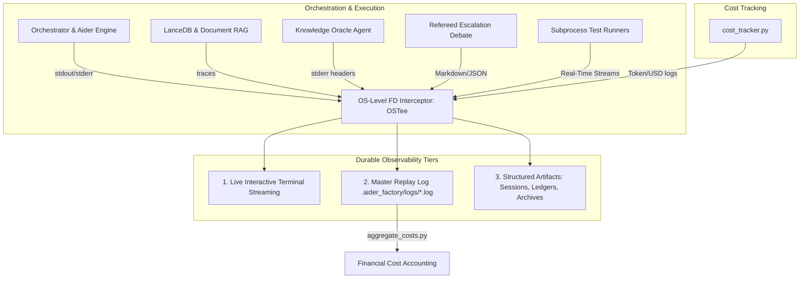

# Full-Stack Observability, Master Logging & Cost Accounting

## 1. Executive Overview & Foundational Invariants

The AI Factory architecture guarantees **100% full-stack visibility** into every agent turn, LanceDB chunking decision, subprocess execution, and financial expenditure. Nothing runs in a black box.

### Foundational Invariants
- **Kernel-Level Stream Interception**: Standard Python `sys.stdout` redirection in user-space silently drops output from C-extensions, Rust core binaries (LanceDB), and child subprocesses (Aider, pytest, Rscript). The pipeline enforces OS-level file descriptor multiplexing (`OSTee`) to guarantee zero-loss capture.
- **Three-Tier Observability**: Every execution is preserved across three synchronized tiers: (1) Live interactive ANSI streaming, (2) Master terminal recording logs, and (3) Structured disk artifacts (ledgers, transcripts).
- **Deterministic Financial Accounting**: Every token sent and received is parsed, aggregated, and logged into a USD cost ledger. Cost tracking is immutable and persists across autonomous loops and interactive pair-programming sessions via `cost_tracker.py`.
- **Zero-Loss PTY Capture**: Interactive sessions wrapped in `script -qfe` ensure that `prompt_toolkit` interfaces are perfectly captured without breaking terminal emulation.

---

## 2. System Topology & Lifecycle Flowcharts

The Observability Mesh captures telemetry from all layers of the DAG and funnels it into durable storage.



---

## 3. Technical Mechanics & Deep-Dive Logic

### 3.1 Kernel-Level Multiplexing (`OSTee`)
To capture raw bytes from all subprocesses and C-extensions, `run_workflow.py` duplicates the underlying POSIX file descriptors (1 for `stdout`, 2 for `stderr`) and wires them to an OS pipe. A background thread pumps this pipe to the master log file.

```python
# OS-Level File Descriptor Duplication
self.orig_stdout_fd = os.dup(1)
self.orig_stderr_fd = os.dup(2)
self.pipe_r, self.pipe_w = os.pipe()

# Redirect standard output/error to the write-end of the pipe
os.dup2(self.pipe_w, 1)
os.dup2(self.pipe_w, 2)
```

### 3.2 Token & Cost Extraction Regex (`aggregate_costs.py`)
At the conclusion of a run, `aggregate_costs.py` parses the master log file using a strict regular expression to extract token counts and USD costs from LiteLLM/Aider output lines.

```python
COST_PATTERN = re.compile(
    r"Tokens:\s*(?P<sent>[0-9.,]+[kM]?)\s*sent,\s*(?P<recv>[0-9.,]+[kM]?)\s*received(?:[.\s]*"
    r"Cost:\s*\$\s*(?P<msg>[0-9.,]+)\s*message,\s*\$\s*(?P<sess>[0-9.,]+)(?:\s*session)?)?",
    re.IGNORECASE,
)
```
Tokens with metric suffixes (`k`, `M`) are stripped of commas and mathematically expanded (e.g., $1.5\text{k} \rightarrow 1500$). The total run cost is the exact sum of all matched `msg` (message) costs.

### 3.3 Session Cost Accumulation (`cost_tracker.py`)
The `cost_tracker.py` module maintains the cumulative session cost across multiple invocations. It reads and writes to a sidecar file (`.oracle_session.json.costs.json`) and formats token counts and USD costs deterministically.

```python
def litellm_cost_line(resp, *, persist_session=False):
    # Formats Aider-style token/cost output for one LiteLLM completion response
    # Accumulates into _PROCESS_SESSION_COST or loads/saves to the sidecar file
```

### 3.4 Zero-Loss PTY Capture (`script -qfe`)
When `pair_programming: true` is enabled, `orchestrate.py` wraps Aider in the UNIX `script` utility. This creates a real PTY for Aider while flushing all output to `.pair_capture.log`, which is subsequently absorbed by `OSTee` and the cost aggregator.

```bash
script -qfe -c "aider --model gemini/gemini-3.6-flash ..." .pair_capture.log
```

### 3.5 Vector Database & Chunking Telemetry
During document and codebase ingestion, `rag_manager.py` emits continuous diagnostic traces captured by the master log:
- **AST Symbol Resolution:** Logs Tree-Sitter grammar parsing, function/class structural boundaries, and oversized leaf fallback line splits.
- **Docling Extraction Traces:** Logs isolated subprocess status (`docling_runner.py`), structural metadata headers (`# Document Metadata`), and table extraction boundaries.
- **Vector Transformation:** Logs embedding model calls, endpoint URLs, batch sizes, and returned vector dimensions.
- **Table Construction & Indexing:** Logs table creation (`<coll>_<repo>_code`, `<coll>_<repo>_docs`), row counts, and automatic `IVF_PQ` Approximate Nearest Neighbor (ANN) index builds when crossing 50,000 rows.
- **Retrieval Attribution:** Oracle queries log exact chunk IDs, cosine similarities, Reciprocal Rank Fusion (RRF) scores, and unique source file headers to `stderr` to keep `stdout` pristine.

---

## 4. Exhaustive CLI & Parameter Reference

| Command | Target Alias | Exit Code | Runtime Behavior |
| :--- | :--- | :--- | :--- |
| `uv run aggregate_costs.py <log>` | Cost Aggregator | `0` | Parses the master log file and prints total USD cost and token counts. |
| `less -R <log_file>` | Log Replay | `0` | Replays a master log file preserving ANSI color codes (Teal for Architect, Pink for Oracle). |
| `bash watch_loops.sh <log> <pid>` | Watchdog | `0` | Monitors a log file for redundant volume (75% threshold) and `kill -9`s the target PID if an infinite loop is detected. |
| `bash clean_lancedb_runs.sh <coll>` | Cleanup | `0` | Cleans up ephemeral artifacts (images, validations, debates) for a specific RAG collection without touching LanceDB tables. |

### 4.1 Structured Artifact Matrix
| Artifact | Path (relative to `.aider_factory/`) | Purpose |
| :--- | :--- | :--- |
| **Master Replay Log** | `logs/<config_stem>_run_<timestamp>.log` | Byte-for-byte capture of the entire execution. |
| **Oracle Transcript** | `logs/oracle_history/<timestamp>_<task_id>.md` | Oracle Q&A including raw retrieved LanceDB chunks in `<details>` tags. |
| **Chat Archive** | `logs/chat_history/<timestamp>_<task_id>.md` | Timestamped copy of the Aider Architect/Editor conversation. |
| **Debate Ledger** | `logs/debates/<stem>.debate.json` | Machine-readable turn state and quote baselines. |
| **Oracle Cost Ledger** | `sessions/<slug>/.oracle_session.json.costs.json` | Sidecar tracking cumulative Oracle session USD costs. |

---

## 5. Configuration Schema & YAML Knobs

### 5.1 Interactive PTY Capture (`pair_programming`)
```yaml
phases:
  - name: "Interactive Research"
    toggles:
      pair_programming: true  # Triggers PTY wrapping via `script -qfe`
```

### 5.2 Terminal Colors (`colors`)
Customizes the 24-bit truecolor ANSI escape sequences for agent debate turns.
```yaml
colors:
  architect_debate: "#38bdf8"  # Sky blue for Architect
  oracle_debate: "#d3869b"     # Soft rose for Oracle
```

---

## 6. Telemetry, Diagnostics & Operational Edge Cases

| Edge Case / Failure Mode | Root Cause | System Mitigation & Telemetry |
| :--- | :--- | :--- |
| **C-Extension Segmentation Faults** | A lower-level library (e.g., `pyarrow`, `lancedb`) crashes the Python process. | Captured safely by `OSTee`. Because `os.dup2` wires the file descriptors at the kernel level, the segfault trace is successfully written to the master log before the process dies. |
| **Unparseable Cost Lines** | Aider or LiteLLM changes its token output format, breaking `COST_PATTERN`. | `aggregate_costs.py` defaults to `0.0` for unmatched lines. The pipeline continues execution uninterrupted; only the final cost summary is affected. |
| **`E2BIG` (Argument list too long)** | Passing massive code contexts to the Oracle via CLI arguments exceeds Linux kernel buffer limits. | The Orchestrator writes debate prompts to temporary files (`.oracle_prompt_<tmp>.txt`) and executes Oracle calls via `--file <tmp_file>`, bypassing OS limits. |
| **Missing Oracle Telemetry** | Oracle library noise (model loading, HTTP warnings) pollutes the Aider chat. | `oracle_agent.py` forces all telemetry, RAG chunk counts, and cost lines to `sys.stderr`. Only the pure answer is printed to `sys.stdout` for Aider to consume. |
| **Infinite Aider Loops** | Aider gets stuck in a repetitive failure loop. | `watch_loops.sh` monitors log volume and kills the process if recent lines are >75% redundant. |
