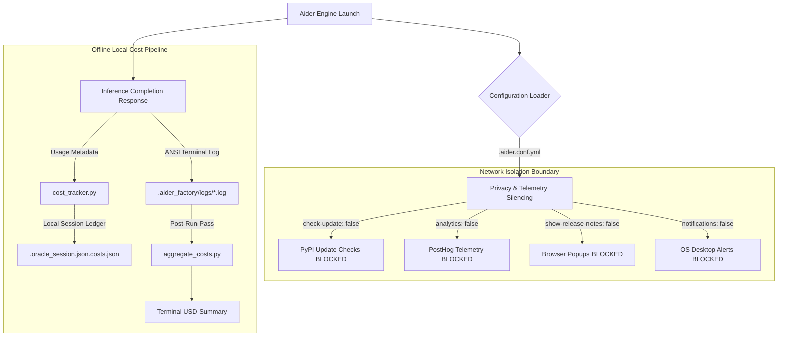

# Terminal UX, Privacy Controls & Automated Linting

## 1. Executive Overview & Foundational Invariants

The `aider-factory` pipeline enforces strict invariants regarding terminal ergonomics, user privacy, air-gapped security, and automated code quality assurance. In high-throughput, automated, or air-gapped environments, unhandled network telemetry, browser popups, and syntax errors introduced by LLM code edits disrupt workflow continuity.

### Key Invariants

1. **Air-Gapped Telemetry & Network Silencing**: By default, upstream Aider contacts remote PyPI repositories for update checks, sends telemetry pings to PostHog, and spawns local browser windows to display release history (`https://aider.chat/HISTORY.html`). `aider-factory` strictly silences all outgoing analytics, update checks, desktop notifications, and browser launches at the configuration level.
2. **Offline Cost & Token Accounting Guarantee**: Blocking telemetry (`analytics: false`) does **NOT** degrade or disable pipeline cost tracking. Token usage (`prompt_tokens`, `completion_tokens`) and financial expenditure ($USD$) are computed 100% offline and locally by reading API response metadata in `cost_tracker.py` and aggregating run logs via `aggregate_costs.py`.
3. **Automated Post-Edit Self-Healing**: Code edits performed by the Editor or Architect agents are immediately passed through automated linting and syntax validation hooks before committing. Any errors (stdout/stderr) are captured and fed back into the LLM context, triggering an automatic self-healing repair cycle.
4. **ANSI Truecolor Ergonomics**: Visual terminal outputs utilize 24-bit ANSI Truecolor formatting (`\033[38;2;R;G;Bm`) mapped to distinct system roles (e.g., Sky Blue `#38bdf8` for Architect/Assistant reasoning, Dark Orange `#d97706` for User inputs, and Soft Rose `#d3869b` for Oracle turns) to maintain visual role separation during live execution.

---

## 2. System Topology & Lifecycle Flowcharts

The following flowcharts detail the telemetry isolation boundaries and the automated post-edit linting/self-healing lifecycle loop.

### Telemetry Isolation & Cost Tracking Topology



### Post-Edit Automated Linting & Self-Healing Loop

```mermaid
graph TD
    A[Editor Agent Applies Code Edit] --> B{Linter Enabled?}
    B -->|auto_lint: false| C[Git Auto-Commit]
    B -->|auto_lint: true| D{lint_cmd Configured?}
    
    D -->|null / Default| E[Resolve Language Default Linter]
    D -->|Custom Command| F[Substitute {file} Parameter]
    
    E --> G[Execute Linter Subprocess]
    F --> G
    
    G --> H{Exit Code == 0?}
    H -->|Yes: Clean| C
    H -->|No: Errors Found| I[Capture stdout & stderr]
    I --> J[Inject Linting Errors into Chat Context]
    J --> K[LLM Self-Healing Edit Pass]
    K --> G
```

---

## 3. Technical Mechanics & Deep-Dive Logic

### 3.1 Air-Gapped Telemetry Silencing Engine
Upstream Aider includes telemetry instrumentation that pings external servers on startup and upon completion of edits. In `aider-factory`, these are permanently blocked in `.aider.conf.yml`:
* `check-update: false` prevents `urllib`/`requests` calls to PyPI.
* `analytics: false` prevents PostHog event logging.
* `show-release-notes: false` suppresses web browser subprocess execution (`webbrowser.open`).
* `notifications: false` disables desktop notification daemons (`notify-send` / `osascript`).

> **Unbreakable Code-Level Guarantee:** Beyond configuration files, `orchestrate.py` and `apply_agent.py` hardcode `--no-analytics`, `--no-check-update`, `--no-show-release-notes`, and `--no-notifications` directly into the subprocess execution CLI arguments. This provides an unbreakable guarantee of privacy and offline execution that supersedes any user misconfiguration or missing `.aider.conf.yml`.

#### Local Cost Accounting Mechanics
Cost tracking remains 100% operational despite telemetry silencing because usage data is extracted directly from model API response payloads:
$$\text{Cost}_{\text{message}} = (\text{Prompt Tokens} \times \text{Rate}_{\text{input}}) + (\text{Completion Tokens} \times \text{Rate}_{\text{output}})$$
$$\text{Cost}_{\text{session}} = \sum_{i=1}^{N} \text{Cost}_{\text{message}, i}$$

The local session cost is maintained in `.aider_factory/sessions/<slug>/.oracle_session.json.costs.json` and printed to `sys.stderr` via `cost_tracker.py`:
```text
Tokens: 12.4k sent, 1.2k received. Cost: $0.0024 message, $0.0148 session.
```

### 3.2 Automated Linting Hook Execution (`auto_lint` & `lint_cmd`)
When `auto_lint: true` is set, Aider monitors modified target files. Upon applying a SEARCH/REPLACE diff, Aider intercepts the workflow prior to git auto-commit:

1. **Command Resolution**: If `lint_cmd` is specified as a string (e.g., `"ruff check --fix {file}"`), `{file}` is dynamically replaced with the relative path of the modified target. If `lint_cmd` is `null`, Aider inspects the file extension and selects a default linter binary.
2. **Subprocess Execution**: The linter command runs in a child process within `working_directory`.
3. **Feedback Loop**:
   - **Exit Code `0`**: Code is clean. Aider proceeds to `git commit`.
   - **Non-Zero Exit Code**: Standard output and standard error are captured, wrapped in a `<lint_errors>` context block, and presented to the LLM model as an auto-correction prompt.

#### Supported Language Defaults (`lint_cmd: null`)
| Extension | Detected Language | Default Invoked Linter Binary |
| :--- | :--- | :--- |
| `.py` | Python | `ruff check` $\rightarrow$ `flake8` $\rightarrow$ `black --check` |
| `.js`, `.ts`, `.jsx`, `.tsx` | JavaScript / TypeScript | `eslint` / `prettier --check` |
| `.rs` | Rust | `cargo check` / `cargo clippy` |
| `.go` | Go | `go vet` |
| `.R`, `.rmd` | R | `Rscript -e 'lintr::lint("{file}")'` |

### 3.3 Terminal Colors & Visual Ergonomics
Terminal rendering uses ANSI 24-bit Truecolor sequences. The helper function `_hex_to_ansi` in `run_workflow.py` converts hex strings from the configuration `colors:` block:
```python
def _hex_to_ansi(hex_color: str, fallback: str) -> str:
    h = (hex_color or "").strip().lstrip("#")
    if len(h) != 6:
        return fallback
    try:
        r, g, b = int(h[0:2], 16), int(h[2:4], 16), int(h[4:6], 16)
        return f"\033[38;2;{r};{g};{b}m"
    except ValueError:
        return fallback
```

---

## 4. Exhaustive CLI & Parameter Reference

### Aider CLI Invocation Flags for UX & Linting

| Flag / Option | Argument Type | Default Value | Description |
| :--- | :--- | :--- | :--- |
| `--auto-lint` / `--no-auto-lint` | Boolean | `--auto-lint` | Enables or disables automated linting after code edits. |
| `--lint-cmd` | String | `null` | Custom command to run for linting. Requires `{file}` placeholder. |
| `--fancy-input` / `--no-fancy-input` | Boolean | `--fancy-input` | Enables rich prompt formatting, command autocompletion, and prompt history. |
| `--multiline` / `--no-multiline` | Boolean | `--no-multiline` | Toggles multiline input mode. When false, `Enter` submits prompt immediately. |
| `--pretty` / `--no-pretty` | Boolean | `--pretty` | Enables or disables colorized ANSI Markdown output formatting. |
| `--user-input-color` | Hex Color | `#d97706` | Sets terminal ANSI color for user prompt text and command headers. |
| `--assistant-output-color` | Hex Color | `#38bdf8` | Sets terminal ANSI color for LLM response text streaming. |

---

## 5. Configuration Schema & YAML Knobs

### 5.1 Privacy & Terminal UX Schema (`.aider.conf.yml` / `session.yml`)

```yaml
# ==============================================================================
# Global Privacy, Telemetry & Browser Popup Controls (.aider.conf.yml)
# ==============================================================================
check-update: false             # Disable PyPI update checks on launch (type: bool)
show-release-notes: false       # Block browser popups to release history (type: bool)
notifications: false            # Disable OS-level desktop alerts (type: bool)
analytics: false                # Block PostHog telemetry pings (type: bool)
no-show-model-warnings: true    # Suppress verbose terminal model warnings (type: bool)

# ==============================================================================
# Terminal Input & Color Ergonomics (.aider.conf.yml)
# ==============================================================================
fancy-input: true               # Enable prompt autocompletion & history (type: bool)
multiline: false                # Enter submits prompt; Esc+Enter adds line (type: bool)
user-input-color: "#d97706"     # Dark Orange user prompt text color (type: hex string)
assistant-output-color: "#38bdf8" # Sky Blue streaming assistant color (type: hex string)
pretty: true                    # Enable colorized ANSI Markdown output (type: bool)
```

### 5.2 Automated Linting Pipeline Schema (`.env.yml`)

```yaml
# ==============================================================================
# Pipeline-Level Automated Linting Configuration (.env.yml)
# ==============================================================================
auto_lint: true                 # Toggle automated linting after code edits (type: bool)
lint_cmd: null                  # Custom linter command string (type: string | null)

# Custom Linter Examples for lint_cmd:
# Python (Ruff):      "ruff check --fix {file}"
# Python (Flake8):    "flake8 {file}"
# R (lintr):          "Rscript -e 'lintr::lint(\"{file}\")'"
# Rust (Clippy):      "cargo clippy --quiet"
# JavaScript:         "eslint --fix {file}"
```

---

## 6. Operational Edge Cases, Failure Modes & Telemetry

### 6.1 Linter Infinite Loops & Exhaustion
* **Symptom**: The Editor agent applies a fix, the linter reports a new error, the Editor applies another fix, creating an infinite repair cycle.
* **Mitigation**: Linting loops inherit the `max_aider_loops` / `loop_aider_test` iteration ceiling defined in `.env.yml`. Once the attempt limit is reached, Aider halts execution, logs the persistent error in `.aider_factory/logs/`, and defers the task for human review or escalation debate.

### 6.2 Missing Linter Binaries
* **Symptom**: `auto_lint: true` is set with `lint_cmd: null`, but the language default linter (e.g., `ruff` or `eslint`) is not installed in the system PATH.
* **Behavior**: Aider logs a warning (`Linter binary not found`), skips the linting pass without throwing a fatal exception, and proceeds to git commit.
* **Resolution**: Install the required linter binary in your environment or specify an explicit, fully-qualified executable path in `lint_cmd` (e.g., `lint_cmd: "/usr/local/bin/ruff check {file}"`).

### 6.3 Non-Interactive TTY / Pipe Buffering
* **Symptom**: Terminal colors appear corrupted or contain raw escape sequences when piping logs through `tee` or running under CI/CD services.
* **Resolution**: Enforce color output by exporting `FORCE_COLOR=1` in your shell environment prior to executing `.aider_factory/bash/factory`.
