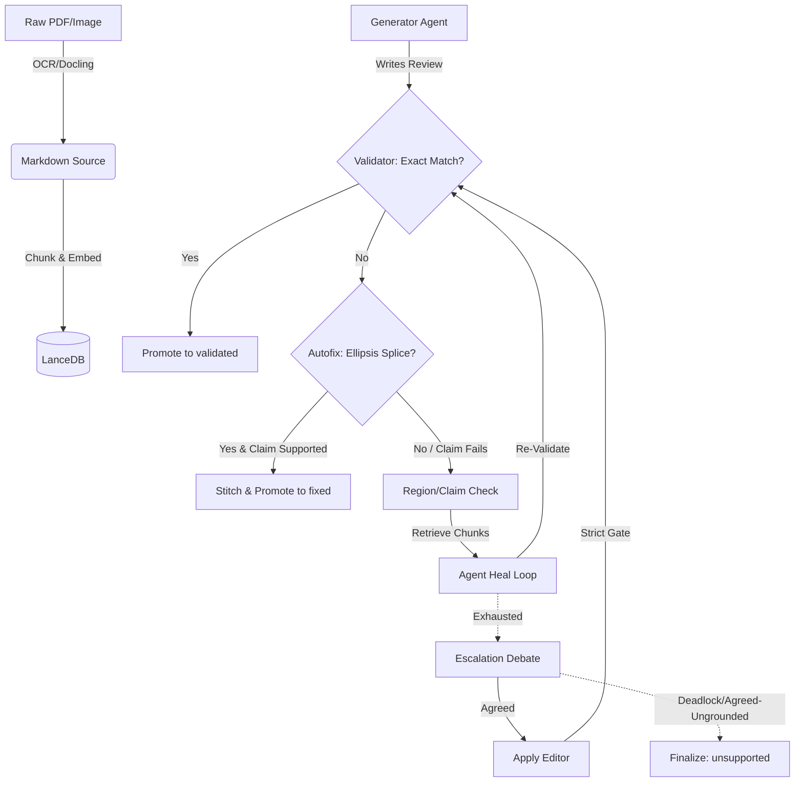

# Deterministic Validation, Grounding & MiniCheck Entailment

## 1. Executive Overview & Foundational Invariants

The Validation and Grounding system is the deterministic authority of the AI Factory Pipeline for literature reviews and document generation. It enforces a strict "tripwire" architecture: every key claim must be anchored by a short quote that is a provable, exact substring of the source document. 

**Foundational Invariants:**
1. **Deterministic-First Execution:** Code performs exact matching and anchored stitching. Agents are engaged exclusively for semantic judgment and hallucination repair.
2. **Validator-Only Write Authority:** The tags ARE the state. Agents only ever write `[evidence]` and edit text. The deterministic validator (`validator.py`) is the sole authority permitted to promote tags to `[validated]` or `[fixed]`, or demote them to `[unsupported]`.
3. **Precision Over Recall:** Grounding requires an exact normalized substring match. There is no fuzzy matching (e.g., Levenshtein) for grounding approval.
4. **Anchor Deletion Guard:** An automated step may never delete a quote. The pre-edit baseline hash set enforces an anchor-count floor; if the count drops, the pipeline halts to prevent silent data loss.
5. **Sentinel Exemption:** Quotes matching the exact phrase `"not specified in paper"` (case-insensitive) are intentional terminal states indicating an absence of source support. They are skipped by the auditor and never flagged or relabeled.

## 2. System Topology & Lifecycle Flowcharts

The validation lifecycle operates as a multi-stage ladder, executing the cheapest and most reliable checks first.



## 3. Technical Mechanics & Deep-Dive Logic

### 3.1 Exact Substring Grounding
Grounding is proven via a normalized exact substring match. The `_normalize(s)` function collapses whitespace and unifies curly quotes and em/en-dashes.
$$ \text{IsGrounded}(q, S) = \text{Normalize}(q) \subseteq \text{Normalize}(S) $$

### 3.2 Deterministic Auto-Fix Engine (`--autofix`)
The most common quote defect is an ellipsis splice (`...`, `…`, or `. . .`). The autofix engine repairs these deterministically:
1. Splits the quote on the ellipsis.
2. Locates each fragment as an exact, ordered, non-overlapping substring of the source.
3. Computes the inter-fragment gap. If the gap $\le 200$ characters (`_MAX_STITCH_GAP`), it constructs the stitched quote.
4. **Claim Gate:** The surrounding claim block is evaluated using the verifier. If $P(\text{Entailed}) < \text{threshold}$, the stitch is declined and held for debate.
5. If passed, the quote is replaced with the verbatim span and relabeled to `[fixed]`.

### 3.3 Weakest-Link Sentence-Level Entailment (MiniCheck)
When configured, the pipeline upgrades claim verification from cosine topicality to exact entailment using the MiniCheck-Flan-T5-Large classifier (Zhang et al., 2024). The evaluation operates at the sentence level, applying a weakest-link scoring mechanism:
$$ \text{Faithfulness}(\text{Claim}) = \min_{s_i \in \text{Sentences}(\text{Claim})} P(\text{Entailed} \mid \text{Document}, s_i) $$
If the minimum probability falls below `entail_threshold` (default 0.5), the claim is flagged as unsupported.

### 3.4 Reciprocal Rank Fusion (RRF)
When retrieving chunks across multiple LanceDB tables (e.g., `--claims-only` or batch RAG), the pipeline merges ranked lists using RRF (Cormack et al., 2009):
$$ \text{RRF\_Score}(d \in D) = \sum_{t \in \text{Tables}} \frac{1}{60 + \text{rank}_t(d)} $$

### 3.5 Tag State Machine Transitions
* `[evidence]` $\rightarrow$ `[validated]`: Quote is grounded and its hash matches the pre-edit baseline.
* `[evidence]` $\rightarrow$ `[fixed]`: Quote is grounded but its hash is NOT in the baseline (it was edited).
* `[evidence]` $\rightarrow$ `[unsupported]`: Quote remains ungrounded after an `agreed` debate.

## 4. Exhaustive CLI & Parameter Reference

The `validator.py` script (wrapped by `.aider_factory/bash/validate`) exposes the following CLI interface:

| Flag / Argument | Type | Description | Default |
| :--- | :--- | :--- | :--- |
| `--file` | `str` | Path to the generated document (review) to audit. | **Required** |
| `--source` | `str` | Path to the OCR `<stem>.md` ground-truth source. | **Required** (unless `--claims-only`) |
| `--report` | `str` | Path to write the output validation/heal report. | **Required** |
| `--claims-only` | `flag` | Validates raw text paragraphs without requiring `[evidence]` tags. | `False` |
| `--no-print` | `flag` | Suppresses stdout printing in `--claims-only` mode. | `False` |
| `--autofix` | `flag` | Runs the deterministic ellipsis-stitch repair engine. | `False` |
| `--finalize-unsupported`| `flag` | Terminal step: promotes grounded, demotes agreed-ungrounded to `[unsupported]`. | `False` |
| `--tag` | `str` | The base tag to audit. | `evidence` |
| `--region-threshold` | `float`| Cosine similarity threshold for region annotation. | `0.60` |
| `--region-margin` | `int` | $\pm$ lines to expand beyond the quote's paragraph for claim blocks. | `2` |
| `--top-k` | `int` | Number of source chunks to retrieve per failing quote. | `5` |
| `--baseline-ledger` | `str` | Path to the debate ledger holding the `quote_baseline` hash set. | `None` |

## 5. Configuration Schema & YAML Knobs

Validation and grounding behaviors are controlled via the `validation` and `endpoints` blocks in `.env.yml`.

```yaml
endpoints:
  grounding_agent_api: "http://192.168.100.1:8090/v1" # Points to minicheck_server.py

models:
  grounding_agent: "openai/minicheck-flan-t5-large" # Unset triggers cosine fallback

validation:
  enabled: true
  validation_tag: "evidence"
  region_threshold: 0.60
  region_margin: 2
  region_paragraphs: 0
  region_top_k: 5
  validation_loops: 3
  verify_all_claims: false  # If true, scores EVERY claim, not just failing ones
  entail_threshold: 0.5     # Minicheck probability threshold
```

## 6. Telemetry, Diagnostics & Operational Edge Cases

### 6.1 Ledger Tracking & No-Progress Guard
To prevent infinite loops during agent healing, the validator maintains a JSON ledger at `.aider_factory/logs/validations/<stem>.ledger.json`. It tracks the SHA-1 hashes of all tripped quotes. If the set of tripped quotes remains identical across consecutive attempts, the `no-progress` guard triggers, halting the loop and escalating to the debate phase.

### 6.2 MiniCheck Server Shim (`minicheck_server.py`)
Because MiniCheck is a seq2seq classifier and not a standard conversational LLM, it cannot be served via a standard `llama.cpp` GGUF chat endpoint. The pipeline includes a dedicated FastAPI shim (`minicheck_server.py`) that downloads the HuggingFace weights and exposes an OpenAI-compatible `/v1/chat/completions` endpoint.
* **Deployment:** Run via `uv run --locked minicheck_server.py`.
* **Systemd Edge Case:** If the service fails with `status=217/USER`, the `User=` directive in the systemd unit file does not match a valid host account.

### 6.3 Soft-Quotes & LaTeX Edge Cases
Quotes containing LaTeX math formatting (`$`) or the explicit `(OCR-uncertain)` marker are treated as "soft-quotes." Because OCR engines rarely extract complex mathematics with character-for-character fidelity, soft-quotes bypass exact-substring gating. 
* **Invariant:** An agent can never promote a soft-quote. If an agent writes `[fixed]` or `[validated]` on a soft-quote that cannot be mathematically proven, the validator deterministically demotes it back to `[evidence]`.
