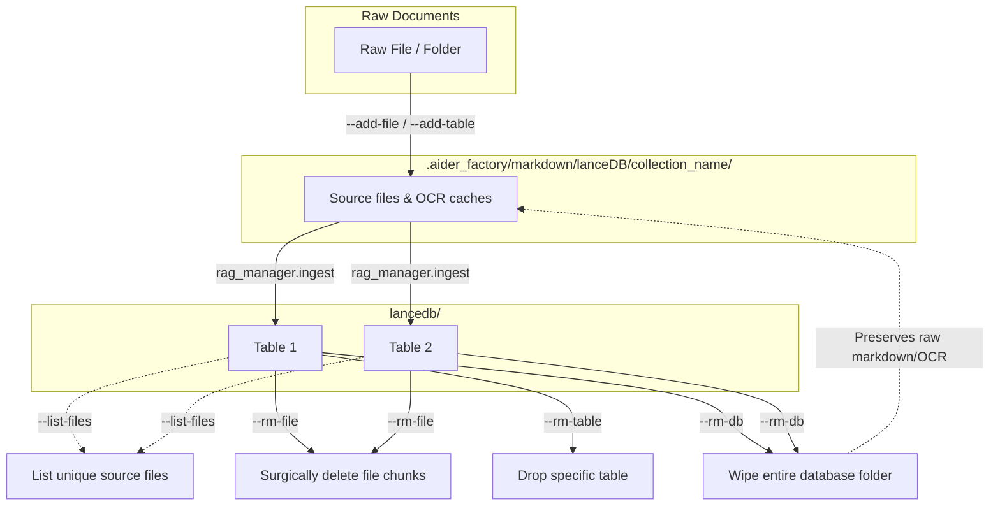

# AI Factory Pipeline — Factory Service Manual

**Target OS:** Ubuntu 26.04 LTS  
**Primary Architecture:** AMD ROCm (Unified Memory)  
**Auxiliary Architecture:** NVIDIA CUDA

This manual is the master reference for deploying the AI Factory Pipeline from bare metal. It covers the exact installation steps, systemd configurations, inference server flags, and YAML configurations required to execute the pipeline reliably.

---

## 0. Core Philosophies (the foundation — do not violate)

These are the load-bearing rules of the codebase. Everything else is a _part_ bolted onto this
foundation: you can add new models, modes, oracles, and iterations, but nothing may break these.
The pipeline is **language-agnostic** — the same DAG runs a literature review, R, Rust, Go, or Java;
"review" and "code" are just two configurations of one skeleton (`produce → verify → escalate →
finalize`).

1. **Deterministic-first; agents only where code provably cannot do the job.** Code does exact
   matching, anchored stitching, tag assignment, counting, and running the test suite. Agents do
   _judgment_ (is this paraphrase faithful? what is the root cause of this failure?). The debate is
   an **escalation of last resort**, not a routine step.
2. **Provable truth, precision over recall, no fuzzy.** Review grounding = an exact normalized
   substring of the OCR source. Code grounding = the test suite's exit code (pass/fail). No
   thresholds, no Levenshtein, no embeddings deciding pass/fail. (`rapidfuzz` is installed but
   deliberately unused.)
3. **Embeddings / region similarity are ANNOTATION ONLY.** They flag a passage as "looks
   hallucinated" (review) or retrieve reference material (code); they never grant or deny grounding.
4. **Only PROMOTE tags automatically. Never delete a quote, never fabricate, never auto-write the
   `"Not specified in paper."` sentinel.** A deletion guard (anchor-count floor) enforces it.
5. **The tags ARE the state; the deterministic validator is the ONLY writer of grounding tags.**
   Agents only write `[evidence]` and edit _text_; they never award themselves `[validated]`/
   `[fixed]`/`[unsupported]`. (Code mode's equivalent authority is the test suite, re-run by the
   deterministic `final_check`.)
6. **Minimal-delta edits.** Targeted changes, not rewrites; preserve behavior on paths you are not
   explicitly changing.
7. **Full cross-validation after EVERY change** (compile, DAG dry-run, real-artifact check, and a
   backward-compat pass) — verify with logic _independent_ of the code under test.
8. **DAG philosophy: phases are splittable AND combinable.** Every node reads its inputs from disk
   (review/report/ledger, or source/test/failure log), so the same result emerges whether steps run
   as one phase or many. Nodes are file-coupled and order-independent. Two modes or ten scale the
   same way.
9. **No pipeline git commits except aider's own auto-commits.** `.aider_factory/python/` is untracked;
   provenance = auto-commits on the artifacts + the ledgers/verdicts.
10. **Run everything under aider's bundled Python** (`AIDER_PY=~/.local/share/uv/tools/aider-chat/
bin/python`) — the only interpreter with lancedb, sentence-transformers, litellm, yaml.
11. **Use aider's framework; don't reinvent it.** Debate turns go through aider (ask mode); the
    escalation hangs off aider's iterate-test loop; settings live in `.aider.conf.yml` /
    `.aider.model.settings.yml`.
12. **Oracle owns ground truth; the Architect applies; the Oracle stays reactive.** It judges the
    Architect's proposal and cites exact evidence (verbatim source for review; reference code + the
    failing test for code); it is not a whole-document auditor.
13. **Communicate plainly; objectivity over agreement.** Disagree when warranted; correct course
    rather than confirm a wrong assumption.

---

## 1. Operating System & Core Dependencies

Ubuntu 26.04 enforces strict Python PEP-668 environments, meaning global `pip install` commands will fail. We completely bypass this using `uv`.

### System Packages

Install the required base build tools and ctags (required by Aider for repository mapping):

```bash
sudo apt update
sudo apt install -y build-essential cmake curl git universal-ctags
```

### Python Environment Tooling (`uv`)

Install Astral's `uv` for fast, isolated Python execution:

```bash
curl -LsSf https://astral.sh/uv/install.sh | sh
source $HOME/.cargo/env
```

### Containerized Test Execution (Docker)

If your `test_command_prefix` in `.env.yml` uses Docker (e.g., `docker exec -i --user bryanr -w /home/bryanr/wf/BaseFeatures -e RETICULATE_PYTHON=/home/bryanr/.venv-rocker/bin/python3 rocker-rstudio`), ensure Docker is running and the container is active before executing the pipeline:

```bash
sudo apt install docker.io
sudo systemctl enable --now docker
# Example to start your specific testing container
# docker start rocker-rstudio
```

### Project Repository & Initial Setup

The AI Factory pipeline is packaged as a global Python tool, meaning you can initialize and run it inside any clean repository without manual script copying.

#### Installation Methods

##### Method A: Standard Installation (Recommended for regular use)

Builds an isolated global sandbox directly from GitLab and registers the CLI commands:

```bash
uv tool install --force git+ssh://git@gitlab.com/bryanrod182/aider-factory.git
```

##### Method B: Editable Installation (Recommended for developers/contributors)

Clones the repository locally and symlinks it, allowing any code changes you make to be live instantly:

```bash
# Clone the repository
git clone git+ssh://git@gitlab.com/bryanrod182/aider-factory.git
cd aider-factory

# Install globally in Editable Mode
uv tool install --force --editable .
```

---

#### Initializing Your Project Workspace

To initialize your project:

```bash
# 1. Navigate to your project directory
cd your-project

# 2. Run aider-factory once to initialize the workspace
aider-factory
```

On the first run, the tool will automatically bootstrap a 100% zero-clutter agent workspace:

At the project root:

- `.aiderignore` — Exclusions to prevent Aider from indexing large databases, caches, or logs, protecting your context window and VRAM.

Inside the git-ignored `.aider_factory/` subdirectory:

- `.aider_factory/.env.yml` — Your master DAG pipeline configuration file.
- `.aider_factory/.aider.conf.yml` — Aider global configuration.
- `.aider_factory/.aider.model.settings.yml` — Aider per-model parameter and reasoning budget overrides.
- `.aider_factory/CONVENTIONS.md` — Global Aider instruction guidelines and protocols.
- `.aider_factory/markdown/templates/` — **User-customizable** plan templates (`implement.md`, `testing.md`, `literary_review_template.md`, etc.). Create, edit, or swap these freely via `plans.*` in your YAML.
- `.aider_factory/markdown/internal/` — **Infrastructure** templates (`analyze_bugs.md`, `deliberation_evidence_template.md`, `apply_evidence_template.md`, `contextual_revalidation_template.md`). These contain pipeline-parsed formatting rules (PROPOSAL/VERDICT formats, tag semantics). Editing them can break parsing or validation gates.
- `.aider_factory/markdown/oracle_pre_plan/` — Phase-0 strategy workflow templates.
- `.aider_factory/markdown/lanceDB/` — RAG corpora: one sub-folder per `collection_name` holding raw PDFs/MDs, OCR outputs, and the `lancedb/` vector store.
- `.aider_factory/tests/` — The test runner (`run_tests.R`) and validation heal scripts.
- `.aider_factory/logs/` — Consolidated run logs, chat histories, debates, and validation reports.

---

#### Configuring Your Cloud API Keys

The AI Factory uses environment variables to authenticate with cloud model providers. You can set them in one of two places:

##### Option A: Globally in your shell profile (Recommended)

Add these lines to the end of your `~/.bashrc` or `~/.zshrc` file so they are always active:

```bash
export GEMINI_API_KEY="AIzaSy..."
export OPENAI_API_KEY="sk-proj-..."
```

Then run `source ~/.zshrc` to reload.

##### Option B: Locally in a `.env` file

Create a local, git-ignored `.env` file at the root of your project:

```env
GEMINI_API_KEY=AIzaSy...
OPENAI_API_KEY=sk-proj-...
```

---

Reference the default `.aider_factory/.env.yml` inside your `.aider_factory/` folder to get started. The initialized version includes a working YAML configuration out of the box.

---

## 2. GPU Acceleration Layer

### Primary: AMD ROCm Setup

For AMD GPUs (especially Unified Memory setups like MI300 or consumer APUs/GPUs), install the ROCm SDK.

```bash
sudo apt install -y rocm-hip-sdk
```

### Auxiliary: NVIDIA CUDA Setup

If deploying on an NVIDIA host, install the proprietary drivers and CUDA toolkit:

```bash
sudo apt install -y nvidia-driver-550 nvidia-cuda-toolkit
```

### Model Acquisition and Organization

GGUF model files can be downloaded from HuggingFace and stored in a central directory. All models are registered in `models.ini` using aliases, which you then reference in your pipeline YAML.

#### Downloading Models from HuggingFace

```bash
mkdir -p ~/Programs/gguf
cd ~/Programs/gguf

# Download split model files from HuggingFace (example pattern)
wget https://huggingface.co/USER/MODEL/resolve/main/model-00001-of-00002.gguf
wget https://huggingface.co/USER/MODEL/resolve/main/model-00002-of-00002.gguf
```

#### Merging Split GGUF Files

If the model was downloaded as multiple parts, use `llama-merge-gguf` to combine them:

```bash
# Clone and build llama-merge-gguf
git clone https://github.com/ggerganov/llama.cpp
cd llama.cpp/gguf-py
pip install -e .

# Merge split files into one GGUF
llama-merge-gguf \
    model-00001-of-00002.gguf \
    model-00002-of-00002.gguf \
    qwen3.6-27b-merged.gguf

# Remove split files, keep only the merged file
rm model-00001-of-00002.gguf model-00002-of-00002.gguf
```

#### Organizing Models

All merged GGUF files live in `~/Programs/gguf/` alongside `models.ini`:

```
~/Programs/gguf/
  models.ini
  qwen3.6-27b-merged.gguf
  glm-ocr-f16.gguf
  glm-ocr-mmproj.gguf
```

Register each model in `models.ini` (see Section 3.4) using a human-readable alias. The alias is what you use in your pipeline YAML. llama.cpp picks up the registry automatically when the server starts.

---

## 3. High-Performance Inference Servers

The pipeline orchestrates multiple AI models simultaneously across different inference endpoints. The architecture leverages three distinct model serving backends:

### 3.1 Understanding Model Prefix Routing

The AI Factory pipeline routes model traffic automatically based on **model prefixes**. These prefixes are a native Aider feature (documented at [aider.chat/docs/llms.html](https://aider.chat/docs/llms.html)) that tells Aider which API endpoint to target when launching a session.

| Prefix            | Backend                          | Endpoint Used                             | Notes                                                                                                                                        |
| ----------------- | -------------------------------- | ----------------------------------------- | -------------------------------------------------------------------------------------------------------------------------------------------- |
| `openai/`         | Any OpenAI-compatible API server | `architect_api_base`                      | Used for high-capability reasoning models (Architect, RAG Oracle). Routes to your local `llama-server` on port 8081 or remote LiteLLM proxy. |
| `ollama/`         | Ollama native API                | `editor_ollama_api`                       | Ollama must be running (`ollama serve`). Ideal for fast, local coding models.                                                                |
| `lm_studio/`      | LM Studio (OpenAI-compatible)    | `editor_ollama_api`                       | LM Studio presents an OpenAI-compatible API on its own port. Mapped to the same `editor_ollama_api` endpoint.                                |
| `gemini/`         | Google Gemini API                | Bypasses endpoints, uses `GEMINI_API_KEY` | Direct API routing. No local server needed.                                                                                                  |
| `vertex_ai/`      | GCP Vertex AI                    | Bypasses endpoints, uses GCP credentials  | Direct API routing. No local server needed.                                                                                                  |
| `github_copilot/` | GitHub Copilot                   | Handled natively by Aider                 | Uses Copilot auth. No local server needed.                                                                                                   |

**You can mix and match prefixes freely across phases.** For example, you could use `openai/qwen3.5-122b` for the Architect in Phase 1 (routing to your high-end `llama-server` on port 8081), then switch to `ollama/qwen2.5-coder` for the Editor in Phase 2 (routing to your local Ollama instance on port 11434). This flexibility allows you to optimize cost and speed per phase.

#### Example: Multi-Prefix Phase Configuration

```yaml
phases:
  - name: "High-Capability Implementation"
    models:
      architect_agent: "openai/qwen3.5-122b-a10b-90k:latest" # Routes to architect_api_base (port 8081)
      editor_agent: "ollama/qwen3.6-27B-90k:latest" # Routes to editor_ollama_api (port 11434)
      rag_agent: "gemini/gemini-3.5-flash" # Bypasses endpoints, uses GEMINI_API_KEY
```

---

### 3.2 llama.cpp Architecture Overview

llama.cpp is the backbone of the high-performance inference layer. It is compiled into a binary called `llama-server`. The pipeline typically runs **two separate `llama-server` instances**:

| Instance           | Port | Purpose                                                      | Configuration Focus                                            |
| ------------------ | ---- | ------------------------------------------------------------ | -------------------------------------------------------------- |
| **Primary Router** | 8081 | Architect (planning), RAG Oracle, fallback models            | MTP enabled for speed, `--parallel 3` for multi-model hot-swap |
| **Vision/OCR**     | 8080 | GLM-OCR vision model for document ingestion, embedding model | Parallel OCR slots, dedicated embedding context                |

Both instances can serve multiple models simultaneously when `--models-max` and `--parallel` are configured appropriately.

#### Context Size and Parallel Slots (critical relationship)

llama-server **divides the total `--ctx-size` evenly across `--parallel` slots**. Each slot gets `ctx-size / parallel` tokens of context. This applies both to global flags and to per-model overrides in `models.ini`.

Example: `--ctx-size 65536 --parallel 8` gives each slot **8192 tokens**. A request requiring 2744 tokens of input fits easily, but a request requiring 10000 tokens would fail with `400 Bad Request: request exceeds the available context size`.

This relationship is critical for vision models (where image tokens are large) and embedding models (where input text length varies). Always calculate `ctx-size / parallel` and verify it exceeds your expected per-request token count.

#### Case-Sensitive Model Names

llama-server's router is **case-sensitive** on model names and aliases. The model registered as `glm-ocr-f16:LATEST` (uppercase) will **not** match a request for `glm-ocr-f16:latest` (lowercase). Always ensure the model name in your YAML `models:` block exactly matches the `[section-name]` in `models.ini`, including the tag casing. Convention: use `LATEST` (uppercase) for local models.

---

### 3.3 Compiling `llama.cpp`

#### Dependencies

```bash
sudo apt update
sudo apt install -y build-essential cmake git
```

#### Clone the Repository

```bash
git clone https://github.com/ggerganov/llama.cpp
cd llama.cpp
```

#### AMD (HIP/ROCm) — Primary Build

```bash
HIPCXX="$(hipconfig -l)/clang" cmake -B build \
    -DGGML_HIP=ON \
    -DGGML_HIP_ROCWMMA_FATTN=ON \
    -DCMAKE_BUILD_TYPE=Release

cmake --build build --config Release -j $(nproc)
```

#### NVIDIA (CUDA) — Auxiliary Build

```bash
cmake -B build -DGGML_CUDA=ON -DCMAKE_BUILD_TYPE=Release
cmake --build build --config Release -j $(nproc)
```

The compiled `llama-server` binary will be at:

```bash
./build/bin/llama-server
```

---

### 3.4 The `models.ini` Configuration File

llama.cpp supports a local model registry via `models.ini`. This file defines available models and their GGUF file paths, allowing `llama-server` to switch models on the fly via an API call.

Create `~/.config/llama-server/models.ini`:

```ini
# ~/.config/llama-server/models.ini
# Format: [model-name] -> /path/to/model.gguf
# The name after the slash in your pipeline YAML (e.g., "glm-ocr-f16:latest") maps to these entries.

[qwen3.5-122b-a10b-90k:latest]
path = /opt/models/qwen3.5-122b-a10b-90k-Q4_K_M.gguf
ctx_size = 32768
n_gpu_layers = 999

[qwen3.6-27b-90k:latest]
path = /opt/models/qwen3.6-27b-90k-udq4kxl.gguf
ctx_size = 32768
n_gpu_layers = 999

[glm-ocr-f16:LATEST]
model = /opt/models/GLM-OCR-f16.gguf
mmproj = /opt/models/mmproj-GLM-OCR-Q8_0.gguf
ctx-size = 65536          # divided by parallel slots (65536/8 = 8192 per slot)
parallel = 8              # 8 concurrent OCR requests; sweet spot for AMD APUs
n-gpu-layers = 999
temp = 0.1
flash-attn = off          # vision models: do NOT enable flash attention
cache-type-k = f16        # vision models: use f16 KV cache (not quantized)
cache-type-v = f16
mmap = false

[qwen3-embedding-8b-8k:LATEST]
model = /opt/models/Qwen3-Embedding-8B.i1-Q6_K.gguf
embeddings = on            # expose /v1/embeddings (CRITICAL for embedding models)
pooling = last             # Qwen3-Embedding pools the final [EOS] token (CRITICAL)
ctx-size = 16384           # safety margin for long queries (model trains to 40960)
batch-size = 16384
ubatch-size = 16384
n-gpu-layers = 999
parallel = 1               # embedding requests are serial; 1 slot is sufficient
flash-attn = on
cache-type-k = f16
cache-type-v = f16
mmap = false
```

When `llama-server` is running, you can switch models via API:

```bash
curl http://localhost:8081/load -d '{"model": "qwen3.6-27b-90k:latest"}'
```

---

### 3.5 Systemd Services for llama-server Instances

#### Systemd Service 1: Primary Router (Port 8081)

This instance serves the Architect and RAG Oracle models. It runs with MTP enabled for speed and parallel execution for hot-swapping.

Create `/etc/systemd/system/llama-pair-router.service`:

```ini
[Unit]
Description=Llama.cpp Primary Router — Architect + Oracle + Fallback Models
After=network.target

[Service]
Type=simple
User=YOUR_USERNAME
WorkingDirectory=/home/YOUR_USERNAME
ExecStart=/opt/llama.cpp/build/bin/llama-server \
    --host 0.0.0.0 \
    --port 8081 \
    --models-dir /home/YOUR_USERNAME/.config/llama-server \
    --models-max 3 \
    --parallel 3 \
    --ctx-size 32768 \
    --spec-type draft-mtp \
    --spec-draft-n-max 3 \
    --flash-attn
Restart=always
RestartSec=5
StandardOutput=journal
StandardError=journal

[Install]
WantedBy=multi-user.target
```

Enable and start:

```bash
sudo systemctl daemon-reload
sudo systemctl enable llama-pair-router.service
sudo systemctl start llama-pair-router.service
# Verify status:
sudo systemctl status llama-pair-router.service
```

#### Systemd Service 2: Vision/OCR + Embedding Endpoint (Port 8080)

This instance serves the GLM-OCR vision model and the embedding model. The router loads models on demand (`--models-max 1` means one model at a time; the router evicts the idle model when a different model is requested). **Critical:** Do NOT enable MTP or Flash Attention as global flags on this instance — vision model encoders break with both. Per-model overrides in `models.ini` (e.g. `flash-attn = on` for the embedding model) are safe.

Create `/etc/systemd/system/llama-vision.service`:

```ini
[Unit]
Description=Llama.cpp Vision/OCR + Embedding Endpoint
After=network.target

[Service]
Type=simple
User=YOUR_USERNAME
WorkingDirectory=/home/YOUR_USERNAME
ExecStart=/opt/llama.cpp/build/bin/llama-server \
    --host 0.0.0.0 \
    --port 8080 \
    --models-preset /path/to/models.ini \
    --models-max 1 \
    --parallel 1 \
    --no-mmap \
    --slot-prompt-similarity 0.0
Restart=always
RestartSec=5
StandardOutput=journal
StandardError=journal

[Install]
WantedBy=multi-user.target
```

Note: `--parallel 1` is the global default; the per-model `parallel = 8` in `models.ini` for `glm-ocr-f16:LATEST` overrides it when that model is loaded.

#### Parallel OCR Tuning (Vision Model Slot Count)

The optimal number of parallel OCR slots depends on your GPU's memory bandwidth. On an AMD Strix Halo APU (128 GB unified memory, ~250 GB/s bandwidth, 40 CUs at 2800 MHz), benchmarks show:

| `parallel` | Per-slot decode speed | Aggregate throughput | Wall-clock (47-page PDF) | Verdict                          |
| ---------- | --------------------- | -------------------- | ------------------------ | -------------------------------- |
| 1          | ~80 t/s               | ~80 t/s              | ~20 min (sequential)     | Baseline                         |
| 8          | ~80 t/s               | ~640 t/s             | ~5 min                   | Sweet spot                       |
| 16         | ~14 t/s               | ~224 t/s             | ~12 min                  | Regression (bandwidth saturated) |

**Recommendation:** Start at `parallel = 8` for vision models. Memory cost is minimal (~5 GB total for GLM-OCR at 8 slots with 8192 context per slot). Monitor GPU clocks — if they drop below ~2200 MHz sustained, reduce slots.

Enable and start:

```bash
sudo systemctl daemon-reload
sudo systemctl enable llama-vision.service
sudo systemctl start llama-vision.service
# Verify status:
sudo systemctl status llama-vision.service
```

---

### 3.6 Remote llama-server Instances (Tablet/Remote Host)

If your primary inference machine is a separate device (e.g., a tablet with an AMD GPU), you can run an additional `llama-server` instance on that remote host and configure the pipeline to target it via the `architect_api_base` endpoint.

On the remote host, create a similar systemd service pointing to the same `models.ini`:

```ini
[Service]
ExecStart=/opt/llama.cpp/build/bin/llama-server \
    --host 0.0.0.0 \
    --port 8081 \
    --models-dir /home/YOUR_USERNAME/.config/llama-server \
    --models-max 3 \
    --parallel 3 \
    --ctx-size 32768
```

Ensure the remote service is reachable from your main machine by configuring your network and updating the pipeline's `architect_api_base`:

```yaml
endpoints:
  architect_api_base: "http://192.168.100.2:8081/v1" # Remote host IP
```

---

### 3.7 Ollama Configuration (Port 11434)

Ollama is primarily used for fast, background coding tasks (the Editor model). It runs on its default port (11434) and is referenced by the `editor_ollama_api` endpoint.

#### Installation

```bash
curl -fsSL https://ollama.com/install.sh | sh
```

#### Allow Remote Access

If your pipeline runs from a different machine, edit the systemd override:

```bash
sudo systemctl edit ollama.service
```

Add:

```ini
[Service]
Environment="OLLAMA_HOST=0.0.0.0"
```

Then:

```bash
sudo systemctl daemon-reload
sudo systemctl restart ollama
```

#### Pulling Models

```bash
ollama pull qwen3.6-27B-90k:latest
ollama pull qwen2.5-coder:1.5b
```

The Ollama API is automatically OpenAI-compatible, so the `ollama/` prefix in your pipeline YAML will route correctly.

---

### 3.8 User-Level SearXNG Service & Web Research Setup

To support vendor-free web research (`aider-research search`), SearXNG runs as a local systemd user service on port **8088** (bypassing port 8080 used by `llama-vision.service`).

`aider-factory` and `aider-research` auto-provision this service transparently on first run if Podman or Docker is available. Podman (`sudo apt install -y podman`) is preferred for 100% rootless, zero-sudo execution.

On onboarding, `cli.py` creates `~/.config/searxng/settings.yml` enabling the JSON search format (`search.formats: [html, json]`) and generates `~/.config/systemd/user/searxng.service`:

```ini
[Unit]
Description=SearXNG Meta-Search Engine (User Service)
After=network.target

[Service]
Type=simple
ExecStartPre=-/usr/bin/podman rm -f searxng
ExecStart=/usr/bin/podman run --rm --name searxng -p 8088:8080 -v %h/.config/searxng/settings.yml:/etc/searxng/settings.yml:ro -e SEARXNG_BASE_URL=http://localhost:8088/ docker.io/searxng/searxng:latest
ExecStop=/usr/bin/podman stop searxng
Restart=always
RestartSec=5

[Install]
WantedBy=default.target
```

Enable and start the user service without sudo:
```bash
systemctl --user daemon-reload
systemctl --user enable --now searxng.service
```

---

### Pipeline Execution Dependencies

The AI Factory pipeline is written in Python and requires the following packages. All dependencies are managed by `uv`, bypassing Ubuntu 26.04 PEP-668 restrictions:

```bash
# Install dependencies via uv (no pip required)
uv pip install --system lancedb sentence-transformers pyarrow requests pyyaml

# Or use uv run (creates isolated environment automatically)
uv run --with lancedb --with sentence-transformers --with pyarrow --with requests --with pyyaml \
    .aider_factory/python/run_workflow.py
```

| Package                 | Purpose                                            |
| ----------------------- | -------------------------------------------------- |
| `lancedb`               | Vector database for RAG document storage           |
| `sentence-transformers` | Embedding model for text chunking and retrieval    |
| `pyarrow`               | Required by LanceDB for data serialization         |
| `requests`              | HTTP client for llama-server API calls             |
| `pyyaml`                | Parsing `.env.yml` and `.aider.model.settings.yml` |

---

## 4. The Orchestration Layer (Aider)

Install Aider globally using `uv tool`, forcing an isolated Python 3.12 environment:

```bash
uv tool install --force --python python3.12 --with pip aider-chat@latest
```

### Aider Configuration: `.aider.conf.yml`

This file locks the KV cache behavior and sets the UI.

```yaml
# .aider_factory/.aider.conf.yml
max-chat-history-tokens: "90000"
map-tokens: "0" # Prevents background map generation from breaking KV cache
map-refresh: manual
weak-model: "gemini/gemini-2.5-flash" # Handles commits cheaply without flushing main model
user-input-color: "#d97706" # UI Optimization
```

### Aider Model Overrides: `.aider.model.settings.yml`

This file forces specific APIs and controls the "Reasoning Budget". Setting `think: false` bypasses the model's Chain-of-Thought, saving Unified Memory bandwidth.

```yaml
# .aider_factory/.aider.model.settings.yml
- name: openai/qwen3.6-27B-90k-udq4kxl:latest
  edit_format: editor-diff
  use_repo_map: true
  examples_as_sys_msg: true # Locks instructions into the system block for cache retention
  reminder: sys
  caches_by_default: true # Forces Aider to prefix-cache
  extra_params:
    think: false # Strips reasoning tokens for speed
    temperature: 0.1 # Forces determinism
    top_p: 1.0

- name: lm_studio/qwen3.5-122B-80k:latest # Routes natively to editor_ollama_api
  edit_format: editor-diff
  examples_as_sys_msg: true
  caches_by_default: true
  extra_params:
    think: false
```

### Aider Operational Flags and Chat History

There are **two** layers of flags, and it's important to know which is which:

**1. Flags `orchestrate.py` passes on every launch (fixed, in code):**

```bash
aider \
    --config            .aider_factory/.aider.conf.yml \
    --model-settings-file .aider_factory/.aider.model.settings.yml \
    --no-check-model-accepts-settings \
    --no-show-model-warnings \
    --model        <architect_agent> \
    --editor-model <editor_agent[_test]>
# plus, conditionally: --message <plan/test output>, --read <files>, the editable
# files, --test-cmd <cmd>, and --auto-test (only when iterate_test + auto_test).
```

**2. Behavioural flags that come from `.aider.conf.yml` (you toggle these):**

| Conf key                                   | Typical value | Purpose                                                                                                                                               |
| ------------------------------------------ | ------------- | ----------------------------------------------------------------------------------------------------------------------------------------------------- |
| `architect`                                | `true`        | Enables the Architect/Editor split mode                                                                                                               |
| `editor-edit-format`                       | `editor-diff` | Forces structured search/replace diffs                                                                                                                |
| `auto-accept-architect`                    | `true`        | Auto-applies the architect's plan to the editor                                                                                                       |
| `yes-always`                               | `true`        | Auto-confirms prompts (autonomous runs). **See the Shell-command quirk below — `yes-always: true` actually _blocks_ model-suggested shell commands.** |
| `auto-commits`                             | `true`        | Commit after each successful edit pass                                                                                                                |
| `attribute-author` / `attribute-committer` | `false`       | Keep aider out of the git author/committer fields                                                                                                     |
| `suggest-shell-commands`                   | `true`        | Allow the model to propose shell commands (see quirk below)                                                                                           |
| `detect-urls`                              | `false`       | **Off on purpose.** When on, a URL in any model/error output is auto-scraped and can trigger a Playwright/Chromium install mid-run.                   |
| `disable-playwright`                       | `false`       | Belt-and-suspenders for the above; set `true` to never install a browser                                                                              |
| `pretty`                                   | `true`        | Colorized output (set `false` only if you parse logs)                                                                                                 |

Because these live in the conf file, you change pipeline behaviour by editing the conf — not the
Python. `orchestrate.py` never hardcodes `--architect`/`--yes-always`; it only points Aider at the
conf.

#### Chat History and Session Persistence

The pipeline redirects Aider chat history to the `.aider_factory/` directory:

```yaml
# In .aider.conf.yml
chat-history-file: .aider_factory/.aider.chat.history.md
input-history-file: .aider_factory/.aider.input.history
restore-chat-history: false
```

Setting `restore-chat-history: false` ensures each pipeline run starts with a fresh session context, preventing stale conversation state from leaking between phases.

#### Generating a Static Repository Map

Aider can generate a static repository map for persistent context, improving KV cache retention:

```bash
# Generate a static repo map (run once from project root)
aider --map-tokens 2048 --show-repo-map > .aider_factory/markdown/static_repo_map.md
```

#### Session Timeout

Long reasoning sessions can exceed default Aider timeouts. Configure the timeout in `.aider.conf.yml`:

```yaml
# .aider.conf.yml
timeout: "10800" # 3 hours in seconds
```

This is especially important for Phase-0 (RAG/OCR) sessions where the Oracle may run extended multi-turn reasoning chains.

#### Git Auto-Commits

Aider auto-commits changes after every successful edit pass. The pipeline disables attribution to keep commit history clean during autonomous runs:

```yaml
# In .aider.conf.yml
auto-commits: true
attribute-author: false
attribute-committer: false
suggest-shell-commands: true # let the model propose shell commands (e.g. the Oracle)
```

#### Shell-command quirk (important — verified against aider 0.86.2 source)

Getting the _model_ to run a shell command (e.g. the Oracle) reliably is harder than it looks.
What we found:

- **Architect mode never runs shell commands.** The architect's reply is not scanned for shell
  blocks, and the editor it spawns is created with shell-suggestion disabled. So with
  `architect: true`, a model-proposed Oracle call is silently turned into a file edit instead of
  being executed. (This is _by design_ in aider.)
- **`ask` mode also never runs shell commands** — that coder doesn't parse them either.
- **Only plain code mode** (an edit-block format like `diff`/`editor-diff` as the _main_ model,
  i.e. `architect: false`) both _asks for_ and _runs_ shell commands.
- **`yes-always: true` actually BLOCKS model shell commands.** Aider treats a shell command as
  requiring an _explicit_ yes; under `--yes-always` it resolves to "no" and skips silently
  (upstream issue #3903). So for model-driven shell you need `yes-always: false` and to confirm
  with Enter, or use the deterministic paths below.
- **The command must be a bare command in a ` ```bash ` block** — not the aider `/run`
  slash-command. `/run` is for a _human_ typing at the prompt; if the model puts `/run …` inside
  a shell block, the shell tries to execute the `/run` directory and fails with "permission
  denied". The model should emit `.aider_factory/bash/oracle "..."` directly.

**Reliable ways to invoke the Oracle (recommended over model-driven shell):**

1. **`oracle` programmatic job** — programmatic, no Aider, fully deterministic (see Section 6 / the Knowledge
   Oracle). This is the production path.
2. **You type `/run .aider_factory/bash/oracle "..."`** in a pair-programming session — always works,
   any mode, because `/run` is a human slash-command.

> Consult-only sessions: if you want a session that consults the Oracle but never edits/commits,
> the robust option is a pair session where you drive `/run`, or the `oracle` programmatic job/validation
> phases. Do **not** rely on architect-mode auto-running shell commands — it cannot.

---

## 5. AI Factory DAG Pipeline Logic (`.env.yml`)

The AI Factory Python scripts parse the `.env.yml` file to generate a Directed Acyclic Graph (DAG).

### 5.1 Endpoint Prefix Routing (Full Explanation)

The AI Factory pipeline's power lies in its ability to route model traffic dynamically across multiple inference endpoints based on prefixes. This section documents the complete routing behavior.

#### How Prefix Routing Works

When Aider launches a session, it reads the model string (e.g., `openai/qwen3.5-122b-a10b-90k:latest`). The prefix (`openai/`) tells Aider which API base to target. The remainder of the string is passed as the model name to that endpoint.

```
Model String: "openai/qwen3.5-122b-a10b-90k:latest"
              ↑
              Prefix determines routing

Routes to: architect_api_base (http://192.168.100.2:8081/v1)
```

#### Simultaneous Multi-Endpoint Usage

You can and should use multiple endpoints simultaneously across phases. For example:

| Phase               | Architect                    | Editor                  | RAG Oracle           | Endpoints Used              |
| ------------------- | ---------------------------- | ----------------------- | -------------------- | --------------------------- |
| Phase 0 (RAG/OCR)   | `openai/qwen3.5-122b`        | `lm_studio/qwen3.6-27B` | `openai/qwen3.6-27b` | Port 8081 + Port 11434      |
| Phase 1 (Implement) | `gemini/gemini-3.5-flash`    | `ollama/qwen2.5-coder`  | N/A                  | GEMINI_API_KEY + Port 11434 |
| Phase 2 (Test)      | `vertex_ai/qwen3-coder-480b` | `openai/qwen3.6-27b`    | N/A                  | Port 8081                   |

#### Prefix Breakdown

| Prefix            | Source                                                               | Routing Target                             | Example Model                              |
| ----------------- | -------------------------------------------------------------------- | ------------------------------------------ | ------------------------------------------ |
| `openai/`         | Any OpenAI-compatible server (llama-server, LiteLLM, text-gen-webui) | `architect_api_base`                       | `openai/qwen3.5-122b-a10b-90k:latest`      |
| `ollama/`         | Ollama native API                                                    | `editor_ollama_api`                        | `ollama/qwen3.6-27B-90k:latest`            |
| `lm_studio/`      | LM Studio (OpenAI-compatible)                                        | `editor_ollama_api`                        | `lm_studio/qwen3.6-27B-90k-udq4kxl:latest` |
| `gemini/`         | Google Gemini API                                                    | Bypasses endpoints (uses `GEMINI_API_KEY`) | `gemini/gemini-3.5-flash`                  |
| `vertex_ai/`      | GCP Vertex AI                                                        | Bypasses endpoints (uses GCP auth)         | `vertex_ai/claude-opus-4-6`                |
| `github_copilot/` | GitHub Copilot                                                       | Bypasses endpoints (uses Copilot auth)     | `github_copilot/gpt-5.4`                   |

#### Configuration Example: Multi-Endpoint Setup

```yaml
name: "Multi-Endpoint Pipeline"
working_directory: "/home/user/projects/my-app"

endpoints:
  architect_api_base: "http://192.168.100.2:8081/v1" # Remote llama-server (Tablet)
  editor_ollama_api: "http://localhost:11434" # Local Ollama
  editor_test_ollama_api: "http://localhost:11434" # Local Ollama (test instance)
  rag_agent_api: "http://192.168.100.2:8081/v1" # Remote llama-server
  ocr_api_base: "http://192.168.100.2:8081/v1" # Vision model for OCR (set = local, "" = cloud via litellm)
  embed_api_base: "http://192.168.100.2:8080/v1" # Embedding model (set = local, "" = cloud via litellm)

phases:
  - name: "Phase 1: Implementation"
    enabled: true
    models:
      architect_agent: "openai/qwen3.5-122b-a10b-90k:latest" # -> 192.168.100.2:8081/v1
      editor_agent: "ollama/qwen3.6-27B-90k:latest" # -> localhost:11434
      editor_agent_test: "lm_studio/qwen3.6-27B-90k-udq4kxl:latest" # -> localhost:11434
      rag_agent: "openai/qwen3.6-27b-90k:latest" # -> 192.168.100.2:8081/v1
```

### 5.2 Iteration Loops & Fallback Logic

Control how aggressively the pipeline retries failed code tests.

```yaml
loop_aider_test: 3 # Number of Architect outer loops
phases:
  - name: "Implementation Phase"
    toggles:
      auto_test: true # Editor will try 3 times internally before escalating to Architect
      iterate_test: true # Enable the test-fixing loop
    models:
      editor_agent_test: "ollama/fast-model:latest"
      editor_agent_test_fallback: "openai/smart-model:latest" # Triggers if fast-model fails
```

### KV Cache Pair Programming & Interactive Research Workflow

When `pair_programming: true` is set, the pipeline wraps Aider in `script -qfe` (quiet, flush, exit-code, command mode) to create a real interactive PTY. This gives Aider's `prompt_toolkit` a proper terminal while capturing all output (stdout + stderr) to a file that flows through the `factory` launcher's `tee` pipeline.

#### The Pair Programming Advantage
While autonomous mode excels at repeatable batch jobs and overnight task chains, **Pair Programming Mode** is a primary highlight of the AI Factory pipeline for complex research, strategy drafting, and code architecture. It provides a human-in-the-loop research environment where querying RAG collections, debating trade-offs with the Knowledge Oracle, and running evidence validation scripts happen interactively at the `architect>` prompt. Tasks that historically required a week of manual literature reading, claim extraction, and cross-checking can be completed in a single day.

#### Interactive Command Cheat-Sheet (`architect>` prompt)

Inside an interactive pair programming session, all package tools are accessible on demand via `/run` (or global CLI entry points `aider-oracle`, `aider-validate`, `aider-factory`):

```bash
# --- Knowledge Oracle Queries ---
/run aider-oracle "what is the exact formula for liquidity-adjusted leverage?"
/run aider-oracle --file ./.notes_hist.txt "Synthesize key findings into the draft..."
/run aider-oracle --collection NIT_database "Targeted query against a specific document table"
/run aider-oracle --type docs "Filter RAG to documentation tables only"
/run aider-oracle --no-rag "Reason directly over prompt without vector retrieval"

# --- Multi-Turn Refereed Debates ---
/run aider-oracle --debate review --loops 4 --rounds 2 "Challenge claim X in section 3..."
/run aider-oracle --debate code --loops 3 "Debate proposed refactoring architecture..."
/run aider-oracle --clear  # Wipe session/debate history and reset KV cache

# --- Grounding & Evidence Validation ---
/run aider-validate --file <review.md> --source <source.md> --report <report.md> --autofix
/run aider-validate --file <review.md> --source <source.md> --report <report.md> --tag evidence

# --- Complete Self-Healing Pipeline Script ---
/run ORACLE_REVIEW_FILE="<review.md>" \
     ORACLE_SOURCE_FILE="<source.md>" \
     ORACLE_VALIDATION_FILE="<report.md>" \
     ORACLE_COLLECTION="<table_name>" \
     ORACLE_RAG_DB_DIR="<lancedb_dir>" \
     bash .aider_factory/tests/validations/validations_context_check.sh
```

#### Autonomous vs. Interactive Evidence Healing Flow

* **Autonomous Mode (`pair_programming: false`)**:
  1. `validations_context_check.sh` runs `aider-validate`. Mismatched `[evidence]` quotes trip a report and exit code 1.
  2. `aider-oracle` retrieves exact verbatim source chunks for each tripwire.
  3. The orchestrator catches exit code 1, captures the Oracle's corrections, and launches an automated Aider edit pass (`contextual_revalidation_template.md`). The Editor applies fixes and relabels `[evidence]` $\rightarrow$ `[fixed]`.

* **Pair Programming Mode (`pair_programming: true`)**:
  1. You run `validations_context_check.sh` or `aider-validate` via `/run`.
  2. The exact audit report and Oracle verbatim corrections stream directly into your `architect>` chat window.
  3. You review the findings and instruct Aider: *"Apply the Oracle's verbatim corrections above to target.md and relabel anchors from [evidence] to [fixed]."*
  4. You re-run `aider-validate` via `/run` to confirm 100% quote grounding (`0 unresolved / N total`).

The `.aider.model.settings.yml` ensures your context stays locked in VRAM without getting flushed by automatic background tasks. Debate architect turns additionally override `max-chat-history-tokens` to 1,000,000 (effectively unlimited) so that multi-turn debate history is never truncated by Aider's summarization.

### Sticky Context

Setting `sticky_context: true` under a phase's `toggles:` ensures that `file_A` modified in Phase 1 is automatically passed as `read` context to subsequent phases. This is primarily used to pass finished work or architectural context (e.g. a Phase-0 Oracle-built design doc) into later implementation jobs, rather than for testing phases. Note: `sticky_context` is a **per-phase toggle** (`toggles.sticky_context`) — it is **not** read at the top level of the YAML; a top-level key there is ignored.

### Pipeline Execution

**Use the `factory` launcher.** It runs `run_workflow.py` under Aider's bundled Python, which has
every dependency the pipeline can touch in-process (yaml + the RAG/OCR/validation stack: lancedb,
sentence-transformers, langchain, pymupdf, rapidfuzz, litellm):

```bash
# Default config (.aider_factory/.env.yml)
.aider_factory/bash/factory

# Custom config
.aider_factory/bash/factory .aider_factory/.env_auto_ocr.yml
```

Why this and not `uv run`/plain `python`:

| Launcher                                       | Works for                                                            | Notes                                                                                           |
| ---------------------------------------------- | -------------------------------------------------------------------- | ----------------------------------------------------------------------------------------------- |
| `.aider_factory/bash/factory <cfg>`               | **everything** (ingest + Oracle + validation + code)                 | Canonical. Equivalent to `~/.local/share/uv/tools/aider-chat/bin/python run_workflow.py <cfg>`. |
| `uv run --with pyyaml … run_workflow.py <cfg>` | only configs with **no ingestion** (`run_ocr_rag: false` everywhere) | Fails with `ImportError: lancedb` the moment a phase ingests (ingestion runs _in-process_).     |
| `python … run_workflow.py`                     | nothing reliably                                                     | Your system Python lacks even `pyyaml`.                                                         |

(The Oracle and the validator always run under Aider's Python via their `bash/` wrappers,
regardless of how the pipeline itself was launched — so only _ingestion_ is sensitive to the
launcher.)

### Cost Reporting

Every pipeline run produces a cost report. The flow:

1. **`factory`** pipes `run_workflow.py`'s stdout/stderr through `tee` to a timestamped log file
   (`.aider_factory/logs/<config_stem>_run_<timestamp>.log`).
2. **Autonomous mode**: Aider's output (including `Tokens: ... Cost: ...` lines) flows directly
   through `tee` to the log.
3. **Pair programming mode**: Aider runs inside a `script -qfe` PTY wrapper. `script` creates a
   real PTY for Aider (so `prompt_toolkit` works) while passing all output through to stdout,
   which flows through `tee` to the log. This captures every cost source: main Aider session,
   `/run oracle --debate` turns, and oracle queries — with no sidecars or chat history parsing.
4. **Oracle costs**: in autonomous debates, `_oracle_turn` extracts cost lines from the oracle's
   stderr and prints them inside the oracle banner (visible in the log). In pair programming,
   `script` captures them automatically.
5. **Post-run**: `factory` runs `aggregate_costs.py` on the log file, which regex-scans for all
   `Tokens: Nk sent, Nk received. Cost: $X.XX message, $Y.YY session` lines and sums the
   message costs.

Re-run the aggregator on any archived log:

```bash
~/.local/share/uv/tools/aider-chat/bin/python .aider_factory/python/aggregate_costs.py .aider_factory/logs/<logfile>.log
```

### Customizing the Test Runner (language-agnostic)

Two top-level keys make the test step language-agnostic:

- **`test_command_prefix`** — an execution _wrapper_ (docker/ssh/`bash`/empty).
- **`test_runner`** — the command _template_; `{file}` is replaced with the test file.

The final command is `{test_command_prefix} {test_runner with {file} substituted}`:

```yaml
# R / testthat (default — existing projects need no change)
test_command_prefix: "docker exec -i --user myuser -w /path/to/project my-container"
test_runner: "Rscript .aider_factory/tests/run_tests.R {file}"

# Python / pytest (native)
test_command_prefix: ""
test_runner: "python -m pytest {file}"

# Run a script directly (e.g. a validation .sh)
test_command_prefix: "bash"
test_runner: "{file}"
```

A third key, **`test_naming_and_path`** (default `tests/testthat/test-{stem}.R`), only sets the
auto-generated test path when a phase omits `files.test_files`. The bundled R runner lives at
`.aider_factory/tests/run_tests.R`; replace it (or `test_runner`) for your language.

### Interaction Templates (User-Customizable Prompts)

Every plan, debate instruction, and oracle template is a **user-editable Markdown file** that controls how the pipeline's agents behave. They are the primary mechanism for adapting the pipeline to your codebase, coding conventions, and task types.

#### Path Resolution Rules

There are two resolution schemes depending on the YAML block:

| YAML block                     | Relative to         | Example path in YAML                              | Resolves to                                                         |
| ------------------------------ | ------------------- | ------------------------------------------------- | ------------------------------------------------------------------- |
| Phase `plans:` (all sub-keys)  | `.aider_factory/`      | `"markdown/templates/implement.md"`               | `.aider_factory/markdown/templates/implement.md`                       |
| Phase `oracle:` (all sub-keys) | `working_directory` | `".aider_factory/markdown/internal/alt_apply_oracle_output_template.md"` | `<working_directory>/.aider_factory/markdown/internal/alt_apply_oracle_output_template.md` |

This means phase-level `plans:` paths omit the `.aider_factory/` prefix, while phase-level `oracle:` paths must include it.

#### Template Directory Map

Templates are organized into three tiers based on their relationship to the pipeline:

**User-customizable** (`markdown/templates/`) — Create, edit, or swap these freely. Set via `plans.*` or `oracle.template` in your YAML. These are your project-specific instructions to the architect/editor.

**Infrastructure** (`markdown/internal/`) — These contain pipeline-parsed instructions: `PROPOSAL:`/`VERDICT:` line formats, `[evidence]`/`[fixed]`/`[validated]` tag semantics, grounding rules, and verbatim-quote constraints. The pipeline's `deliberate.py` parser, `validator.py` auditor, and `orchestrate.py` debate loop all depend on the exact structure of these templates. **Editing them can break debate parsing, validation gates, or the heal loop.** Override via `plans.*` only if you understand the downstream parsing contracts.

**Strategy workflow** (`markdown/oracle_pre_plan/`) — Phase-0 templates for building a knowledge-base-grounded implementation plan before code is written. User-customizable; the pipeline loads them only when explicitly configured via `plans.ocr_phase_plan` or as `target_files`.

| File                                  | Location (under `.aider_factory/`) | YAML key                     | Tier           | Mode          | Purpose                                                                           |
| ------------------------------------- | ------------------------------- | ---------------------------- | -------------- | ------------- | --------------------------------------------------------------------------------- |
| `implement.md`                        | `markdown/templates/`           | `plans.job_one_plan`         | User           | Code          | Architect instructions for feature implementation                                 |
| `testing.md`                          | `markdown/templates/`           | `plans.job_two_plan`         | User           | Code          | Architect instructions for writing unit tests                                     |
| `testing_unit_iterate.md`             | `markdown/templates/`           | `plans.iterate_plan`         | User           | Code          | Constraints appended during test-fix loops                                        |
| `testing_helpers.md`                  | `markdown/templates/`           | `plans.job_two_plan`         | User           | Code          | Tests for utility/helper functions                                                |
| `testing_helpers_iterate.md`          | `markdown/templates/`           | `plans.iterate_plan`         | User           | Code          | Constraints for helper test-fix loops                                             |
| `integrate_testing.md`                | `markdown/templates/`           | `plans.job_two_plan`         | User           | Code          | Integration tests against a live database                                         |
| `testing_integrate_iterate.md`        | `markdown/templates/`           | `plans.iterate_plan`         | User           | Code          | Constraints for integration test-fix loops                                        |
| `validate.md`                         | `markdown/templates/`           | `plans.job_one_plan`         | User           | Code          | Senior code reviewer audit                                                        |
| `post_test_validation.md`             | `markdown/templates/`           | `plans.job_one_plan`         | User           | Code          | Audit generated tests for "test-driven damage"                                    |
| `general.md`                          | `markdown/templates/`           | `plans.job_one_plan`         | User           | Code          | Generic blank template for any task                                               |
| `literary_review_template.md`         | `markdown/templates/`           | `oracle.template`            | User           | Review        | Oracle's generation instructions for literature reviews                           |
| `job_debate.md`                       | `markdown/templates/`           | `oracle.job_debate_template` | User (create)  | Code debate   | Optional. Seeds the pre-edit debate before code is written                        |
| `analyze_bugs.md`                     | `markdown/internal/`            | `oracle.template`            | Infrastructure | Code debate   | Architect's debugging instructions for the escalation debate                      |
| `deliberation_evidence_template.md`   | `markdown/internal/`            | `plans.deliberate_plan`      | Infrastructure | Review debate | Architect's role in evidence grounding debates                                    |
| `apply_evidence_template.md`          | `markdown/internal/`            | `plans.apply_plan`           | Infrastructure | Review apply  | Apply editor's rules for inserting Oracle's verbatim corrections                  |
| `contextual_revalidation_template.md` | `markdown/internal/`            | `plans.iterate_plan`         | Infrastructure | Review heal   | Architect's instructions for the heal loop                                        |
| `strategy_instruct_template.md`       | `markdown/oracle_pre_plan/`     | `plans.ocr_phase_plan`       | Strategy       | Phase-0       | Architect instructions for querying oracle and building a strategy plan           |
| `strategy_template.md`                | `markdown/oracle_pre_plan/`     | (output artifact)            | Strategy       | Phase-0       | Empty target populated by the architect; consumed downstream via `sticky_context` |
| `alt_apply_oracle_output_template.md` | `markdown/oracle_pre_plan/`     | `plans.apply_plan` (alt)     | Strategy       | Review apply  | Alternative apply plan for post-validation oracle corrections                     |

#### Writing Custom Templates

Templates are prompt programs written in Markdown. Follow these conventions:

1. **Write in the Architect's voice** — imperative, second-person ("You are a senior engineer...").
2. **Define scope, constraints, and expected output format** explicitly ("Do NOT modify files outside the target list").
3. **Reference codebase conventions** — point the agent at `CONVENTIONS.md` or other standards docs.
4. **One template per distinct task type** — create new templates freely; the pipeline discovers them by YAML path, not by filename convention.
5. **Templates are loaded as `--read` (context) and `--message` (instruction)** on the first aider attempt. On subsequent iterate attempts, the template is replaced by the test failure output + the `iterate_plan` constraint block.

#### Setting Up the Debate Feature

To enable pre-edit debates (Architect consults Oracle before writing code), configure:

1. **Build the LanceDB collection** — run the pipeline once with `run_ocr_rag: true` to ingest your corpus. Place documents in `.aider_factory/markdown/lanceDB/<collection_name>/`.
2. **Set the oracle block** in your phase:
   ```yaml
   oracle:
     template: ".aider_factory/markdown/internal/analyze_bugs.md" # Architect's debug instructions
     job_debate_template: ".aider_factory/markdown/templates/job_debate.md" # Optional: seeds pre-edit debate
     start_job: false # Code mode (no generation)
     architect_oracle_chat: true # Enable pre-edit debate
   ```
3. **Set debate parameters** in `oracle_toggles`:
   ```yaml
   oracle_toggles:
     debate_loops: 4 # Max architect/oracle turns per debate (stops early on agreement)
     debate_rounds: 2 # Escalation cycles after test-fix loop exhausts
   ```
4. **Assign a RAG-capable model** as `rag_agent` (the oracle model). Cloud models (`gemini/`) work well.
5. **Ensure the embedding endpoint is reachable** — the oracle embeds the query to search LanceDB. Check that `rag.embed_api_base` points to a running llama-server with the embedding model loaded.

The debate produces a verdict file at `.aider_factory/logs/debates/<stem>.job2_verdict.md` (or `.verdict.md` for escalation debates). When `debate_rounds > 1`, each round's verdict is suffixed: `<stem>.job2_verdict_r1.md`, `<stem>.job2_verdict_r2.md`; the last round's verdict feeds the downstream job. If the verdict is "agreed," the downstream aider task applies the resolution.

### Artifact & Log Directory Map

All paths are relative to `working_directory` unless noted.

#### Ephemeral Files (per-task lifecycle — wiped on next task start)

| Artifact              | Path                                          | Contains                                                                                            |
| --------------------- | --------------------------------------------- | --------------------------------------------------------------------------------------------------- |
| Aider chat log        | `.aider_factory/.aider.chat.history.md`          | Full architect/editor conversation                                                                  |
| Aider input log       | `.aider_factory/.aider.input.history`            | Raw input prompts sent to aider                                                                     |
| Oracle transcript     | `.aider_factory/.oracle_chat.history.md`         | Retrieved LanceDB chunks (`<details>` block) + oracle Q&A                                           |
| Oracle session        | `.aider_factory/.oracle_session.json`            | Multi-turn message history (wiped by `run_task` between tasks)                                      |
| Oracle cost sidecar   | `.aider_factory/.oracle_session.json.costs.json` | Cumulative oracle session cost (Aider-style session total)                                          |
| Debate oracle session | `.aider_factory/.oracle_debate_session.json`     | Debate-specific oracle session (separate from main; conditionally cleared per `pass_round_history`) |
| Debate Aider history  | `.aider_factory/.debate_aider_history.md`        | Debate architect Aider history (separate from main; conditionally cleared per `pass_round_history`) |
| Pair capture log      | `.aider_factory/.pair_capture.log`               | `script` PTY capture of pair programming session (cost extraction source)                           |

#### Archived Copies (permanent — timestamped)

| Artifact                   | Path                                                       | Contains                                                          |
| -------------------------- | ---------------------------------------------------------- | ----------------------------------------------------------------- |
| Aider chat archives        | `.aider_factory/logs/chat_history/<timestamp>_<task_id>.md`   | Timestamped copies of aider chat logs                             |
| Oracle transcript archives | `.aider_factory/logs/oracle_history/<timestamp>_<task_id>.md` | Timestamped copies with full retrieved chunks in `<details>` tags |

#### Permanent Artifacts (debate/validation outputs)

| Artifact          | Path                                              | Contains                                       |
| ----------------- | ------------------------------------------------- | ---------------------------------------------- |
| Debate transcript | `.aider_factory/logs/debates/<stem>.debate.md`       | Human-readable architect/oracle back-and-forth |
| Debate ledger     | `.aider_factory/logs/debates/<stem>.debate.json`     | Machine-readable turn state + quote baseline   |
| Verdict file      | `.aider_factory/logs/debates/<stem>.verdict.md`      | STATUS + GATE + PROPOSAL headers               |
| Validation report | `.aider_factory/logs/validations/<stem>.context.md`  | Failing quotes + region scores + source chunks |
| Gate report       | `.aider_factory/logs/validations/<stem>.gate.md`     | Strict apply-gate output                       |
| Validation ledger | `.aider_factory/logs/validations/<stem>.ledger.json` | No-progress guard state                        |

#### Server Logs

| Server                                  | Command                                                                     |
| --------------------------------------- | --------------------------------------------------------------------------- |
| llama-server (desktop, port 8080)       | `journalctl -u llama-server -f`                                             |
| llama-server (tablet/remote, port 8081) | `journalctl -u llama-multi-server -f` (or `llama-pair-router`)              |
| Pipeline execution                      | stdout/stderr of `.aider_factory/bash/factory` (pipe to `tee` for persistence) |

---

## 6. Knowledge Oracle & RAG Ingestion

The Phase-0 OCR ingestion process uses the isolated `llama-vision` server (8080) to parse images/PDFs, embed them, and store them in LanceDB.

### Crucial Fix: LanceDB Table Retrieval

LanceDB 0.4+ changed how `list_tables()` returns data. The Oracle pipeline python code must use `.name` to prevent empty context retrieval:

```python
# In rag_manager.py / oracle_agent.py (the actual pattern the code uses)
import lancedb

db = lancedb.connect("./.lancedb")
# Newer lancedb returns a ListTablesResponse(tables=[...]); older returns a list.
# Read the `.tables` attribute if present, else use the value directly:
_names = db.list_tables() if hasattr(db, "list_tables") else db.table_names()
available_tables = list(getattr(_names, "tables", _names))

if collection_name in available_tables:
    table = db.open_table(collection_name)
```

### Oracle Fast CLI Returns

To ensure the Oracle side-agent returns data to the terminal instantly without streaming pages of `<think>` noise, ensure the `rag_agent` assigned in the `.env.yml` has reasoning disabled via the `openai/` configuration in `.aider.model.settings.yml`:

```yaml
- name: openai/qwen3.6-27b-90k:latest # Assigned to rag_agent
  extra_params:
    think: false
    thinking_tokens: 0
```

This forces ground-truth answers directly to `stdout`.

### RAG/OCR Context Directory Structure & Code Ingestion

The RAG/OCR pipeline ingests both literature (PDFs, images, loose markdown) and code repositories into LanceDB. It handles code and documents differently:

- **AST-Aware Code Chunking**: Code files (`.py`, `.R`, `.js`, etc.) from the configured `working_repo` are parsed using `tree-sitter`. The pipeline chunks the abstract syntax tree by structural boundaries (functions, classes) to preserve semantic integrity. If a language grammar is missing or parsing fails, the pipeline _hard-skips_ the file rather than corrupting the database with fractured text. Oversized AST leaf nodes (e.g. a 146KB string literal) are split via `_text_split_fallback()` at line boundaries with configurable overlap, preserving the AST metadata (`symbol`, `line_start`, `line_end`) while guaranteeing no chunk exceeds the embedding model's context.
- **Fenced-Aware Document Chunking**: Documents and OCR sidecars are processed via a semantic chunker that preserves the opening and closing fences of oversized Markdown code blocks.
- **Incremental Append & Updates**: The pipeline natively scans the target paths and skips vision/OCR passes for files that already exist in the tables.
- **Active File Exclusion**: Any file that is a target, editable, or context file in the active phase is automatically excluded from the vector store. The `working_repo` is auto-derived from `os.path.basename(working_directory)` when not explicitly set in the YAML. This prevents stale code copies from polluting oracle retrieval. The explicit `rag.working_repo` override still works for edge cases.
- **Fault-Tolerant Ingestion**: Each table build is wrapped in its own `try/except`. A single failing file (OCR endpoint unreachable, corrupt PDF, embedding error) does not kill the entire ingestion — remaining tables continue, and the pipeline proceeds with whatever tables succeeded.
- **Legacy Schema Safety**: Multi-table code ingestion utilizes metadata columns (`source_type`, `language`, etc.). The pipeline enforces a strict invariant: attempting to append new data to an old-schema table without these metadata columns will gracefully abort. You must set `vectordb_overwrite: true` to rebuild legacy tables.
- **Parallel OCR**: Set `rag.ocr_parallel: N` (default 1) to process N pages concurrently within each document via `ThreadPoolExecutor`. Match this to your llama-server's `--parallel` setting for the vision model. Pages are reassembled in order after completion. See Section 3.5 for tuning guidance.
- **Local/Cloud Routing**: Both embedding and OCR support dual routing. When `embed_api_base` / `ocr_api_base` is set, requests go directly to the local endpoint via HTTP. When empty or unset, requests route through `litellm` for cloud model routing (e.g. `gemini/text-embedding-004` for cloud embeddings, `gemini/gemini-2.5-flash` for cloud OCR).

The `collection_name` in your `.env.yml` maps directly to a subdirectory under `.aider_factory/markdown/lanceDB/` (for literature ingestion). Code is ingested from the project directory.

```
.aider_factory/markdown/lanceDB/
  alpha_strategies/    # collection_name: "alpha_strategies"
    document1.pdf
    document2.pdf
    image1.png
  another_collection/  # collection_name: "another_collection"
    file.pdf
```

Before running a Phase with `toggles.run_ocr_rag: true`, place your raw documents in the matching subdirectory. The pipeline will:

1. Use the vision endpoint to extract text from each file (rasterize → OCR).
2. Chunk and embed the text using the model specified in `embed_model` (default: `BAAI/bge-m3`).
3. Store the vectors in LanceDB at `.aider_factory/markdown/lanceDB/{collection_name}/lancedb/`.

### Batch vs. Per-Document Tables (`batch`)

The phase-level `batch` toggle controls how the documents in a collection map to LanceDB tables:

- **`batch: true`** (default) — enables the **Multi-Table, Type-Routed** database architecture. Documents are chunked into type-specific tables (`<coll>_<repo>_code`, `<coll>_<repo>_docs`, `<coll>_docs`). Best for **corpus-wide** retrieval: the Oracle natively uses **Reciprocal Rank Fusion (RRF)** to fuse results from all tables in the collection directory simultaneously (automatically triggers the `*` fuse-all sentinel for pipeline debates). If a bare collection name is passed (e.g. via `oracle --collection MyProject`), the Oracle falls back to **prefix-matching** all tables starting with `MyProject_` and fuses them via RRF.
  - You can filter the fusion by corpus using `--type code` or `--type docs`.
- **`batch: false`** — each document gets its **own isolated table** (named after the sanitized file stem). Best for **per-document** work (focused queries, per-paper literature reviews). Two important consequences:
  - There is **no combined table**, and `--type` filtering excludes these tables. An Oracle query without `--collection` finds nothing — you must target a document (`oracle --collection <table>` or `oracle --list` to discover names).
  - A wildcard under `files:` (e.g. `literary_review/*.md`) is **glob-expanded and alphabetically sorted**. The pipeline **auto-creates** a per-document output `.md` for each source doc before expanding `target_files`, so a fresh collection resolves cleanly.

Ingestion runs **once** per phase (the first task carries it); later per-document tasks depend on it. `vectordb_overwrite: false` makes ingestion a per-table cache-hit (resume); `true` drops and rebuilds.

**Enterprise Scale Indexing (IVF_PQ):**
To ensure bounded latency as the database grows, the pipeline implements an automatic post-ingestion indexing hook. Once a given table exceeds a row-count threshold (e.g., 50,000 chunks), `rag_manager.py` automatically builds a LanceDB `IVF_PQ` Approximate Nearest Neighbor (ANN) index on the table.

### How the Oracle Side-Agent Works

The Oracle is a standalone CLI side-agent (`.aider_factory/python/oracle_agent.py`, invoked through the thin wrapper `.aider_factory/bash/oracle`). It is **separate from ingestion** (`rag_manager.py` builds the LanceDB tables; the Oracle _queries_ them). It runs under Aider's own venv interpreter (which has `litellm` + `lancedb`), embeds the query, searches the active table, asks the `rag_agent` model for a grounded answer, and prints **only** that answer to `stdout` (all library noise goes to `stderr`) so it folds cleanly into the Aider chat.

The pipeline injects the Oracle's configuration as `ORACLE_*` environment variables per phase (see Appendix A), so `/run` child processes pick them up automatically.

#### Two invocation paths

- **Interactive / autonomous (inside a session):** `/run .aider_factory/bash/oracle "<question>"`. In pair mode you type it; with `suggest-shell-commands` the architect can also propose it and Aider runs it (the answer folds back into chat).
- **Programmatic (no Aider) — `oracle` job:** a phase that declares an `oracle:` block runs the Oracle directly for each target file (no session) and writes the synthesized answer to disk. See "Programmatic Oracle" below.

#### Oracle CLI surface

```
oracle "<question>"                                 # ask; uses the session's collection + retrieval mode
oracle --file <path> ["note"]                       # send a whole file as the message (via temp file; no size limit)
oracle --collection <table> "<question>"            # target ONE document's table (batch:false)
oracle --no-rag "<question>"                        # bypass RAG ingestion natively; force LLM reasoning only
oracle --debate [code|review] [--loops N] [--rounds N] "<q>"  # Multi-turn debate; --rounds chains full debate cycles
oracle --clear [oracle]                             # wipe all 4 session files (regular session, transcript, debate session, debate Aider history)
oracle --list                                       # list tables in the active lancedb dir
oracle --db <dir> ...                               # point at a different lancedb directory
oracle --mode top_k|no_retrieve|full_document ...   # per-call retrieval override
oracle --type code|docs ...                         # narrow RRF fusion to code or doc tables only (batch:true)

# Database Maintenance & Management Commands:
oracle --list-files                                 # list unique files in the active collection
oracle --rm-file <filename>                         # surgically delete file chunks from the collection database
oracle --rm-table <table_name>                      # drop a specific table from the database
oracle --rm-db                                      # wipe the collection database (preserves OCR cache)
oracle --add-file <path1> <path2> ...               # copy file(s) into collection and incrementally ingest
oracle --add-table <path1> <path2> ...              # copy folder(s) into collection and incrementally ingest
oracle --add-web <url1> [url2...]                   # fetch web page or .pdf link and incrementally ingest
oracle --add-web --file <urls.txt>                  # fetch line-separated URL file (supports ~/ and relative paths)
```

`--collection`/`--db`/`--mode`/`--list` and the maintenance commands are operator/power controls; the agent-facing skill (`.aider_factory/markdown/skills/oracle.md`) deliberately surfaces only `"question"`, `--file`, and `--collection` to keep the agent focused.

#### Retrieval modes (`retrieval_mode` / `--mode`)

- **`top_k`** — embed the query, return the `top_k` closest chunks (default; safe for pair-programming and multi-document collections).
- **`no_retrieve`** — skip the vector DB; reason directly over the question/`--file` (no grounding).
- **`full_document`** — dump the whole table for the collection (only for `batch:false` single-doc tables; overflows context on a large multi-doc table).

Set the default per phase via `retrieval_mode:` (global default `rag.retrieval_mode`), or override per call with `--mode`. (The `oracle` path ignores this and uses its own `full_document` flag.)

**Query Truncation:** When retrieving via `top_k`, the query text is truncated to 6000 characters before embedding (`_MAX_EMBED_CHARS`). This prevents oversized prompts (e.g. a debate prompt with full code files) from exceeding the embedding model's context window and producing a diluted embedding vector. Short interactive queries pass through unchanged.

**Prompt File (E2BIG Prevention):** In debate mode, the full oracle prompt (system instruction + code files + architect proposal) is written to a temporary file and passed via `--file` instead of as a CLI argument. This prevents Linux `E2BIG` errors (`Argument list too long`) when the prompt exceeds `ARG_MAX` (~2 MB).

#### LanceDB Database Maintenance & Management

To keep your knowledge base clean, up-to-date, and optimized, the Oracle CLI provides a powerful set of database maintenance commands. These commands allow you to manage files and tables inside your LanceDB vector databases directly from the command line without needing to write custom Python scripts.

The following diagram illustrates the relationship between your raw documents, the collection directory, and the LanceDB tables, along with the maintenance actions you can perform:



##### 1. Listing Files (`--list-files`)

This command scans all tables belonging to the active collection in the vector database and prints a list of all unique source files that have been successfully ingested.

- **Command:**
  ```bash
  .aider_factory/bash/oracle --list-files
  ```
- **What it does:** It connects to LanceDB, opens every table associated with the active collection, extracts the unique `source_file` attribute from the chunks, and prints them grouped by table name.
- **Layman's terms:** "Show me exactly which PDFs, markdown files, or code files are currently inside my search engine's brain."

##### 2. Adding Files (`--add-file`)

Copy one or more raw files into the active collection directory and incrementally ingest them into the vector database.

- **Command:**
  ```bash
  .aider_factory/bash/oracle --add-file path/to/document.pdf path/to/another.md
  ```
- **What it does:**
  1. Resolves the active collection name (from your environment or configuration).
  2. Bootstraps the collection directory if it doesn't already exist.
  3. Copies the specified files into `.aider_factory/markdown/lanceDB/<collection_name>/`.
  4. Triggers `rag_manager.ingest` to incrementally process, chunk, embed, and insert the new files into your LanceDB tables.
- **Layman's terms:** "Take these new documents, copy them to my project's library, and index them so the AI can search and reference them immediately."

##### 3. Adding Folders/Tables (`--add-table`)

Copy one or more directories into the active collection directory and incrementally ingest all files within them.

- **Command:**
  ```bash
  .aider_factory/bash/oracle --add-table path/to/folder/
  ```
- **What it does:** Behaves similarly to `--add-file`, but handles directories recursively. It merges directory contents if the folder already exists in the collection directory, and runs incremental ingestion on all files.
- **Layman's terms:** "Take this entire folder of reference materials, copy it into my project's library, and index everything inside it."

##### 4. Removing Files (`--rm-file`)

Surgically delete all vector chunks and text fragments belonging to a specific file across all tables in your active collection.

- **Command:**
  ```bash
  .aider_factory/bash/oracle --rm-file document.pdf
  ```
- **What it does:**
  1. Scans all tables in the active collection.
  2. Performs a SQL-like deletion query: `source_file = 'document.pdf' OR source_file LIKE '%/document.pdf'`.
  3. If all chunks in a table are deleted (the table becomes empty), it automatically drops the table to prevent database clutter.
- **Layman's terms:** "Surgically erase all traces of this specific document from the AI's search index without touching any other files."

##### 5. Removing Tables (`--rm-table`)

Directly drop an entire table from the active database.

- **Command:**
  ```bash
  .aider_factory/bash/oracle --rm-table alpha_strategies_docs
  ```
- **What it does:** Executes `db.drop_table(table_name)` directly in LanceDB.
- **Layman's terms:** "Completely delete this specific table and all its contents from the database."

##### 6. Wiping the Database (`--rm-db`)

Surgically delete the entire LanceDB database directory for the active collection.

- **Command:**
  ```bash
  .aider_factory/bash/oracle --rm-db
  ```
- **What it does:** Deletes the `lancedb/` directory containing all vector indexes for the active collection via `shutil.rmtree`.
- **Layman's terms:** "Wipe the vector search database completely, but keep all my raw markdown text and OCR files. This lets me re-index everything from scratch in seconds without having to run the slow and expensive OCR vision model again."

#### Programmatic Oracle & Pre-Edit Debates (`oracle`)

When a phase declares an `oracle:` block **and** `pair_programming` is false, it configures both autonomous review generation and pre-edit dialogues.

**Zero-RAG Bypass:** If a phase configuration specifies `vector_store.collection_name: []` (empty list), the pipeline bypasses LanceDB vector ingestion and retrieval entirely. In this mode, both the Programmatic Oracle and Pre-Edit debates will rely strictly on the raw text contents of the files defined in `target_files` and `context_files_job` injected directly into the prompt.

If `start_job: true` (Review Mode), the phase runs **no Aider session**. Instead, the Oracle reads the `template`, pulls that document's knowledge (the whole document if `full_document: true`, or raw file contents if Zero-RAG), synthesizes an answer, and writes it straight to the target file. This powers automated literature reviews:

```yaml
# Phase that auto-generates one review per paper (batch:false + oracle.start_job)
batch: false
oracle:
  template: ".aider_factory/markdown/templates/literary_review_template.md"
  full_document: true
  start_job: true
toggles:
  run_ocr_rag: true # ingest first (or false to reuse existing tables)
  pair_programming: false # MUST be false; true makes it an interactive session instead
files:
  target_files:
    - ".aider_factory/markdown/lanceDB/<collection>/literary_review/*.md"
```

If `pair_programming: true`, programmatic generation is ignored and the phase opens an interactive consultation session instead.

**`start_job` (mode selector).** The `oracle` block also decides the phase's _mode_:

- `start_job: true` (default when `oracle` is present) → **REVIEW mode**: the template is the Oracle's generation job, as above.
- `start_job: false` → **CODE mode**: the generation step is **skipped entirely** (so the Oracle never overwrites a source file). The `template` instead becomes the Architect's "debugger" instructions for the Escalation Debate (when tests fail).

**`architect_oracle_chat` (Pre-Edit Drafts)**
When `start_job: false` (Code Mode), you can set `architect_oracle_chat: true` to trigger a **Pre-Edit Debate** before the code is actually written in `run_job_one` or `run_job_two`.

```yaml
oracle:
  job_debate_template: ".aider_factory/markdown/templates/job_debate.md"
  template: ".aider_factory/markdown/internal/analyze_bugs.md"
  start_job: false # Code mode: no generate
  architect_oracle_chat: true # Triggers debate before writing code
```

In this state, the Architect and Oracle will discuss the implementation plan (using `job_debate_template`) up to 4 turns. Once they agree, the drafted plan is handed to the Editor agent to actually implement the code or tests.

Code mode is also entered automatically whenever `run_job_one` or `run_job_two` is true, even without
an `oracle` block.

#### Skills (CLI + Skill framework)

Each CLI tool has a focused "skill" doc under `.aider_factory/markdown/skills/` (the first is `oracle.md`). A skill teaches the agent the tool's high-value invocations and when to use it. Skills are delivered **per phase** by listing them in `files.context_files_job` for phases that should use the tool (kept out of the always-on `CONVENTIONS.md`, which only carries a one-line pointer). Add one `skills/<feature>.md` per new CLI feature.

#### Oracle Model Configuration

Assign the Oracle model via `rag_agent` in `.env.yml`, and disable reasoning for fast, clean CLI returns:

```yaml
# In .env.yml (per phase, or as defaults)
rag_agent: "openai/qwen3.6-27b-90k:latest"


### The Oracle Session

The Knowledge Oracle is not stateless; it maintains session state for KV cache prefix-matching, conversation continuity, and follow-up questions.

#### 1. Session Types & Files
The Oracle maintains two separate session files to isolate conversational contexts:
- `.oracle_session.json` — Used for regular, interactive `/run oracle "question"` queries.
- `.oracle_debate_session.json` — Used for multi-turn debates (both CLI debates and autonomous pipeline deliberations).

These are kept separate because the apply-phase cleanup wipes the main pipeline sessions but must not destroy debate context.

#### 2. CLI Debate Session Lifecycle
- **First Invocation**: The Oracle loads the full context, target files, and RAG chunks, then runs Oracle Turn 0 to generate a grounded assessment.
- **Follow-up Invocations**: When the same question or follow-up question is asked against the same target files, the session is loaded from disk. The Oracle receives only the `NEW QUESTION: {question}` payload, preserving the loaded conversation history without re-processing the files or RAG chunks. This maintains a warm KV cache on the inference server.
- **Context Changes**: If the YAML target files list changes, the file-list hash gate (`files_hash` validation) detects the mismatch, automatically clears the stale session and Aider history, and starts fresh.
- **Manual Reset**: Running `oracle --clear` explicitly deletes all four session files (regular session, transcript, debate session, and debate Aider history) for a clean slate.

#### 3. Autonomous Debate Session Lifecycle
- **Oracle Turn 0 (Pre-Assessment)**: The Oracle analyzes the issue, context, and files, producing a grounded pre-assessment *before* the Architect's first turn.
- **Turn Accumulation**: During the debate, turns accumulate in memory and are persisted using `ORACLE_SESSION_FILE = .oracle_debate_session.json`.
- **Round Transitions**:
  - `pass_round_history: false` (Default): The session is cleared between rounds. Each round is independent.
  - `pass_round_history: true`: The session is preserved across rounds, allowing Round 2 to resume with Round 1's full context and a warm KV cache.

#### 4. Display & Terminal Colors
- **Oracle Output**: Displayed in gruvbox pink (`#d3869b`), configurable via `colors.oracle_debate` in the YAML config or the `PIPELINE_COLOR_ORACLE` environment variable. This applies to both single queries and debate turns.
- **Architect Output**: Displayed in sky blue (`#38bdf8`), configurable via `colors.architect_debate` or the `PIPELINE_COLOR_ARCHITECT` environment variable.

# Corresponding entry in .aider.model.settings.yml
- name: openai/qwen3.6-27b-90k:latest
  extra_params:
      think: false
      thinking_tokens: 0
```

---

## 7. The Validation System (Evidence Grounding)

When the Oracle writes a document from your corpus (e.g. a per-paper literature review), how do
you _know_ its quotes are real and not hallucinated? The validation system answers that with
**deterministic, auditable fact-checking** plus a **self-healing** repair loop — the feature that
turns "an LLM said so" into "this line provably traces to an exact span of the source, and the
prose around it was checked too."

### 7.1 The idea: the quote is a tripwire

Each key claim in a review carries one short `[evidence] "quote"`. That quote isn't decoration —
it's a **tripwire** that proves the analyst was actually reading the source in that spot. So a
_failing_ quote means more than "fix this quote"; it's a signal that **the surrounding paragraph
might be hallucinated and needs checking**. The system therefore does two different jobs with two
different tools, cheapest-and-most-reliable first:

```
PDF --(OCR: vision model)--> <stem>.md --(chunk+embed)--> LanceDB
                                 │
                                 └--(Oracle writes review with [evidence] "quotes")
```

The jobs run **cheapest-and-most-reliable first** (deterministic-first): code does everything it
provably can, and an agent is engaged only for what is left.

| Check                | Question                                                         | How                                                                                                                                                     | Cost          | Status    |
| -------------------- | ---------------------------------------------------------------- | ------------------------------------------------------------------------------------------------------------------------------------------------------- | ------------- | --------- |
| **Tier 0**           | Is the OCR faithful to the PDF?                                  | diff OCR vs PDF text layer / 2nd OCR pass                                                                                                               | —             | _future_  |
| **Quote grounding**  | Is the quote a verbatim span of the OCR?                         | **exact normalized substring** of the full source — provable, no model                                                                                  | free          | **built** |
| **Region grounding** | Is the _passage around_ a failing quote on-topic with the paper? | embed the review passage, compare to the paper's LanceDB table (bge-small, cosine) — _annotation only_                                                  | cheap (local) | **built** |
| **Auto-fix**         | Is the failure just an ellipsis splice?                          | deterministically stitch the verbatim fragments back together (`--autofix`)                                                                             | free          | **built** |
| **Heal / Debate**    | Make it right                                                    | Oracle judges the failure against retrieved source chunks; architect rewrites quote **and** claim; or a refereed two-party debate resolves the residual | model         | **built** |
| **Finalize**         | Settle the terminal state                                        | promote grounded → `[validated]`/`[fixed]`; flag the rest `[unsupported]`                                                                               | free          | **built** |

The tool behind all of this is `.aider_factory/python/validator.py`, run through
`.aider_factory/bash/validate` (it needs Aider's Python for LanceDB/bge-small). The **only** file it
mutates is the review itself: it _relabels tags_ (below) and, in `--autofix` mode, performs the one
deterministic, exact-verified text repair (ellipsis-stitch). It never rewrites prose or claims — all
prose/claim edits are made by the architect/editor, exactly like the rest of the pipeline.

### 7.2 The tags are the state (the document heals itself)

Every anchor's tag records its verification state, so the document is self-documenting and doubles
as an audit trail:

| Tag             | Meaning                                                                                                                                   | Who writes it                                |
| --------------- | ----------------------------------------------------------------------------------------------------------------------------------------- | -------------------------------------------- |
| `[evidence]`    | authored / unverified resting state. **Anything still `[evidence]` after a full run = human review.**                                     | the generating agent                         |
| `[validated]`   | the quote is a proven verbatim substring of the OCR, original text unchanged.                                                             | the validator (deterministic)                |
| `[fixed]`       | the quote was failing and has since been corrected (by the deterministic auto-fix or by an agent) so that it is now a verbatim substring. | the validator (deterministic)                |
| `[unsupported]` | a quote that an **agreed** debate still could not ground — provably no matching span exists. Text is preserved; flagged for a human.      | the validator (deterministic, finalize step) |

**The golden rule — only the validator writes grounding tags.** Agents (the generator, the heal
architect, the apply editor) only ever write `[evidence]` and edit quote _text_. The deterministic
validator is the sole authority that promotes `[evidence] → [validated]/[fixed]` or flags
`[unsupported]`. A model can never award itself a passing grade — that is what makes the audit trail
trustworthy.

**Automated steps only ever _promote_ a tag toward "verified," or flag it for a human.** No
automated step ever deletes a quote or writes the sentinel `[evidence] "Not specified in paper."`
(that sentinel is reserved for the _generator_ marking a genuinely-absent field, and the validator
skips it entirely). An anchor-count **deletion guard** enforces this: if the number of recognized
anchors ever drops below the pre-edit baseline, the run fails rather than let a quote silently
disappear.

### 7.3 Quote grounding — provable, deterministic, free

Each quote (after light normalization: collapse whitespace, unify curly quotes/dashes) must be an
**exact substring** of the normalized full OCR source. No fuzzy scoring, no threshold. If it
matches, the validator relabels `[evidence] → [validated]` in place. If it doesn't, it's a tripwire.
Soft cases — LaTeX formulas and `(OCR-uncertain)` quotes — are noted but never gate (formula OCR
rarely matches character-for-character). This exact check is what lets you make the _auditable_
claim "every `[validated]` line is verifiably in the source," rather than "the retriever usually
finds it."

### 7.4 Region grounding + heal loop (turn on with `post_validate: true`)

For each tripped quote, every loop attempt:

1. **Region check (deterministic, semantic):** take the **review** passage around the quote (its
   bullet/paragraph + `region_margin` lines), embed it, and compare it to the paper's LanceDB table
   (cosine). The similarity (vs `region_threshold`, default 0.60) and the closest **source chunks**
   are written to the report. A low score flags a region whose surrounding claim may be fabricated.
2. **Ask the Oracle** (top_k retrieval) about each failure, handing it the source chunks: return
   the corrected verbatim quote, the corrected claim if the prose misstates the source, or
   `UNSUPPORTED`.
3. **Architect/editor heal:** apply the confirmed quote fix **and** correct any hallucinated claim,
   leaving the anchor as `[evidence]` (the agent never writes a grounding tag). On the next
   re-validation pass the deterministic validator confirms the corrected quote is now a verbatim
   substring and promotes it to `[fixed]`. `UNSUPPORTED` items are left byte-identical as
   `[evidence]` for a human — never deleted, never sentinel-ed.

This repeats up to `validation_loops` times (default 3), re-validating each pass. A **no-progress
guard** (per-document ledger `validations/<stem>.ledger.json`, keyed on the set of still-tripped
quotes) stops the moment a pass resolves nothing. Terminal states: **all grounded**, **no-progress**
(residual left in the report), or **loop-exhausted**.

> Region grounding is _annotation_: every tripped quote still goes to the agent; the score tells the
> report and the human which regions look hallucinated. (A future build lets the agent escalate to a
> _different_ retrieval strategy each loop.)

### 7.5 Deterministic auto-fix — the cheapest repair (no model, `--autofix`)

The single most common quote defect is an **ellipsis splice**: a generator stitches two real spans
together with `...`, producing a "quote" that is not, as written, a continuous span of the source:

```
[evidence] "the popular one-factor Heston (1993) ... is not able to reproduce the slow decay"
```

Both halves are verbatim in the paper, but the stitched string is not — so it fails the exact
check. Sending this to a language model is wasteful: the repair is purely mechanical. The validator's
`--autofix` mode (run as its own DAG node, `validate --autofix`) does it deterministically:

1. Split the quote on an ellipsis (`...`, the Unicode `…`, or spaced `. . .`).
2. Locate each fragment as an **exact substring** of the source, in order and non-overlapping.
3. If the fragments resolve to **one contiguous span** — the total text skipped _between_ them is
   ≤ `MAX_STITCH_GAP` (200 characters) — replace the quote with that exact source span and relabel
   `[evidence] → [fixed]`.
4. **Re-verify** the result is an exact substring before writing.

Anything that does not resolve cleanly is **left untouched for the debate**: a missing fragment, a
_distant_ split (two clauses pulled from far-apart parts of the paper — e.g. two separate
"Assumption" definitions), a stitched span that would contain a `"`, or any LaTeX (`$…$`) /
`(OCR-uncertain)` soft-quote (formula OCR rarely matches character-for-character and is never
auto-edited).

> **This is not fuzzy matching.** There is deliberately _no_ similarity threshold and _no_ rapidfuzz.
> Every output is an exact, re-verified substring of the source, so the auto-fix can never fabricate
> or mis-ground a quote — its worst case is "couldn't fix it → escalate." This is the project's
> **precision-over-recall** rule: we make the provable claim "every `[validated]`/`[fixed]` line is
> verifiably in the source," never "the matcher was 95% sure."

The payoff: the deterministic pass clears the mechanical bulk for free, so the expensive agent debate
only ever sees genuine judgment calls.

### 7.6 Escalation: the two-party deliberation (the debate)

What the deterministic passes cannot resolve — a paraphrased quote, a claim that misstates the
source, or a quote that must be split across two _distant_ spans — escalates to a short, refereed
**debate** between two agents:

- **Knowledge Oracle**: receives the issue context first and produces a grounded pre-assessment (turn 0) before the Architect speaks.
- **Architect** (ask-mode, read-only): reviews both the original context and the Oracle's pre-assessment, then diagnoses the failure and proposes a concrete fix, ending its turn with one machine-parseable line: `PROPOSAL: <one-line fix>`.
- **Knowledge Oracle (Subsequent Turns)**: judges that proposal against the source it retrieves, **cites the exact
  verbatim text** the quote should be, and ends with `VERDICT: AGREE` or `VERDICT: OBJECT - <reason>`.

A deterministic referee (`deliberate.py`) reads only those two lines each round and computes the
state — no model decides when the debate is over:

| State       | Meaning                                                                   | Outcome                             |
| ----------- | ------------------------------------------------------------------------- | ----------------------------------- |
| `agreed`    | the Oracle's last verdict is AGREE                                        | **actionable** → the fix is applied |
| `deadlock`  | the Oracle still OBJECTs **and** the Architect repeated the same proposal | held for a human                    |
| `exhausted` | ran out of rounds without agreement                                       | held for a human                    |
| `clean`     | the gate was already green (auto-fix resolved everything)                 | nothing to do                       |

The debate is **off by default** (`debate_loops: 0`); set `debate_loops: N` to allow up to N rounds.
It is an **escalation of last resort, not a routine step** — the governing philosophy is
_deterministic-first: spend agent budget only where code provably cannot do the job._

Properties worth knowing:

- **Oracle session isolation** — the debate uses a separate session file
  (`.oracle_debate_session.json`) from the main pipeline session (`.oracle_session.json`). Within a
  single debate round, the oracle session accumulates turns (turn 0 retrieves RAG chunks; subsequent
  turns carry them forward via the session). Between rounds, the session is conditionally cleared:
  when `pass_round_history: false` (default), each round's oracle starts fresh (independent
  judgments, no cross-round drift); when `pass_round_history: true`, the session persists across
  rounds so Round 2's oracle sees Round 1's full context and judgments. Cross-document and cross-run
  bleed is prevented by the `run_task` cleanup that wipes the main `.oracle_session.json`.
- **Context on every turn** — source files (target + test + context) are assembled and included on
  every oracle turn, not just turn 0. The Oracle cannot read files itself (it is not Aider), so the
  full context must be pre-assembled each time.
- **RAG retrieval on every turn (Turn 0 and Turn 1..N):** LanceDB chunks are retrieved on the first turn (Turn 0) using your initial question, and **on every subsequent loop turn (Turn 1..N) using the Architect's proposal as the query**. This ensures the Oracle is always armed with fresh, highly relevant chunks specifically matching the Architect's proposed code or claims, rather than relying solely on the initial query's chunks.
- **Unconditional Retrieval on Every CLI Invocation:** Subsequent CLI debates unconditionally run vector search and inject fresh chunks for your new question, preventing the "0 chunks" blind spot when reloading persistent sessions.
- The Oracle is **reactive** — it judges the Architect's proposal and supplies ground truth; it is
  _not_ a whole-document auditor. Because the deterministic passes already shrank the problem to the
  hard residual, this is sufficient and keeps debates short (typically two rounds).

Everything is observable: turns stream live to the terminal (the Architect's turns in aider's
architect-blue, `#38bdf8`), and the **oracle's chunk count** is displayed at the top of each oracle
turn (e.g. `[oracle] 30 source chunk(s) · mode=top_k · model=gemini/gemini-3.5-flash`). A
human-readable transcript is written to `.aider_factory/logs/debates/<stem>.debate.md` (relative to
`working_directory`), the machine ledger to `<stem>.debate.json`, and the verdict to
`<stem>.verdict.md`.

The oracle's full conversation (including the raw retrieved LanceDB chunks inside `<details>` tags)
is archived to `.aider_factory/logs/oracle_history/<timestamp>_<task_id>.md` at the end of
each debate. This archive persists even after the ephemeral `.oracle_chat.history.md` is wiped by
the next aider task.

#### Multi-round escalation (`debate_rounds > 1`)

When `debate_rounds` is set to a value greater than 1, the pipeline chains multiple full
debate-apply-verify cycles. Each round is a complete debate (up to `debate_loops` turns), followed
by an apply step (if agreed) and a re-verification (gate check). If the gate still fails, the next
round begins.

The three debate paths in the pipeline all converge on `orchestrate.py:_run_deliberation`:

| Path                                      | Where built                               | Has apply phase between rounds        | `gate_cmd`                      |
| ----------------------------------------- | ----------------------------------------- | ------------------------------------- | ------------------------------- |
| Pre-job1 debate (`architect_oracle_chat`) | `run_workflow.py` job1 block              | No (advisory — verdict seeds the job) | `None`                          |
| Pre-job2 debate (`architect_oracle_chat`) | `run_workflow.py` job2 block              | No (advisory — verdict seeds the job) | `None`                          |
| Post-iterate escalation                   | `run_workflow.py` shared escalation block | Yes (apply + gate between rounds)     | `test_cmd` or `_grounding_gate` |

Pre-job debates use `draft_mode: True` — the verdict is advisory (it seeds the downstream job's
message file with the agreed plan). Post-iterate escalation uses `gate_cmd` — the verdict is
actionable (the apply phase runs the gate to verify the fix worked).

**Round behavior:**

- Each round gets a suffixed task ID (`_r1`, `_r2`) and its own verdict file
  (`.aider_factory/logs/debates/<stem>.job2_verdict_r1.md`, etc.). When `debate_rounds == 1`, no suffix is added.
- Early exit on `agreed` — if a round reaches consensus, remaining rounds are skipped.
- `pass_round_history` controls whether the architect's Aider history and the oracle's debate
  session persist across rounds (see `oracle_toggles.pass_round_history` in the YAML reference).

**KV cache invariant:** The llama.cpp server maintains KV cache in slots (server-side,
process-independent). Both Aider and litellm send the full message history each request. The server
does token-level prefix matching — if the beginning of the new request matches the slot's cached
tokens, it skips reprocessing. The critical invariant: **the saved session must contain
byte-for-byte the same content that was sent to the model.** Any difference (context prefix
stripped, thinking tokens removed, whitespace change) invalidates the cache. With
`pass_round_history: true`, Round 2 reuses Round 1's cached prefix; with `false`, each round pays
the full prompt cost.

### 7.7 Apply the verdict, then finalize

If — and only if — the debate `agreed`, an **apply** step makes the edit. The Architect hands the
editor the Oracle's exact verbatim text; the editor changes only the quote _text_, never the tag. A
strict gate (`apply_evidence.sh`) re-validates after each attempt. Two safeguards make this trustworthy:

- **The agent never tags.** The editor leaves anchors as `[evidence]`; the validator then assigns
  `[validated]`/`[fixed]` using a pre-edit **quote baseline** — a grounded quote whose text is
  unchanged becomes `[validated]`; one that was edited becomes `[fixed]`.
- **Soft-fail.** The apply loop's strict gate may not re-run after the _final_ edit, so loop
  exhaustion is treated as a _soft success_ that defers the verdict to the finalize step below — it is
  not reported as a hard failure (this removed a class of misleading "TASK FAILED" logs).

A deterministic **finalize** step is the terminal authority. Two idempotent passes:

1. **Promote (always, any debate state):** any still-`[evidence]` quote that is now a verbatim
   substring is relabeled `[validated]`/`[fixed]`. A grounded quote is grounded regardless of how the
   debate ended (this catches a final edit that no gate re-checked).
2. **Demote (only when `agreed`):** a quote that is _still_ ungroundable becomes `[unsupported]`
   (text preserved), flagged for a human. After a `deadlock`/`exhausted` debate, ungrounded residuals
   deliberately stay `[evidence]` — a distinct, more-recoverable signal ("unresolved" ≠ "provably no
   match").

#### The complete deterministic-first ladder (REVIEW mode)

This whole chain is ONE phase (no separate `deliberate:` block); the nodes are gated by toggles
(`oracle`/`start_job`, `post_validate`, `debate_loops`) and can be split across phases or
collapsed into one:

```
PDF ──OCR──▶ <stem>.md ──chunk+embed──▶ LanceDB
                  │
  generate ...... oracle job (start_job: true) writes the review with [evidence] quotes
  autofix ....... deterministic ellipsis-stitch ............... NO MODEL      (debate_loops set)
  heal .......... exact-substring grounding + region check + agent heal ...... (post_validate)
  ── escalation (only if debate_loops > 0) ─────────────────────────────────────────────
  deliberate .... debate ONLY the residual
  apply ......... apply an AGREED verdict (agent edits text) .. strict gate
  finalize ...... promote grounded / flag [unsupported] ...... deterministic, authority
```

Each rung reads its inputs from disk, so the ladder is splittable across phases or collapsible into
one (the DAG philosophy). The agent is engaged at exactly the escalation rungs, and only when the
deterministic rungs could not finish the job. If `debate_loops: 0`, the chain is purely
deterministic: autofix runs and any residual is left as `[evidence]` for a human.

#### The same skeleton in CODE mode

Code mode reuses the identical `produce → verify → escalate` chassis — only the _parts_ differ. The
deterministic authority is the **test suite's exit code** (not exact-substring grounding); there are
no tags, no autofix, and no `[unsupported]`.

```
  job_one ....... implement (job_one_plan)                     (run_job_one)
  job_two ....... write tests + iterate-fix loop ............. (run_job_two / iterate_test)
                  (soft-fails on exhaustion when debate_loops>0, deferring to the debate)
  ── escalation (only if debate_loops > 0) ─────────────────────────────────────────────
  deliberate .... debate the failing test; issue = the test log; gate = the test suite;
                  the Architect AND the Oracle get the source + test + context files, plus
                  reference chunks retrieved from the corpus (analyze_bugs.md template)
  apply ......... apply an AGREED fix (agent edits code) then re-run the suite
  final-check ... deterministic: re-run the suite ONCE to report honest pass/fail
```

**Why the final-check?** The iterate loop verifies edit _N_ via the test-check at the _start_ of
attempt _N+1_, so the loop never re-tests its own **final** edit. Review mode has `finalize` as its
authority; code mode's authority is the **`final_check`** node (`Task.final_check`), which re-runs
`test_cmd` once after the apply loop and returns the true pass/fail — so a last edit that actually
fixed the suite reports SUCCESS instead of a misleading FAILED. Grounding mode does not use
`final_check` (it uses `finalize` + `soft_fail`), so review is unaffected.

### 7.8 One phase, but phase-splittable

The reference config (`.env_auto_ocr.yml`) does this in a single phase: the `oracle` job generates,
then the heal loop validates/heals. Because every step after generation reads its inputs from disk
(the review + report + ledger), you can lift the validate/heal steps into separate phases and get
the _same_ healed document — the coherence test for the project's DAG philosophy.

Tip for iterating without paying to regenerate reviews: set `redo_oracle_job: false` (reuse the
existing review, no Oracle call) and `run_ocr_rag: false` (reuse the cached LanceDB).

### 7.9 The moving parts (reference)

| Piece                 | Path                                                         | Role                                                                                                                                                                                                                     |
| --------------------- | ------------------------------------------------------------ | ------------------------------------------------------------------------------------------------------------------------------------------------------------------------------------------------------------------------ |
| Auditor               | `.aider_factory/python/validator.py`                            | exact-substring quote proof + embedding region check + **deterministic auto-fix** (`--autofix`) + **finalize** (`--finalize-unsupported`); relabels tags, writes report + ledger. Handles **multiple anchors per line**. |
| Wrapper               | `.aider_factory/bash/validate`                                  | runs the auditor under Aider's Python (LanceDB/bge-small)                                                                                                                                                                |
| Referee               | `.aider_factory/python/deliberate.py`                           | parses `PROPOSAL:`/`VERDICT:` lines; computes `agreed`/`deadlock`/`exhausted`/`clean`; writes the verdict                                                                                                                |
| Orchestrator          | `.aider_factory/python/orchestrate.py`                          | runs the debate (`_run_deliberation`), the ask-mode Architect turns (`_aider_ask_turn`), the stateless Oracle turns (`_oracle_turn`), the strict gate (`_gate_run`); the apply loop + `soft_fail`                        |
| Heal script           | `.aider_factory/tests/validations/validations_context_check.sh` | Phase-1 re-validate each loop → Oracle judge → exit code gates the architect                                                                                                                                             |
| Apply gate            | `.aider_factory/tests/validations/apply_evidence.sh`            | Phase-2 strict re-validation (no ledger) → Oracle supplies verbatim corrections for the apply editor                                                                                                                     |
| Heal plan             | `markdown/internal/contextual_revalidation_template.md`      | architect heals quote+claim; flags `UNSUPPORTED` (infrastructure — do not edit without understanding tag semantics)                                                                                                      |
| Debate plan           | `markdown/internal/deliberation_evidence_template.md`        | Architect role in the debate (un-splice / correct claim / `UNSUPPORTED`) (infrastructure — PROPOSAL line format is parsed by `deliberate.py`)                                                                            |
| Apply plan            | `markdown/internal/apply_evidence_template.md`               | apply editor inserts ONLY the Oracle's verbatim text; never tags (infrastructure — tag preservation rules are enforced by `validator.py`)                                                                                |
| Per-doc report        | `…/validations/<stem>.context.md`                            | failing quotes + region scores + source chunks; the debate's "issue" / loop gate                                                                                                                                         |
| Per-doc gate report   | `…/validations/<stem>.gate.md`                               | strict apply-gate output                                                                                                                                                                                                 |
| Per-doc ledger        | `…/validations/<stem>.ledger.json`                           | Phase-1 no-progress guard state (per run)                                                                                                                                                                                |
| Per-doc debate ledger | `.aider_factory/logs/debates/<stem>.debate.json`                | debate state + `quote_baseline` (deletion guard + `[validated]`/`[fixed]` split)                                                                                                                                         |
| Per-doc verdict       | `.aider_factory/logs/debates/<stem>.verdict.md`                 | the apply node's self-gate (acts only on an `agreed`, gate-backed verdict)                                                                                                                                               |
| Per-doc transcript    | `.aider_factory/logs/debates/<stem>.debate.md`                  | human-readable full back-and-forth (observability only)                                                                                                                                                                  |

`oracle_toggles` for the review heal loop AND the escalation chain: `post_validate` (heal on),
`validation_tag` (default `evidence`), `region_threshold` (0.60), `region_margin` (2), `region_top_k`
(5, source chunks per failure), `validation_loops` (3, the review apply/heal retry ceiling),
`redo_oracle_job`, **`debate_loops`** (0 = debate off; N = debate TURNS per debate),
**`debate_rounds`** (1 = a single debate->apply cycle; N = multi-round reflexion), and
**`pass_round_history`** (false = fresh context each round; true = persist across rounds). (Code
mode uses `loop_aider_test` as its loop ceiling and ignores `region_*` / `validation_tag`.)

### 7.10 Quirks worth knowing

- **`validation_loops` needs `iterate_test: true` and `auto_test: false`.** The loop reuses the
  built-in iterate machinery; `auto_test: true` would add Aider's _internal_ self-test loop on top.
  `validation_loops` is a per-phase override of `loop_aider_test`.
- **The report is the gate.** A non-empty report tells the loop "there is work to do." The validator
  deletes a stale report when a document becomes clean, so a healed document won't trigger a phantom
  fix next run. In review mode with `debate_loops` set, the auto-fix node _writes_ this report
  (`<stem>.context.md`), and it becomes the debate's "issue." (In code mode the debate's "issue" is
  the live test-suite log, not this file.)
- **Validate against the OCR `<stem>.md`, not the LanceDB dump** — chunk overlap/join artifacts
  would otherwise cause false failures. (The region check _does_ query LanceDB — that's its job.)
- **Quotes must be one or two continuous verbatim sentences.** Every quote-authoring template forbids
  stitching fragments with `...`; spliced quotes can't be an exact substring and will (correctly)
  trip. The deterministic auto-fix repairs the simple contiguous cases; distant splits go to the debate.
- **Multiple anchors on one line are fully supported.** A debate fix that splits one spliced quote
  into two `[evidence]` anchors can leave them inline on the same line; the validator extracts and
  grounding-checks _every_ anchor per line (not just the first) and relabels each independently. (A
  regression where only the first anchor on a line was checked has been fixed — verify any new
  anchor-handling code with an all-anchors, not first-match, scan.)
- **The debate is observable and append-only.** If a debate seems to "pause" with two HF-Hub warnings
  before the first Architect turn, that is the local bge-small embedding load (context-symmetry
  retrieval + the strict gate), **not** a hidden Oracle call — the Oracle provides an initial
  assessment before the Architect's first proposal, then turns alternate Architect-then-Oracle,
  and every Oracle reply is printed live.
- **The Oracle must end with a literal `VERDICT:` line.** The referee parses `VERDICT: AGREE|OBJECT`.
  If a model writes a bare "OBJECT - …" without the prefix, the round is recorded as no-verdict and
  the debate simply continues (it cannot reach `deadlock`, only `exhausted`). The prompt enforces the
  format; this is a known nondeterministic edge.
- **No pipeline commits.** Deterministic relabels ride along on Aider's auto-commit during the apply
  step (or remain as a working-tree change on an all-clean run). `.aider_factory/python/` is untracked
  by design — the tags + ledgers + verdicts are the provenance record.

### 7.11 Cross-validation matrix — features ↔ configuration

Every behaviour described above maps to a concrete YAML knob in
`markdown/yaml_docs_sample.md` (the configuration reference) or is automatic. Use this as the
implementation checklist when wiring a new project:

| Feature                             | What it gives you                                                                                                                            | Configure in (YAML)                                                                              | Default                        | Implemented by                                                |
| ----------------------------------- | -------------------------------------------------------------------------------------------------------------------------------------------- | ------------------------------------------------------------------------------------------------ | ------------------------------ | ------------------------------------------------------------- |
| **Mode selector**                   | review vs code pipeline (same skeleton)                                                                                                      | `oracle.start_job` (true=review, false=code) or `run_job_one/two` (→code)                        | review when `oracle` present   | `run_workflow.py` mode discriminator                          |
| **Review: generate**                | Oracle writes the review from the paper                                                                                                      | `oracle:` block + `start_job: true`                                                              | —                              | `oracle_agent --auto`                                         |
| **Quote grounding (review)**        | provable "this quote is verbatim in the source"                                                                                              | always on for a review validation phase                                                          | —                              | `validator._grounded` / `_run`                                |
| **Region annotation (review)**      | "this passage looks hallucinated" flag                                                                                                       | `oracle_toggles.region_threshold`, `region_margin`, `region_top_k`                               | `0.60`, `2`, `5`               | `validator._region`                                           |
| **Entailment claim check (review)** | upgrade the claim signal from cosine → entailment (MiniCheck/instruct); routes suspicious claims to the agent, never grants/denies grounding | `models.grounding_agent` + `endpoints.grounding_agent_api` + `oracle_toggles.entail_threshold`   | unset → cosine fallback; `0.5` | `validator._verify`/`_entail` + `minicheck_server.py` (§7.12) |
| **Verify-all claims (review)**      | (c) score EVERY claim, annotate grounded-but-drifted prose                                                                                   | `oracle_toggles.verify_all_claims`                                                               | `false` (=(b) candidates only) | `validator._run` claim-drift section                          |
| **Self-heal loop (review)**         | agent fixes failing quotes + claims                                                                                                          | `oracle_toggles.post_validate: true` + `toggles.iterate_test: true`, `auto_test: false`          | off                            | `validations_context_check.sh` + heal template                |
| **Deterministic auto-fix (review)** | free, no-model ellipsis-stitch repair                                                                                                        | runs whenever `oracle_toggles.debate_loops` is set (>=0)                                         | —                              | `validator._autofix` (`--autofix`); gap = 200 chars           |
| **Code: implement / tests**         | write code / write+fix unit tests                                                                                                            | `toggles.run_job_one` / `run_job_two` / `iterate_test`                                           | —                              | `run_workflow.py` code branch                                 |
| **Pre-Edit Debate**                 | drafts an agreed plan before writing code                                                                                                    | `oracle.architect_oracle_chat: true`                                                             | `false`                        | `run_workflow.py` (job 1 / 2 injection) + `deliberate.py`     |
| **Code loop ceiling**               | test-fix attempts per file                                                                                                                   | `loop_aider_test` (global)                                                                       | `1`                            | `orchestrate.run_task` outer loop                             |
| **Review heal/apply ceiling**       | heal/apply attempts per doc                                                                                                                  | `oracle_toggles.validation_loops`                                                                | `3`                            | `orchestrate.run_task` outer loop                             |
| **Two-party debate (both modes)**   | escalate only the hard residual to agents                                                                                                    | `oracle_toggles.debate_loops` (turns)                                                            | `0` (off)                      | `orchestrate._run_deliberation` + `deliberate.py`             |
| **Escalation cycles**               | debate->apply->re-verify repeats (multi-round reflexion)                                                                                     | `oracle_toggles.debate_rounds`                                                                   | `1`                            | `run_workflow.py` dynamic round loops                         |
| **Cross-round context persistence** | persist architect + oracle debate context across rounds                                                                                      | `oracle_toggles.pass_round_history`                                                              | `false`                        | `orchestrate._run_deliberation` conditional session clearing  |
| **Code debate context**             | Oracle+Architect get the test log + source/test/context files + corpus chunks                                                                | automatic in code mode                                                                           | —                              | `_oracle_turn` (code) + `_run_deliberation`                   |
| **Apply verdict**                   | agent inserts the agreed fix (review: verbatim, never tags; code: edits code)                                                                | automatic when the debate is `agreed`                                                            | —                              | apply node + gate                                             |
| **Soft-fail**                       | loop exhaustion defers to the downstream authority, not "FAILED"                                                                             | automatic (review apply; code verify)                                                            | —                              | `Task.soft_fail`                                              |
| **Final-check (code)**              | re-run the suite once after apply → honest pass/fail                                                                                         | automatic on the code apply node                                                                 | —                              | `Task.final_check` in `orchestrate.run_task`                  |
| **Finalize (review)**               | promote grounded; flag `[unsupported]` (if agreed)                                                                                           | automatic (final node)                                                                           | —                              | `validator._finalize` (`--finalize-unsupported`)              |
| **`[unsupported]` tag**             | provably-no-match quote, kept for a human                                                                                                    | automatic (finalize, agreed only)                                                                | —                              | `validator._finalize`                                         |
| **Oracle session isolation**        | debate uses separate session file; cross-round persistence controlled by `pass_round_history`                                                | `oracle_toggles.pass_round_history` (debate); automatic (main session wipe)                      | `false`                        | `orchestrate._oracle_turn` + `_run_deliberation`              |
| **Deletion guard (review)**         | a quote can never silently disappear                                                                                                         | automatic (debate ledger `quote_baseline`)                                                       | —                              | `validator._run` floor check                                  |
| **Multi-anchor lines (review)**     | all anchors per line checked & relabeled                                                                                                     | automatic                                                                                        | —                              | `validator._extract` (finditer) + `_relabel`                  |
| **Quote tag audited (review)**      | reuse the system for other tags                                                                                                              | `oracle_toggles.validation_tag`                                                                  | `evidence`                     | `validator` family                                            |
| **Architect turn color**            | debate Architect turns shown in aider-blue                                                                                                   | automatic (cosmetic)                                                                             | `#38bdf8`                      | `orchestrate._aider_ask_turn`                                 |
| **Debate templates**                | override the Architect/apply prompts                                                                                                         | `plans.deliberate_plan` / `apply_plan` (review), `analyze_bugs_plan` or `oracle.template` (code) | code defaults                  | `run_workflow.py` plans parsing                               |

> **Minimal config — REVIEW:** an `oracle:` block (`start_job: true`, review `template`,
> `full_document: true`), `oracle_toggles.post_validate: true`, `debate_loops: N` (N>0 to allow
> escalation; 0 = deterministic-only), and the shared `region_*` / `validation_loops` knobs.
> **Minimal config — CODE:** `toggles.run_job_one/run_job_two/iterate_test: true`, an `oracle:`
> block with `start_job: false` + a debug `template` (e.g. `analyze_bugs.md`), `debate_loops: N`,
> and the code test runner set at the TOP level (`test_command_prefix` + `test_runner`). See the
> annotated examples in the YAML reference.

### 7.12 Entailment-grounded claim verification (the MiniCheck grounding verifier)

The region/claim check has two backends. By default it uses **cosine** similarity (bge-small vs
the paper's LanceDB table) — a _topicality_ signal, annotation-only. Set a **grounding verifier**
and the CLAIM decision upgrades to **entailment** ("is this claim supported by the retrieved
source?"), which is the actual state of the art (AlignScore/MiniCheck lineage; cosine is known to
be a poor faithfulness signal). Retrieval stays cosine (recall); entailment is the _decision_
(precision). It still only routes suspicious claims to the agent — grounding itself remains the
exact-substring proof, and the validator remains the only writer of grounding tags.

**Where it applies:** the deterministic autofix gate (accept a stitch only if the claim is
supported) and the `_run` report annotation. With `oracle_toggles.verify_all_claims: true` (mode
"c") it also scores _grounded_ quotes' surrounding prose and annotates any "grounded quote,
unsupported claim" drift (the grounding tag is never changed; annotate-only for now).

**Wire it (config only — no code change):**

```yaml
endpoints:
  grounding_agent_api: "http://192.168.100.1:8090/v1" # the MiniCheck shim (below)
models:
  grounding_agent: "openai/minicheck-flan-t5-large" # unset -> cosine fallback
oracle_toggles:
  entail_threshold: 0.5 # calibrated support prob below which a claim is flagged/declined
  verify_all_claims: false # false=(b) failing/candidate claims only; true=(c) every claim
```

`run_workflow.py` injects `GROUNDING_AGENT_MODEL` / `_API_BASE` / `_API_KEY` /
`GROUNDING_ENTAIL_THRESHOLD` / `GROUNDING_VERIFY_ALL` into `rag_env`, so `validator.py` picks
them up on every path (autofix node, heal/apply `.sh` gates, strict gate) as argparse env
defaults. If the verifier is unset or unreachable, `_entail` returns `None` and the pipeline
**falls back to cosine automatically** — never blocks.

#### Why MiniCheck needs a shim (not a gguf)

`MiniCheck-Flan-T5-Large` is a seq2seq **classifier**: `MiniCheck(document, claim) -> {0,1}` with a
calibrated `raw_prob`, read from the decoder's class logits by the official `minicheck` package.
Served as a llama.cpp **gguf chat endpoint it does NOT work** — the chat template corrupts the T5
input and free generation ignores the logit (you get `0 0 0 0` / `<unk>` / wrong polarity). So we
run the model the real way (HF weights, auto-downloaded — the gguf is unused) behind a tiny
OpenAI-compatible shim, `.aider_factory/python/minicheck_server.py`, that returns the probability as
the message content. `validator._parse_entail` reads that float, so nothing else changes. It scores
at the **sentence level** (splits the claim, returns the MIN support — any unsupported sentence
flags the claim).

> Alternative: any instruct model works as the verifier (LLM-as-judge; the RARR/Factcheck-GPT
> baseline) — just set `grounding_agent` to that model. It returns 1.0/0.0 votes rather than a
> calibrated probability. MiniCheck gives better calibration/consistency at <1B.

#### Deploy the shim on the inference host (uv, PEP 723 — no venv/pip)

The shim is repo-tracked at `.aider_factory/python/minicheck_server.py` but **runs on the GPU/host
box** (e.g. `ares` @ `192.168.100.1`), so the file must be present there (sync the repo or copy the
one file). It declares its deps inline (PEP 723); `uv run` builds a cached, lockable env — no
manual venv, no pip:

```sh
cd /home/ares/Programs/gguf                 # dir that CONTAINS minicheck_server.py
uv run --locked minicheck_server.py         # first run downloads HF weights (~1GB) to ./ckpts
# optional, for a pinned/reproducible env:  uv lock --script minicheck_server.py
```

First bring-up is **CPU-simple** (Flan-T5-Large is <1B; CPU works, just slower). For GPU later, add
a CUDA torch index to the PEP 723 header (`[[tool.uv.index]]` for `download.pytorch.org/whl/cuXXX`

- `[tool.uv.sources] torch = {index=...}`).

systemd unit (`/etc/systemd/system/minicheck.service`) — note `User=` must be the real host user:

```ini
[Unit]
Description=MiniCheck grounding verifier (OpenAI-compatible)
After=network.target

[Service]
User=ares
WorkingDirectory=/home/ares/Programs/gguf
Environment=MINICHECK_CACHE=/home/ares/Programs/gguf/ckpts
ExecStart=/home/ares/.local/bin/uv run --locked /home/ares/Programs/gguf/minicheck_server.py
Restart=on-failure
RestartSec=3

[Install]
WantedBy=multi-user.target
```

```sh
sudo systemctl daemon-reload
sudo systemctl reset-failed minicheck.service   # clears a prior start-limit-hit
sudo systemctl enable --now minicheck.service
```

> **`status=217/USER`** means systemd could not resolve `User=` (wrong/nonexistent user) — it fails
> _before_ exec (so it is NOT a missing-dependency error, which would be `203/EXEC`). Fix `User=`
> and the paths to the real host account. Env overrides: `MINICHECK_MODEL` (default
> `flan-t5-large`), `MINICHECK_PORT` (`8090`), `MINICHECK_CACHE`, `MINICHECK_SERVED_ID`,
> `MINICHECK_MIN_SENT_LEN`.

Health check:

```sh
curl -s http://192.168.100.1:8090/v1/models
curl -s http://192.168.100.1:8090/v1/chat/completions -H 'content-type: application/json' \
  -d '{"model":"minicheck-flan-t5-large","messages":[{"role":"user","content":"DOCUMENT:\nStudents study in the library for finals.\n\nCLAIM:\nThe students prepare for an exam.\n\nIs the CLAIM fully supported by the DOCUMENT? Answer only SUPPORTED or UNSUPPORTED."}]}'
# -> {... "content":"0.98xx" ...}
```

---

## Appendix A: Required Environment Variables

Depending on which model providers you use, export the following before running the pipeline:

```bash
# Google Gemini (used by gemini/ prefix)
export GEMINI_API_KEY="your_key_here"

# OpenAI-compatible servers (used for local llama-server, LiteLLM proxies)
# Note: Aider accepts a dummy key for local servers
export OPENAI_API_KEY="sk-dummy"

# GCP Vertex AI (used by vertex_ai/ prefix)
export GOOGLE_APPLICATION_CREDENTIALS="/path/to/service-account.json"

# GitHub Copilot (used by github_copilot/ prefix)
# Authenticate via: gh auth login
```

#### Knowledge Oracle variables (auto-injected — do NOT export manually)

The pipeline derives these from each phase's YAML and injects them into the `/run oracle`
child environment (`orchestrate.py`). They are listed here for reference/debugging only:

```bash
ORACLE_ARCHITECT_MODEL       # Derived from models.architect_agent; routes CLI debate's Architect turn
ORACLE_ARCHITECT_API_BASE    # Endpoint for the Architect in a CLI debate
# Routing / model (from models.rag_agent + endpoints.rag_agent_api)
ORACLE_AGENT_MODEL          # e.g. "openai/qwen3.6-27b-90k:latest"
ORACLE_AGENT_API_BASE       # endpoint for the oracle model (omitted for gemini/)
ORACLE_AGENT_API_KEY        # "sk-dummy" for local servers

# Retrieval target (from vector_store.collection_name + rag.top_k + retrieval_mode)
ORACLE_RAG_DB_DIR           # .../lanceDB/<collection>/lancedb
ORACLE_COLLECTION           # LanceDB table to query (batch:false -> per-document stem)
ORACLE_TOP_K                # number of chunks for top_k retrieval
ORACLE_RETRIEVE_MODE        # top_k | no_retrieve | full_document

# Programmatic job mode (set only for oracle programmatic jobs)
ORACLE_JOB                  # "1" enables the no-Aider write-to-file path
ORACLE_JOB_TEMPLATE         # instruction/template file the oracle fills
ORACLE_JOB_OUT              # output file the synthesized answer is written to
ORACLE_JOB_FULLDOC          # "1" = whole-document context, "0" = top_k search
ORACLE_JOB_READ_FILES       # record-separator (\x1e) delimited file paths for
                            #   zero-RAG fallback (contents appended to context
                            #   even when the vector store has no chunks)

# Validation system (set only for oracle_toggles validation phases)
ORACLE_REVIEW_FILE          # the document being validated (the review)
ORACLE_SOURCE_FILE          # the OCR <stem>.md ground-truth source
ORACLE_VALIDATION_FILE      # the failures/context report to write/read (the gate)
ORACLE_LEDGER_FILE          # per-doc JSON ledger (no-progress guard state)
ORACLE_VALIDATION_TAG       # quote tag to audit (default: evidence)
ORACLE_REGION_THRESHOLD     # region cosine flag threshold (default: 0.60)
ORACLE_REGION_MARGIN        # ± review lines added to a quote's claim block (default: 2)
ORACLE_REGION_PARAGRAPHS    # full paragraphs expanded beyond the quote's own paragraph (default: 0)
ORACLE_REGION_TOPK          # source chunks retrieved per failing quote (default: 5)
VALIDATION_ATTEMPT          # outer-loop index; resets the per-run ledger on attempt 0

# Escalation / apply (set only on the review escalation apply node)
ORACLE_BASELINE_LEDGER      # the debate ledger holding quote_baseline + state
                            #   -> drives the deletion guard, [validated]/[fixed] split,
                            #      and the finalize promote/demote decision

# Debate session management (set by _run_deliberation for multi-round debates)
ORACLE_SESSION_FILE         # overrides the default .oracle_session.json path;
                            #   debates use .oracle_debate_session.json so the apply
                            #   phase cleanup (which wipes the main session) does not
                            #   destroy cross-round debate context
ORACLE_DEBATE_ROUNDS        # number of escalation rounds (from oracle_toggles.debate_rounds)
                            #   parsed by _extract_overrides for CLI --rounds flag

# REMOVED (older configs may still list them; they are ignored — no longer set or read):
#   ORACLE_FAIL_THRESHOLD, ORACLE_RESCUE_THRESHOLD, ORACLE_CONTEXT_LINES
```

CLI flags (`--collection`, `--db`, `--mode`) override the corresponding `ORACLE_*` value for a single call.

### Verifying Service Health

Before running the pipeline, verify all inference endpoints are reachable:

```bash
# Primary Router (llama-server on port 8081)
curl http://localhost:8081/health

# Vision/OCR Endpoint (llama-server on port 8080)
curl http://localhost:8080/health

# Ollama (port 11434)
curl http://localhost:11434/api/tags

# Check systemd service status
sudo systemctl status llama-pair-router.service
sudo systemctl status llama-vision.service
```

### Common Errors and Fixes

- **Model not found during Aider launch:** Ensure the model is listed in `models.ini` and that `--models-preset` is set correctly in the systemd service.
- **`400 Bad Request` on OCR or embedding:** The request exceeds the per-slot context. Remember: `ctx-size / parallel = tokens per slot`. Increase `ctx-size` in `models.ini` for the affected model. See Section 3.2 for the full explanation.
- **`400 Bad Request` with `model not found`:** llama-server model names are **case-sensitive**. `glm-ocr-f16:LATEST` (uppercase) and `glm-ocr-f16:latest` (lowercase) are different names. Ensure the YAML `models:` entry exactly matches the `[section-name]` in `models.ini`.
- **Empty RAG context / `[knowledge base unavailable: ...]`:** Check that the embedding endpoint is reachable (`curl <embed_api_base>/v1/models`). With `--models-max 1`, the embedding model may have been evicted by another model. Also verify the query is not exceeding the embedding model's context (the pipeline truncates to 6000 chars, but a misconfigured `ctx-size` can still cause 400s).
- **Slow Oracle returns:** Ensure `think: false` and `thinking_tokens: 0` are set in `.aider.model.settings.yml` for your `rag_agent`.
- **`ImportError: lancedb` (or `pyyaml`) when starting a run:** You launched with `python`/`uv run` instead of the `factory` launcher. Use `.aider_factory/bash/factory <config.yml>` for any config that ingests.
- **`permission denied: /run` during a session:** The model emitted `/run ...` inside a shell block. `/run` is a _human_ aider command; the model must emit the bare command (`.aider_factory/bash/oracle "..."`). See the Shell-command quirk in Section 4.
- **Model-suggested Oracle call never executes:** Expected in `architect`/`ask` mode, and also when `yes-always: true` (it blocks shell commands). Use the `oracle` programmatic job, or type `/run` yourself in a pair session (Section 4).
- **Validation phase logs "FAILED / exhausted attempts" but edits were applied:** Cosmetic at `validation_loops: 1`; set `2+` to re-verify and report SUCCESS (Section 7.6).
- **Aider tried to install Playwright/Chromium mid-run:** A URL appeared in model/error output and was auto-scraped. Keep `detect-urls: false` (and optionally `disable-playwright: true`) in `.aider.conf.yml`.
- **Permission denied on systemd service:** Ensure the service file owner is `root` and reload: `sudo systemctl daemon-reload && sudo systemctl restart llama-pair-router.service`.
